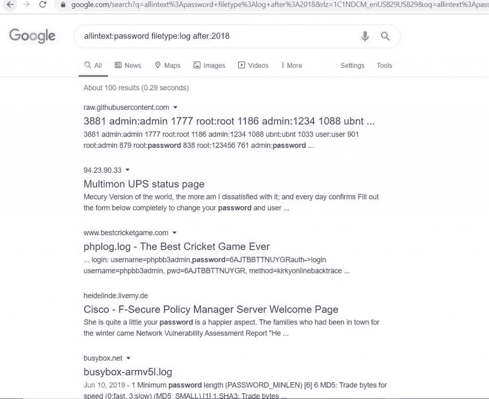

# 用 Dotenv 模块摆脱硬编码的 Python 变量

> 原文：<https://betterprogramming.pub/getting-rid-of-hardcoded-python-variables-with-the-dotenv-module-d0aff8ce0c80>

## 提高代码可维护性和抵御 Google dorking 攻击的安全性


[Firmbee.com](https://unsplash.com/@firmbee?utm_source=medium&utm_medium=referral)在 [Unsplash](https://unsplash.com?utm_source=medium&utm_medium=referral) 上拍照

每个程序员都编写过一些应用程序硬编码的全局设置和变量。虽然在一个简单的脚本中使用这种方法没有错，但是在一个更方便的地方为一个更大的应用程序定义配置可能是值得的。

注意:在本文中，我将互换使用术语“全局变量”和“常量”。

让我们来看几个包含常量的代码示例:

在这种情况下，把 URL 直接写成函数调用的参数也没什么问题。但是，如果您必须在应用程序中多次请求同一个网页，那该怎么办呢？你可能会用这样的全局常量:

这种方法不一定不好，但是如果你的代码被分成不同的文件，可能会适得其反。在每个文件中定义相同的变量既耗时又不可维护，因为更改变量需要您手动检查应用程序中的每个文件。在这种情况下，设置文件可能是一个不错的选择。

要访问名为`global_settings.py`的设置文件中声明的常量，只需像这样导入它:

这是一种更简洁的方式来声明应用程序可以访问的变量。但是要注意在源文件中存储敏感信息的潜在安全问题。

## 硬编码变量的安全问题

假设您决定开源您的应用程序:可能会出什么问题呢？如果您的设置文件看起来像这样会怎么样:

任何恶意用户都可能在几秒钟内接管您的应用程序。 [Google dorking](https://en.wikipedia.org/wiki/Google_hacking) 是一种黑客技术，它利用谷歌的搜索引擎和工具，通过简单的浏览器查询来暴露公众可获得的信息或关于目标的错误配置。



Google dorking 的例子。来源:[https://www . security news paper . com/2020/03/05/see-how-to-search-username-passwords-configuration-files-emails-open-camera-on-Google/](https://www.securitynewspaper.com/2020/03/05/see-how-to-search-username-passwords-configuration-files-emails-open-cameras-on-google/)

要了解更多关于流行的谷歌呆子，请查看这个指南。

## Python 设置文件的兼容性问题

Python 文件在纯 Python 环境中工作得很好。当你在应用程序中加入其他技术时，麻烦就开始了，比如 [Docker](https://en.wikipedia.org/wiki/Docker_(software)) 。您可能需要为 Docker 和 Python 文件设置全局常量，回到在不同的地方定义相同的变量。

## 使用环境变量

更安全的方法是将全局设置存储在环境变量中。它们将在整个应用程序中共享，而不仅仅是 Python 可以访问。根据应用程序的部署环境，可以对它们进行不同的定义。此外，环境变量是不公开的，因此对谷歌呆子是安全的。

定义环境变量的一个简单方法是通过一个`.env`文件。这种类型的文件使用简单的 Bash 式语法。这里有一个例子:

## 用 Python-dotenv 模块加载环境变量

可以通过以下方式轻松安装 [Python-dotenv](https://pypi.org/project/python-dotenv/) 模块

```
pip install python-dotenv
```

如您所见，使用该模块非常简单:

默认情况下，`load_dotenv()`函数搜索与 Python 文件位于同一目录下的一个名为`.env`的文件。您可以通过像这样传递`dotenv_path`参数来覆盖这种行为:

```
load_dotenv(dotenv_path='path/to/.env')
```

## 将配置载入字典

您可能希望将所有设置分组到一个 Python 字典中。Python-dotenv 通过使用`dotenv_values()`方法使之变得简单:

## 使用 Python-dotenv 的 Python 设置文件

尽管有我之前提到的安全问题，使用一个`.env`文件使得使用 Python 设置文件变得安全。如前所述，这个文件可以从应用程序中的其他 Python 文件导入，以访问全局设置。下面是这样一个文件的示例:

## 隐藏了。环境文件

我以前讨论过公开设置文件的安全问题。包含敏感数据。由于`.env`文件依赖于部署环境，它们不应该存储在任何私有或公共的存储库中。为了防止将它们推送到存储库，应该将`.env`添加到应用程序的`.gitignore`文件中。

## 快速回顾一下

*   安装`python-dotenv`模块。
*   用适当的配置创建`.env`文件。
*   将其添加到`.gitignore`文件中。
*   使用`python-dotenv`模块将配置加载到 Python 文件中。

感谢阅读！