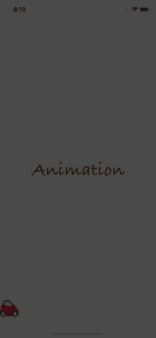
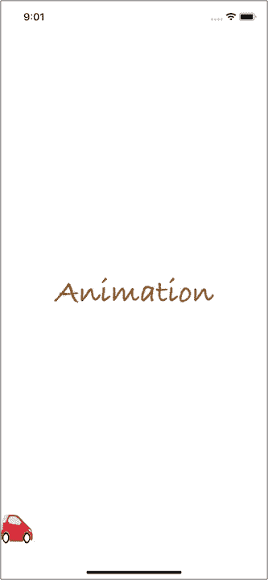
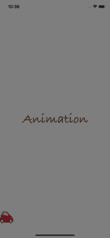
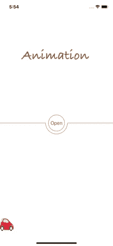
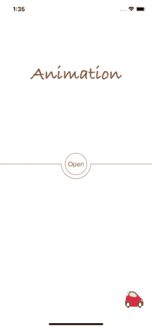
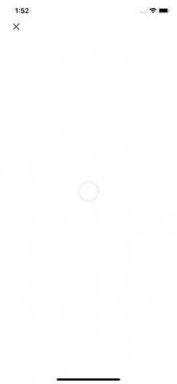
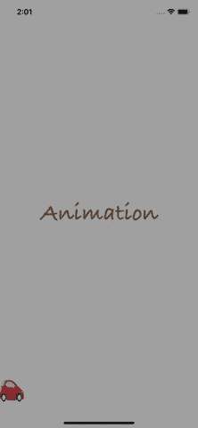

# 如何开始使用 iOS 动画(第 1 部分)

> 原文：<https://betterprogramming.pub/getting-start-with-ios-animation-part-1-7bd3a673bee4>

## 如何制作视图组件的动画


由[宇宙时间旅行者](https://unsplash.com/@cosmictimetraveler?utm_source=unsplash&utm_medium=referral&utm_content=creditCopyText)在 [Unsplash](https://unsplash.com/s/photos/frame?utm_source=unsplash&utm_medium=referral&utm_content=creditCopyText) 上拍摄的照片

动画是让我们的应用程序变得有趣和专业的关键。如果用户觉得开发者投入了精力，一丝不苟地让应用程序更加用户友好，他们就会更加信任你的应用程序，并参与其中。

在这个由三部分组成的系列中，我们将看到我们可以在 iOS 中制作的一整套动画:

*   查看动画。在第一篇文章中，我们将创建一个视图，并让视图的组件来回移动。
*   电影般的动画。在本文中，我们将学习如何实现 Lottie 框架和图像序列。最后，我们将比较视频、GIF、图像序列、编码动画和 Lottie 框架。
*   过渡动画。在本文中，我们将触及 iOS 动画的最后也是最复杂的部分:视图控制器过渡动画。

先决条件:读者应该知道如何创建像`UIView`、`UIButton`和`UIImageView`这样的视图组件。

在第一部分中，我们将看到如何实现所有推荐的使视图组件动画化的方法。此外，我们分析了每种方法的限制和使用情况。

因为一个动画图像胜过千言万语，所以下面是最终的结果(实际上我们会添加更多的用户互动动画作为奖励):



# 本教程的设置

在进入动画之前，我们必须初始化一些视图组件，并将它们添加到主视图中。这是我们所有动画的起点。请在您的初始视图控制器中添加以下代码:

基本上，我们在这里做的是在视图中央插入应用程序徽标图像和打开按钮(隐藏)。我们还在屏幕的底部添加了一辆汽车`ImageView`。这是我们现在所拥有的:



在深入研究动画代码之前，值得一提的是，创建一个动画需要大量的试验和错误。我们需要多次测试，以找出最佳的持续时间、帧定时、位置和其他参数值。为了方便测试，我们应该使用模拟器的慢动作工具(模拟器->调试->慢速动画)来监控动画。

# 最简单的视图动画形式:UIView.animated 函数

制作视图动画最简单的方法是使用`UIView.animated`功能。这里我们要做两件事:将 app logo“Animation”移动到顶部，淡入打开按钮。

将此函数添加到当前代码中:

正如你所看到的，这个函数非常简单。它包含三个输入:

*   `withDuration`:指定动画的持续时间。这里我们要在一秒钟内移动 logo。
*   `animations`:描述该动画的最终状态。这里我们指定了徽标图像视图的最终位置(框架)。该函数本身将插入源帧值和目标帧值来激活动作。
*   `completion`(可选):这是一个完成处理程序，通知我们动画序列是否完成。在这里，我们让它成为我们自己的完成。

现在我们在`viewDidAppear`中执行这个函数。另外，当动画标志结束时，我们还使用`UIView.animate`功能淡入打开按钮:

现在运行我们的应用程序。我们应该看到这一点:



这个函数能够处理视图的边框、边界、中心、变换、alpha 和背景颜色。

`UIView`的动画功能有一些变体，允许指定更多的动画属性，如阻尼、动画选项(容易进入、容易退出等)。)，延迟，等等。我们建议您阅读 Apple 的文档以了解更多细节。

# 动画层属性:CABasicAnimation

`CABasicAnimation`是一个为层属性提供基本的单关键帧动画功能的对象。您使用继承的`init(keyPath:)`方法创建 CABasicAnimation 的一个实例，指定要在呈现中动画化的属性的关键路径。像`UIView.animated`函数一样，通过指定`fromValue`和`toValue`，核心动画将插入过渡值并制作动画。您可以参考核心动画编程指南、[附录 B](https://developer.apple.com/library/archive/documentation/Cocoa/Conceptual/CoreAnimation_guide/AnimatableProperties/AnimatableProperties.html) 和[附录 C](https://developer.apple.com/library/archive/documentation/Cocoa/Conceptual/CoreAnimation_guide/Key-ValueCodingExtensions/Key-ValueCodingExtensions.html#//apple_ref/doc/uid/TP40004514-CH12-SW2) 中关键路径的完整列表。

我们将使用`CABasicAnimation`动画绘制打开按钮周围的线条。为此，我们采用四个步骤:

1.  为那条线创建贝塞尔路径。
2.  将该路径注入到一个`CAShapeLayer`中。
3.  通过指定我们的动画参数创建`CABasicAnimation`对象。
4.  通过使用`CATransaction`在我们的`CAShapeLayer`上执行这个`CABasicAnimation`。

代码如下:

代码看起来很吓人，但实际上大部分是用来指定我们的动画参数，比如持续时间、开始位置、结束位置、时间`easyInEasyOut`等。这些值是通过反复试验找到的。

我们通过用函数`self.animateLoginButton()`替换`animateLogo`的完成来执行这个函数。我们收到下面的结果(请忽略汽车移动；我们稍后再做):


基于我们刚刚在这里学到的，我们可以很容易地创建一个基于用户触摸的“摇动”动画。基本上，当用户触摸动画标志时，我们希望标志被摇动。正如您可能已经发现的那样，该动画将是一个位置类型(从左到右)，自动反转，并循环大约四到五次。代码应该如下所示:

为了将点击事件连接到该函数，我们可以在`setupUI`函数中将手势识别器注册到徽标图像视图:

```
logoImageView.isUserInteractionEnabled = true
logoImageView.addGestureRecognizer(UITapGestureRecognizer(target: self, action: #selector(shakeLogo)))
```

运行代码，下面是点击徽标图像时的结果:



# 通过用户交互制作动画

与视图动画交互最方便的方式是使用`UIViewPropertyAnimator`。来自[苹果的文档](https://developer.apple.com/documentation/uikit/uiviewpropertyanimator):

> “一个`UIViewPropertyAnimator`对象可以让您将视图的更改制作成动画，并在它们完成之前动态修改您的动画。使用属性动画师，您可以正常地从头到尾运行您的动画，或者您可以将它们转换为交互式动画并自己控制时间。动画师操作视图的动画属性，如帧、中心、alpha 和变换属性，从您提供的块创建所需的动画。

其实`UIViewPropertyAnimator`和`UIView.animated`功能比较类似。当我们创建这个对象时，我们必须指定一个包含代码的块，该代码修改一个或多个视图的属性、时间曲线、持续时间以及动画完成时要执行的完成块。

我们将应用这个对象来制作汽车的动画。我们想让它无限地向右移动，然后再向左移动。另外，我们需要捕捉用户的点击手势，然后让汽车后退。所以基本上我们需要三个功能。一个函数在用户点击汽车时运行，一个函数使汽车向右运行，最后一个函数使汽车向左移动:

现在我们将这些函数连接到我们在`viewDidAppear`中的视图，并添加`self.animateCarToRight()`。在`setupUI()`中，添加以下内容:

```
carImageView.isUserInteractionEnabled = true
carImageView.addGestureRecognizer(UITapGestureRecognizer(target: self, action: #selector(userTapOnCar)))
```

运行应用程序，尝试点击汽车，看看它是否会后退。结果如下:



轻敲汽车使它返回

# 从这里去哪里

可以[下载本教程](https://www.dropbox.com/sh/nnfgxk6umaypb8o/AABVjUozrFZ1aZLJEYCIlRrra?dl=0)的代码。

在本文中，我们学习了如何使用`UIView.animated`函数制作一个`UIView`的动画。我们还看到了核心动画如何帮助我们使用贝塞尔路径和`CABasicAnimation`绘制层动画。最后，我们想出了如何让用户与动画互动。

我们现在是制作视图组件动画的专家。在下一篇文章中，我们的目标是制作一系列图像的动画(类似电影的动画)，在最后一篇文章中，我们将制作视图控制器之间的过渡动画。

这是第二部分之后的内容:



在最后一部分，我们制作了当前转换和解散转换的动画。我们还将学习如何以编程方式控制动画的进度。



我希望你喜欢这个教程。下一集再见。