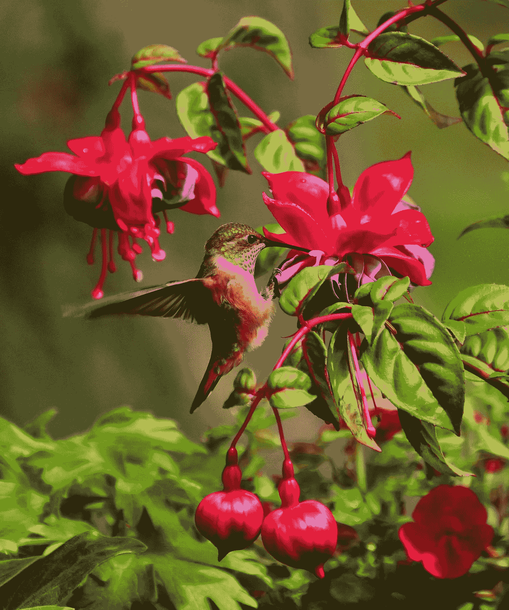
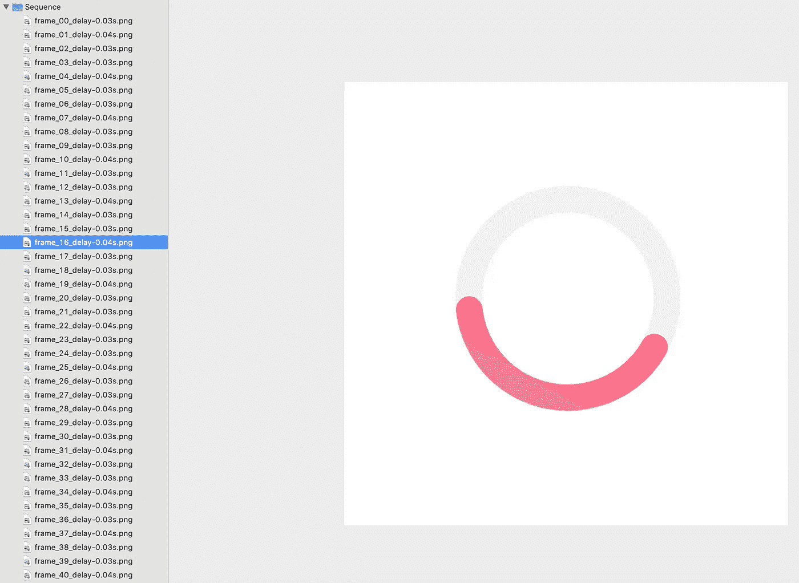

# iOS 动画入门(第 2 部分)

> 原文：<https://betterprogramming.pub/getting-start-with-ios-animation-part-2-65f5bcd0c087>

## 如何创建类似电影的动画



由[布莱恩·汉森](https://unsplash.com/@bryanhanson?utm_source=unsplash&utm_medium=referral&utm_content=creditCopyText)在 [Unsplash](https://unsplash.com/s/photos/hummingbird?utm_source=unsplash&utm_medium=referral&utm_content=creditCopyText) 上拍摄

在这个系列的[第一部分，我们学习了如何实现`UIView`动画。在这一部分，我们将看到如何在 iOS 中从图像序列创建动画。](https://medium.com/@nqtuan86/getting-start-with-ios-animation-part-1-7bd3a673bee4)

我们将从只使用 UIKit 内置函数来制作装载循环序列图像的动画开始。接下来，我们将看到如何实现 [Lottie](https://airbnb.design/lottie/) 库来制作这种相同的动画(唱歌的鸟),但是更加优雅和容易——同时也提供更好的性能。最后，我们将对制作同类动画的各种方法和工具进行比较。

因此，这是我们在本教程结束时应该得到的预期结果:


本教程是从上一个教程发展而来的。你可以在这里下载这个项目。但是，即使你是从零开始做一个项目，你也可以跟随这个教程。请记住，这个故事是在一个单独的视图控制器上，并且有一个函数，返回，使人能够消除并返回到上一个(第一个)视图控制器。

# 设置视图

现在我们必须设置初始视图组件:

您可能已经注意到，我们在视图中央插入了一个`UIImageView`，并在左上角添加了一个后退按钮。现在，我们在这里没有什么可看的，因为我们只有一个返回按钮，可以返回到上一页。在`viewDidAppear`中，我们调用了`animateSequenceImages`函数，但是现在它是空的。

# 使用 UIKit 制作图像序列动画

首先，我们将创建加载动画。因此，我们应该有一个图像序列作为资产提供给这个动画。我们需要在 Xcode 中创建一个图像参考文件夹，如下所示:



您可以通过本文结尾的链接下载该项目。或者你可以下载一个你在谷歌上找到的 GIF 文件，把它拆分成一个图像序列。如果你这样做，我建议使用 [ezgif](https://ezgif.com/split) 来分割这个 gif 文件。

酷！我们有资产，现在让它动起来:

这很简单:

1.  通过`animationImages`变量向`UIImageView`输入所有`UIImage`资产。
2.  分配动画持续时间(`animationDuration = 5`)。
3.  我们不重复动画(`animationRepeatCount = 0`)。
4.  最后启动动画(`sequenceImageView.startAnimating()`)。

实际上，我们希望在动画制作时淡出这个加载视图——这就是为什么我们让动画持续时间为五秒钟——但是我们在两秒钟后就淡出了。

以下是目前为止的结果:


# 用洛蒂制作动画

Lottie 是一个开源框架，最初由 Airbnb 创建:

> “Lottie 是一个 iOS、Android 和 React 原生库，可以实时渲染 After Effects 动画，允许应用程序像使用静态图像一样轻松地使用动画。”— [洛蒂的官方网站](https://airbnb.design/lottie/)

首先，我们需要在我们的项目中安装`lottie-ios`。Lottie 支持 CocoaPods、Carthage 和 Swift 包管理器。详情可以咨询他们的 [GitHub repo](https://github.com/airbnb/lottie-ios) 。

其次，我们需要为洛蒂找到资产。LottieFiles 是搜索动画资源的绝佳资源。下载你在这里找到的任何免费 JSON，并将其命名为`bird.json`。将此文件拖放到当前项目中。Lottie 的 JSON 动画文件就像是一个`UIImageView`的 PNG。

然后，我们在视图控制器中设置洛蒂视图(`AnimationView`)。其实用`AnimationView`和一个普通的`UIImageView`很像。我们声明变量:

```
**private** **var** giftView: AnimationView!
```

现在我们可以在`setupUI()`函数中初始化这个视图:

```
giftView = AnimationView(name: "bird")
giftView.frame = **self**.view.frame
giftView.contentMode = .scaleAspectFit
giftView.alpha = 0
giftView.loopMode = .autoReverse
view.addSubview(giftView)
```

`AnimationView(name: “bird”)`是告诉 Lottie 框架在主包中寻找文件`bird.json`。我们可以注意到，除了`loopMode`之外，其他的都和一个`UIImageView`一模一样。`loopMode`告诉我们动画会向前向后播放，直到停止。

现在我们想在载入淡出时触发鸣鸟动画。我们将在`viewDidAppear`中的`animateSequenceImages()`完成时调用`animateGift()`:

```
animateSequenceImages {
    self.animateGift()
}
```

在`animateGift()`里面，我们淡入`AnimationView`:

`play()`功能启动`AnimationView`的动画。这是我们的最终结果:


# 比较不同形式的动画

实际上，有很多方法可以将类似电影的动画嵌入到视图控制器中。

除了洛蒂和我们刚刚做的图像序列方法，我们还可以使用 GIF，视频，或者甚至使用贝塞尔路径和/或`UIView`的动画函数组合来编码。设计师和开发人员开始喜欢 Lottie 动画而不是其他格式的原因有很多。让我们比较一下洛蒂和你的其他选择。

## PNG 序列图像

PNG 序列图形的最大缺点之一是它们的尺寸相当大，这使得设计师在不同的界面上导出和操作它们有些麻烦。

相比之下，Lottie 文件非常小，大小适中，因此下载速度很快，并尽可能保持网站或应用程序运行顺畅。

## GIF 格式

虽然比 PNG 图形小，gif 仍然是一种非常占用空间的格式，比简单的 Lottie 动画平均大一倍。

gif 通常也以固定的尺寸缩放。这意味着您不能修改它们以更好地适应不同于它们最初创建时的界面上的缩放。Lottie 动画为您提供了所需的空间，您可以根据大尺寸解决方案以及小尺寸屏幕进行调整。

## 录像

关于一个简单而简短的动画，视频内容经常出现。对于视频内容，尤其是真人表演，你需要安排大量的资源，包括道具、演员和地点。动画是相对简单和便宜的替代品，但仍能完成工作。

就编码而言，处理视频比处理`AnimationView`(就像处理`UIImageView`一样简单)要麻烦得多。更不用说:一个好的动画会吸引你的访问者，而不会强迫他们关掉它。

## 代码动画

应用程序开发团队希望简化开发流程，尽可能节约成本和资源。

用代码编写动画可能是一个时间和技能密集型的过程，更不用说在编写代码时遇到大量问题是多么容易。与其将宝贵的资源用于外包项目或雇用熟练的员工，为什么不使用 Lottie 形式的替代动画工具，这种工具直观、可扩展且兼容多种平台？

# 从这里去哪里

你可以在这里下载项目[。](https://www.dropbox.com/sh/hirw5786plbyspb/AAAdXMiQkuXE43Yup3llAPDOa?dl=0)

在本文中，我们学习了如何使用 PNG 序列图像和 Lottie 创建类似电影的动画。我们还发现了一个伟大的洛蒂动画资源:[洛蒂文件](https://lottiefiles.com/)。我们也看到了为什么 Lottie 在短动画方面比其他所有的动画形式都要好。

我们完成了这个系列的第二部分。在下一部分，我们将看到如何制作视图控制器之间的过渡动画。这是我们三部分系列的最终结果:

