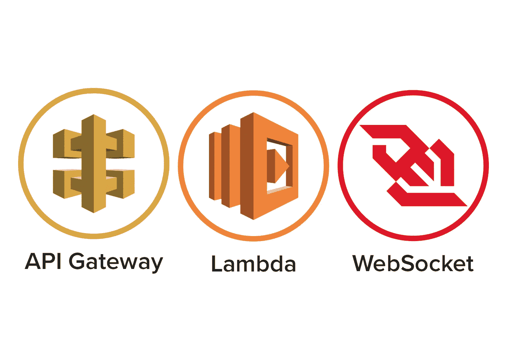
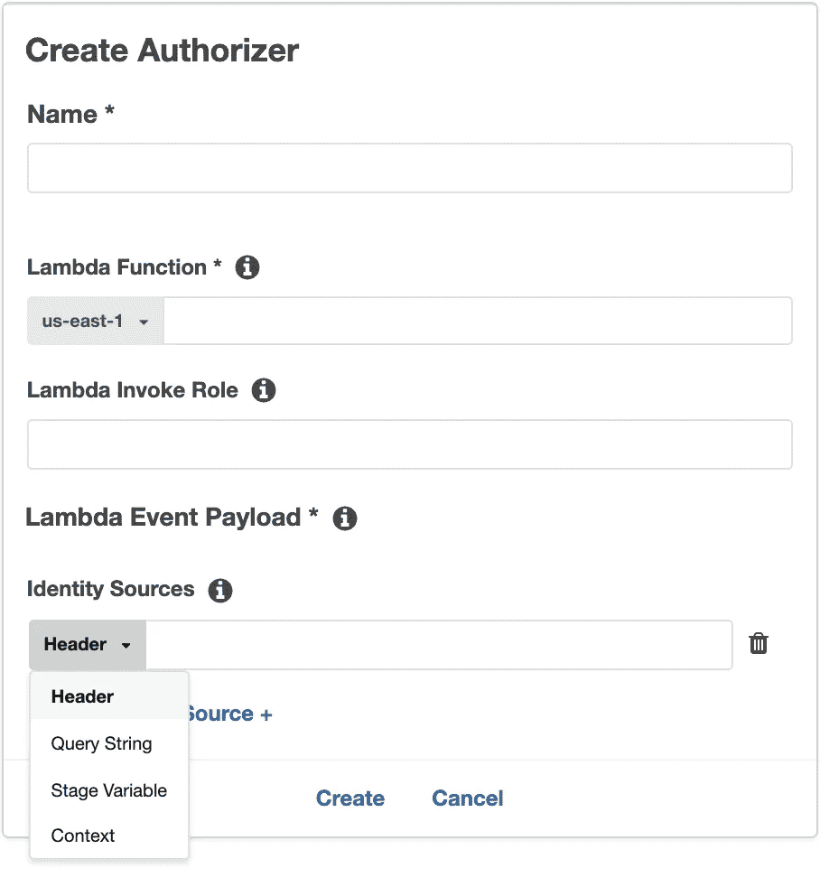

# AWS Websockets API 入门

> 原文：<https://betterprogramming.pub/getting-started-aws-websockets-api-4a585eb1e12d>

## 介绍 AWS Lambda 支持的实时 AWS WebSocket API 的强大功能



# 简要概述

2018 年 12 月 18 日，亚马逊 Web 服务正式发布 API Gateway 对 WebSocket APIs 的支持。这是巨大的，因为我们现在终于可以利用 AWS Lambda 的无服务器架构进行 WebSocket 连接了！这项新服务有三大部分:路由、消息连接客户端和授权者。我试图提供我在自己的项目中使用的许多工作示例，以便让您了解如何利用这项服务。让我们跳进来吧！

# 路线

路线是您可以将 AWS Lambda 函数附加到 API 的地方。默认情况下，AWS 提供了三种您可能想要实现的路由— $connect、$disconnect 和$default。您还可以实现遵循给定路线选择表达式的自定义路线。这个表达式只是告诉 AWS 在哪里寻找路由名。例如，它可能类似于:

```
$request.body.action
```

## $connect

当客户端连接到您的 API 时，会使用这个路由。您将(很可能)希望为这个函数附加一个授权器，以便可以存储连接 id 和任何给定的授权客户信息。这可能是这样的

## $断开连接

当客户端与您的 API 断开连接时，将使用此路由。根据我自己的经验，这是非常不可靠的，因为您经常需要手动检测客户端连接是否过时。在这篇文章的**消息客户端**中，我给出了一个例子。

## $默认

当模式与您的任何自定义模式都不匹配时，将使用此路线，并将其作为一个总括模式。

# 消息客户端

向连接的客户端发送消息实际上非常简单。您只需要确保将客户端的连接 id 存储在某个地方(数据库或缓存)，您可以使用类似下面的代码来实现这一点。

您需要注意两个特定的错误代码，410 和 504。

*   410 —表示客户端不再可用。
*   504 —请求超时(通常在 30 秒后)，根据我的经验，这通常表明我们无法与客户端通信。

# 授权人

*不幸的是，与 API Gateway 中的传统 REST API 不同，您不能附加一个 AWS Cognito 池来自动为您处理这些。*

在撰写本文时，授权 WebSocket 连接的唯一方法是提供一个定制的 authorizer lambda 函数。将授权人附加到您的 API 时，您将收到该表单的提示。



该自定义授权者应规定是否应根据给定的身份源对请求进行身份验证。本质上，您只需选择传递身份验证方式的方法(例如，AWS Cognito ID 令牌、JWT 访问令牌等)。)在**中每个请求**到你的 WebSocket API。

您只能对整个 API 使用**一个**授权函数，并将其附加到您的 **$connect** 路径。相同的授权者功能也将用于其他路由的所有其他请求。

使用 AWS Cognito 的授权者功能示例如下:

我希望 one-day AWS 将添加对使用 AWS Cognito 进行授权的自动支持，因为如果我们拥有与 REST APIs 相同的支持，这将会消除许多难看的代码。

*感谢您的阅读，祝您的项目好运！如果你有任何问题，请留言或给我。*