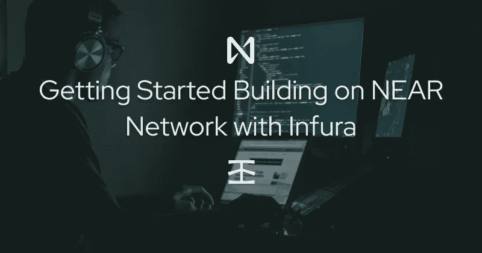
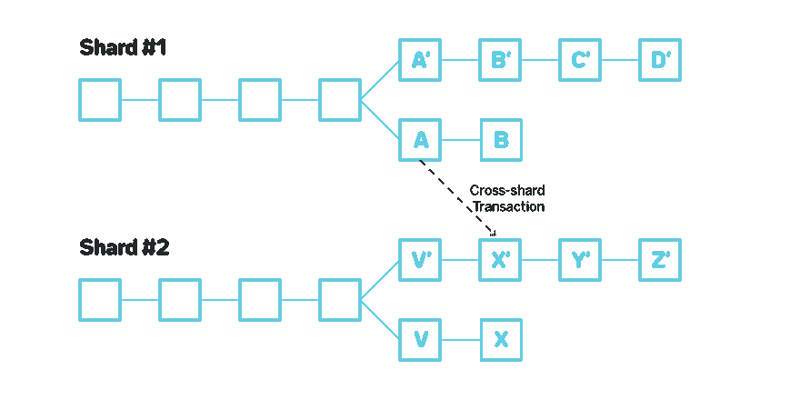
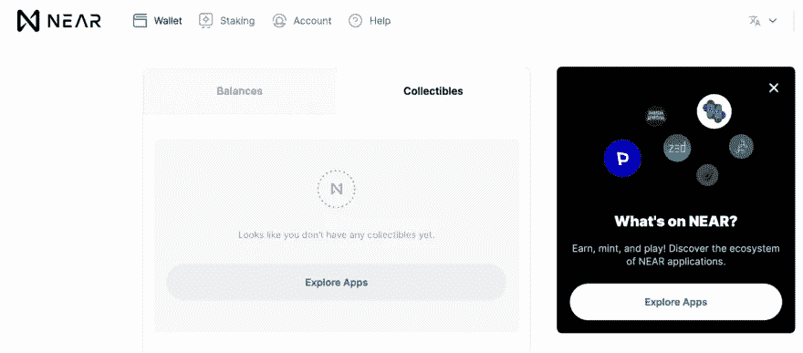
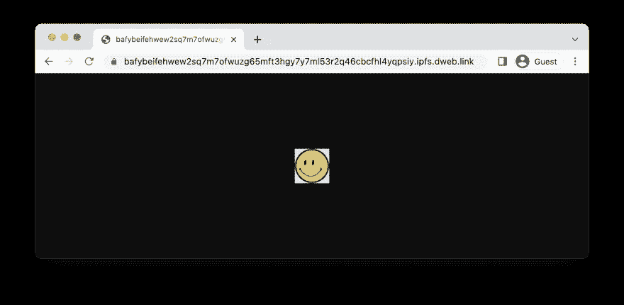
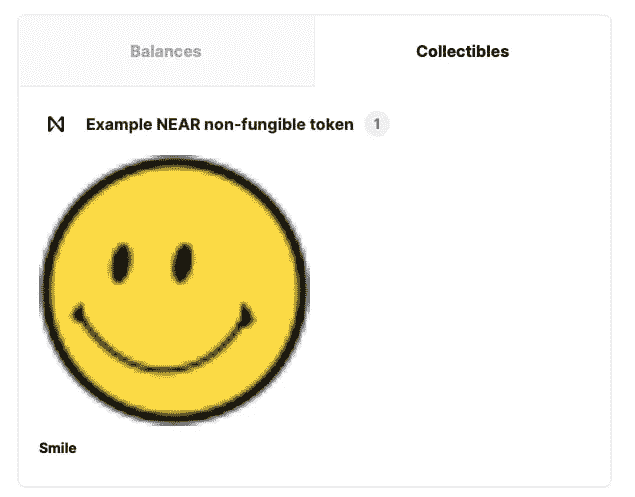
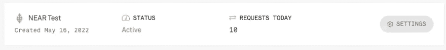

# 使用 Infura 构建 NEAR 网络

> 原文：<https://betterprogramming.pub/getting-started-building-on-the-near-network-with-infura-544ac3554cbc>

## 在附近开始使用 Web3



# 介绍

Web3、NFTs 和智能合约越来越受欢迎。事实上，[最近对公共代码库](https://medium.com/electric-capital/electric-capital-developer-report-2021-f37874efea6d)的一项分析显示，每月有超过 18，000 名开发人员定期为开源 crypto 和 Web3 项目做出贡献。这种增长的一些关键是像 NEAR 这样的区块链和像 Infura 这样的开发者平台。

在本文中，我们将研究 NEAR 区块链，它的优点，以及如何使用 Infura 构建 NEAR。然后我们将使用 NEAR Rust SDK 分三步制作一个 NFT，然后与来自 Infura 的 NFT 进行交互。你需要[一个近账户](https://docs.near.org/docs/develop/basics/create-account)、[一个远账户](https://infura.io/register)，以及一些[技能和工具](https://www.rust-lang.org/learn/get-started)来快速上手并运行。

# 什么是近？

附近是区块链，有一个由数千名建筑商组成的活跃的开发人员社区，由一个为 DeFi、和 DAO 相关项目提供稳定性的基金会提供支持。NEAR 专注于提供低交易费用和快速交易吞吐量，以及 Web3 中最前沿的分片机制，称为[茄影](https://near.org/papers/nightshade/)。

NEAR 还有许多其他的好处，包括人类可读的账户名，对碳中和的关注，以及使用通用语言来写合同。与以太坊相比，NEAR 速度明显更快，用户体验也更先进。然而，他们并不想取代 Web3 巨头。凭借其极光层和多个区块链之间的轻松桥接，NEAR 旨在提高生态系统中的互操作性。



*基本的分片设计。将区块链分成多个“碎片”,同时允许跨碎片通信。*

# 什么是 Infura？

[Infura](https://infura.io/) 允许开发人员使用直观的 JSON-RPC API 与多个区块链交互来构建智能合约。虽然 Infura 是第一个为以太坊构建的 API 解决方案，但该平台也支持分散存储网络、IPFS、第二层链 Polygon、Arbitrum 和乐观，现在是他们跨多链和协议扩展以推进 Web3 的计划的一部分。Infura 让初学者和老手更容易开始区块链开发。

因为 Infura 是区块链的连接点，所以没有必要运行自己的节点来访问上面的区块链。这大大减少了启动时间，因为你不需要花几个小时同步你的节点与多网络。Infura 是一个基础设施即服务(IaaS)，因此他们提供了开发人员在区块链和 scale 上构建所需的一切。

# 第一步:铸造 NFT

在这一点上，深入这项技术听起来可能有些吓人。为了让你的工作更容易，我们将遵循 NEAR 的[指南来铸造一个 NFT](https://docs.near.org/docs/tutorials/contracts/nfts/minting-nfts) ，插入 Infura 使这个过程更加顺利。

# 1a:创建一个近账户

你需要做的第一件事是创建你的近账户。因为我们这样做是为了学习，你可以在 NEAR 的`testnet`上创建你的钱包，为你的帐户提供一些免费的 NEAR 令牌。一旦您准备好将您的解决方案投入生产，您将需要 NEAR `mainnet`上的真正 NEAR 令牌，但现在，我们将使用测试令牌。创建一个账户非常简单，这份文档将带你创建一个`testnet`账户。

注意到您生成的人类可读的帐户地址吗？与其他区块链相比，此地址更易于跟踪和共享。此外，如果您使用电子邮件设置您的帐户，您将收到一个帐户恢复链接，这是大多数其他连锁店甚至不提供的。

一旦你有了自己的`testnet`账户并登录，进入收藏品选项卡，它会列出你所有的非功能性物品。



因为我是从一个新帐户开始工作的，所以我现在没有列出任何帐户。让我们看看用 NEAR、[星际文件系统](https://ipfs.io/) (IPFS)和 Infura 铸造我们的第一个 NFT 有多容易。

# 1b:创建一个 Infura 帐户并上传到 IPFS

我们的下一步是[创建一个 Infura 账户](https://infura.io/)(给出你的电子邮件地址和密码)[在那个账户中创建一个 IPFS 项目](https://docs.infura.io/infura/getting-started#2.-create-an-ethereum-project)。确保在创建项目时选择 IPFS 作为产品，而不是以太坊。Infura 将需要信用卡信息来实现这一点，但只要你在 IPFS 上使用的空间或带宽不超过 5GB，你就不会被收费。

一旦你有了一个 Infura 账户，找些东西变成 NFT。确保你选择了你可以公开的东西。我选择了[一个简单的笑脸，这是我从维基百科](https://commons.wikimedia.org/wiki/File:SNice.svg)上获得的 CC-3.0 属性共享许可，但是你可以使用任何你想要的。

Infura 提供了一个将文件上传到 IPFS 的有用工具。如果您的计算机上有 Golang 构建链，您可以在本地构建它，或者从 Github repo 安装一个预构建的二进制文件。无论你用哪种方式安装`ipfs-upload-client`，你都离把 NFT 的伟大档案放到 IPFS 上只有一步之遥了。

```
ipfs-upload-client --id <project_id> --secret <project_secret> </path/to/data>
```

显然，您需要使用您实际的项目 id 和秘密，以及您的文件在您机器上的位置。然而，只要您在路径中有`ipfs-upload-client`的地方运行这个命令，您应该能够在您的 Infura Dashboard Explorer 中看到您的文件的内容标识符(CID)。


或者，您可以使用 cURL 命令将图像上传到 IPFS:

```
curl -X POST -F file=@myfile -u "PROJECT_ID:PROJECT_SECRET" "https://ipfs.infura.io:5001/api/v0/add"
```

您可以在 dweb.link 上查看您的文件，方法是获取 CID 并将其放在 URL[https://dweb.link/ipfs](https://dweb.link/ipfs)的末尾。您需要在下一步中这样做，这样您就有了不区分大小写的 CID，所以请继续验证。一旦你有了你的 CID，让我们进入下一步。



# 1c:构建一个 NFT 合同示例

NEAR 提供了[一个优秀的范例库](https://github.com/near-examples/NFT)，用于开始使用遵循 [NEAR 增强提议标准](https://nomicon.io/Standards/NonFungibleToken)的 NFTs。克隆回购协议，并在其中进行探索。这个例子的真正内容在`nft/src/lib.rs`文件中，但是可以随意多看看。如果您已经克隆了安装了适当 Rust 工具链的存储库，如自述文件中所述，那么只需运行存储库根目录中的`build.sh`文件即可。

一旦您在本地构建了智能契约，您就可以[将其部署到 NEAR，并使用 near-cli](https://docs.near.org/docs/tutorials/contracts/nfts/minting-nfts#deploying-the-contract) 创建您的第一个令牌。如果您以前从未安装过 NEAR CLI，请使用`npm`安装，然后从您构建合同的目录运行以下步骤:

```
$ near login$ export ID=YOUR_NEAR_TESTNET_ID # replace this with your actual ID$ near deploy --wasmFile res/non_fungible_token.wasm --accountId $ID$ near call $ID new_default_meta '{"owner_id": "'$ID'"}' --accountId $ID$ near call $ID nft_mint '{"token_id": "0", "receiver_id": "'$ID'", "token_metadata": { "title": "Example NEAR non-fungible token", "description": "Smile", "media": "https://bafybeifehwew2sq7m7ofwuzg65mft3hgy7y7ml53r2q46cbcfhl4yqpsiy.ipfs.dweb.link/", "copies": 1}}' --accountId $ID --deposit 0.1 # make sure to use your CID
```

如果一切顺利，你应该有你的 NFT 显示在你的钱包附近的收藏品区。



虽然这不仅仅是微不足道的，但与大多数区块链相比，你可以更快更便宜地铸造一个 NFT，这是非常惊人的。然而，铸造 NFT 只是一个开始。让我们看看如何使用 Infura 与它进行交互。

# 步骤 2:从 Infura 检查区块链细节

Infura 对多个不同的区块链和 IPFS 项目提供了强大的支持，提供了一个流畅的 JSON-RPC API，您可以根据它构建并观察应用程序的事务活动。现在，我们将重点检查将您的 NFT 转移到另一个地址的汽油价格。只需要一个 API 调用。

```
curl -X POST \
-H "Content-Type: application/json" \
--data '{"jsonrpc": "2.0", "id": 1, "method": "gas_price", "params": [null]}' \
"https://near-testnet.infura.io/v3/<YOUR-PROJECT-ID>"
```

您应该会得到类似这样的响应:

```
{"jsonrpc":"2.0","result":{"gas_price":"100000000"},"id":1}
```

只要您[将 NEAR 添加到您的 Infura RPC 端点 URL](https://docs.infura.io/infura/networks/near/how-to/choose-a-network) ，您将能够使用 Infura 支持的任何其他 [JSON-RPC 方法与 API 进行交互。此外，Infura 将允许您通过项目仪表板监控交互。您还将能够配置比仅使用对 NEAR API 的原始 JSON-RPC 调用更高程度的安全性。](https://docs.infura.io/infura/networks/near/json-rpc-methods)



# 第三步:继续铸造！

在本文中，您了解了 NEAR，这是一种更快、更便宜且环保的第一层区块链。您还了解了作为节点提供服务的 Infura 如何允许您使用它们的 RPC 端点 URL 与 NEAR 进行交互。

希望本教程已经向你展示了一些可能性，并且你对自己使用 Web3 工具进行创新的能力更有信心了。为你的下一个 Web3 项目做一次尝试。它们真的可以让你的工作更顺利。