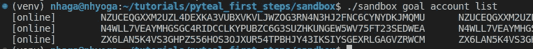
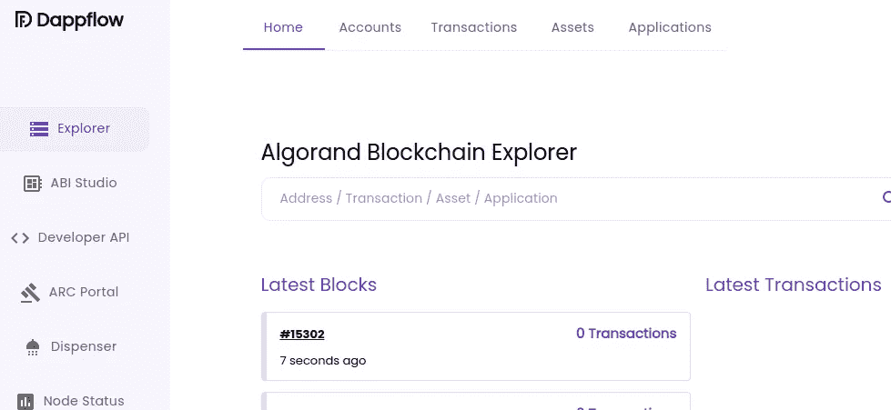
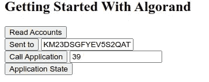
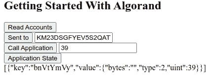

# 使用 PyTeal 的 Algorand 智能合约

> 原文：<https://betterprogramming.pub/getting-started-with-algorand-413d3474cb5>

## 通过使用 Python 编写一个简单的智能合同，开始使用 Algorand


[马里·赫林](https://unsplash.com/@mari?utm_source=medium&utm_medium=referral)在 [Unsplash](https://unsplash.com?utm_source=medium&utm_medium=referral) 拍摄的照片

在本文中，我将展示如何使用 PyTeal 在 Algorand 上编写一个简单的智能契约，将其部署在本地开发网络上，并使用 Python 与它进行交互，然后在浏览器中进行交互。我将尝试简化所使用的工具，这样读者就可以专注于 PyTeal 代码。

# 设置开发环境

配置本地开发环境的第一步是设置 [Algorand 沙箱](https://github.com/algorand/sandbox)。沙箱创建了一个本地专用网络，允许开发人员完全控制在任何时候重置其状态，并为该网络创建了一个索引器。使用 Algorand 沙盒的唯一要求是安装 Docker 和 Docker-Compose。

要运行沙盒，请克隆存储库:

```
git clone [https://github.com/algorand/sandbox](https://github.com/algorand/sandbox)
```

通过运行以下命令进入目录并启动沙盒(`-v`显示日志):

```
sandbox up -v
```

现在您应该有三个容器在运行:(I)一个索引器，(ii)一个用于索引器的 Postgres 数据库，最重要的是，(iii) algod 客户端。

在 algod 容器中，可以运行例如 [goal](https://developer.algorand.org/docs/clis/goal/goal/) ，这是 Algorand 用于与网络交互的 CLI。您可以使用它来获取在沙箱中创建的帐户列表，方法是在容器中输入以下内容:

```
./sandbox enter algod
goal account list
```

或者通过运行以下命令:

```
./sandbox goal account list
```

此示例将显示这台机器上的 Algorand 帐户列表:



对于本教程，我不会进入可用的 CLI 工具，如 goal，kmd，algokey 等。我将尝试只使用 Python，主要是 Python algoSDK，但也会简单地涉及 Beaker，这是一个用于 [PyTeal](https://github.com/algorand/pyteal) 的智能合约开发框架。

Beaker 使 Algorand 上的开发变得更加容易，也许我会在将来写一篇关于它的文章，但现在，我们将使用它的“helpers”函数从沙盒中获取 algod 客户端和帐户。

## 安装所需的库

要编写、部署和调用智能合约，我们将在沙盒上创建，然后安装 PyTeal、Python Algorand SDK 和 Beaker。

```
python -m venv venv
source venv/bin/activatepip install pyteal beaker-pyteal
```

(SDK 也将被安装，因为它是一个依赖项)

我们现在可以使用 Python Algorand SDK 创建 Algod 客户端的连接实例。

然而，Beaker 为我们提供了一些帮助函数，使得创建客户端(使用默认的沙盒设置，它的运行方式与上面相同)和获取现有帐户变得更加容易。

我们现在可以通过各自的 ALGO `balance`检查现有账户。

> 账户余额 DNP 46…6 miyi:40 亿微藻类
> 账户余额 KM23D…NL3NA:40 亿微藻类
> 账户余额 whn mm…SNHAI:10 亿微藻类

# 发送简单的支付交易

让我们通过发送一个在两个账户之间转移 1000 个微藻的交易来测试我们是否已经正确设置了一切。

如果我们再次运行代码来列出帐户，我们将看到这两个帐户之间的余额变化。

# 沙盒区块链浏览器

在这一点上，我建议检查一下[https://dappflow.org/](https://dappflow.org/)，这是一个浏览器开发工具，它使我们能够连接到沙盒，以获取有关帐户、交易、资产和应用程序的信息。



有了这个工具，你可以很容易地检查发送到沙箱的事务，现有的应用程序，应用程序调用等。

# 皮蒂尔

在本教程中，我们将使用 PyTeal 编写一个简单的存储智能契约(应用程序)。

PyTeal 是一个用于 algrand Smart Contracts(ASC1s)的 Python 语言绑定，使用一种基于堆栈的语言实现，称为事务执行批准语言(Teal)。

TEAL 本质上是一种汇编语言，写起来并不用户友好。PyTeal 在 Teal 上提供了高级函数式编程抽象，开发者可以通过 PyTeal 对象纯粹使用 Python 来表达智能合约逻辑。

我们将用于编写简单智能契约的 PyTeal 对象是:

*   `Approve` / `Reject` —表达式导致程序立即退出。如果使用`Approve`，则标记执行成功，如果使用`Reject`，则标记执行不成功。
*   `Bytes` —一个字节片是一个二进制字符串。
*   `Int` —整数，其中`n >= 0`和`n < 2 ** 64`
*   `Seq` —创建多个表达式序列的链接表达式
*   `Cond` —链接一系列测试以选择结果表达式的表达式
*   `Btoi()` —将字节字符串转换为 uint64 的函数
*   `App.globalPut` —写入当前应用程序全局状态的方法
*   `Txn.application_args` —表示应用程序调用参数数组
*   `Txn.application_id()` —从当前事务的`ApplicationCall`部分获取应用 ID
*   `Txn.on_completion()` —从事务的`ApplicationCall`部分获取完成时动作
*   `OnComplete` —值的枚举`TxnObject.on_completion() may return`

关于这些和其他 PyTeal 对象的完整参考，请参考这里的文档:[https://pyteal.readthedocs.io/](https://pyteal.readthedocs.io/)。

举个例子，如果我们编译`Approve()` PyTeal 对象:

我们将得到以下输出代码:

```
#pragma version 6
int 1
return
```

作为第二个例子，如果我们编译一个序列，将整数`5`写入“number”键下的当前应用程序的全局状态，然后批准该事务:

我们将得到以下输出代码:

```
#pragma version 6
byte “number”
int 5
app_global_put
int 1
return
```

# 创建简单的智能存储合同

关于 Algorand 智能合同如何工作的完整解释，我建议阅读 Algorand 开发者文档上智能合同页面的前几段，尤其是“智能合同的生命周期”一节

[](https://developer.algorand.org/docs/get-details/dapps/smart-contracts/apps/) [## 智能合同详情——algrand 开发商门户

### 阿尔格兰德智能合约是位于阿尔格兰德区块链上的逻辑块，可以远程调用。这些…

developer.algorand.org](https://developer.algorand.org/docs/get-details/dapps/smart-contracts/apps/) 

我们将创建一个简单的存储智能契约，它在一个名为“number”的变量中保存一个值，允许用户检索当前值并在其上存储一个新值。我们将使用 PyTeal 来创建批准和清除状态程序。

简而言之，审批程序负责实现应用程序的大部分逻辑。只有当程序完成时，堆栈上还留有一个非零值，或者调用顶部为正值的`return`操作码时，程序才会成功。`ClearStateProgram`用于处理使用 clear 调用的账户，以从其余额记录中删除智能合约。

对于`ClearStateProgram`，我们将不处理任何逻辑，我们将总是在堆栈上留一个，这样调用将总是成功的。

我们正在`Approve()`上运行`compileTeal`功能。这将返回带有参数模式应用程序和 TEAL 版本 6 的`Int(1)`。这将生成以下 TEAL 代码:

```
#pragma version 6
int 1
return
```

现在对于处理所有事务调用类型的`ApprovalProgram`(除了`ClearState`):

*   `NoOp` —执行`ApprovalProgram`的通用应用程序调用。
*   `OptIn` —账户使用此交易开始参与智能合约。参与支持本地存储使用。
*   `DeleteApplication` —删除申请交易。
*   `UpdateApplication` —更新合同的 TEAL 程序的交易。
*   `CloseOut` —账户使用该交易结束其在合同中的参与。基于 TEAL 逻辑，该调用可能会失败，从而阻止帐户从其余额记录中删除该合同。

在我们的合同中，我们将拒绝除`NoOp`之外的所有交易电话。这是批准程序的完整代码。这可能不是编写该应用程序的最佳方式，但它展示了可以用 PyTeal 定义的不同逻辑部分。

该计划的主要部分是:

```
program = Cond(
[Txn.application_id() == Int(0), init],
[Txn.on_completion() == OnComplete.NoOp, no_op],    [Txn.on_completion() == OnComplete.DeleteApplication, Reject()],
[Txn.on_completion() == OnComplete.UpdateApplication, Reject()],
[Txn.on_completion() == OnComplete.OptIn, Reject()],
[Txn.on_completion() == OnComplete.CloseOut, Reject()],
)
```

这里我们使用`Cond`来表示条件，就像一系列由逻辑语句和动作组成的“如果”语句。

第一个将在应用程序创建时运行“init”表达式，即当调用事务但不包含应用程序 id 时:

```
[Txn.application_id() == Int(0), init]
```

init 表达式将值`0`存储在全局 var 号中，然后批准交易。

```
init = Seq(App.globalPut(number, Int(0)), Approve())
```

注意，上面代码中的“number”只是一个 Python 变量，它指向开头定义的名为`number`的字节块。

```
number = Bytes("number")
```

继续通用应用程序调用的`Cond`表达式(`NoOp`),“存储”表达式被调用:

```
[Txn.on_completion() == OnComplete.NoOp, store]
```

存储表达式获取事务调用的第一个参数`Tx.application_args[0]`，将其从字节转换为整数`Btoi()`，并将其存储在数字变量`App.globalPut(number, …)`中。

```
store = Seq(
 App.globalPut(number, Btoi(Txn.application_args[0])),
 Approve()
)
```

最后，继续`Cond`表达式，对于`DeleteApplication`、`UpdateApplication`、`OptIn`和`CloseOut`交易类型，使用`Reject()`或`Int(0)`拒绝应用程序调用。代码如下:

```
[Txn.on_completion() == OnComplete.DeleteApplication, Reject()],
[Txn.on_completion() == OnComplete.UpdateApplication, Reject()],
[Txn.on_completion() == OnComplete.OptIn, Reject()],
[Txn.on_completion() == OnComplete.CloseOut, Reject()],
```

我们上面定义的函数生成的 TEAL 代码太长了，不能在这里发表，但是我建议读者输出并浏览它。

不得不说，目前有更好的方法在 Algorand 上编写应用程序，而不仅仅是使用这些简单的对象，即使用 ABI 路由器。它公开了应用程序中可以调用的方法，或者更好的是，使用 Beaker。但是这个智能合同很容易实现。此外，Algorand Foundation 已经暗示了对开发工具包的进一步改进，即 Algokit，即将推出。

# 部署智能合同

我们将通过使用 Python SDK 函数发送一个`ApplicationCreate`事务来部署智能契约，称为 Algorand 上的应用程序。

首先，我们将创建一个助手函数，以字节形式向`ApplicationCreate`事务提供审批和清算程序的 TEAL 代码。

接下来，我们用`ApplicationCreateTxn`创建事务，并提供适当的输入:

*   `sender` —合同创建人的地址
*   `sp` —我们可以从客户那里获得的建议参数
*   `on_complete` —一旦程序运行完毕，什么应用程序应该这样做
*   `approval_program`和`clear_program`——以字节为单位的 TEAL 代码
*   `global_schema`和`local_schema` — `StateSchema` 表示全局和局部变量中有多少整数和字节的对象。

然后，我们用发送方的私钥对交易进行签名，并将交易发送给客户端。

运行这段代码应该会输出一个包含应用程序 id 和事务哈希的字符串。

```
Created App with id: 13 in tx: 5E5PXN24CBRZVWPD2KMMFFIV3LJZYXNGMOKH2NGANFQYXZ5ELQDA
```

# 进行应用程序调用

现在我们将使用整数`5`作为参数调用应用程序，这样它就可以存储在应用程序的全局状态中，在`number`键下。

我们将使用`ApplicationCallTxn`，添加带有输入列表的参数`app_args`。代码如下:

调用事务成功后，我们可以查询应用程序的全局状态。

它将输出:

```
{‘key’: b’number’, ‘value’: {‘bytes’: ‘’, ‘type’: 2, ‘uint’: 5}}
```

存储在关键字`number`中的值属于类型`2`，即整数，并且具有值`5`。

(注意，我们必须解码密钥才能看到`number`，因为它们存储为 base64 编码的字符串。)

# 分度器

我将简单地提到索引器，它也可以在沙盒中使用，并允许查询大量信息。

比如从上面定义的应用程序中获取状态:

以下是输出结果:

```
{'application': {'created-at-round': 1792,
  'deleted': False,
  'id': 13,
  'params': {'approval-program': 'BiACAAEmAQZudW1iZXIxGCISQAA2MRkiEkAAKDEZgQUSQAAeMRmBBBJAABQxGSMSQAALMRmBAhJAAAEAIkMiQyJDIkMoNhoAZyNDKCJnI0M=',
   'clear-state-program': 'BoEBQw==',
   'creator': 'DNP46TUHD55E7ZFF4GBLDL4ZQGTHX4V623FVIJPIZWMV32EAXOMVO6MIYI',
   'global-state': [{'key': 'bnVtYmVy',
     'value': {'bytes': '', 'type': 2, 'uint': 5}}],
   'global-state-schema': {'num-byte-slice': 0, 'num-uint': 1},
   'local-state-schema': {'num-byte-slice': 0, 'num-uint': 0}}},
 'current-round': 16881}
```

或者获取特定帐户的信息:

以下是输出结果:

```
{'account': {'address': 'UBIVVQ72ZI6MUPGAF7EIXKNGBDQJFHY4BXP4NUEE5UQ6H6Y7MRI4HVLVE4',
  'amount': 30002040,
  'amount-without-pending-rewards': 30000000,
  'created-at-round': 13826,
  'deleted': False,
  'pending-rewards': 2040,
  'reward-base': 345,
  'rewards': 2040,
  'round': 16528,
  'status': 'Offline',
  'total-apps-opted-in': 0,
  'total-assets-opted-in': 0,
  'total-created-apps': 0,
  'total-created-assets': 0},
 'current-round': 16528}
```

或者通过提供过滤器来搜索应用程序，尽管没有过滤器，我们将得到所有应用程序:

以下是截断的输出:

```
{'applications': [{'created-at-round': 1521,
   'deleted': False,
   'id': 8,
   'params': {'approval-program': 'BiACAAEmAQZudW1iZXIxGCISQAA2MRkiEkAAKDEZgQUSQAAeMRmBBBJAABQxGSMSQAALMRmBAhJAAAEAIkMiQyJDIkMoNhoAZyNDKCJnI0M=',
    'clear-state-program': 'BoEBQw==',
    'creator': 'DNP46TUHD55E7ZFF4GBLDL4ZQGTHX4V623FVIJPIZWMV32EAXOMVO6MIYI',
    'global-state': [{'key': 'bnVtYmVy',
      'value': {'bytes': '', 'type': 2, 'uint': 0}}],
    'global-state-schema': {'num-byte-slice': 1, 'num-uint': 1},
    'local-state-schema': {'num-byte-slice': 0, 'num-uint': 0}}},
  (...)
```

# 通过浏览器中的前端与合同交互

现在，我们将编写一个基本的 HTML 文件，以便从浏览器与部署的应用程序进行交互。

我们将使用 Javascript Algorand SDK 来构建和发送事务，并使用 MyAlgo Connect 对它们进行签名。

MyAlgo Connect Javascript 库的缩小版可以在这里下载:[https://github.com/randlabs/myalgo-connect/releases](https://github.com/randlabs/myalgo-connect/releases)。

Algorand SDK 可以在这里下载:[https://github.com/algorand/js-algorand-sdk](https://github.com/algorand/js-algorand-sdk)。它也可以通过一个缩小的包直接在浏览器中使用。

我将省略错误捕捉和其他测试，以使代码不那么冗长，更易于阅读。

为了进行测试，我们可以从连接到客户端并使用 JavaScript 从一个帐户获取信息开始:

要获得以下示例输出:

> 账户余额:29998014 微藻

现在，我们将测试发送一个帐户将从 MyAlgo Wallet 签名的支付交易。为此，我们将使用带有 Python SDK 的 KMD 客户端来创建一个测试帐户，并为其提供资金以将该帐户导入 MyAlgo Wallet。

沙箱将默认具有一个“未加密的默认钱包”钱包，该钱包具有三个预先注资的账户。我们可以通过运行以下命令来检查这一点:

```
./sandbox goal wallet list
```

要查看以下输出:

```
##################################################
Wallet: AssetWallet
ID: e3113df264e17bb996fdb1fc06a37fc9
##################################################
Wallet: unencrypted-default-wallet (default)
ID: d62580046d0e0e78828f7ef9e86efae6
##################################################
```

然后去看账目:

```
./sandbox goal account list
```

因此，我们可以使用下面的 Python 代码片段在这个钱包中创建一个帐户:

(请在代码中插入您自己的助记符。)

让我们通过选择“添加帐户”，然后选择“导入短语”，并输入创建帐户时使用的助记符中的 25 个单词，将该帐户导入 my algo wallet([https://wallet.myalgo.com](https://wallet.myalgo.com/))。(我知道，可能有点繁琐。)

我们现在可以发送支付交易。导入的帐户将在 MyAlgo wallet 中签名。

发送此交易时，MyAlgo wallet 会提示您连接钱包中的帐户(通常，您会有一个用于 dApp 的“连接钱包”),然后签署交易。

如果成功，您可以检查发送方和接收方帐户的余额，并验证付款金额是否已转账。

最后，我们现在将读取状态并向部署的应用程序发送一个调用事务。

这将使用页面上输入框中的值发送应用程序调用:



如果成功，应用程序状态中的`number`键应该更改为调用中的值。

最后，为了展示获取应用程序信息的另一种方式，我们将向沙箱中的索引器发出一个`GET`请求。

我们只是输出`global-state`键中的值。



但是完整的输出将是:

```
{‘application’: {‘created-at-round’: 3827,
 ‘deleted’: False,
 ‘id’: 13,
 ‘params’: {‘approval-program’: ‘BiACAAEmAQZudW1iZXIxGCISQAA3MRkiEkAAKDEZgQUSQAAeMRmBBBJAABQxGSMSQAALMRmBAhJAAAEAIkMiQyJDIkMoNhoAF2cjQygiZyND’,
 ‘clear-state-program’: ‘BoEBQw==’,
 ‘creator’: ‘DNP46TUHD55E7ZFF4GBLDL4ZQGTHX4V623FVIJPIZWMV32EAXOMVO6MIYI’,
 ‘global-state’: [{‘key’: ‘bnVtYmVy’,
 ‘value’: {‘bytes’: ‘’, ‘type’: 2, ‘uint’: 39}}],
 ‘global-state-schema’: {‘num-byte-slice’: 1, ‘num-uint’: 1},
 ‘local-state-schema’: {‘num-byte-slice’: 0, ‘num-uint’: 0}}},
 ‘current-round’: 37710}
```

感谢阅读！敬请关注更多内容。

```
**Connect with me**[Twitter](https://twitter.com/nhaga) | [LinkedIn](https://www.linkedin.com/in/davidmduarte/) | [Github](https://github.com/nhaga) | [Instagram](https://www.instagram.com/nhaga/)
```