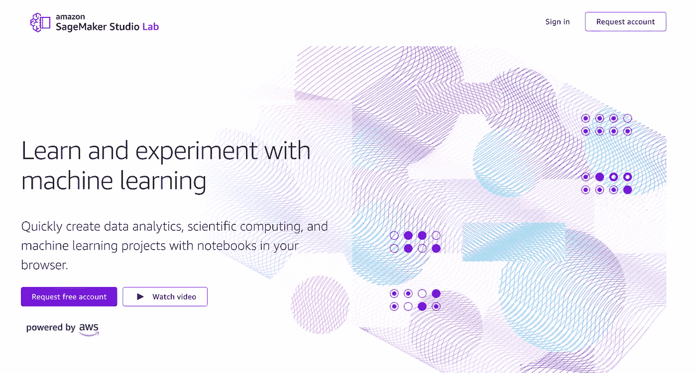
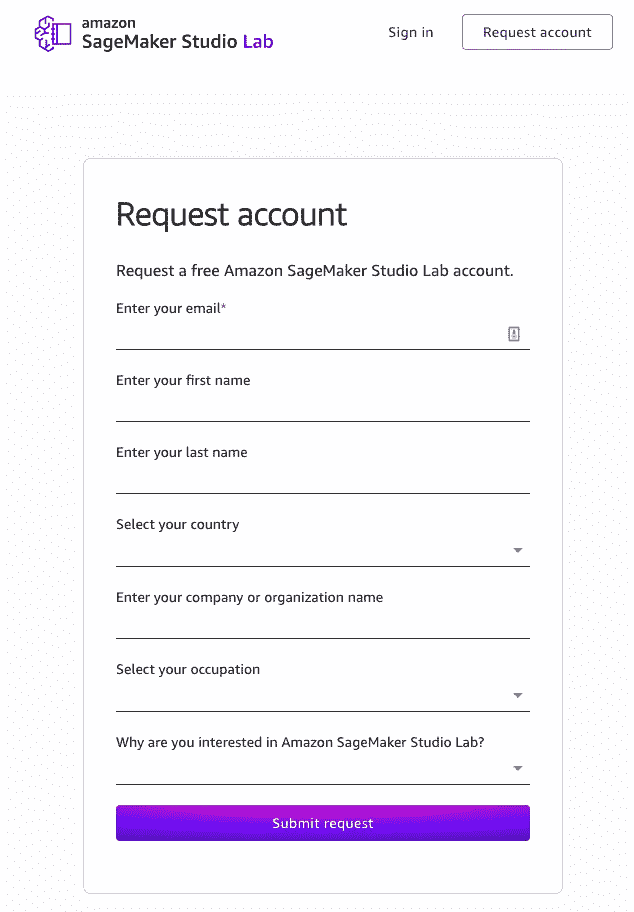
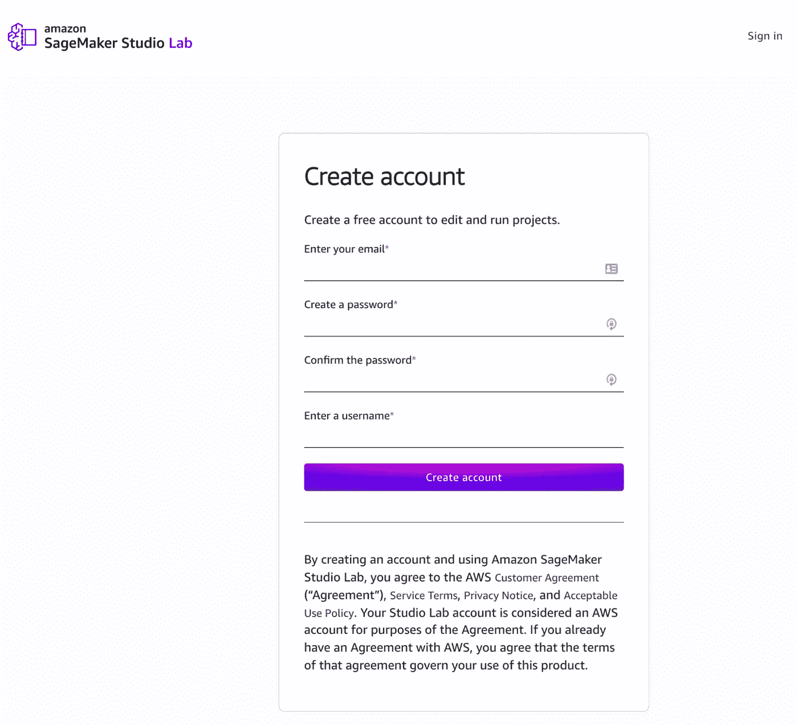
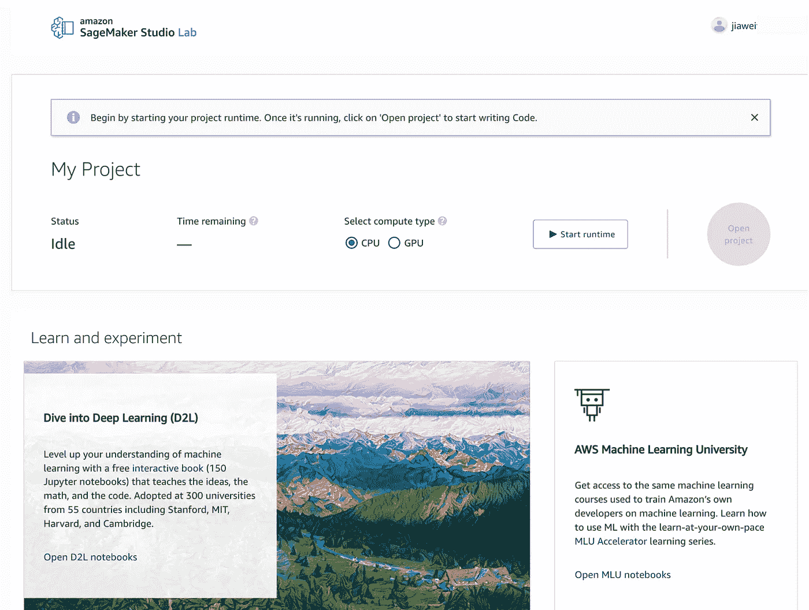
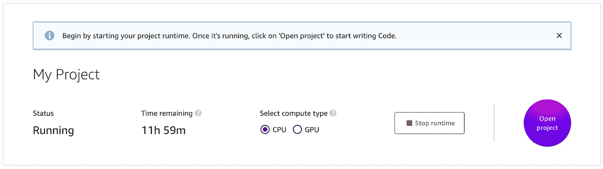
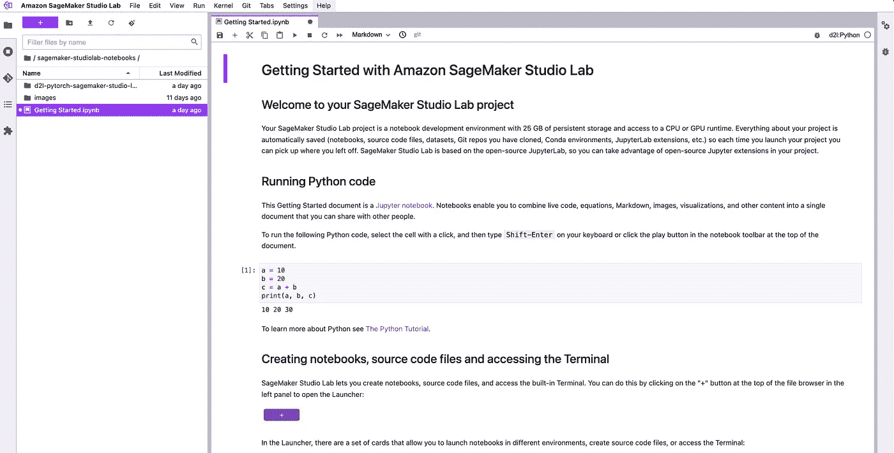
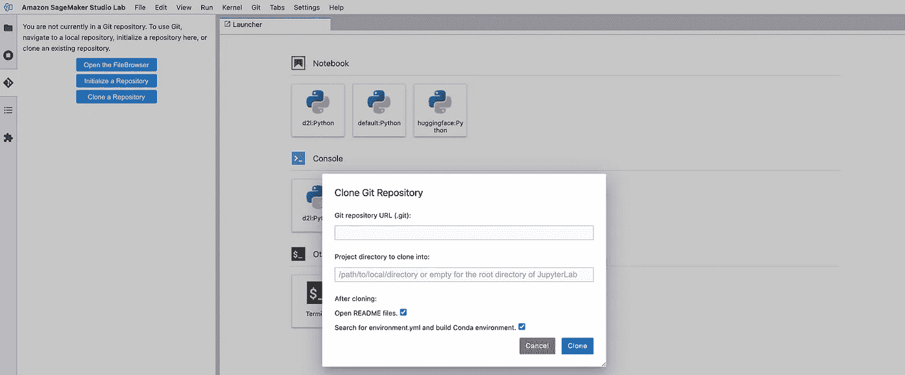
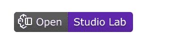

# Amazon SageMaker Studio 实验室入门

> 原文：<https://betterprogramming.pub/getting-started-with-amazon-sagemaker-studio-lab-c53f09218253>

## 它不同于 SageMaker 工作室，而且是免费的



作者截图来自 SageMaker 工作室的官方网站

学习数据科学和机器学习的最佳方式是动手实验室、教程和实验。不幸的是，有一些常见的痛点增加了一层摩擦，让有抱负的数据科学家开始工作。

这些斗争包括:

*   在个人笔记本电脑上设置硬件，如 GPU 或框架安装
*   云托管的 ML 环境很容易建立，但是很昂贵
*   在免费选项中缺少持久存储(即，您的数据和环境将在会话到期后重置)

# 介绍

在最新的 AWS [re:Invent 2021](https://reinvent.awsevents.com/) 中，AWS 团队宣布推出 SageMaker Studio Lab(目前正在预览中)以解决这些挑战并消除设置麻烦。

> 亚马逊 Sagemaker Studio 是一项免费的无配置服务，允许开发人员、学者和数据科学家学习和实验机器学习。

与 SageMaker Notebook Instances 或 SageMaker Studio 不同，在那里你需要建立一个 AWS 帐户(并需要一张信用卡)，现在**只需要**一个有效的**电子邮件地址**来注册一个帐户并开始试验。

## 概观

AWS SageMaker Studio 实验室免费(对，免费！).您甚至可以根据项目需求在 CPU 或 GPU 之间进行选择。

你的账户被分配了 15 GB 的永久存储空间和 16GB 的内存。这意味着您可以将项目和数据集保存在云中(不需要每次都从头开始)

> F 或者熟悉 AWS 的人，底层资源如下 GPU 用 G4dn.xlarge，CPU 实例用 T3.xlarge(可能会有变化)

# 帐户注册和创建

1.  访问 https://studiolab.sagemaker.aws/并申请一个账户。
2.  把你的详细资料填在表格里



申请表(作者截图)

3.等待请求批准(AWS 声称流程是在 1 到 5 个工作日内完成*)。在我提出请求后的第二天，我的帐户就被批准了)*

*4.收到您的批准电子邮件后，您可以按照帐户创建说明，通过电子邮件中的注册链接进行注册。*

**

*帐户创建(来自作者的截图)*

# *探索界面*

*到达登录页面后，您需要启动项目运行时。您需要在 CPU 和 GPU 运行时之间进行选择，会话分别从 12 (CPU)和 4 (GPU)开始。*

**

*SageMaker Studio 实验室的主页/欢迎页面(截图来自作者)*

*一旦会话超时，您将不得不再次重新启动项目运行时。不要担心，您的所有文件都将保存在永久项目存储中。*

**

*检查您的会话剩余时间*

# *学习和实验*

## *AWS 机器学习大学(MLU)*

*MLU 笔记本包含用于培训亚马逊自己的开发人员进行机器学习的材料。课程包括*

*   *自然语言处理*
*   *表列数据*
*   *计算机视觉*
*   *决策树和集成方法*

## *深入学习(D2L)*

*交互式笔记本(超过 150 个 Jupyter 笔记本)教授机器学习的基础知识，采用了 300 所大学，包括斯坦福大学、麻省理工学院、哈佛大学和剑桥大学。*

## *拥抱脸*

*[抱抱脸](https://huggingface.co/)是变形金刚图书馆和最新的 NLP、语音和计算机视觉模型的所在地。在这里，你可以探索和学习这个[仓库](https://github.com/huggingface/notebooks)里的笔记本。*

# *Jupyter 实验室界面*

*因为它是基于开源的 JupyterLab，所以您可以利用开源的 Jupyter 扩展来运行您的 Jupyter 笔记本。*

*您还可以完全控制您的(虚拟)环境，以利用 PyTorch、TensorFlow、MxNet、Hugging Face 等框架和 Scikit Learn、Pandas 和 NumPy 等库。*

**

*SageMaker Studio Lab 上典型的 Jupyter 实验室界面(截图来自作者)*

*您可以克隆自己的 Github 存储库，并在 SageMaker Studio Lab 上工作，因为它已经集成到 Github 和 Git 以进行版本控制。*

**

*在 SageMaker Studio Lab 上克隆您自己的 repo(截图来自作者)*

*此外，如果您有一个带有 Jupyter 笔记本的公共 Github repo，您可以让其他人很容易地在 SageMaker Studio Lab 中打开您的笔记本。*

*你所需要做的就是将`Open in Studio Lab`链接(徽章)添加到你的`README.md`文件或笔记本中。包括的降价如下:*

```
*[](https://studiolab.sagemaker.aws/import/github/org/repo/blob/master/**path/to/notebook**.ipynb)*
```

*创建的徽章将如下所示。*

**

*“在 Studio Lab 中打开”徽章*

# *奖励:黑客马拉松*

**

*AWS 灾难响应黑客马拉松*

*在撰写本文时(2021 年 12 月)，有一个正在进行的黑客马拉松(AWS 灾难响应黑客马拉松)，你可以在 SageMaker Studio 实验室探索和训练你的模型。截止日期是美国东部时间 2022 年 2 月 7 日下午 5:00。*

*阅读更多信息:*

*[](https://awsdisasterresponse.devpost.com/) [## AWS 灾难响应黑客马拉松

### 自然灾害的频率和严重程度都在增加。仅在今年，我们就看到了重大的…

awsdisasterresponse.devpost.com](https://awsdisasterresponse.devpost.com/)* 

*感谢你阅读这篇文章，我希望你会发现它很有见地。在等待名单变长之前，获取您的 SageMaker Studio 实验室。*

*祝大家学习愉快。*