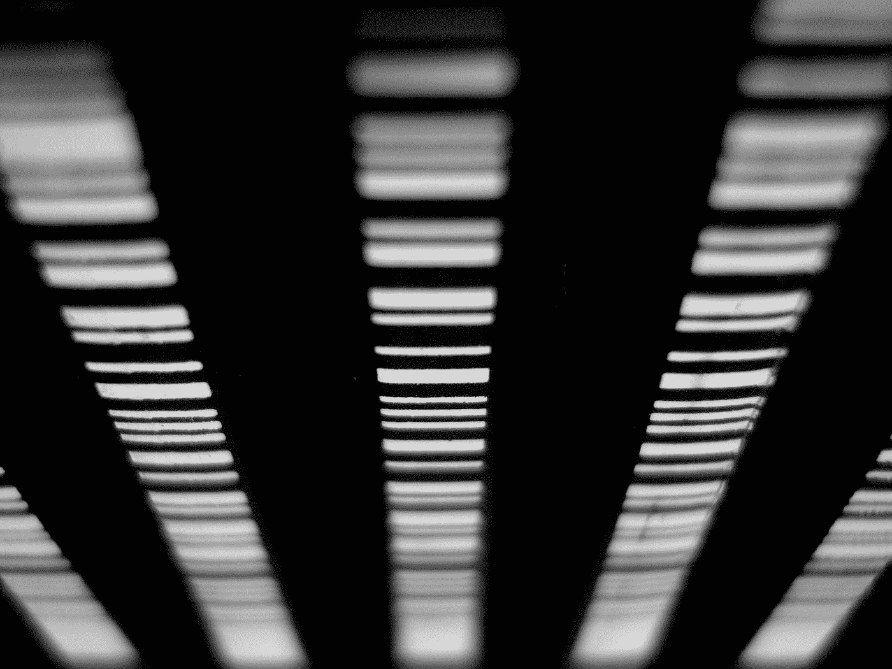
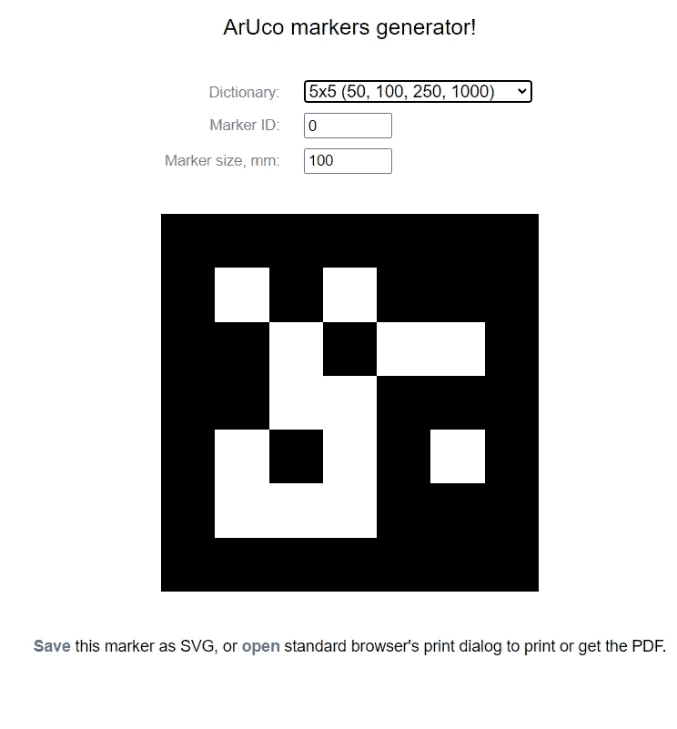
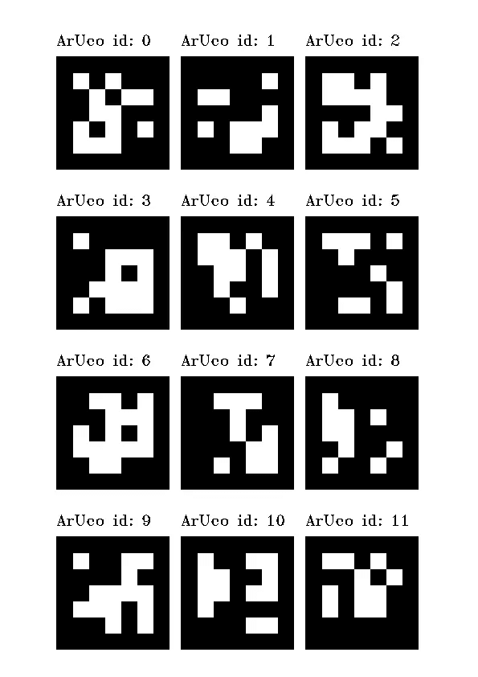
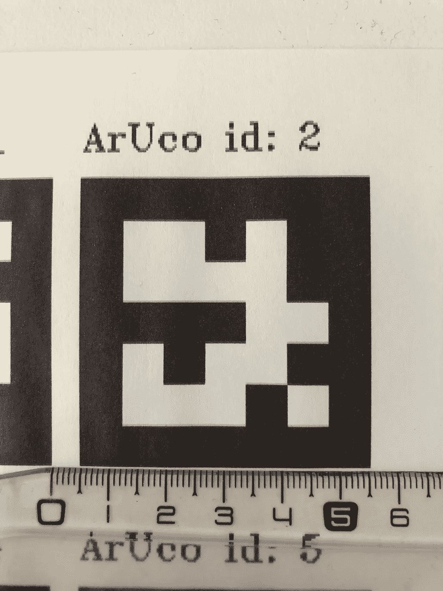
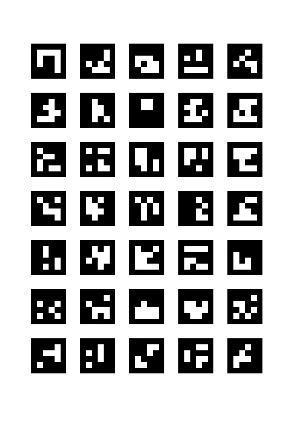
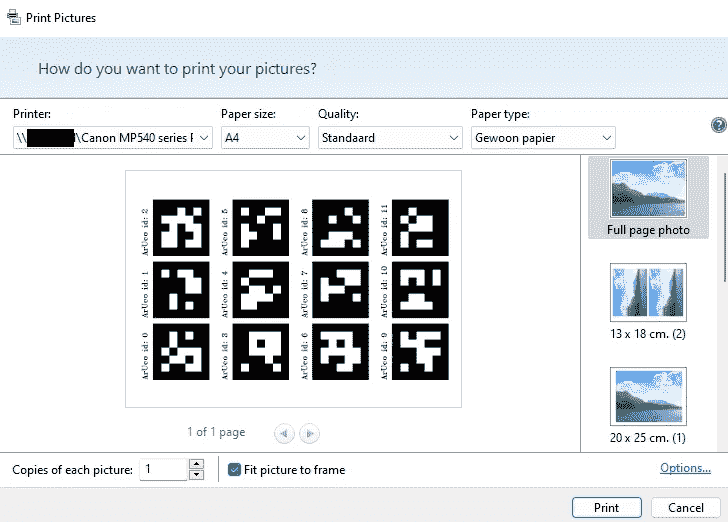
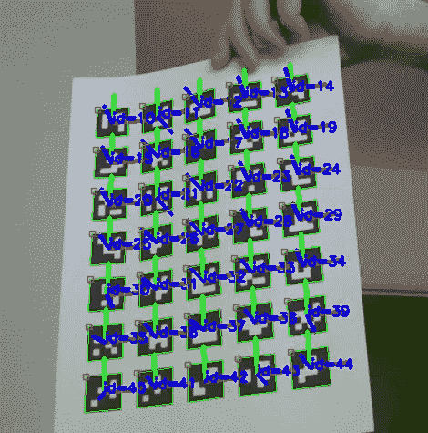
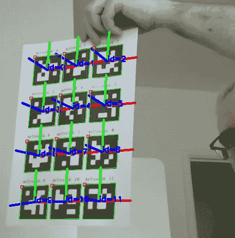

# ArUco 标记器入门

> 原文：<https://betterprogramming.pub/getting-started-with-aruco-markers-b4823a43973c>

## 在本文中，我们将使用 Python 和 OpenCV 来检测和估计 ArUco 标记的方向。

[D Pl](https://unsplash.com/@d_dandelion?utm_source=medium&utm_medium=referral) 在 [Unsplash](https://unsplash.com?utm_source=medium&utm_medium=referral) 上拍摄的照片

首先，我们将从生成 ArUco 标记开始。你可以使用一个特定的网站来创建一个接一个的标签，或者使用我的程序来生成整页的标记。

一旦你创建了一些标记，我将向你展示另一个程序来检测这些。该程序还可以确定这些 ArUco 标记的姿态轴。

我在这里写的代码是用 Python 编写的，但是对于更高级的检测和姿态估计应用程序，您可能希望使用 C++来实现它们。

你在下面发现的是我的好奇心和想要实验图像处理的结果。欢迎任何建设性的意见。

# 生成 ArUco 标记

如果你想一个一个地创造阿鲁科标记，那么你可以使用奥列格·卡拉切夫的[这个网站。该网站提供了一个简单的界面，如下所示:](https://chev.me/arucogen/)

选择 ArUco 字典、标记的 id 和大小。然后下载马克笔并打印出来。

我想用 ArUco 马克笔打印整页，所以这个网站对我没有帮助。

现在，OpenCV 提供了两个名为`cv.aruco.GridBoard.create()`和`cv.aruco.GridBoard.draw()`的函数来完成这项工作——创建并随后绘制一整页的 ArUco 标记。你可以在这里阅读关于这些功能[的更多信息。](https://docs.opencv.org/4.x/de/d05/classcv_1_1aruco_1_1GridBoard.html)

然而，我对测试这些功能的结果并不满意。ArUco 标记的尺寸在打印时不正确，一些标记没有正确放置在页面的边框内，并且无法添加标记的 id。

因此，我决定编写自己的程序来生成 ArUco 标记页面。您可以在下面找到它:

这个程序的想法是生成一个 A4 页面，在网格上放置 ArUco 标记(或 April 标签)。几个输入参数决定了该网格的大小:

*   标记/标签的尺寸，单位为毫米
*   标记之间的边距大小，以 mm 为单位
*   X 方向的标签数量
*   Y 方向上的标签数量
*   标签的 id 是否应该写在标签上面

该程序将确定所提供的参数是否会产生一个网格，该网格将适当地停留在 A4 页面的边界内。如果不是这样，程序将输出一个错误信息。

除了上述参数，您还可以提供以下其他参数:

*   图像输出文件的名称
*   要放在页面上的第一个标记的 id
*   输出图像的 DPI
*   要生成的标记或标签的类型

以下是如何生成带有标记的页面的一些示例:

`python aruco_gen_page.py -o "aruco_markers.png" -i 0 -t "DICT_5X5_50" -d 72 --write-id -x 3 -y 4`

这将产生以下页面:

左边是输出图像，右边是打印时的默认尺寸(50 mm)和边距(5mm)。

`python aruco_gen_page.py -o "aruco_markers.png" -i 10 -t "DICT_4X4_50" -d 72 -s 25 -m 10 --no-write-id -x 5 -y7`

它给出了以下结果:

左边是输出图像，右边可以看到打印时的尺寸(25mm)和边距(10 mm)是正确的。

为确保在使用 Windows 11 时正确打印生成的图像，最佳打印方法如下:

前往输出带有标记的图像的文件夹。然后右键单击图标并选择“打印”您将看到下面的对话框(可能不像我的部分是荷兰语):

在这里选择您的打印机，将纸张设置为 A4，并选择“标准”质量和“普通”纸张(尽管我怀疑这些设置可能因打印机而异)。确保选择了“整页照片”并选中了“图片适合框架”。

我没有在其他操作系统上测试过这个程序。

# 检测和估计我们 ArUco 标记的姿态

在我们能够检测和估计标记的姿态之前，我们需要校准我们的相机。如何做到这一点，请看我下面的文章。

 [## 如何使用 Python 和 OpenCV 校准相机

### 在本文中，我们将看看如何确定单目相机的相机矩阵和失真系数…

better 编程. pub](/how-to-calibrate-a-camera-using-python-and-opencv-23bab86ca194) 

当你校准了你的相机，你需要得到相机矩阵和失真系数。我已经把这些放在一个 JSON 文件中，如本文所示。

下面是我用来检测和估算的程序。

首先，从 JSON 文件中加载相机矩阵和失真系数。

接下来，从摄像机中读取一帧，以确定视频流中图像的宽度和高度。

然后，使用 OpenCV 函数`cv2.getOptimatlNewCameraMatrix()`和`cv2.unitUndistortRectifyMap()`确定感兴趣区域`roi`，以及`mapx`和`mapy`参数。

在无限循环中，我们从视频流中读取一帧。使用我们刚刚找到的`mapx`和`mapy`参数重新映射(不失真)这个帧。此外，图像仅被裁剪为包含感兴趣的区域。

现在我们可以开始使用 [OpenCV 函数](https://docs.opencv.org/4.x/d4/d17/namespacecv_1_1aruco.html#a061ee5b694d30fa2258dd4f13dc98129) `cv2.aruco.detectMarkers()`检测标记。我还包括了使用当前图像帧的灰度版本的可能性。

然后，如果检测到一些标记(通过它们的角来标注)，我们可以使用[函数](https://docs.opencv.org/4.x/d9/d6a/group__aruco.html#ga2ad34b0f277edebb6a132d3069ed2909) `cv2.aruco.drawDetectedMarkers()`在视频帧中的标记周围画一个框，包括 id。可选地，我们也可以使用`cv2.estimatePoseSingleMarkers()`和`cv2.aruco.drawFrameAxes()`绘制显示帧中每个标记的姿态的轴。在这里和这里[阅读关于这些功能](https://docs.opencv.org/4.x/d9/d0c/group__calib3d.html#gab3ab7bb2bdfe7d5d9745bb92d13f9564)[的更多信息。](https://docs.opencv.org/4.x/d9/d6a/group__aruco.html#ga56878c4f94362c9420f20b78de0def9b)

最后，我们使用`cv2.imshow()`在屏幕上的 GUI 中显示该帧。

下面是来自 GUI 的两个截图，显示程序正确地确定了姿势的轴和我们之前生成的页面上每个标记的 id。

当我保持页面相对静止或轻微移动时，大多数或所有标记都会被检测到。另一方面，如果我将页面快速移过相机，那么在某个时刻，将不会检测到标记。我的猜测是，我们所做的 Python 实现运行速度不够快，无法“跟随”。

如果这是正确的，并且如果我们需要检测 ArUco 标记以供例如自动驾驶车辆使用，那么应该用 C++来实现，以便足够快地工作。

# 参考

[Pyimagesearch 的“使用 OpenCV 和 Python 生成 ArUco 标记”](https://pyimagesearch.com/2020/12/14/generating-aruco-markers-with-opencv-and-python/)

[Pyimagesearch 的“使用 OpenCV 和 Python 检测 ArUco 标记”](https://pyimagesearch.com/2020/12/21/detecting-aruco-markers-with-opencv-and-python/)

[“使用 python 中的 aruco 标签进行 3D 姿态估计”由 programming.vip 完成](https://programming.vip/docs/3d-pose-estimation-using-aruco-tag-in-python.html)

[《Python cv2 . initundistortrectifymap()示例》programcreek.com](https://www.programcreek.com/python/example/89319/cv2.initUndistortRectifyMap)