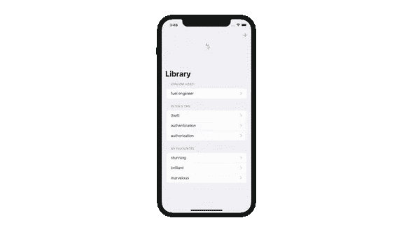
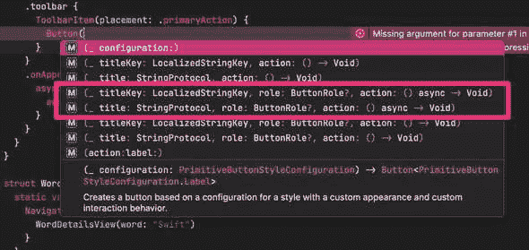

# iOS 15 swift ui 中的 Async/Await 入门

> 原文：<https://betterprogramming.pub/getting-started-with-async-await-in-swiftui-for-ios-15-f627eb722a4b>

## 了解如何在 SwiftUI 应用中使用异步/等待


图片由作者提供(基于 SF 符号)。

毫无疑问，WWDC21 上最大的声明之一是[Swift Concurrency](https://developer.apple.com/news/?id=2o3euotz)——最显著的是对`async/await`的支持。

作为开发人员，我们经常面对我们编写的应用程序的异步特性。从磁盘读取文件，从 web 上的远程 API 获取数据，甚至从用户那里获取输入——所有这些都是异步操作。多年来，已经实现了许多不同的处理异步代码的方法。大多数 iOS 开发人员都熟悉大中央调度、完成处理程序或委托。

新的 Swift 并发模型建立在线程之上，但从线程中抽象出来。

在 2021 年 WWDC 大会上，苹果公司做了一项了不起的工作，解释了`async/await`和结构化并发背后的所有概念。有不少于九个视频，加上 Swift 语言指南中关于并发性的一整章以及大量样本代码(如果你没有尝试过，请查看开发人员应用程序中的复制代码功能)。

但是因为有如此多的信息，有时很难只见树木不见森林。

本文旨在为您提供编写 SwiftUI 应用程序所需的一切，这些应用程序利用了 Swift 中新的并发功能。

所以我们开门见山吧！

*注意:本文基于 Xcode 13 中包含的 Swift 5.5(在撰写本文时，Xcode 13b1)。在 iOS 15 向公众发布并且 Apple 开始接受用 Xcode 13 GA 创建的版本之前，您将无法在您的生产版本中使用它。然而，学习如何使用新的语言特性并理解它们可能对您的代码产生的影响是有益的——特别是如果您是一个库或框架供应商的话。*

# 示例应用程序

在为我们的示例应用程序寻找易于使用的 API 时，我遇到了 [WordsAPI](https://www.wordsapi.com/) 。这是一个有趣的 API，提供了大量关于单词的有趣信息(在英语中)。你给它发送一个词，比如“Swift”，它会返回一堆信息，比如这个词的不同含义(比如“移动非常快”，“一只像燕子的小鸟”，或者“一个出生在爱尔兰的英国讽刺作家”)。

示例应用程序在一个`List`视图中显示一串单词。当用户点击其中一个单词时，该应用程序将从 WordsAPI 中获取该单词的含义，并在详细信息屏幕中显示它们。

在本文的后面，我们将添加另一个特性，从 WordsAPI 获取一个随机单词，并在用户进行刷新时将其添加到主列表中。



*拉至刷新示例截图*

# 使用 URLSession 和 Async/Await

`URLSession`是许多已经升级支持`async/await`的 API 之一，所以获取数据现在是一个简单的单行程序:

```
let (data, response) = try await URLSession.shared.data(for: urlRequest)
```

通过一些最低级别的错误处理和 JSON 解析(由 Codable 提供支持)，获取单词详细信息的代码如下所示:

注意，我们通过在方法签名中追加`async`将我们的`search(for searchTerm: String)`方法标记为异步。这意味着无论何时调用这个方法，我们都必须使用`await`。这样做表示一个所谓的暂停点，并给运行库一个机会来暂停当前正在执行的函数。挂起的函数被“挂起”，直到它调用的函数返回。当函数挂起时，它正在执行的线程可以用来执行应用程序中的其他代码。

# 更新@Published 属性

示例应用程序使用视图模型作为从 WordsAPI 端点获取数据的中心点。它被实现为一个`ObservableObject`，因此它可以利用 SwiftUI 的状态管理系统:

我们来讨论一下这是怎么回事:

*   `result`是包含 API 调用结果的已发布属性(一旦该调用返回)。
*   `isSearching`表示我们当前是否正在执行搜索。该属性将被绑定到一个进度指示器，以向用户提供一些视觉反馈，表明我们正在等待结果。
*   `executeQuery`管理`isSearching`的状态，然后调用实际代码来执行 API 调用。注意，这个函数也需要标记为`async`，因为它调用`search(for:)`，这是一个可能会挂起的函数(正如“Swift 中的 Meet async/await”中提到的[，可能会挂起的函数也会挂起它们的调用方)。](https://developer.apple.com/videos/play/wwdc2021/10132?time=1208)
*   最后，整个视图模型被标记为`@MainActor`，以表明其中的任何代码都必须在主参与者上运行。

最后一点很关键:因为发布的属性更新 UI，所以对它们的任何更改都需要在主线程上运行。通过用`@MainActor`属性标记一个类，Swift 编译器将保证该类上的所有方法和属性只从主参与者调用。所以通过用`@MainActor`注释来注释`WordDetailsViewModel`，我们确保所有的更新都发生在主线程上。

*注意:我强烈推荐使用视图模型，因为它们有助于保持代码的整洁。然而，放弃视图模型并使* `*search(for searchTerm: String)*` *功能成为 SwiftUI 视图的一员是完全可能的。要了解如何做到这一点，请查看本文 GitHub 资源库中的*[*word detailsviewnoviewmodel*](https://github.com/peterfriese/SwiftUI-Concurrency-Essentials/blob/main/WordBrowser/WordBrowser/Views/WordDetailsViewNoViewModel.swift)*。*

# 从 SwiftUI 调用异步代码

难题的最后一块是如何从 SwiftUI 调用我们的异步代码。你可以从许多不同的地方打电话:

*   当视图出现时
*   当用户点击按钮时
*   当用户拉动刷新时
*   响应于搜索请求
*   基于通知
*   基于计时器

让我们看看其中的一些，以了解我们可以使用的不同机制。

## 当视图出现时

这可能是获取数据最常见的时间，您可能已经在现有的 SwiftUI 应用程序中使用了`onAppear`视图修饰符来触发获取数据。我们仍然可以使用`onAppear`，但是编译器会抱怨我们不能在这里调用异步函数。


这个问题的一个解决方案是通过调用静态函数`async`来创建一个新的`Task`(在 Xcode 13b2 中这将被替换为`Task.init`)，如下所示:

这很有效，但是还有一个更好的解决方案。因为在视图出现时获取数据是如此常见，SwiftUI 有一个新的视图修改器，当视图消失时，它将自动创建一个新的`Task` *和*取消任务:

## 当用户点击按钮时

有时，我们希望执行异步代码来响应按钮点击。在 Xcode 13b1 中，大部分按钮动作处理程序都不支持调用异步代码，所以我们需要自己调用`async`来创建一个新的异步上下文:

一些`Button`的动作处理程序支持调用异步代码，但是:



我不太清楚为什么这应该只对有角色的`Buttons`可行，所以也许我们会在下一个测试版中看到这方面的更新。

## 当用户拉动刷新时

拉至刷新是今年 SwiftUI 发布的另一个受欢迎的新增功能。通过简单地添加`refreshable`视图修饰符，视图就获得了拉至刷新的能力。在闭包内部，我们可以更新视图中显示的数据:

## 响应于搜索请求

今年 SwiftUI 的发布也为我们带来了`searchable()`视图修改器。通过将这个视图修饰符应用到一个列表视图，可以得到一个特定于平台的搜索 UI。视图修改器的第一个参数是到一个`String`的绑定，然后您可以使用它来驱动搜索。如果你不想使用 Combine 来监听搜索字符串的变化，你可以使用`onSubmit(of:)`视图修改器来响应某些按键。例如，要在用户点击屏幕键盘上的搜索按钮(或按回车键)时触发搜索，您可以使用以下代码片段:

您可能已经注意到，`onSubmit`的闭包没有被标记为异步，这就是为什么我们需要使用现在熟悉的`async { }`语法创建一个新的`Task`。

# 结论

总结一下:

1.  使用苹果 API 的异步版本(如果这不可能，有一个变通方法，我们将在以后的文章中了解)。
2.  将调用异步代码的函数标记为`async`。
3.  将您的`ObservableObjects`标记为`@MainActor`。
4.  要在视图出现时获取数据，使用`task`视图修改器。
5.  使用`refreshable`视图修改器使用拉至刷新来异步获取数据。
6.  使用`async`从同步上下文中启动一个新的异步任务，比如`Button`。

我希望你觉得这很有用。如果您有任何问题或建议，请在本文的[资源库](https://github.com/peterfriese/SwiftUI-Concurrency-Essentials)上留下评论或提交请求。

感谢阅读！

*原载于*[*https://peterfriese . dev*](https://peterfriese.dev/swiftui-concurrency-essentials-part1/)*。*