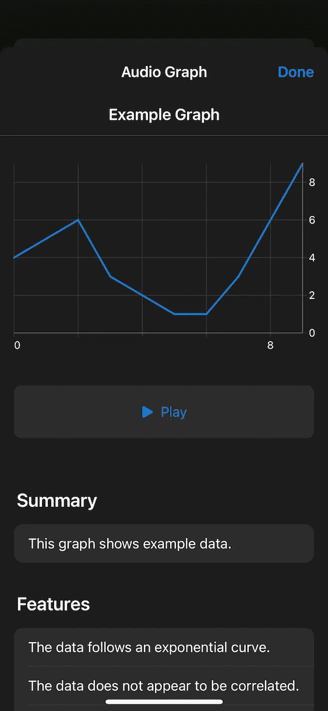
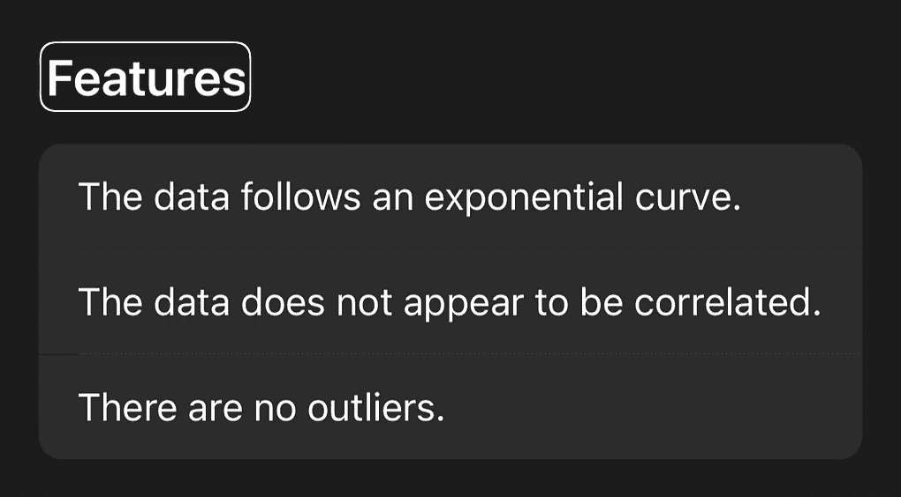
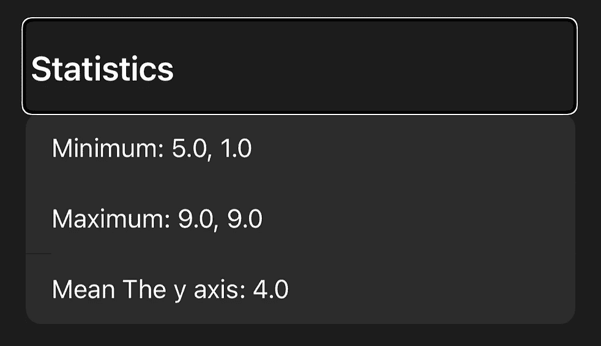

# Swift 和 iOS 15 中的音频图表入门

> 原文：<https://betterprogramming.pub/getting-started-with-audio-graphs-in-swift-7502979494f6>

## 让图形和图表变得可访问—第一部分

Pawel Czerwinski 在 [Unsplash](https://unsplash.com/?utm_source=unsplash&utm_medium=referral&utm_content=creditCopyText) 上拍摄的照片

苹果以易用性强而闻名。iOS 15 中引入了新的音频图表功能，使得视障用户更容易使用 iOS。

本教程涵盖了您开始使用 iOS 应用程序的音频图表所需了解的一切。我们将了解什么是音频图，以及如何将它们添加到我们的应用中，如何定义轴和数据点。

本教程结束时，您将准备好让您的应用程序比以往任何时候都更易于访问，并帮助更多人使用您的应用程序。

正如苹果在会议上所说的 [*在你的应用中加入图表的可访问性*](https://developer.apple.com/videos/play/wwdc2021/10122/)

> 你看不到的图表没有价值

所以让我们开始吧！

# 什么是音频图？

在本教程中，我们不打算研究如何创建和使用图表。有很多向用户展示图表和图形的好方法，从简单的自建解决方案到现成的框架，如[图表](https://github.com/danielgindi/Charts)。

相反，我们将使用一组示例数据点，并重点关注添加音频图表功能。最后，这将是为我们的图表创建的页面:

该页面显示了向用户播放的图表。它还包含有关数据系列的摘要、特征和统计数据等附加信息。所有这些信息都将通过 VoiceOver 读给用户听。

# 实现音频图形

要做的第一步是使呈现图表的视图控制器符合协议`AXChart`。该协议被描述为

> 一种协议，声明辅助功能元素充当图表所需的最小接口。

它有一个要求:属性`var accessibilityChartDescritpor: AXChartDescriptor?`。这样的描述符包含了显示您在上面看到的音频图形页面所需的所有信息，例如`title`、`summary`和`series`。

图表描述符由轴和数据点的更多描述符组成。在将它们放在一起并创建一个`AXChartDescriptor`之前，让我们先来看看这些类。

# 描述轴

轴描述符可以是两种类型之一:`AXNumericDataAxisDescriptor`或`AXCategoricalDataAxisDescriptor`。两者实现相同的基础协议`AXDataAxisDescriptor`，不能直接使用。

对于 x 轴，两种类型的描述符都可以使用。但是 y 轴只能用数字描述符来定义。这是有意义的，因为图中显示的点只能是数字，而 x 值可以是点和类别。

*注:我们将在下周 Swift* *的下一部分* ***高级音频图中更详细地研究分类描述符。现在，我们将看到一个对 x 和 y 轴只使用数字描述符的基本例子。***

让我们从创建一个 x 轴开始，我们可以这样做:

`// 1` —现在我们创建一个带有示例标题的数轴。对于真实世界的应用程序，您应该使用更具描述性的标题，因为这是 VoiceOver 将读取的内容。

`// 2` —一个轴也需要知道它的范围。当我们在后面的步骤中创建数据点时，我们将创建 10 个点，因此在本例中范围是`(0...9)`。当基于真实数据创建点时，您可以传递想要在图表中显示的值的数量。

`// 3` —接下来，我们还可以传入一个点数组来显示网格线。但是，不管提供什么值，这似乎对创建的音频图详细信息页面没有影响。如果你知道更多关于这个房产的信息，请在评论中告诉我！

`// 4` —最后，一个轴需要知道如何将数据点转换成字符串，以供用户阅读。这是通过提供一个将`Double`值转换成`String`值的闭包来实现的。在这种情况下，我们只是将值嵌入到一个字符串中，但是您也可以使用格式化程序或其他转换。

y 轴的创建与我们创建 x 轴的方式非常相似。还需要一个`title`、`range`、`gridlinePositions`和`valueDescriptionProvider`:

# 描述数据点

图形点包含在一个`AXDataSeriesDescriptor`中，代表一个数据系列。一个音频图可以有多个数据系列，但现在我们只使用一个。

一个`AXDataSeriesDescriptor`由一个名称、一个布尔标志(表示数据序列是否连续)和一个作为实际点的`AXDataPoint`对象数组组成。

一个点总是有一个 x 轴值叫做`xValue`。y 轴的值`yValue`是可选的。此外，一个点可以有一个给数据点命名的`label`和`additionalValues`，它可以是这个数据点的数值或分类值。

给定一些示例值，下面是如何创建一个`AXDataSeriesDesciptor`:

`// 1` —这里我们用 y 轴的值数组创建数据点。x 轴值是数组中一个数字的索引。

`// 2` —接下来，我们使用刚刚创建的`AXDataPoint`对象数组，并将它们包装在`AXDataSeriesDescriptor`中。我们为`isContinous`传入`true`以显示一个连贯的图形，并定义一个空字符串作为该数据系列的名称。

您也可以使用`false`代替`isContinuous`来分别显示所有点。您可以自己查看，或者等待下一部分，我们将详细了解更多选项。

# 将所有描述符放在一起

我们为轴创建了两个描述符，为数据序列创建了一个描述符。现在我们准备把它们放在一起，创建一个`AXChartDescriptor`。

我们可以这样做:

`// 1` —如上所述，为了实现协议`AXChart`，我们需要提供类型`AXChartDescriptor?`的属性`accessibilityChartDescriptor`。

`// 2` —为了创建它，我们指定了一个`title`和一个`summary`，它们将在音频图表详细信息页面上向用户显示和读取。我们还传入了之前创建的轴描述符和数据序列描述符。

`// 3` —因为这个属性永远不会从其他地方设置，所以我们将 setter 留空。

# **使用音频图形**

让我们看看我们的音频图。

如果你不习惯画外音，使用它可能会令人生畏。启用或禁用它的最佳方式是在 iPhones 背面双击或三击。转到`Settings > Accessibility > Touch`并向下滚动到**后点击**。您可以在这里定义许多不同的动作，由双击或三击触发。

接下来，运行您的应用程序，转到您已启用音频图表功能的图表。启用 VoiceOver 并推送，直到您选择了图表。

如果你不知道如何使用 VoiceOver 导航，你可以查看[苹果的 VoiceOver 手势指南](https://support.apple.com/guide/iphone/learn-voiceover-gestures-iph3e2e2281/ios)或 [iOS 辅助功能:raywenderlich.com 入门](https://www.raywenderlich.com/6827616-ios-accessibility-getting-started)。

一旦图形被选中，你可以通过上下滑动来选择不同的选项。您可以通过双击屏幕上的任意位置来选择一个。这些是选项:

**描述图表** : VoiceOver 会读出您的`AXDataAxisDescriptors`的标题，以及有多少数据系列可用。

**播放音频图**:播放数据序列时，y 值较高的点音调较高，y 值较低的点音调较低。

**图表详细信息**:打开音频图表详细信息页面，显示图表、播放按钮和更多详细信息，如我们在`AXChartDescriptor`中提供的摘要、图表特征和统计信息。

打开音频图表详情页面—这就是我们一直努力的目标！

向右滑动直到选择了**播放按钮**并双击播放音频图。很容易看到(或听到)，为什么这个新功能大大提高了视觉障碍用户的图形的可访问性。

# 从这里去哪里

正如你在本教程中看到的，苹果使得为现有图形添加音频表示变得非常容易。这只是将您的数据点包装成一个`AxDataSeriesDescriptor`并添加一些元数据的问题。

在下一部分，我们将看看它们有多灵活。我们将涵盖不同类型的轴，并展示多个数据系列。这部分将于下周发布，敬请关注更多可访问性！

通过音频图表使您的应用程序更易于访问，从而让更多的受众能够使用它们。这会让你的用户有更好的体验。

如果您有任何问题或意见，请在评论中告诉我，或者通过 [Twitter](https://twitter.com/HeyDaveTheDev) 联系我。

# 资源

 [## Apple 开发者文档:音频图表

### 在图表中提供数据的声音表示。

developer.apple.com](https://developer.apple.com/documentation/accessibility/audio_graphs)  [## 在您的应用程序中添加图表访问功能- WWDC21 -视频- Apple Developer

### 图表是理解数据的重要工具，对于理解我们自己、我们的健康、我们的财务状况至关重要…

developer.apple.com](https://developer.apple.com/videos/play/wwdc2021/10122/)  [## SwiftUI 中的音频图形

### 就可访问性而言，图表是复杂的事物之一。幸运的是，iOS 15 有了一个新功能…

swiftwithmajid.com](https://swiftwithmajid.com/2021/09/29/audio-graphs-in-swiftui/)