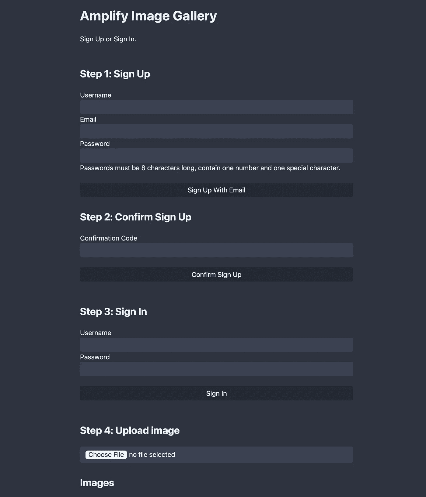

# AWS Amplify 入门

> 原文：<https://betterprogramming.pub/getting-started-with-aws-amplify-d5ed64c831b9>

## 了解 Amplify 的工作原理，部署具有用户验证、存储和文件上传功能的图库


[官方标志](https://docs.amplify.aws/start/)

Amplify 允许网络和移动开发者在 AWS 上快速创建全栈应用。在本文中，您将了解 Amplify 如何工作，以及如何构建和部署具有用户验证、存储和文件上传功能的图片库。

无服务器云基础设施是构建应用的下一步。但是如果你尝试过在 AWS 控制台中导航大量的服务，你就会知道使用云是说起来容易做起来难。今天的开发人员被 AWS 提供的大量服务淹没了。

解决办法？AWS Amplify 通过提供一系列 CLI 工具、库、框架和云服务，帮助开发人员轻松构建和部署完整的移动和 web 应用。

# AWS Amplify 是如何工作的？

使用 Amplify 时，您的主要交互点是 CLI 工具，它提供了许多命令来帮助您设置和维护无服务器项目。Amplify CLI 可以通过生成和部署 CloudFormation 代码来创建基础架构。它还包括使用以下语言的移动和 web 应用程序的代码生成器:JavaScript/TypeScript、Dart、Swift、Java 和 GraphQL。

这样，您可以获得部署到云中的新 AWS 资源，配置了最佳实践，以及将您的前端与这些资源连接起来所需的样板代码。

Amplify 也有自己的一套云服务，你可以用来设置和管理你的应用程序，包括基于亚马逊 S3 和亚马逊 CloudFront 的虚拟主机，Amplify 控制台和 Amplify Admin UI。Amplify 控制台用于在您部署应用程序后深入了解应用程序的工作情况，而 Amplify Admin UI 是 Amplify CLI 的可视化替代工具，您可以在浏览器中创建后端。

还有大量的前端库和组件可以帮助您连接 AWS 服务，并简化 Amplify 与 React 或 Vue 等前端框架的集成。这包括一个用于与 [Amazon Cognito](https://aws.amazon.com/cognito) 认证的库，AWS 自己的身份管理服务，以及一个连接到 [AppSync](https://aws.amazon.com/appsync) 的 GraphQL 客户端，一个托管的 GraphQL API 服务。

通过 Amplify DataStore，Amplify 甚至包括一个相对高级的库，可以减轻为您的应用程序设置离线功能和实时同步的痛苦。

# 建立图像库

为了更好地理解 Amplify 能做什么，让我们用它来构建一些东西！对于 Amplify 来说，图片库网络应用是一项简单的任务。本教程向您展示了如何使用 Amplify auth、hosting 和 storage 插件，以及如何使用 Amplify CLI 生成大部分代码。

# 1.先决条件

本教程需要以下内容:

*   AWS 帐户
*   AWS CLI
*   Node.js 和 NPM
*   放大 CLI

如果使用 Cloud9 IDE 跟进，只需手动安装和配置 Amplify CLI 其他一切都是开箱即用的。确保通过`amplify configure`配置了 Amplify CLI，以使用您的 AWS 凭证。AWS 有关于安装和配置 Amplify CLI 的详细[指南。](https://docs.amplify.aws/start/getting-started/installation/q/integration/js/)

# 2.初始化示例应用程序

首先，您需要为您的应用程序创建一个包含几个子目录的新目录。

```
$ mkdir image-gallery
$ cd image-gallery
$ mkdir src
$ mkdir dist
```

`src`目录用于存储 JavaScript 代码，而`dist`目录被 Amplify 用来捆绑、缩小和上传 JavaScript 和 HTML 到云端。

在项目根目录下创建一个`package.json`文件，内容如下:

```
{
  "name": "image-gallery",
  "version": "0.1.0",
  "scripts": {
    "build": "esbuild src/app.js --bundle --minify --define:global=window --outfile=dist/app.js"
  },
  "dependencies": {
    "aws-amplify": "latest"
  },
  "devDependencies": {
    "esbuild": "^0.13.15"
  }
}
```

您应该使用 ESBuild 将 Amplify SDK 与您的应用程序代码捆绑在一起并进行精简，以便进行部署。`amplify publish` CLI 命令将自动调用构建脚本并搜索`dist`目录中的文件以上传到 Amplify 的托管服务。

# 3.初始化放大器

用下面的命令初始化项目中的 Amplify。当询问时，选择默认值。

```
$ amplify init -y
```

该命令将在云中设置基本的与 Amplify 相关的资源，包括两个 IAM 角色和一个用于部署相关数据的 S3 存储桶。它还将生成一个`src/aws-exports.js`文件，其中包含您的前端连接到您稍后将部署的服务所需的所有凭证。该文件将在每次调用 Amplify CLI 时更新，因此您不应该手动更改它。

接下来，依次添加`hosting`、`auth`和`storage`。

```
$ amplify add hosting
```

选择下面列出的默认值。

```
? Select the plugin module to execute: Hosting with Amplify Console (Managed hosting with custom domains, Continuous deployment)? Choose a type: Manual deployment$ amplify add auth
```

接下来，CLI 将询问您一些问题，并给出默认答案。这里，默认值也是可以的。它们如下:

```
Do you want to use the default authentication and security configuration? Default configurationHow do you want users to be able to sign in? UsernameDo you want to configure advanced settings? No, I am done.$ amplify add storage
```

存储类别需要一点定制。默认配置只允许经过身份验证的用户访问存储，但您也希望未经身份验证的用户查看图像。为此，您需要以下配置:

```
? Select from one of the below mentioned services: Content (Images, audio, video, etc.)✔ Provide a friendly name for your resource that will be used to label this category in the project: ...✔ Provide bucket name: ...✔ Who should have access: Auth and guest users✔ What kind of access do you want for Authenticated users? create/update, read, delete✔ What kind of access do you want for Guest users? read✔ Do you want to add a Lambda Trigger for your S3 Bucket? no
```

对于存储器，选择`Auth and guest users`以确保您有权访问。认证用户需要对`create`、`update`和`read`文件的权限，访客用户需要对`read`文件的权限。

# 4.编写源代码

在`dist`目录下创建一个`index.html`文件，内容如下:

```
<!DOCTYPE html><meta charset="utf-8" /><title>Amplify Image Gallery</title><link rel="stylesheet" href="//unpkg.com/bamboo.css@1.3.7/dist/dark.min.css" /><style>
  button {
    width: 100%;
  }
</style><h1>Amplify Image Gallery</h1><div id="signin-status">Sign Up or Sign In.</div>
<br><h2>Step 1: Sign Up</h2>Username <input id="signup-username" /><br>Email <input id="signup-email" /><br>Password <input type="password" id="signup-password" /><br><p>
  Passwords must be 8 characters long, contain one number and one special
  character.
</p><button id="signup-button">Sign Up With Email</button><br><h2>Step 2: Confirm Sign Up</h2>Confirmation Code <input id="signup-confirmation-code" /><br><br><button id="confirm-signup-button">Confirm Sign Up</button><br><br><h2>Step 3: Sign In</h2>Username <input id="signin-username" /><br>Password <input type="password" id="signin-password" /><br><br><button id="signin-button">Sign In</button><br><br><h2>Step 4: Upload image</h2><input type="file" id="upload-input" /><h2>Images</h2><div id="gallery"></div><script src="app.js"></script>
```

这个 HTML 页面有几个注册过程的按钮。它们将在下面的 JavaScript 文件中与逻辑联系起来。

在`src`目录下创建一个`app.js`文件，内容如下:

```
import Amplify, { Auth, Storage } from 'aws-amplify'import awsconfig from './aws-exports'Amplify.configure(awsconfig)const getElement = document.getElementById.bind(document)const statusDiv = getElement('signin-status')async function refreshGallery() {
  const galleryDiv = getElement('gallery')galleryDiv.innerHTML = ''const files = await Storage.list('')for (let file of files) {
    const image = document.createElement('img')image.src = await Storage.get(file.key)galleryDiv.appendChild(image)
  }
}refreshGallery()getElement('signup-button').addEventListener('click', async () => {
  const username = getElement('signup-username').value
  const email = getElement('signup-email').value
  const password = getElement('signup-password').valueawait Auth.signUp({ username, password, attributes: { email } })statusDiv.innerText = `Check "${email}" inbox for a confirmation code.`
})getElement('confirm-signup-button').addEventListener('click', async () => {
  const code = getElement('signup-confirmation-code').value
  const username = getElement('signup-username').valueawait Auth.confirmSignUp(username, code)statusDiv.innerText = 'Sinup confirmed. You can sign in now.'
})getElement('signin-button').addEventListener('click', async () => {
  const username = getElement('signin-username').value
  const password = getElement('signin-password').valueconst result = await Auth.signIn(username, password)statusDiv.innerText = 'Signed in as ' + result.username
})getElement('upload-input').addEventListener('change', async (e) => {
  const [file] = e.target.filesawait Storage.put(file.name, file)await refreshGallery()
})
```

`app.js`文件给 HTML 注入了生命。`aws-exports.js`文件包含您的客户机与部署的基础设施交互所需的所有凭证。您将使用它来初始化 Amplify SDK。

`refreshGallery`函数获取您上传到 AWS Amplify 存储器的所有文件名的列表，这实际上是一个 S3 桶。然后，它使用`Storage.get`方法生成经过签名的 URL，这些 URL 可以放入`img` HTML 元素来显示您的图像。

接下来，向所有按钮添加事件侦听器来管理身份验证流。Amplify SDK 提供了一个具有各种方法的 Auth 对象来注册、登录和确认电子邮件代码。稍后需要登录才能使用上传功能。

要安装用于 JavaScript 和 ESBuild 的 Amplify SDK，请运行以下命令:

```
$ npm i
```

安装完库后，您可以使用 Amplify CLI 部署无服务器基础架构，并将更改发布到 AWS 云:

```
$ amplify publish
```

该命令将部署无服务器基础设施和包，并上传您的前端代码。这可能需要几分钟才能完成，因为将调配许多资源。

# 5.使用应用程序

部署完成后，Amplify 会为您提供一个 URL。该应用程序将类似于下面图 1 中的图像。



图 1:图片库应用

在浏览器中打开 URL，然后按照说明进行操作:

1.  用你的邮箱注册
2.  输入您从 AWS Cognito 收到的确认码并进行验证
3.  签到
4.  上传图像

当您使用 CLI 设置存储类别时，映像将被直接发送到由 Amplify 创建的 S3 存储桶。Amplify SDK 随后用于生成签名的 URL，这允许您通过 HTTP 访问图像。加载图像的完整代码在`src/app.js`文件内的 refreshGallery 函数中:

```
async function refreshGallery() {
  const galleryDiv = getElement('gallery')galleryDiv.innerHTML = ''const files = await Storage.list('')for (let file of files) {
    const image = document.createElement('img')
    image.src = await Storage.get(file.key)
    galleryDiv.appendChild(image)
  }
}
```

# 6.清除

部署和使用系统后，您只需使用一个 Amplify CLI 命令即可删除它:

```
$ amplify delete
```

该命令将删除所有本地文件，放大生成并销毁 CloudFormation 模板和云中部署的所有相关资源。

调用上述命令后，检查 [S3 控制台](https://s3.console.aws.amazon.com/s3/home)中与项目相关的桶。为了防止 Amplify 中的数据丢失，进而防止云形成，它们不会被自动删除。

另外，Amplify 创建的用于部署资源的 IAM 用户在调用 delete 命令后将会离开。你可以在你的 [IAM 仪表盘](https://console.aws.amazon.com/iamv2/home?#/users)中找到它，你必须手动删除它。

# 定价呢？

如果你曾经使用过 Firebase 或 Heroku 之类的服务，你可能会知道，简化开发人员与云的交互的解决方案可能会变得很昂贵，尤其是在以后扩大规模的时候。通常，这些解决方案是作为完全独立的服务构建的，专门用于一个目的:使云更易于使用。

AWS 和 Amplify 走的是不同的方向。它建立在你已经知道的 AWS 基础设施服务上，所以你必须支付与你在没有 Amplify 的情况下使用这些服务相同的费用。由于它使用的服务是无服务器的，它们都提供按需支付选项。如果你建立了一个没人想用的系统，你就不用为没用的资源买单了。

如果你开发了一个基于 Amplify 的应用，看看[的 AWS 价格计算器](https://calculator.aws/#/)来估算一下你会花多少钱。无论有无 Amplify，所有资源都遵循相同的定价模式。

# 摘要

AWS Amplify 是实现无服务器基础设施的一种令人兴奋的方法。它主要迎合前端和移动开发者，所以即使你手头没有足够的全栈或后端开发者，它的项目也可以维护。

Amplify 与 Firebase 等解决方案的不同之处在于，Amplify 只是现有无服务器 AWS 服务之上的一个抽象层。除了管理应用程序的 Amplify 控制台和 Amplify Admin UI，它没有引入特殊服务来运行应用程序。这也是为什么使用 Amplify 运行应用程序的成本与手动配置所有底层服务的成本相同。

```
**Want to Connect With the Author?**For our latest insights and updates, [follow us on LinkedIn](https://www.linkedin.com/company/codersociety)
```