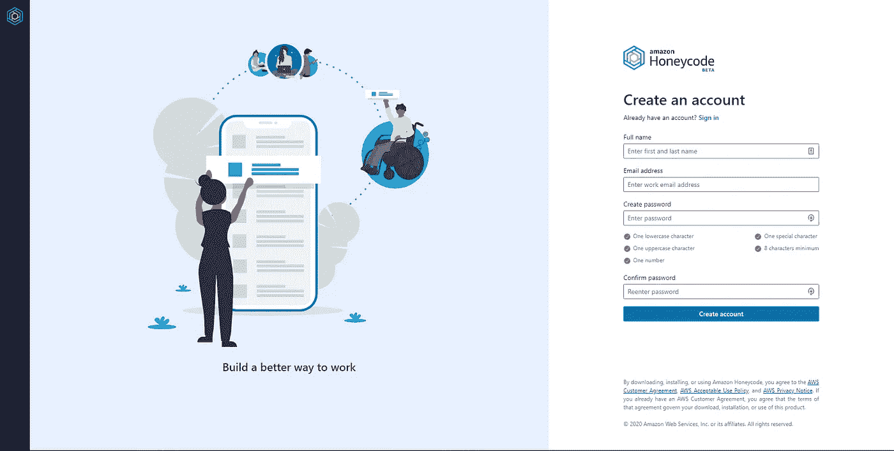
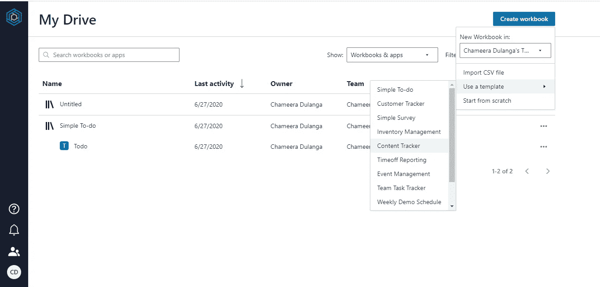
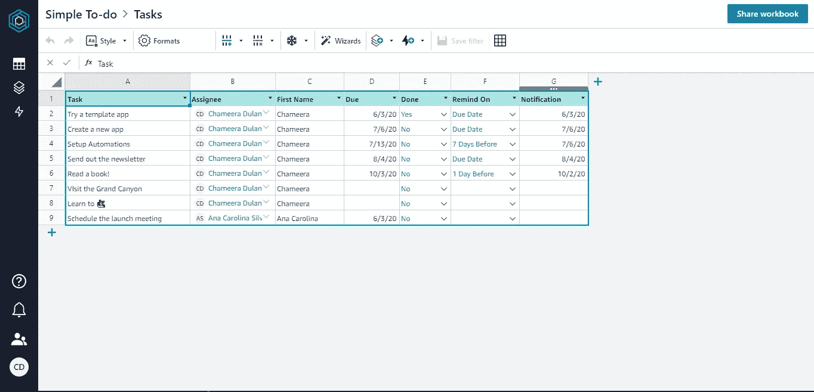
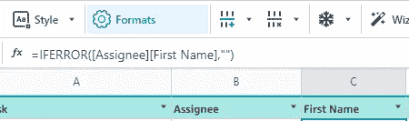
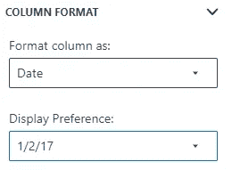
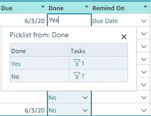
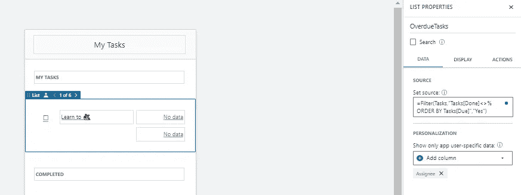
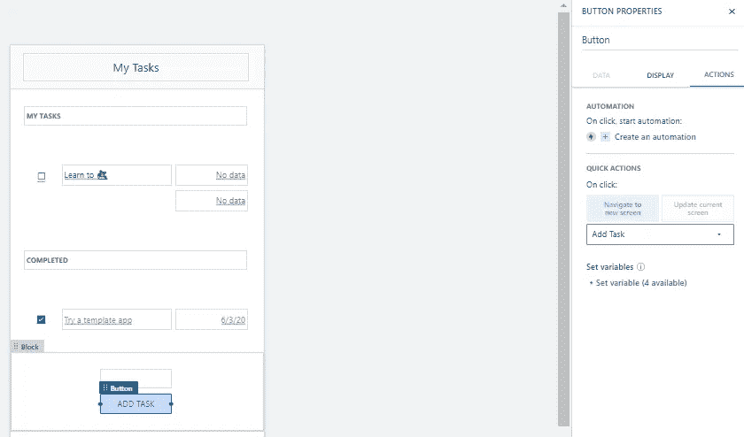
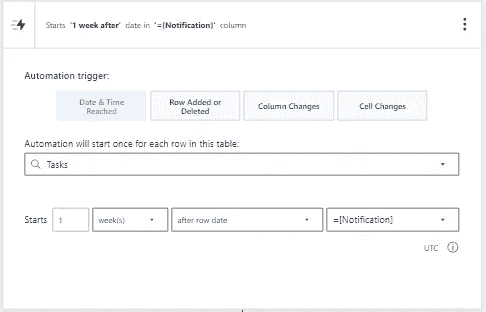
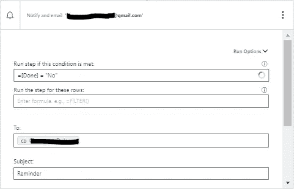

# AWS Honeycode 入门

> 原文：<https://betterprogramming.pub/getting-started-with-aws-honeycode-c0390fd2bf76>

## 让我们探索一下新的 AWS Honeycode 的特性


丹尼尔·麦金尼斯在 [Unsplash](https://unsplash.com?utm_source=medium&utm_medium=referral) 上的照片

AWS Honeycode 是 Amazon Web Services 提供的最新的无代码服务，用于构建 Web 和移动应用程序。如果你还没听说过，请阅读我之前的文章，[介绍 AWS Honeycode](https://medium.com/better-programming/introducing-aws-honeycode-2d96d2dea7dd) ，对 AWS Honeycode 有一个基本的了解。在这篇文章中，我将探索更多关于 AWS Honeycode 的特性。

# 创建一个帐户

首先，我们需要使用 [Honeycode Builder 创建一个账户。](https://builder.honeycode.aws/auth/signup?redirectUrl=https%3A%2F%2Fbuilder.honeycode.aws%2F)



作者截图— Honeycode 注册页面

之后，您将被重定向到我的驱动器视图，在那里您可以看到工作簿和应用程序，以及多个搜索、过滤和查看选项。此外，您可以浏览现有项目或创建新工作簿。

# 创建新工作簿

让我们使用创建工作簿选项创建一个新工作簿。您可以导入 CSV 文件，从头开始，或者使用给定的模板。在本教程中，我将使用给定的模板创建一个工作簿。



作者截图—创建一个示例应用程序

我从下拉列表中选择了简单的待办事项，它将立即创建工作簿、表格和应用程序。然后，在与客户共享之前，您可以清除示例数据或对其进行自定义。



按作者分类的屏幕截图-表格视图。

这个表格类似于你的办公软件包中的电子表格，但是在它的表面之下还有一些额外的东西。为了理解这一点，让我们分别看一下每一列。

*   任务(A) —纯文本
*   受理人(B) —格式化为联系人的文本
*   名字(C)-通过公式计算的文本



作者截图

*   到期(D)-包含多种日期格式的文本



作者截图

*   完成(E)-这是一个从另一个表中获取值的选项列表，格式为蜜码行链接



作者截图

*   提醒开(F)-这也是一个选择列表
*   通知(G) —日期

我想现在你可以看到 Honeycode 表和电子表格之间的区别了。此外，您还可以从边栏中看到表格列表、应用程序和自动化功能。

# Honeycode 应用构建器

现在我们来看看 Honeycode 应用构建器。与表格的情况一样，我将向您展示一些亮点，并让您自己探索其余部分。以下是我在构建器中打开简单的待办事项应用程序时看到的内容:


作者截图—移动视图

生成的应用程序包含四个屏幕:我的任务、所有任务、编辑和添加任务。所有这些屏幕都有移动和网络视图，如上图所示。默认情况下，移动布局和 web 布局是链接的。所以一个布局的改变也会影响另一个。但是，如果您愿意，您可以取消它们的链接，并对其中一个进行更多的更改。

Honeycode 的另一个特性是，这些布局中的对象可以引用表中的数据。举个例子，我的任务屏幕上的列表对象过滤任务表中的行，选择未完成的任务，并使用以下表达式按到期日期对它们进行排序:

```
=Filter(Tasks,"Tasks[Done]<>% ORDER BY Tasks[Due]","Yes")
```



作者截图

此外，屏幕上的对象可以启动运行自动化和启动操作。例如，添加任务按钮导航到添加任务屏幕:



作者截图

有许多类似上述的选项，您可以在应用程序构建器中进行更多探索。

# 自动化

自动化可以通过四种不同的方式触发。以下自动化为尚未标记为完成的任务生成提醒。任务表中的每一行都会自动运行一次。通知仅在任务未被标记为完成时运行，也可以使用`FILTER()`功能:



作者截图



作者截图

同样，您可以为所有四种类型的触发器创建自动化。

# 共享应用程序

应用程序完成后，您可以将其与团队的其他成员共享。每个 Honeycode 用户可以是一个或多个团队的成员。要共享应用程序，请转到应用程序构建器视图，然后选择右上角的共享应用程序选项。共享应用程序后，团队成员将收到一封包含链接的电子邮件，他们可以立即开始使用该应用程序。拥有移动设备的用户可以安装 Honeycode Player ( [iOS](https://apps.apple.com/app/id1502619411) ， [Android](https://play.google.com/store/apps/details?id=com.amazon.aws.honeycode) )，并使用任何已经分享给他们的应用。

正如我在以前的文章中提到的，Honeycode 仍处于测试版，将在未来的版本中升级更多的工具。但是不要等到那个时候。今天就尝试一下，熟悉一下这项服务，因为这迟早会成为移动和网络开发的革命性变化。