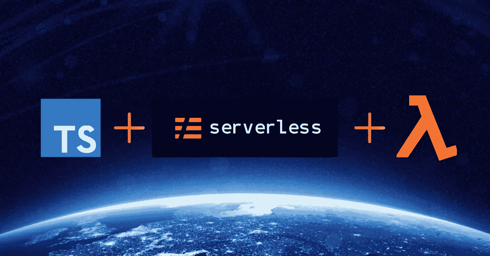

# AWS、无服务器和 TypeScript 入门

> 原文：<https://betterprogramming.pub/getting-started-with-aws-serverless-typescript-8c172ccfec41>

## 有了有用的入门模板



TypeScript +无服务器+ AWS

2019 年，当我加入 [fleet.space](http://fleet.space) 的团队，建立云基础设施以支持他们的纳米卫星星座和工业物联网网络时，我被抛进了无服务器的世界。

我真的很难找到一个关于如何用 TypeScript 构建新服务的全面指南，所以我在这里写了一个我希望拥有的指南。我们不会查看任何示例代码—我们将只关注构建一个健壮的基础模板，您可以在所有服务中重用它。

我们要做的第一件事是安装[无服务器框架](https://serverless.com/framework/docs/)。我发现它比官方的 AWS SAM 模板有更好的支持。

首先，让我们通过`npm i -g serverless`在我们的系统上安装无服务器作为全局依赖。接下来，我们将创建一个项目，`mkdir typescript-serverless`。在该目录中，让我们使用以下命令搭建一个新的无服务器模板:

`sls create --template aws-nodejs-typescript`

这将生成一个带有 TypeScript 的基本模板，但是它缺少了许多我反复使用的强大配置。让我们来设置一些东西。如果你不使用 VS 代码，继续删除这个模板初始化的讨厌的 VS 代码目录，然后运行`npm i`来安装无服务器框架的基本依赖项。

# 无服务器插件

与 SAM 相比，无服务器框架有一个优势，那就是围绕它构建了许多社区插件来帮助您做事(如果需要，您可以构建自己的插件)。它是非常可扩展的。我在几乎所有服务中使用的插件有:

*   [无服务器 iam 角色每功能](https://github.com/functionalone/serverless-iam-roles-per-function#readme)

这个插件允许你在函数级别定义 IAM 权限，而不是默认的项目级别。如果只有一个函数需要访问 DynamoDB，那么我们不需要给它们所有的访问权限。

*   [无服务器创建全局动力数据库表](https://github.com/rrahul963/serverless-create-global-dynamodb-table)

多区域部署在无服务器世界中基本上是免费的(无论如何与 containers/ec2 相比)。唯一的复杂性是保持 DynamoDB 同步。这可以通过全局表来完成。

*   [无服务器-离线](https://github.com/dherault/serverless-offline)

这是我最近不常使用的一个，但它只是一个开发依赖项，使用起来很方便。它将允许你在本地调用你的 lambda API。

*   [无服务器清理插件](https://github.com/claygregory/serverless-prune-plugin)

对于无服务器来说，这是一个偷偷摸摸的风险，尤其是如果您经常部署的话。Lambda 将对您部署的每个功能进行版本化，并且对您可以存储的数量有一个硬存储限制。这个插件将删除不需要的旧版本，并防止这个微妙的错误影响您的生产环境。

```
npm i -D serverless-iam-roles-per-function serverless-create-global-dynamodb-table serverless-offline serverless-prune-plugin
```

我们还将通过`npm i aws-sdk aws-lambda`添加 [aws-sdk](https://github.com/aws/aws-sdk-js) 和 [aws-lambda](https://github.com/awspilot/cli-lambda-deploy) 。

## Lambda 电动工具

当我踏入无服务器世界时，我真正纠结的一件事是可观察性和可追溯性。跨服务边界甚至边界内基础设施的调试(SQS、Kinesis、DynamoDB 等)。)是一种痛苦。谢天谢地，我碰到了一套很棒的用于 Lambda 的[电动工具](https://github.com/getndazn/dazn-lambda-powertools)，它们在任何服务中都是必备的。

*   `@dazn/lambda-powertools-cloudwatchevents-client`
*   `@dazn/lambda-powertools-correlation-ids`
*   `@dazn/lambda-powertools-logger`
*   `@dazn/lambda-powertools-pattern-basic`
*   `@dazn/lambda-powertools-lambda-client`
*   `@dazn/lambda-powertools-sns-client`
*   `@dazn/lambda-powertools-sqs-client`
*   `@dazn/lambda-powertools-dynamodb-client`
*   `@dazn/lambda-powertools-kinesis-client`

我只是导入所有这些，并让 webpack tree shaking 担心如何去掉我不使用的东西。

```
npm i @dazn/lambda-powertools-cloudwatchevents-client @dazn/lambda-powertools-correlation-ids @dazn/lambda-powertools-logger @dazn/lambda-powertools-pattern-basic @dazn/lambda-powertools-lambda-client @dazn/lambda-powertools-sns-client @dazn/lambda-powertools-sqs-client @dazn/lambda-powertools-dynamodb-client @dazn/lambda-powertools-kinesis-client
```

# 林挺

下一个我在代码库中离不开的重要东西是林挺。ESLint 是我每天使用的最大拐杖之一。让我们将其配置为与 TypeScript 和无服务器框架一起工作。我们将需要以下开发依赖。

*   `[eslint](https://github.com/eslint/eslint)`
*   `[eslint-config-airbnb-base](https://github.com/airbnb/javascript)`
*   `[typescript-eslint](https://github.com/typescript-eslint/typescript-eslint)`
*   `[eslint-plugin-import](https://github.com/benmosher/eslint-plugin-import)`
*   `[@typescript-eslint/eslint-plugin](https://github.com/typescript-eslint/typescript-eslint)`
*   `[@typescript/eslint-parser](https://github.com/typescript-eslint/typescript-eslint)`
*   `[eslint-import-resolver-alias](https://github.com/johvin/eslint-import-resolver-alias)`
*   `[eslint-plugin-module-resolver](https://github.com/HeroProtagonist/eslint-plugin-module-resolver)`

```
npm i -D eslint eslint-config-airbnb-base typescript-eslint eslint-plugin-import eslint-import-resolver-alias eslint-plugin-module-resolver @typescript-eslint/eslint-plugin @typescript-eslint/parser
```

现在，我们需要创建一个`.eslintrc.json`配置文件来定义我们的规则。我喜欢下面的规则。这个要点还包括我们将在最后设置的一些模块别名的一些别名映射，以及我们将马上设置的一些 Jest 配置。

我还将调整我的`tsconfig`文件来添加`inlineSource`、`esModuleInterop`、`sourceRoot`和`baseUrl`。下面的要点还预先填充了我们稍后将设置的一些模块别名信息。如果您愿意，现在可以注释掉 paths 中的任何内容。

## 测试

我将为每个服务编写测试，因此在我们的基本模板中配置一个测试运行器是有意义的。我个人喜欢 [Jest](https://jestjs.io/) ，所以我们来设置一下。

同样，我们需要用一些 npm dev 依赖项来填充`node_modules`的黑洞。

*   `jest`
*   `babel-jest`
*   `@babel/core`
*   `@babel/preset-env`
*   `@babel/preset-typescript`

```
npm i -D jest babel-jest @babel/core @babel/preset-env @babel/preset-typescript
```

确保 Jest 在你的`.eslintrc.json`中被配置为插件，并且你在`env`下设置了`jest/globals`(如果你复制了上面的要点，你已经有了这个)。

我们需要创造一个巴别塔`.config`让 Jest 发挥作用。

在这一点上，我们应该检查 Jest 是否正常工作，以及它的配置是否正确。让我们创建一个`tests`目录并添加一个示例测试。创建一个测试文件，让我们添加一个虚拟测试，`tests/example.test.ts`。

如果您使用的是 WebStorm，您可以按 Ctrl+Shift+R 直接从您的 IDE 运行这个测试。否则，让我们更新我们的`package.json`来添加一个测试脚本(以及 lint 和 TS 编译检查)。

在您的`package.json`文件中，更新脚本部分以包含以下内容:

我通常在 CI/CD 管道中运行所有这些，以防止坏代码影响生产。现在，您可以从您的控制台运行`npm run test`来运行测试套件。希望您的测试套件运行并通过。理想情况下，您的 IDE 也不会在您的`example.test.ts`文件中向您抛出林挺错误。

既然我们在这里，运行`npm run lint`，让我们看看默认模板是否有任何林挺错误。您可能会得到一些关于自动折叠的`webpack.config`和`handler.ts`文件的错误。让我们把这些弄清楚。

在您的`webpack.config`文件的顶部，添加`*/* eslint-disable @typescript-eslint/no-var-requires */*`并取消注释模板附带的 Fork TS Checker Webpack 插件默认值。那应该能解决那个文件。

对于`handler.ts`文件，只需从`hello`函数中移除未使用的上下文函数签名。

# 代码放在/src 中

我喜欢的一个惯例是将我们所有的域逻辑放在一个`/src`目录中，并将根目录留给 config(和`/tests`)。创建一个`/src`目录，并将`handler.ts`文件移动到`/src`目录中。

如果您决定采用这个约定，您需要转到`serverless.yml`并将处理程序的路径更新为`src/handler.hello`。

让我们在`serverless.yml`文件中配置我们的无服务器插件。

```
service:
  name: typescript-serverless

.....

plugins:
  - serverless-offline
  - serverless-webpack
  - serverless-iam-roles-per-function
  - serverless-create-global-dynamodb-table
  - serverless-prune-plugin ...
```

此时，您应该能够在您的终端中运行`sls offline`,进行干净的编译和构建，启动一个无服务器的离线端点。

```
➜  typescript-serverless git:(master) ✗ sls offline
Serverless: Bundling with Webpack...
Time: 398ms
Built at: 27/02/2020 11:24:42 pm
  Asset      Size       Chunks             Chunk Names
  src/handler.js  6.33 KiB  src/handler  [emitted]  src/handler
  Entrypoint src/handler = src/handler.js
  [./src/handler.ts] 316 bytes {src/handler} [built]
  [source-map-support/register] external "source-map-support/register" 42 bytes {src/handler} [built]
Serverless: Watching for changes...
Serverless: Starting Offline: dev/us-east-1.

Serverless: Routes for hello:
Serverless: GET /hello
Serverless: POST /{apiVersion}/functions/typescript-serverless-dev-hello/invocations

Serverless: Offline [HTTP] listening on http://localhost:3000
Serverless: Enter "rp" to replay the last request
```

希望你能看到这个。您应该能够访问`localhost:3000`并看到可用 API 端点的列表。如果你去`/hello`，应该会看到我们在`src/handler.ts`返回`APIGatewayProxyEvent`的一个垃圾场。

```
*import* { *APIGatewayProxyHandler* } *from* 'aws-lambda';
*import* 'source-map-support/register';

*export const* hello: *APIGatewayProxyHandler* = *async* (event) => ({
  statusCode: 200,
  body: ***JSON***.stringify({
    message: 'Go Serverless Webpack (Typescript) v1.0! Your function executed successfully!',
    input: event,
  }, *null*, 2),
});
```

# 无服务器配置

现在我们有了一个工作的 API 网关端点，让我们在无服务器框架中配置更多的选项。

*   为函数设置 X 射线追踪
*   设置一些默认的`.env`变量
*   锁定无服务器版本
*   使用默认值设置阶段和区域配置
*   设置全局 DynamoDB 插件

```
service:
  name: typescript-serverless

custom:
  webpack:
    webpackConfig: ./webpack.config.js
    includeModules: true
  serverless-iam-roles-per-function:
    defaultInherit: true *# Each function will inherit the service level roles too.* globalTables:
    regions: *# list of regions in which you want to set up global tables* - us-east-2 *# Ohio (default region to date for stack)* - ap-southeast-2 *# Sydney (lower latency for Australia)* createStack: false
  prune: # automatically prune old lambda versions
    automatic: true
    number: 3plugins:
  - serverless-offline
  - serverless-webpack
  - serverless-iam-roles-per-function
  - serverless-create-global-dynamodb-table
  - serverless-prune-plugin provider:
  name: aws
  runtime: nodejs12.x
  frameworkVersion: ‘1.64.1’
  stage: ${opt:stage, 'local'}
  region: ${opt:region, 'us-east-2'}
  apiGateway:
    minimumCompressionSize: 1024 *# Enable gzip compression for responses > 1 KB* environment:
    DEBUG: '*'
    NODE_ENV: ${self:provider.stage}
    AWS_NODEJS_CONNECTION_REUSE_ENABLED: 1
  tracing:
    lambda: true
  iamRoleStatements:
    - Effect: Allow
      Action:
        - xray:PutTraceSegments
        - xray:PutTelemetryRecords
      Resource: "*"

functions:
  hello:
    handler: src/handler.hello
    events:
      - http:
          method: get
          path: hello
```

在 provider 下，我们为服务设置了一个默认的阶段和区域以及一些全局`.env`变量。我们还设置了 X 射线跟踪，这样一旦部署了我们的服务，我们就可以轻松地调试它。

我们还锁定了我们的无服务器框架版本。我以前没有这样做过，当 Serverless 升级一个版本并破坏我们的一个插件时，我让部署管道中断。在撰写本文时，这个版本是 1.64.1。

最后，我们使用`local`和`us-east-2`的一些默认值设置阶段和区域配置。这些参数在部署过程中被设置为 CLI 参数(可选)。

最后，我们为服务配置了一些全局 IAM 角色语句。(这些是我们将设置的唯一全局角色。我们将在每个功能级别设置其他所有内容)。

**注意**:您可能希望注释掉初始多区域部署的全局表。这个插件可能不会像你预期的那样工作。这可能导致部署失败的原因在这里[列出](https://github.com/rrahul963/serverless-create-global-dynamodb-table/issues/17)。

# 模块混淆

最后要配置的是模块别名。人们在 2020 年构建节点应用程序而不使用模块别名，这真的让我大吃一惊。相对导入路径对我来说太脆弱了，所以让我们设置一些别名。

我们将设置三个缺省值(`src`、`test`和`queries`)，以便有人可以进来并知道将来如何设置它们。我们还将在示例处理程序中使用从查询导入来确保 TypeScript 正确编译和解析。

现在这有点乱，但让我们去设置它。努力是值得的。

首先，让 webpack 知道模块别名并更新 resolve 对象。

```
resolve: {
  extensions: ['.mjs', '.json', '.ts'],
  symlinks: *false*,
  cacheWithContext: *false*,
  alias: {
    '@src': ***path***.resolve(__dirname, './src'),
    '@queries': ***path***.resolve(__dirname, './queries'),
    '@tests': ***path***.resolve(__dirname, './tests'),
  },
},
```

接下来，我们将通过更新`compilerOptions`路径让我们的`.tsconfig`知道模块别名(我们也可以参考前面的`tsconfig`要点)。

```
"paths": {
  "@src/*": ["src/*"],
  "@queries/*": ["queries/*"],
  "@tests/*": ["tests/*"]
}
```

最后，我们会让 ESLint 知道这一点，这样我们在别名时就不会出现讨厌的林挺错误。(同样，如果你只是照抄的话，这是在之前的要点中完成的。)

```
"settings": {
  "import/resolver": {
    "alias": {
      "map": [
        ["@src", "./src"],
        ["@tests", "./tests"],
        ["@queries", "./queries"]
      ],
      "extensions": [
        ".ts",
        ".js"
      ]
    }
  }
}
```

好了，是时候确保配置正确了。

让我们创建一个`/queries`目录并添加`queries/exampleQuery.ts`来验证我们的别名。我们将使这个模块尽可能简单，以测试编译是否仍然有效。

```
*export const* echo = (sound: *string*): *string* => sound;
```

我们只取一个参数，然后直接返回。如果这不起作用，我们将得到一个编译时错误。

现在在`src/handler.ts`中，让我们用我们设置的别名导入这个模块，并尝试在我们的响应中使用它。让我们更新回复中的信息。

使用别名使重构变得更加简单。您的 IDE 也应该足够智能，能够自动导入别名(WebStorm 就是这样)。

# 更多笑话配置

现在我们正在使用模块别名，当我们试图测试组件时，我们将会遇到一个问题。这是因为 webpack 为我们的导入处理所有的路径解析，但是 Jest 不能在 transpiled 代码上运行。通过让 Jest 知道我们的映射，我们可以很容易地解决这个问题。我们可以在`jest.config.js`中这样做

Jest 配置文件

Jest 还允许您在每个测试运行之前运行一些设置。让我们在 setupFiles 键下创建我在上面的代码片段中定义的 setEnvironment.js 文件

这段方便的代码将在运行测试套件之前覆盖我们的环境变量。这里我们只需覆盖区域和 AWS 键。几乎可以肯定，您还想覆盖生产中的其他变量(想想条带键、数据库凭证等)。

# 包扎

这就是它的全部内容。您应该开始编写代码，并使用 TypeScript、ESLint 和 Jest 的所有优点来构建您的服务。我将在以后的文章中介绍如何使用一些电动工具以及如何设置 SQS、社交网络、Kinesis 和 DynamoDB。

你可以在[我的 GitHub](https://github.com/mtimbs/typescript-serverless) 上找到这个完整的入门模板。

有关如何通过配置 IAM 角色将该项目部署到您的 AWS 帐户的信息，[请阅读此处](https://medium.com/@Michael_Timbs/creating-a-serverless-deploy-user-with-aws-iam-b2053227534)。