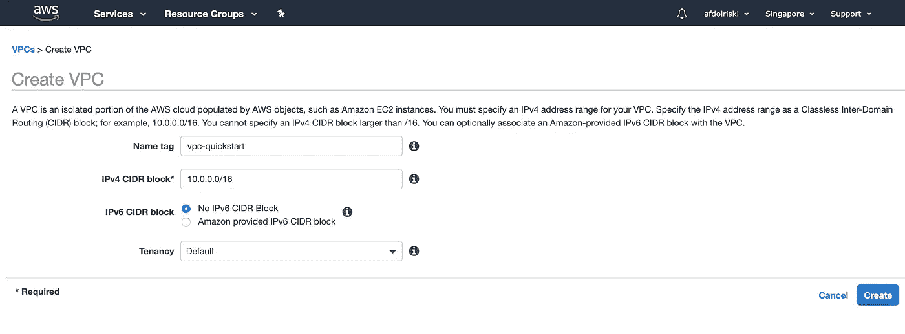
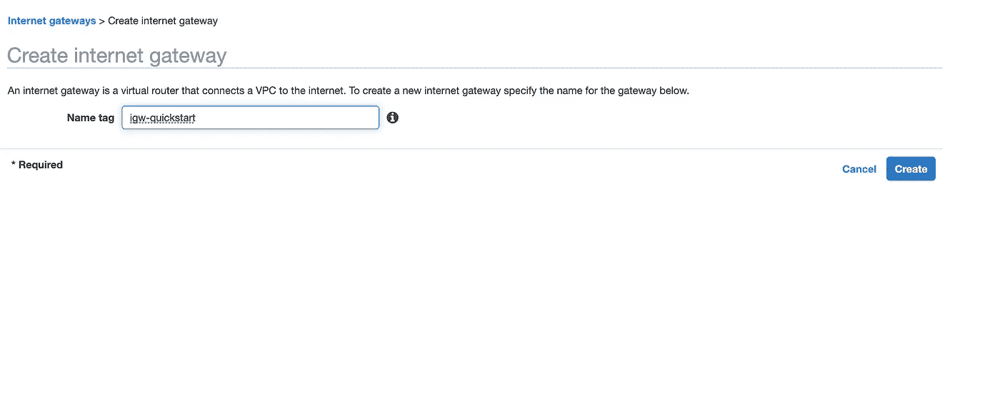
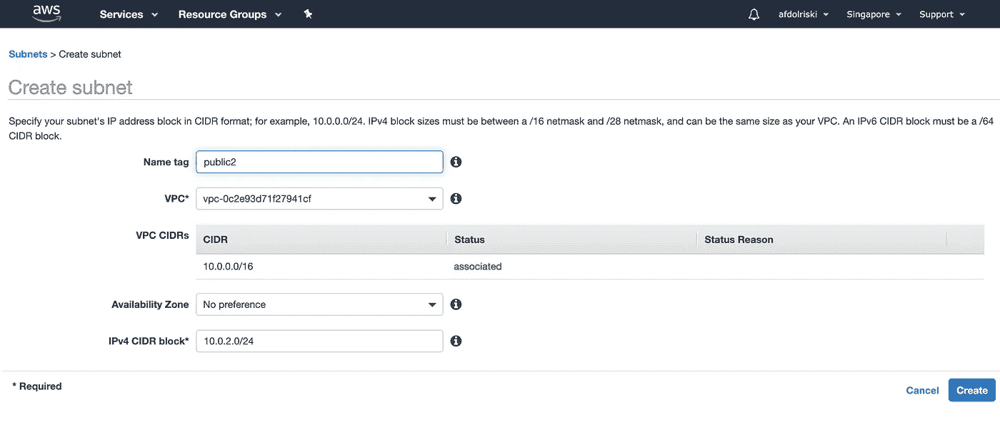
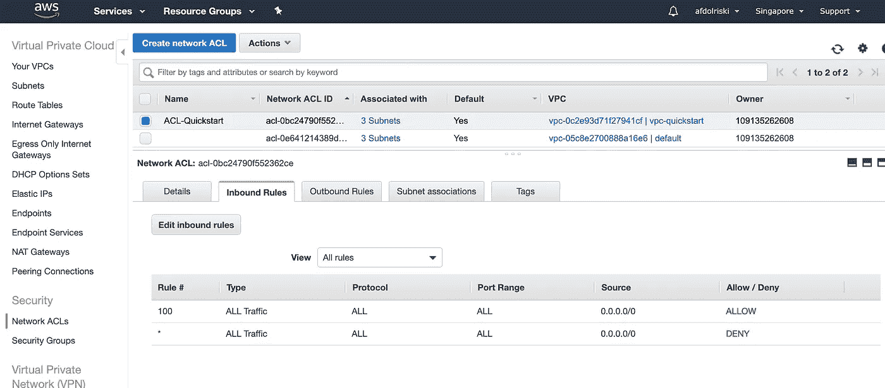
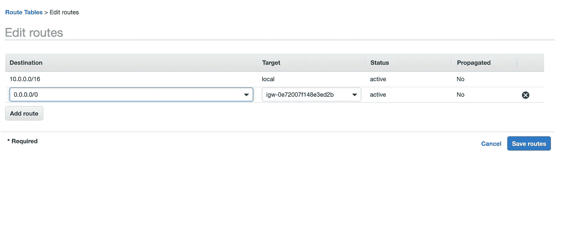
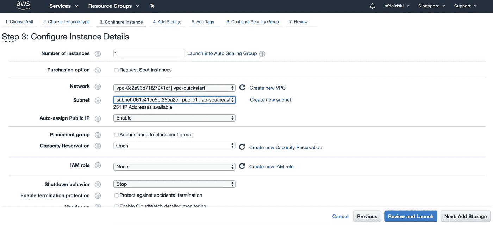
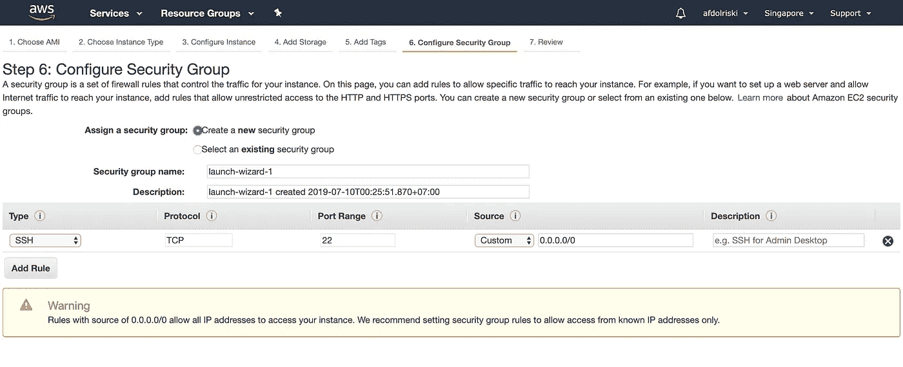

# AWS VPC 入门

> 原文：<https://betterprogramming.pub/getting-started-with-aws-vpc-ae23ecf75743>

图片来自[https://pix abay . com/illustrations/network-earth-block-chain-globe-3537401/](https://pixabay.com/illustrations/network-earth-block-chain-globe-3537401/)

作为开发人员，我们的主要精力放在构建东西上。

然后，一旦开发完成，我们需要把那个应用程序放到互联网上的某个地方，这样它就可以被公众访问了。

如果你在一个团队中工作，这可能不是一个问题，因为在运营中可能有人可以处理这项任务。

但是如果你是一个人，或者这是你第一次使用云，这可能会很混乱。有太多我们甚至不知道存在的术语。

在这篇文章中，我们将特别谈论 [AWS](https://aws.amazon.com/) ，因为它非常受欢迎。

# 让您的应用在 AWS 云中运行

要让你的应用在 AWS 云中运行，你需要从 AWS 资源中了解至少两件事: [EC2](https://aws.amazon.com/ec2/) 和 [VPC](https://aws.amazon.com/vpc/) 。

## **EC2**

EC2 是一个虚拟计算环境。它和你现在可能正在使用的笔记本电脑差不多。

## VPC

概述中说:

> 亚马逊虚拟专用云(亚马逊 VPC)允许您提供 AWS 云的逻辑隔离部分，您可以在您定义的虚拟网络中启动 AWS 资源。

或者，简单地说，VPC 让你从网络的角度管理你的 AWS 资源。

在这篇文章中，我将解释构成 VPC 的构件，同时给你解释它的每个组成部分。

我不会涵盖所有关于网络的内容，因为我假设您已经知道 IP 地址的基本工作原理以及公共和私有 IP 之间的区别。

到本文结束时，您将拥有一个正在运行的 EC2 实例，您可以通过 SSH 连接它，以证明它可以从互联网访问。

默认情况下，在您创建帐户后，AWS 已经为您提供了每个地区的默认 VPC。那些默认的 VPC 将满足您的大部分需求，但是您仍然需要理解它是如何工作的。

# 创造一个 VPC

姑且称之为`vpc-quickstart`。

什么是 IPv4 CIDR 块？

它是*无类域间路由的缩写。*

这是您想要指定 IP 范围的方式。

符号是`<ip notation>/<number>`。

让我们以`10.0.0.0/16`为例。

这里重要的部分是数字 16。这决定了你的 IP 范围。

这里的 IP 是 IPv4。它由 32 位组成，一次按 8 位(八位字节)分组，用点分隔。例如，如果你转换一个 255.255.255.255 的 IP 地址，你会得到二进制格式的`11111111.11111111.11111111.11111111`。

如果你不知道如何阅读二进制数字，我鼓励你先学会它。

在我们的例子`10.0.0.0`中，你得到`00001010.00000000.00000000.00000000`。

然后是数字 16，它作为一个掩码，从左到右用数字“1”表示，形成 IP 地址格式。结果是`11111111.11111111.00000000.00000000`。

掩码上带有 0 的位置可供您在网络内部使用。这意味着，如果最后两个二进制八位数中的所有剩余位都用于您的网络，如果掩码是 24 或`11111111.11111111.11111111.00000000`，则您只能得到最后一个二进制八位数。

所以你的 IP 范围是从`00001010.00000000.00000000.00000000`到`00001010.00000000.11111111.11111111`，或者小数形式的`10.0.0.0`到`10.0.255.255`。

# **互联网网关**

顾名思义，为了让您的 VPC 能够访问互联网，您必须连接一个互联网网关。让我们创建一个互联网网关，并将其命名为`igw-quickstart`:

# 子网络

子网是网络的一个逻辑组，根据需求的不同而不同。

子网划分让我们可以将网络分成更小的部分。把它想象成一个巨大建筑中的网络，有 100 个不同的公司和 100 个部门，每个部门都有网络组。

例如，子网范围从 192.168.1.1 到 192.168.1.255。

您还必须为每个子网指定 CIDR 块。

让我们创建三个子网，`public1` `public2`和`private1`，因为我们将创建两个公共子网和一个私有子网。

公共子网意味着子网可以访问互联网，而私有子网不能访问互联网。稍后我会解释如何做。

让我们用之前创建的 VPC 的选择来创建一个子网。

请注意，这次我们指定了掩码“24”。

一个 24 掩码转换成二进制是`11111111.11111111.11111111.00000000`。因此，前三个二进制八位数已经被预留，我们唯一拥有的空间是最后一个二进制八位数。

因此，如果我们平均创建我们的子网，我们最终会有`10.0.<0-255>.*`个子网。

# **网络访问控制列表**

NACL 允许您指定网络入站和出站流量的规则。

入站意味着流量进来，而出站意味着流量出去。

您可以根据协议类型(如 HTTP、TCP、UDP 等)为您的网络设置任何规则。和端口号。

给每个规则一个数字，从最低到最高进行评估。

让我们创建一个并命名为`ACL-Quickstart`。

默认情况下，允许所有流量。为了这门课的目的，我们就让它保持原样吧。但是，我鼓励您不要在生产环境中这样做。

在“子网关联”选项卡中，单击“编辑子网关联”并添加您之前创建的子网。

# **路由表**

这就像应用程序中的路由一样。例如，如果 IP 目的地是 10.0.0.14，那么将其路由到 service-a，就这么简单。

让我们创建两个路由表，并将它们命名为`RT1`和`RT2`。

对于`RT1`，打开“路线选项卡”并点击“编辑路线”。添加目的地为`0.0.0.0/0`的路线，目标是我们创建的互联网网关。

这意味着`0.0.0.0/0`意味着将其他流量定向到互联网网关，以便它可以访问互联网。单击“保存路由”,然后转到“子网关联选项卡”。

单击“编辑子网关联”并添加您之前创建的两个名为`public1`和`public2`的子网。

这就是如何使子网成为公共子网的方法；将其与目的地为互联网网关的路由表相关联。

对于`RT2`，对其进行编辑，使其与子网`private1`相关联，从而成为私有子网。

# **启动 EC2 实例**

最后，让我们测试一下我们的网络是否工作正常。

启动 EC2 实例—使用“t2.micro”实例类型，因为它符合自由层条件。

转到步骤#3 来配置实例。这是我们配置该实例将使用的网络的地方。

选择 VPC 和我们刚刚创建的一个公共子网。然后，转到步骤#6，配置安全组并启用自动分配公共 IP。

# **安全组**

安全组让我们配置入站和出站流量，但是是在实例级，而 NACL 是在网络层。

这一次，我们将只允许来自所有传入 IP 源的端口 22 的 SSH 连接。

单击“Review and Launch ”,启动您的实例，但不要忘记下载密钥对——该实例将需要一些时间来准备。

完成后，让我们使用 SSH 连接到它。单击实例，然后单击表格顶部的“connect”。它会给出使用 SSH 进行连接的说明。

按照说明，然后…瞧！

到 EC2 实例的 SSH 连接。

现在，您有了一个连接到互联网的 EC2 实例，并且您知道其流程的每一步。

在此之后，您可以安装您的应用程序，并通过向安全组添加更多规则来打开 HTTP 端口 80，从而使其可以通过浏览器轻松访问。

关于 VPC 还有很多要学习的—尝试更改我们创建的配置，看看会发生什么，例如从路由表中删除 internet 网关，更改 NACL 的规则，等等。

我希望你喜欢这篇文章！