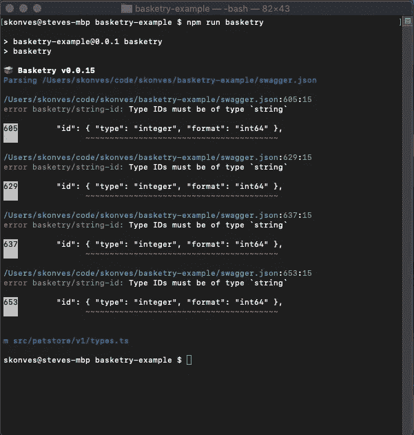
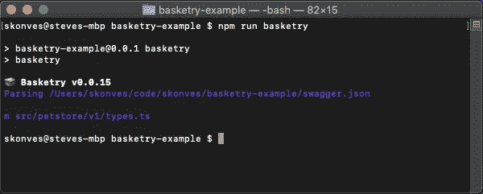
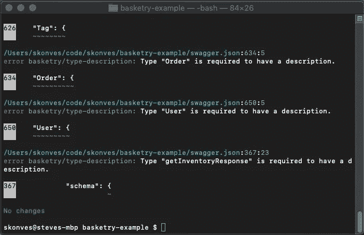

# 开始使用 Basketry

> 原文：<https://betterprogramming.pub/getting-started-with-basketry-fceeb5316ad7>

## 任何语言的代码生成


照片由[安德里亚·斯库利](https://unsplash.com/@andreacarole?utm_source=medium&utm_medium=referral)在 [Unsplash](https://unsplash.com?utm_source=medium&utm_medium=referral) 拍摄

Basketry 是任何语言的可插拔的、面向服务的代码生成管道。[在 Github](https://medium.com/@stevekonves/list/basketry-70b223946fc9) 上阅读更多关于 basketh 和[的信息。](https://github.com/basketry/basketry/wiki)

本指南将从 Swagger 宠物店的例子开始，一步一步地引导您生成新的服务。

# 先决条件

如果您还没有，请继续阅读[介绍篮筐](https://medium.com/@stevekonves/introducing-basketry-3ff2861a7730)。它给出了一个完整的解释，什么是篮筐，它解决什么类型的问题。它还涵盖了将在指南中出现的所有与 Basketry 相关的术语，比如服务定义、解析器、规则、生成器和中间表示。

我们将讨论安装包以及创建和运行脚本。本指南假设您已经掌握了 NPM 或纱线的应用知识，并且知道如何使用首选的包装管理器来执行这些操作。

最后，我们将使用 Typescript 构建我们的服务。本指南假设您熟悉如何设置新项目，或者可以访问现有项目。如果您想使用我个人用于新项目的 Typescript 项目搭建工具，请查看我的 [Yeoman generator](https://www.npmjs.com/package/generator-ts-console) 。

# 初始设置

## 获取服务定义

让我们从下载一个现有的服务定义开始。Swagger.io 提供了一个示例 Swagger 文档，它定义了一个示例宠物店服务:[https://petstore.swagger.io/v2/swagger.json](https://petstore.swagger.io/v2/swagger.json)。下载文件名为`swagger.json`的文件，并将其放在项目的根文件夹中。

## 安装软件包

首先安装以下软件包:

*   `basketry`
*   `@basketry/swagger-2`
*   `@basketry/typescript`

第一个包包含通过`basketry`命令的 Basketry CLI。有两种方法可以使用 CLI。首先，您可以将所有项目选项作为参数直接传递给 CLI。有关这些参数的详细信息，请参见存储库中的自述文件。其次，你可以在项目的根目录下添加一个`basketry.config.json`文件，然后不带任何参数地运行`basketry`。我们将在本指南中使用配置文件。

第二个包是 Swagger 2.0 文档的解析器。这个包导出一个默认模块，该模块接受原始的 Swagger doc 并输出服务的中间表示(IR)。

最后一个包是生成器，它获取 IR 并输出一个`types.ts`文件，该文件包含实现宠物店服务所需的所有接口、类型和枚举。

## 创建脚本

在`package.json`中创建以下脚本来运行 Basketry CLI:

```
{
  "scripts": {
    "basketry": "basketry",
    "watch:basketry": "basketry --watch"
  }
}
```

当我们运行`basketry`脚本时，Basketry CLI 将查找一个`basketry.config.json`文件，以了解使用什么解析器和生成器以及在哪里可以找到 Swagger 文档。接下来让我们创建它。

## 创建配置文件

将下面的`basketry.config.json`文件添加到项目的根目录中:

```
{
  "source": "swagger.json",
  "parser": "@basketry/swagger-2",
  "generators": ["@basketry/typescript"],
  "output": "src/petstore"
}
```

让我们来看看这些设置的作用。

首先，`source`让 Basketry 知道我们想从哪里加载我们的服务定义。如果您想将`swagger.json`重命名为其他名称，请确保在配置中也反映出名称的变化。

接下来，`parser`让 Basketry 知道使用什么模块将 Swagger 文档解析成 IR。管道的其余部分不知道最初的服务定义语言(SDL)是 Swagger——生成器(以及我们添加它们时的规则)可以与任何源语言一起工作。为此，我们需要选择一个理解 SDL 的解析器，这就是我们安装`@basketry/swagger-2`的原因。

继续，`generators`让 Basketry 知道如何将 IR 转换成代码文件。我们可以添加任意多的发电机。首先，我们将只使用`@basketry/typescript`。我们将在后面的指南中添加更多内容。

最后，`output`指定我们希望 Basketry 将生成的文件放在哪里。一些生成器可能会在子文件夹中写入文件；然而，`output`文件夹将是所有生成内容的根目录。

关于配置文件的更多信息，请参考 Basketry wiki。

## 生成一些代码！

现在运行`basketry`命令:


你可以看到它生成了`types.ts`。您的项目现在将包含(至少)以下文件:

```
basketry-example/
 ├─ node_modules/
 ├─ src/
 │  ├─ petstore/
 │  │  ├─ v1/
 │  │  │  ├─ types.ts
 │  ├─ .gitattributes
 ├─ basketry.config.json
 ├─ package.json
 ├─ swagger.json
```

注意`types.ts`在一个`v1`文件夹中。这是因为 Swagger doc 有一个版本的`1.0.6`(参见`info`对象)并且 Basketry 跟踪源服务的主要版本。正如我们在这里看到的，`@basketry/typescript`使用该版本号将文件写入特定于版本的文件夹。

而且就是这么简单！此时，我们有了一个描述我们的宠物店的 Swagger 文档，然后我们设置 Basketry 为我们的服务生成 Typescript 类型。

# 实施 API 设计指南

设计指南有助于在单个服务内部以及由多个团队拥有和维护的多个服务之间提供一致性。这种一致性改善了开发人员的体验，并随着 API 的成长和成熟而促进了增量更改。

Basketry 规则提供了一种简单的方法来将 API 治理的这个方面添加到您的项目中。

## 添加标准规则

Basketry 提供了一套标准规则来帮助您入门。

首先，安装软件包`@basketry/rules`。

接下来，让我们将“字符串 ID”规则添加到配置文件中:

```
{
  "source": "swagger.json",
  "parser": "@basketry/swagger-2",
  "rules": ["@basketry/rules/lib/string-id"],
  "generators": ["@basketry/typescript"],
  "output": "src/petstore"
}
```

现在，当我们运行`basketry`脚本时，我们会看到以下输出:


这个输出让我们知道我们的 Swagger doc 在五个地方违反了“basketry/string-id”规则。错误输出显示了违反了什么规则、文件路径以及违反的位置，以帮助我们进行修复。

对于上下文,“字符串 ID”规则要求任何名为`id`的属性必须是字符串。(出于安全原因，该规则通常用于要求非顺序 id。)

现在我们发现了一些违规，让我们回到 Swagger doc，找到第一个违规，然后进行更改

```
{ "type": "integer", "format": "int64" }
```

收件人:

```
{ "type": "string", "minLength": 12 }
```

并重新运行`basketry`脚本:



如您所见，我们修复了第一个违规，我们的`types.ts`文件已经更新以反映这一变化。

如果我们对剩余的 ID 属性进行同样的更改，我们应该看到所有的违规都被清除了！



## 设置规则选项

让我们添加标准集中的`description`规则，以确保我们向所有内容添加描述:

```
{
  "source": "swagger.json",
  "parser": "@basketry/swagger-2",
  "rules": [
    "@basketry/rules/lib/string-id",
    "@basketry/rules/lib/type-description"
  ],
  "generators": ["@basketry/typescript"],
  "output": "src/petstore"
}
```

错误太多了！



我们可以将一些选项传递给规则，以某种方式修改它们的行为:

```
{
  "source": "swagger.json",
  "parser": "@basketry/swagger-2",
  "rules": [
    "@basketry/rules/lib/string-id",
    {
      "rule": "@basketry/rules/lib/description",
      "options": { "severity": "warning" }
    }
  ],
  "generators": ["@basketry/typescript"],
  "output": "src/petstore"
}
```

现在，所有的“描述”违规都被报告为警告而不是错误。各种规则允许不同的选项，因此查看[篮筐规则](https://github.com/basketry/rules#readme)以获得完整的可用规则及其各自的选项。

你可以随时参考 [Basketry wiki](https://github.com/basketry/basketry/wiki) 获取更多的文档和指南。

这就是如何开始编织篮子！

如果你喜欢你看到的，让我知道。如果你认为我值得拥有一个⭐，那就把它加入篮子库吧。