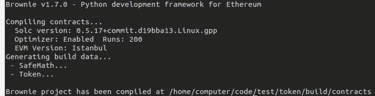
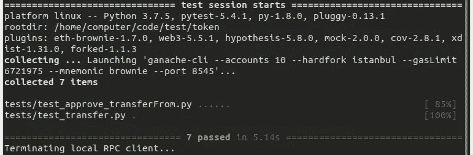
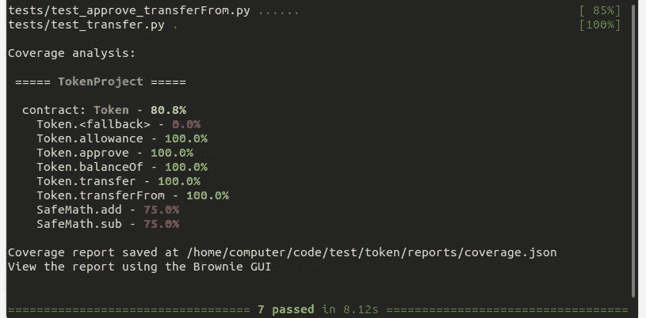
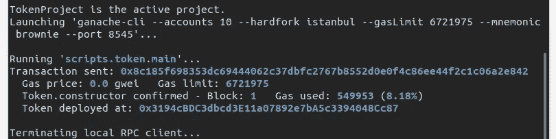

# 布朗尼入门(第 2 部分)

> 原文：<https://betterprogramming.pub/getting-started-with-brownie-part-2-615a1eec167f>

## 使用核仁巧克力饼项目


照片由[思想目录](https://unsplash.com/@thoughtcatalog?utm_source=unsplash&utm_medium=referral&utm_content=creditCopyText)在 [Unsplash](https://unsplash.com/s/photos/ethereum?utm_source=unsplash&utm_medium=referral&utm_content=creditCopyText) 上拍摄

*错过了第一部？* [*点击这里*](https://medium.com/@iamdefinitelyahuman/getting-started-with-brownie-part-1-9b2181f4cb99) *。*

我们刚刚安装了[布朗尼](https://github.com/iamdefinitelyahuman/brownie)，并确认它可以工作。现在怎么办？让我们从快速定位开始，然后我们将深入一些更重要的领域。首先，我们需要一个项目！

# 创建一个布朗尼项目

在使用 Brownie 的大部分时间里，你都在处理一个项目。项目由一个或多个智能合约、单元测试和脚本组成，以处理部署和常见交互。

我们可以通过在一个空文件夹中键入`brownie init`来开始一个新项目，但是对于本教程，我们将从一个预先制作的项目开始工作。Brownie 提供了几个模板(称为*混合*)，以及一个初始化它们的工具`brownie bake`。

让我们从初始化`[token-mix](https://github.com/brownie-mix/token-mix)`开始，这是一个简单的 ERC20 项目:

```
brownie bake token
cd token
```

初始化完成后，打开新创建的`token`子目录，查看一下。如果您使用过其他智能合约框架，这种布局可能很熟悉。

*   `**contracts/**`保存项目智能合约的所有源文件。Brownie 支持用 [Solidity](https://solidity.readthedocs.io/en/v0.6.6/) (带`.sol`后缀)和 [Vyper](https://vyper.readthedocs.io/en/latest/) (带`.vy`后缀)书写的合同。
*   `**interfaces/**`持有项目所需的智能合约接口。接口是一个文件，可以用来与合同进行交互，但不包含足够的信息来部署它。
*   `**scripts/**`保存用于部署和与项目交互的 Python 脚本。
*   为你的项目保存单元测试。Brownie 使用 [pytest](https://docs.pytest.org/en/latest/) 框架进行测试。

# 运行编译器

项目已初始化，但尚未编译。我们可以使用以下命令手动触发编译器:

```
brownie compile
```

您应该会看到如下输出:



Brownie 自动跟踪项目的`contracts/`文件夹中的文件，并在添加或更改文件时运行编译器。通常不需要手动编译——但是知道如何编译还是很好的。

# 运行测试

Brownie 使用 [pytest](https://docs.pytest.org/en/latest/) 进行单元测试。Pytest 是一个成熟的全功能测试框架——如果您以前没有使用过，您会很快爱上它。我们将在另一篇文章中讨论如何进行单元测试。现在，让我们运行测试套件:

```
brownie test
```

您应该会看到如下输出:



Brownie 还可以评估测试覆盖率:

```
brownie test --coverage
```

您应该会看到如下输出:



# 运行部署脚本

在`scripts/`文件夹中，你会发现一个单独的文件，`token.py`。这是一个非常基本的脚本，可以处理`Token`合同的部署。让我们试着运行它:

```
brownie run token
```

您应该会看到如下输出:



您可能已经注意到，Brownie 加载了 [Ganache](https://github.com/trufflesuite/ganache-cli) 并且契约部署在那里。这很好，因为我们只是弄清楚了一切是如何工作的，但是当到了实际部署的时候，我们将使用`--network`标志来代替部署到一个活动的网络。稍后会详细介绍。

# 启动控制台

Brownie 控制台是开发过程中快速测试和调试的宝贵工具。这也是熟悉 Brownie 功能的一个很好的起点。

要加载控制台:

```
brownie console
```

您应该会看到类似这样的内容:


当您键入时，Brownie 会提供自动完成和输入提示来帮助您导航。您已经连接到了由 Ganache 提供的开发链上，因此可以随意使用。你不会弄坏任何东西:)

# 接下来

暂时不要关闭控制台！在本系列的第三部分[中，我们将使用它来探索布朗尼的一些功能。](https://medium.com/@iamdefinitelyahuman/getting-started-with-brownie-part-3-ef6bfa9867d7)