# 布朗尼入门(第 3 部分)

> 原文：<https://betterprogramming.pub/getting-started-with-brownie-part-3-ef6bfa9867d7>

## 基本布朗尼功能


andréFran ois McKenzie 在 [Unsplash](https://unsplash.com/s/photos/ethereum?utm_source=unsplash&utm_medium=referral&utm_content=creditCopyText) 上的照片

现在我们已经[安装了 Brownie](https://medium.com/@iamdefinitelyahuman/getting-started-with-brownie-part-1-9b2181f4cb99) 并且[创建了一个项目](https://medium.com/@iamdefinitelyahuman/getting-started-with-brownie-part-2-615a1eec167f)，是时候熟悉一些核心功能了。

如果还没有，请从打开控制台开始:

```
brownie console
```

[Brownie](https://github.com/iamdefinitelyahuman/brownie) 将启动 [Ganache](https://github.com/trufflesuite/ganache-cli) 并创建一些对象来帮助你与你的项目互动。准备就绪后，您会看到一个命令提示符:

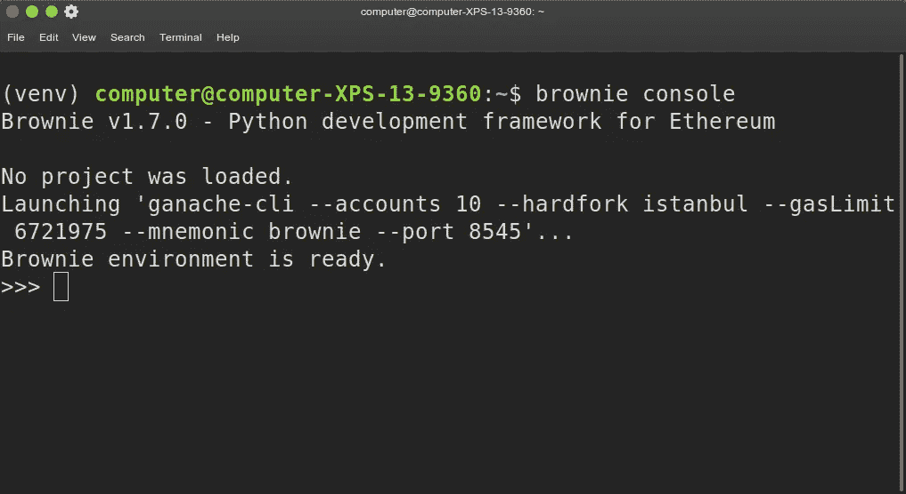

对于 Python 的新手来说，是时候升一级了！让我们来看看两个非常有用的内置函数:

*   `**dir**`显示名称空间内的对象列表或对象成员列表。如果使用 Python 对你来说就像是去外国旅游，那么就把`dir`当成你的路线图吧。

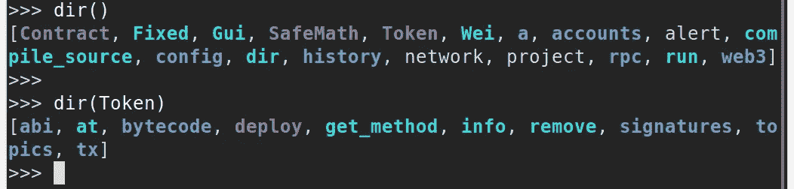

*   `**help**`接受任何对象作为参数，并显示该对象的文档。继续我们之前的类比，如果`dir`是你的路线图，那么`help`就是你的指南。

有了这两个功能和足够的好奇心，您就可以很好地理解如何在不接触文档的情况下做任何事情。(但是请务必打开[布朗尼文档](https://eth-brownie.readthedocs.io/en/stable/index.html)。我花了很多心血。)

# 转移乙醚

让我们从一个简单的交易开始。因为我们用的是 Ganache，已经有几个解锁的账户可以用 100 以太来资助我们了。与这些帐户交互的对象可以在一个名为`accounts`的容器中找到:

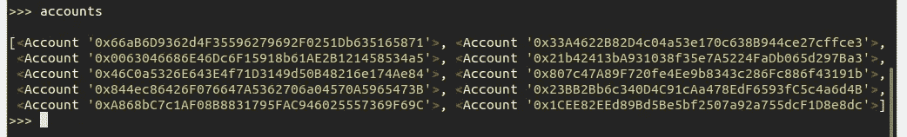

让我们从简单地将一个乙醚从`accounts[0]`转移到`accounts[1]`开始。输入以下命令:

```
accounts[0].transfer(accounts[1], "1 ether")
```

你可以键入`1e18`或者甚至`1000000000000000000`来代替`"1 ether"`，但是我发现这个字符串更容易阅读，Brownie 会很乐意转换它。

Ganache 立即挖掘事务，并将结果输出到控制台:

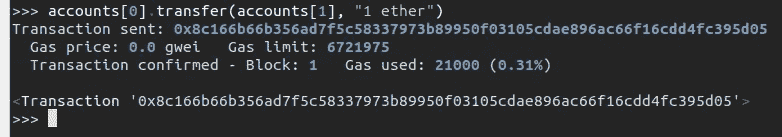

看到最后一行了吗？`<Transaction ...>`？这是一个代表你刚刚完成的交易的对象。因为它没有被赋给变量，所以被打印到控制台。但是不要担心，即使你没有分配它也不会全部丢失！事务也被添加到一个名为`history`的容器中:

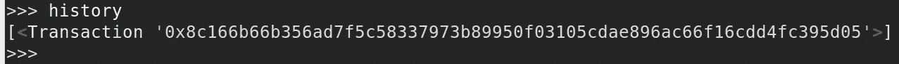

`TransactionReceipt`对象包含许多用于检查事务的属性和方法。它是布朗尼最强大的组成部分之一，可能值得有自己的文章。我们很快会回来。

# 使用合同

token-mix 模板包括一个可部署的契约，名为`Token`。每个契约都有一个可用于部署的对象，如下所示:

```
Token.deploy("TST", "Test Token", 18, 1e24, {'from': accounts[0]})
```

在输入命令时，您会注意到 Brownie 提供了所需值的提示。多棒啊。

最终值被称为**事务字典**。您可以在这里指定信息，如发送者、气体价格和气体限制。Brownie 尽可能使用合理的默认值——唯一的必填字段是`from`。

广播事务，看:一个新部署的契约诞生了。

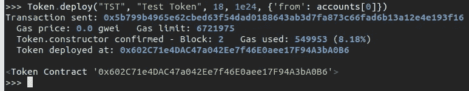

该调用返回一个`Contract`对象，用于与部署进行交互。那是什么？你没有再分配一次？！没什么大不了的。用于部署的对象也是保存部署的容器。

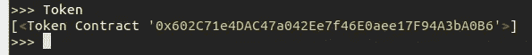

将部署的`Contract`对象赋给一个变量，然后让我们和好朋友`dir`一起看看:

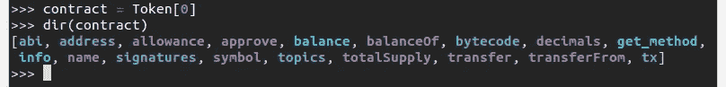

所有标准的 ERC20 方法都可以作为对象中的可调用成员。首先检查总供应量和余额:

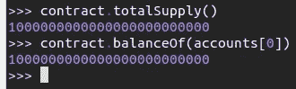

正如预期的那样，所有令牌最初都被分配给我们用来部署合同的地址。让我们试着发送一些令牌，这次一定要分配返回的`TransactionReceipt`:

```
tx = contract.transfer(accounts[1], 1e18, {'from': accounts[0]})
```

# 使用事务

现在是时候来看看这个交易了。我们将从快速调用`dir(tx)`开始。您可以看到有多少信息可用:

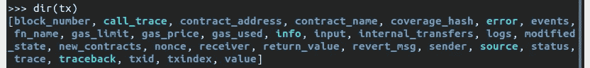

这是一个很长的列表，大多数属性都是不言自明的。现在，调用`tx.info()`来获得一个扩展的人类可读的事务描述。

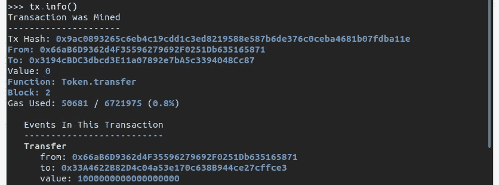

当事情没有按计划进行时，这个物体真正发光。键入以下命令:

```
tx = contract.transfer(accounts[3], 1e18, {'from': accounts[2]})
```

哦不，我们的交易失败了！

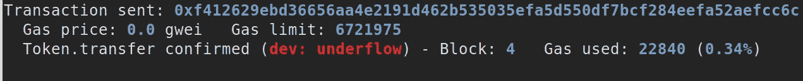

你可能已经知道哪里出了问题，但我们还是会调查。从以下命令开始:

```
tx.error()
```

Brownie 在出现错误的地方输出一段源代码:

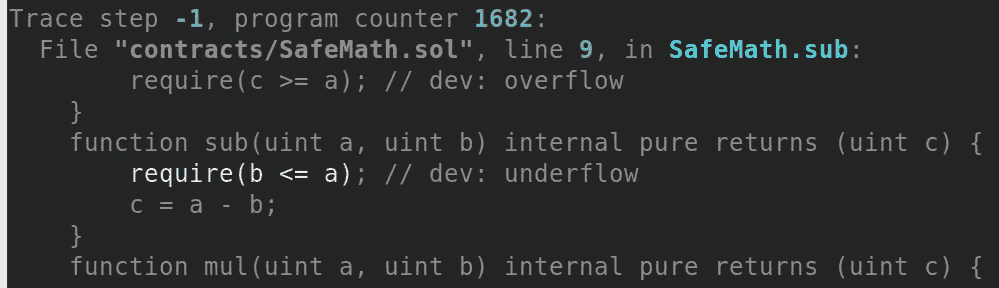

好吧，我们没有通过`SafeMath`下溢检查。很高兴知道，但我们可以使用一些上下文。接下来尝试此命令:

```
tx.traceback()
```

这一次，我们看到了 Python 风格的回溯，突出显示了导致还原的每一帧:

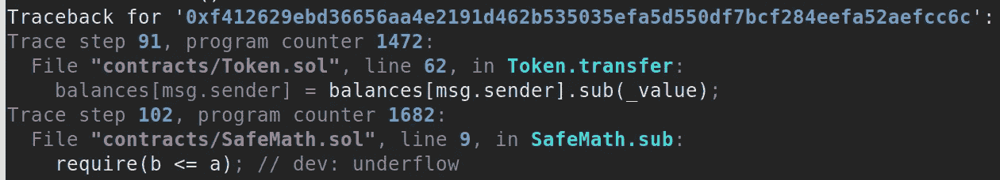

瞧啊。下溢是因为`msg.sender`余额不足。这个例子很简单，但是当你发现自己在构建下一个 DeFi gem，并且在一次交易中在十几个合同之间跳跃时，这些回溯会让你感觉很禅。

# 接下来

暂时就这样吧！不久我们将发布第四部分，在那里我们将讨论单元测试。