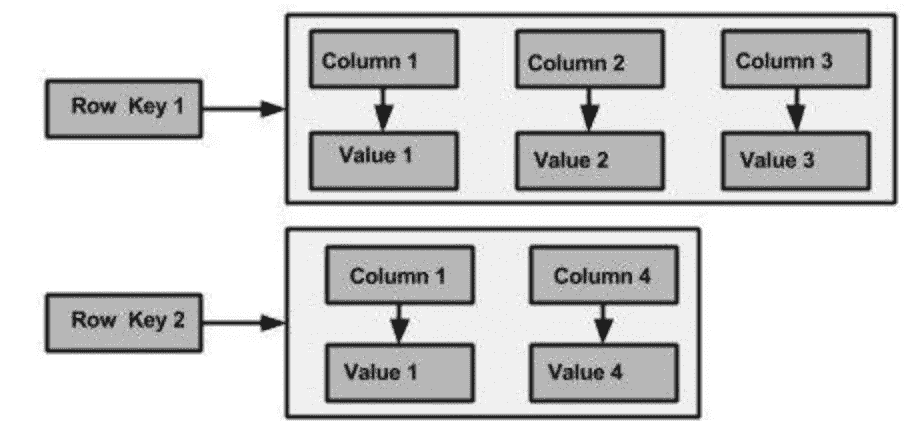
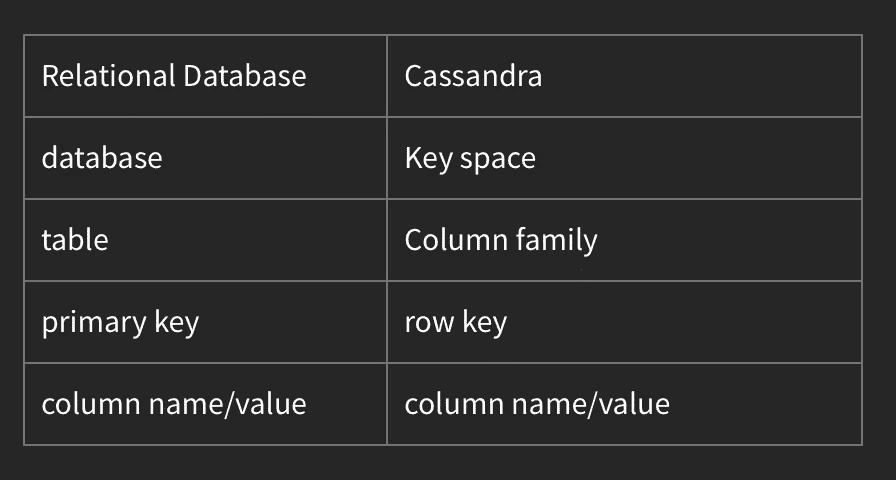

# Cassandra NoSQl 数据库入门

> 原文：<https://betterprogramming.pub/getting-started-with-cassandra-nosql-database-4eefb5d57906>

## Cassandra 架构和内部解释

照片由[丹尼尔·利维斯·佩鲁西](https://unsplash.com/@yogidan2012?utm_source=unsplash&utm_medium=referral&utm_content=creditCopyText)在 [Unsplash](https://unsplash.com/s/photos/infinity?utm_source=unsplash&utm_medium=referral&utm_content=creditCopyText) 上拍摄

自从 NoSql 数据库出现以来，由于内置的水平分区、模式的灵活性以及为其存储的大量数据计算指标/智能元数据的能力，它们一直非常受欢迎。因此，它不是在所有情况下都适用的灵丹妙药；NoSql 数据库上的连接可能更难，数据之间的关系可能不是隐式的，读取时间可能更慢，并且没有 ACID 属性。

大致有 5 种不同类型的 NoSql 数据库:

*   键值存储(Key Value Store):可以认为是一个巨大的分布式哈希表。一些流行的例子包括 [Redis](https://en.wikipedia.org/wiki/Redis) 和 [Couchbase](https://en.wikipedia.org/wiki/Couchbase_Server) 。
*   **文档存储**:用于存储和检索类似文档的结构，如 JSON、XML 等。`Document Store`是`Key-Value` store 的子类，区别在于数据对于键值存储中的数据库来说是不透明的，而文档存储使用文档的底层结构来生成元数据并进一步优化。MongoDB 是一个流行的例子。
*   **图形**:图形数据库可以看作是在那些文档之间增加了一层关系的文档数据库。
*   **列式数据库**:多列存储数据的数据库。它类似于二维键值存储。最受欢迎的例子之一是卡珊德拉。

Cassandra 由脸书开发并开源，目前正被网飞、苹果、Spotify 等公司大量使用。像 Cassandra 这样的列数据库的优点是，每一列都存储在磁盘上的一个单独的文件中，所以如果只查询某些列，只需要读取它们，而不用用不属于查询的列来解析整行。此外，可以压缩列中的重复顺序数据以提高存储效率。

# 卡桑德拉的特征

*   分布式、非关系型数据存储。
*   水平可扩展(低数据密度)。
*   设计用于访问模式(i/o 操作的类似 SQL 的数据查询)。
*   无缝数据复制。
*   P2P 无主模式。避免任何单点故障。
*   最终一致的系统。

# Cassandra 数据模型

存储在 Cassandra 中的最小形式的数据可以想象为:

1.  列:名称和数据类型
2.  列族:具有主键的列的列表(可以是其中一列，也可以是组合键)。它有一些属性:

*   `key_cached`:保存密钥在存储器中的位置。
*   `row_cahed`:在内存中保存整行。
*   `pre_load_row_cache`:预加载行缓存的选项

色谱柱系列可视化—作者图片

3.超级列族:它是行的列族的子集。它可以用于绑定经常使用的行，但是:

*   Cassandra 不索引超级列家族中的列。
*   可能会发生内存不足的错误。

4.一个柱族或一组柱族成为一个键空间。

密钥空间是 Cassandra 数据存储中最外面的地方，我们在这里定义复制和副本放置策略。

卡珊德拉 vs 关系数据库—作者图片

## 卡珊德拉钥匙

主键由两部分组成:

1.  **分区键**:决定我们的数据放在哪个节点上的键；

*   使用散列函数对分区键进行散列，由此形成的令牌决定数据将位于哪个节点(具有令牌范围)。
*   具有相同主键的行将位于相同的节点上，因此在查询时，指定整个分区键是至关重要的。

2.**聚类键**:数据在具有相同分区键的节点中排序的顺序。因此，范围查询在这里是可能的。

注意:对于使用任何其他列(而不是主键)的查询，我们需要将它作为二级索引。它通过 SS 表附加二级索引(SASI)来实现。

## 查询优先建模

由于没有连接，我们需要创建所有的关系表和查询时需要的表。因此，我们需要考虑将在 ER 上执行的所有查询，然后相应地制作表。

## 物化视图

因为对于每个表，我们需要太多的其他表来执行所有的查询。因此，在更新操作的情况下，我们需要更新多个表，逻辑需要由应用程序自己编写，加上 Cassandra 是一个 NoSQL 数据库，不能保证类似 ACID 的属性。Cassandra 用物化视图(MV)解决了这个问题:

1.  使用 MV，我们可以创建从基表到 MV 的一对一映射。
2.  基表上的任何更新都将传播到 Mat。卡桑德拉的观点。
3.  基表的主键必须出现在 Mat 的主键中。尽管分区和聚集键可以改变。此外，除了主键之外，您最多可以在 mat 视图的主键中多选择一列。

## **节点和令牌**

*   Cassandra 集群中的节点被虚拟地放置在一个令牌范围从-2⁶到 2⁶ -1 的环上。
*   当单个节点添加到节点配置为 256 个令牌的空群集中时。该环被分成 256 个令牌范围，并且这些范围被给予单个节点。
*   当另一个节点具有 256 个令牌配置时，第一个节点中的令牌范围被一分为二，并且一半的范围以随机的统一顺序给予第二个节点，依此类推。
*   因为我们自己进行令牌分配，所以我们进入了从一个节点到另一个节点的下游任务的业务，这对于数据的整个分割是没有效率的。因此，为了获得更高的吞吐量，我们使用 vnodes 将工作平均分配给所有其他节点。

## 分身术

在复制属性方面，我们有*复制因子*，即我们需要多少份数据副本，以及*复制放置策略*，即如何定位和放置每个副本。在一个简单的复制放置策略- >中，副本被放置在环上的下一个虚拟节点上。

## 一致性

> ***R + W > N***

*   每个节点都充当协调器节点。
*   一旦读/写进入任何节点(协调程序),它查看所有节点共有的环形结构，并找到具有相同分区键的节点及其副本。
*   然后，它对所有 N 个副本进行读/写操作，并根据配置(全部、一个、仲裁)将答案返回给协调器，然后返回给应用程序。
*   在多个 DC 的情况下，当请求到达一个节点(协调程序)时，它会在另一个 DC 中找到一个远程协调程序，并将请求转发到那里。跨 DC 的一致性配置也可以调整到本地仲裁或每个仲裁

## 八卦协议

*   让所有节点互相交谈以使所有节点拥有所有元数据是低效的。
*   这种流行病般的算法会看到每个节点随机选择另一个节点并交换它们的数据。然后，每个节点将谈论它们的状态和它们知道的节点的状态。每个节点需要几分钟来了解所有其他节点。

## 写路径内部

1.  书面请求来自协调器节点。
2.  然后，它被同时写入提交日志(在磁盘中，日志结构的合并树，每个节点一个)和 mem 表(在 RAM 中，每个表一个)。两个操作一完成，ACK 就被发回。
3.  一旦 mem 表满了，它就被刷新到不可变的 SS 表中(在磁盘中)。
4.  在`DELETE`操作的情况下，逻辑删除被写入 mem 表，然后被刷新到 SS 表。

## 读取路径内部

1.  作为第一步，我们检查 mem 表，它有最新的数据，所以如果请求的行在那里，我们就返回它们。
2.  然后我们尝试解析多个 SS 表。
3.  读通磁盘是昂贵的。
4.  为了对此进行优化，我们在每个 SS 表上设置了布隆过滤器和密钥缓存。
5.  因此，首先它将检查布隆过滤器，以确定所请求的密钥是否存在。如果没有，它将移动到下一个 SS 表。如果存在，它将检查键缓存，如果存在(键缓存由数据存在的偏移量组成)，它将查看该偏移量并返回数据，如果不存在，它将扫描 SS 表，该表将按分区键排序，更新键缓存中的偏移量并返回数据。

## 压紧

由于会有多个 SS 表，Cassandra 不时会压缩 SS 表并删除带有墓碑的值。

至此，我结束了对卡珊德拉 NoSQL 数据库的基本了解。感谢阅读。