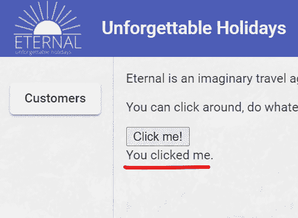
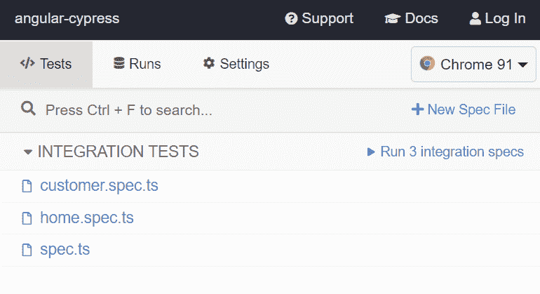
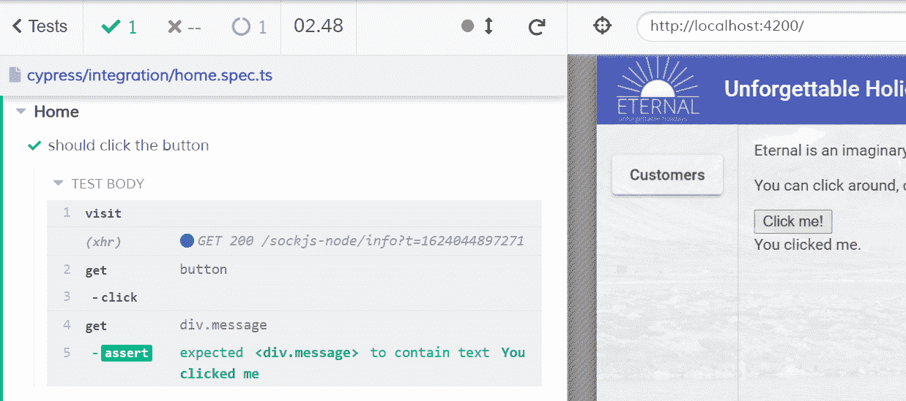
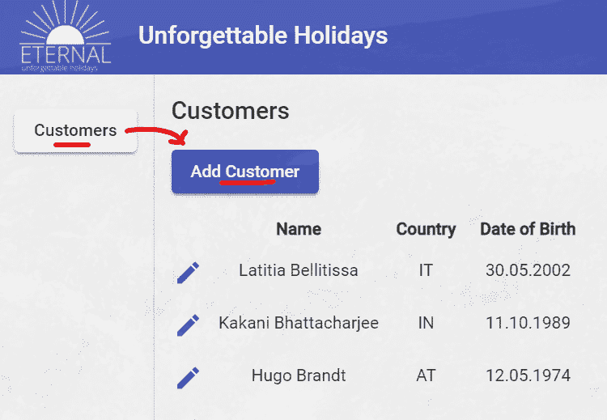
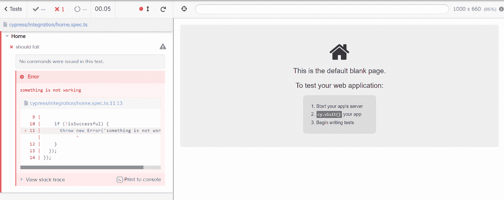

# Cypress 入门:编写您的第一个角度测试

> 原文：<https://betterprogramming.pub/getting-started-with-cypress-write-your-first-angular-test-77caf9f2a45e>

## 编写健壮的 E2E 测试

本·穆林斯在 [Unsplash](https://unsplash.com?utm_source=medium&utm_medium=referral) 上的照片

4 月 24 日，Angular 宣布放弃他们的 E2E 测试工具量角器。目前还不清楚是否会有继任者，或者 Angular 是否会将这一任务委托给用户自己。在撰写本文时，WebDriver。IO、TestCafé和 Cypress 提供了 Angular CLI 的原理图。

这是第二部分，是关于在赛普拉斯的第一步。[第一部分](/protractor-is-dead-long-live-cypress-3f0c6bdd62e6)是关于 E2E 框架的概述。

你可以在这里找到源文件。如果你喜欢看而不喜欢读，那么这个我的演讲录音是给你的。

# 基础

柏树非常容易使用。从 Angular 12 开始，你只需要运行像`npx ng add @cypress/schematic`和 voilá这样的原理图，就完成了。如果你用的是 Nx，这也是我推荐的，Cypress 已经预装了。

Cypress 测试的编写类似于 JavaScript 中的大多数其他测试。`describe`定义了一个新的测试套件，包含多个测试用例，每个测试用例由`it`定义。它们位于文件夹 **/cypress/integration** 中。

E2E 测试做的事情和人类测试人员做的一样。他们在看、点击和打字。这三个动作在 Cypress 中都有自己的命令。实际上，它们是全局`cy`对象的方法。

在我们用 DOM 节点做一些事情之前，我们必须先查找它。这是通过`cy.get("some-selector")`完成的。那么我们已经可以对它进行操作了。这可以是一个`click()`或`type("some text")`。这些方法可以被链接起来。点击一个按钮就是`cy.get('button').click()`。那不是很容易吗？

因为我们编写了一个测试，所以我们想要验证在点击之后发生了什么。我们期望文本消息出现在选择器`p.message`的段落中。它应该显示“更改已保存”我们将使用这个命令断言它:`cy.get('p.message').should('contain.text', 'Changes have been saved');`。

# 第一次测试

让我们只写我们上面描述的测试。

作者截图

根据我们目前掌握的知识，我们可以马上做到这一点。我们在**/cypress/integration/home . spec . ts**中创建测试文件，并编写以下代码:

那么，我们如何运行它呢？同样，非常简单。只需执行`npx cypress open`或`npm run cypress:open`即可。Cypress 应该打开，您点击`home.spec.ts`，测试运行程序在另一个窗口中打开并立即运行测试。确保 Angular 应用程序本身也在运行。

作者截图

作者截图

工作了？精彩！现在，当测试应该在 CI 的管道中运行时，我们必须做什么？我们只执行`npm run cypress:run`，而不是`npm run cypress:open`。这将在无头模式下运行测试。由于我们实际上看不到任何东西，Cypress 会自动记录测试并将视频文件存储在 **/cypress/videos** 中。另外，失败的测试也会在**/cypress/screens**下截图。

# 当心剥落

假设我们想在测试中添加一个客户。在侧边栏中，我们单击“客户”按钮，然后客户列表会出现在“添加客户”按钮旁边我们也点击它，得到这个结果:

作者截图

如果您运行该测试，很可能会以一种非常奇怪的方式失败，如下所示:

作者截图

看起来它找不到与“添加客户”的链接，尽管它就在我们面前。那里发生了什么事？

答案很清楚。我们可能会认为`cy.get("a")contains("Add Customer")`正在继续寻找一个带有文本“Add Customer”的链接，最多四秒钟。这不是真的。

我们在这里看到的是两个按顺序运行的命令。第一个命令是查找所有链接标签。如果 Cypress 找到了一些，它将对这些应用下一个命令。在我们的例子中，“添加客户”链接不会在点击“客户”后立即呈现当 Cypress 寻找链接时，它只会找到两个:标题中的“客户”和徽标。然后它等待这两个链接中的一个，它们的文本变成“添加客户”

在某些情况下，“添加客户”的渲染速度足够快。然后赛普拉斯会找到三个链接并成功。因此，我们最终的测试有时会失败，有时会成功。一场噩梦！

永远记住这两条规则:

1.  命令成功时不会重试
2.  链是多个命令

那么，如何避免呢？我们应该想出更好的选择器，因此避免将选择过程分成两个命令。我更喜欢将带有唯一标识符的`data-test`应用于我的 DOM 元素。这两个链接的标记如下所示:

我们以下面重写的测试结束:

# 小心异步

像`cy.get`这样的 Cypress 命令有一个内置的等待特性。这意味着它们会重试多次，直到操作可行或找到元素。这种不断的重试是异步发生的。您可以这样阅读测试用例:

虽然这些命令提供了一个`then`方法，但是不要把它们误认为是承诺。是的，你不能像上面这样写代码。Cypress 在内部排队并运行命令。您必须意识到“内部异步”并避免将其与同步代码混淆。这里有一个例子:

运行测试后，我们得到以下结果:

那里发生了什么？看起来应用程序甚至没有打开！没错。Cypress 只是将所有的`cy`命令排队，以异步运行它们，但是`let`和带有`throw`命令的条件是同步命令。所以在 Cypress 有机会运行异步部分之前，测试就已经失败了。意识到这一点。您只能在“then”方法中运行同步代码。

这就结束了我们对 Cypress 的快速介绍。作为下一步，我建议你转到[https://www.cypress.io/](https://www.cypress.io/)。官方文件是极好的。

# 进一步阅读

*   [从量角器迁移到 Cypress | Cypress 文档](https://docs.cypress.io/guides/migrating-to-cypress/protractor)
*   [@柏树/示意图](https://www.npmjs.com/package/@cypress/schematic)
*   [源代码](https://github.com/rainerhahnekamp/angular-cypress)

*最初发表于*[*www.rainerhahnekamp.com*](https://www.rainerhahnekamp.com/en/angular-e2e-testing-protractor-is-dead-long-live-cypress-part-2/)