# 2021 年 Docker 入门

> 原文：<https://betterprogramming.pub/getting-started-with-docker-in-2021-8df187f5979d>

## 关于 Docker 你需要知道的一切


托德·克雷文在 [Unsplash](https://unsplash.com?utm_source=medium&utm_medium=referral) 上的照片。

在过去的几年里，Docker 一直在扰乱开发和 DevOps 领域。很多人认为 Docker 是一种编程语言或框架。它不是。Docker 是一个用于构建、运输和运行容器的开源平台。

这是一个允许你管理图像和容器的工具。因此，在介绍 Docker 之前，我们最好先了解一下容器。

# 容器

[根据 Docker](https://www.docker.com/why-docker) 的说法，“容器是一种标准化的软件单元，允许开发者将他们的应用程序与环境隔离开来。”通过使用容器，你不再需要担心你的应用程序之间的相互依赖。一个应用程序需要的每一个依赖项都可以安装并隔离在一个容器中。此外，我们可以保证在一个容器中运行的应用程序也可以在其他容器中运行。

## 使用容器的优点

那么，我们为什么还要使用容器呢？有什么好处？好吧，简单回答这个问题，隔离和限制。

通过使用容器，我们可以将特定的应用程序与主机(我们使用 Docker 的机器)中的其他组件隔离开来。默认情况下，容器不能访问主机的任何存储，反之亦然。隔离和限制行为解决了很多事情，但是让我们关注两件主要的事情:依赖性冲突和限制恶意软件的损害。

## 避免依赖冲突

我很确定每个人都经历过个人电脑上的依赖冲突。当你在你的电脑上安装了大量的软件时，这些软件之间的依赖关系就有可能发生冲突。

例如，您希望安装软件 A 和软件 B。软件 A 要求您在 PC 中安装 Python 2.1，而软件 B 要求 Python 2.3。当你安装软件 A 时，它可以完美地工作。但是在你安装了软件 B 之后，你的电脑用 2.3 版本替换了 Python 2.1。因为 Python 2.3 和 2.1 的一些特性不同，所以软件 A 可能不再工作了。这种事情也经常发生在生产服务器中。

为了让一切都完美地工作，您需要解决依赖性冲突。

我们可以通过在应用系统中使用容器来避免依赖冲突。容器是相互隔离的，甚至与它们的主机也是隔离的，所以依赖冲突是不可能的。

## 限制病毒的危害

不管是不是意外，你使用的一些软件可能含有病毒。如果带有病毒的软件在没有使用任何资源隔离的情况下运行，它将能够访问整个主机。但是，如果它在容器中运行，它将不能访问任何超出允许范围的内容。正因为如此，你可以把一个容器想象成一个里面正在运行的进程的监狱。在容器内，病毒将无法访问容器外的文件。它也不容易访问硬件资源(CPU 和内存),因为容器也会限制它们使用的硬件资源。

# 容器与虚拟机

如果你已经做了一段时间的开发人员，你可能听说过甚至使用过虚拟机。容器和虚拟机非常相似。它们既隔离又限制了其中的一个过程。那么，为什么使用容器而不是虚拟机呢？

虚拟机是一种软件，它在其上托管整个操作系统，并在称为虚拟机管理程序的物理机器上运行。同时，容器提供了一个运行在其主机操作系统之上的隔离空间。

容器最重要的优势是初始化新实例的速度。创建一个虚拟机需要几分钟，因为您需要创建一个虚拟磁盘、安装操作系统、分配资源等。容器使用主机的操作系统、磁盘、内存、CPU 等。这使得创建容器非常快速(通常几秒钟)。

另一个优势是便携性。在 Docker 中，我们可以使用图像来打包容器的数据(我们将在本文后面了解这一点)。然而，对于一个虚拟机，如果你想打包它，你需要用它的系统数据包装整个操作系统，产生一个巨大的包。

需要注意的一点是，在 VM 中包含容器没有任何问题。其实很多人都是这样用的。你可以在像 GCP、AWS 或 DigitalOcean 这样的云服务器中租用一个虚拟机，并在其中运行许多容器。

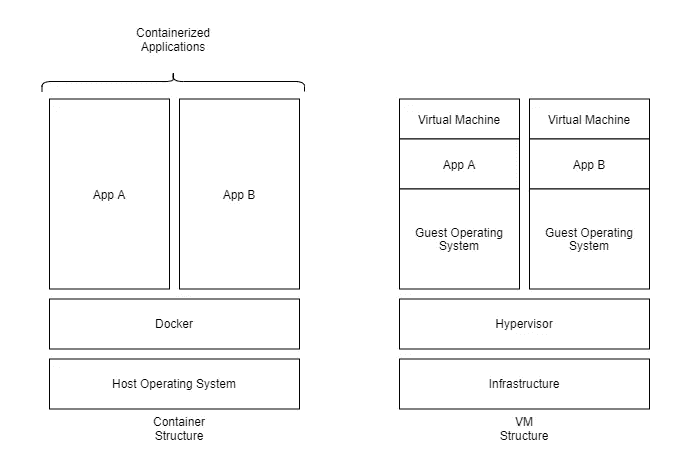

容器与虚拟机结构

# Docker 简介

正如我们在上一节中了解到的，Docker 是一个用于构建、运输和运行容器的开源平台。默认情况下，Docker 运行在 Linux 操作系统之上。如果你在 Windows 或 macOS 上安装 Docker，它会要求你安装一个 Linux VM，这样它就可以在其上运行。

*注意:苹果新的 M1 CPU 架构目前不支持 Docker。有一个开发者预览版，但是还不稳定。*

## Docker 的“你好世界”

对于这一部分，你需要首先安装 [Docker 桌面](https://www.docker.com/products/docker-desktop)。安装完成后，您可以使用命令`docker -v`来验证您的安装。在我的例子中，我使用的是 Windows，我安装的 docker 版本是`19.03.12`。

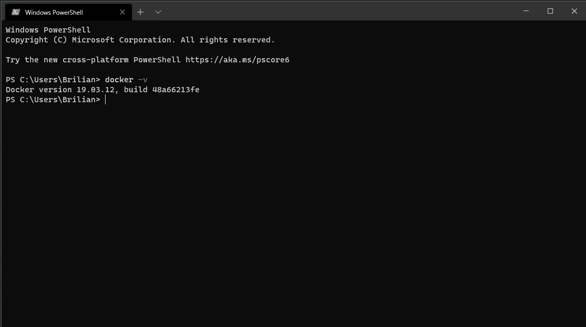

成功安装 Docker 后，您可以尝试使用`docker run hello-world`运行“hello world”Docker 映像。您应该会得到这样的结果:


那么，你觉得结果怎么样？你注意到那行`Unable to find image ‘hello-world:latest’ locally`了吗？当我们运行前面的命令时，实际上发生了什么？

你首先要知道的是 Docker 形象。Docker 映像基本上是之前配置的容器的快照。在我们的“hello world”图像中，它被配置为在容器启动时立即显示消息。

那么，当我们运行这个命令时发生了什么呢？

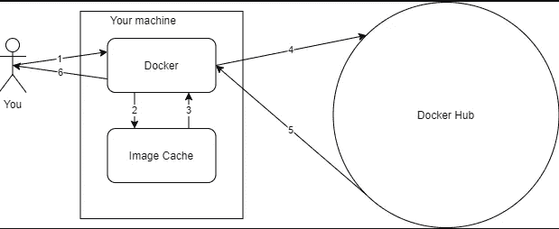

1.  码头工人得到了`docker run hello-world`号的命令。
2.  Docker 检查了`hello-world`图像是否在图像缓存中。
3.  图像缓存没有返回任何内容，表明`hello-world`图像不在图像缓存中。
4.  Docker 检查了 Docker Hub (Docker 的公共存储库)中的`hello-world`图像。
5.  Docker Hub 发现了一个标记为`hello-world:latest`的图像，并将其返回到您机器上的 Docker。注意，如果不指定标签版本，默认情况下您将获得`latest`标签。
6.  Docker 然后从它得到的图像创建一个容器，在终端屏幕上显示输出。

# 基本命令

既然我们已经了解了如何使用`docker run`运行映像，那么让我们学习一些基本的命令。

## 码头运行

我们在“hello world”示例中使用了`docker run`。`docker run`基本上就是`docker pull`、`docker create`、`docker start`的组合。简单来说，`docker pull`用来从 Docker 注册表中拉一张图片到你的图片缓存中，`docker create`用来根据图片创建一个容器，`docker start`用来启动一个容器。

`docker run`有很多参数可以发送给它。一些最常用的是`--rm`、`--name`和`-it`。

当你用`--rm`启动一个容器时，Docker 会在停止时移除你的容器。如果你想保持你的机器干净，没有未使用的容器，这是很有用的。

`--name`会给容器一个名字。如果您为容器设置了一个名称，那么您可以通过它的名称而不仅仅是它的 ID 来与容器进行交互。

`-it`参数公开了容器的输入和输出，因此您可以与之交互。

## 使用自定义命令运行

在创建 Docker 映像时，您可以指定一个默认命令，该命令将在您从映像运行容器时执行。对于我们的`hello-world`图像，它的默认命令将打开一个脚本，在容器中显示一些输出。但是如果图像没有任何默认命令呢？或者，如果我们想使用自定义命令而不是默认命令，该怎么办？

对于本节中的例子，我们将使用一个`busybox`映像，它提供了几个 Unix 实用程序。`busybox`没有默认命令，这对于我们的例子来说非常完美。

让我们试着用`docker run busybox`运行`busybox`图像:

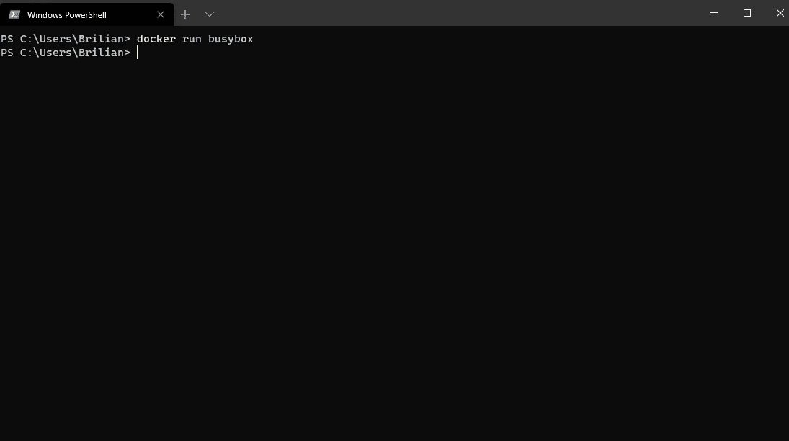

*注意:如果您之前没有运行过* `*busybox*` *图像，将会有一个图像提取过程。我以前运行过* `*busybox*` *图像，所以没有图像提取过程。*

什么都没发生，对吗？在您键入命令后，会有一点延迟，但之后它不会显示任何内容。`busybox`没有默认命令，所以在我们运行它之后，它会自动停止。

现在，让我们试试`docker run -it busybox /bin/sh`:

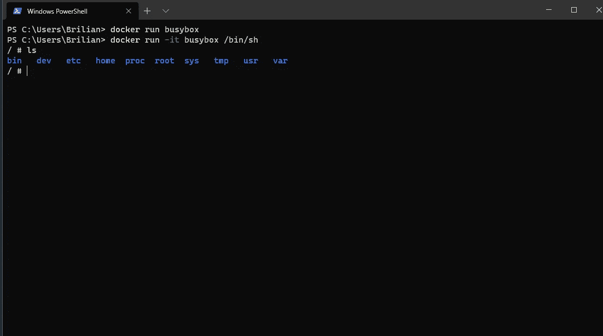

出事了！我们现在实际上正在进入集装箱！正如我们在上一节中了解到的，`-it`参数公开了容器的输入和输出，因此您可以与容器进行交互。

`/bin/sh`是容器启动时要运行的命令。如果你对 Linux 有一些基本的了解，你就会知道它是做什么的。它基本上会启动一个外壳。

现在，让我们打开这个终端，打开一个新的。

## docker ps

`docker ps`是一个将显示每个正在运行的容器的命令。如果你想显示一个没有运行的容器，你可以添加一个`-a`参数。

因为我们仍然在运行`busybox`容器，所以让我们使用`docker ps`来查看它的信息:

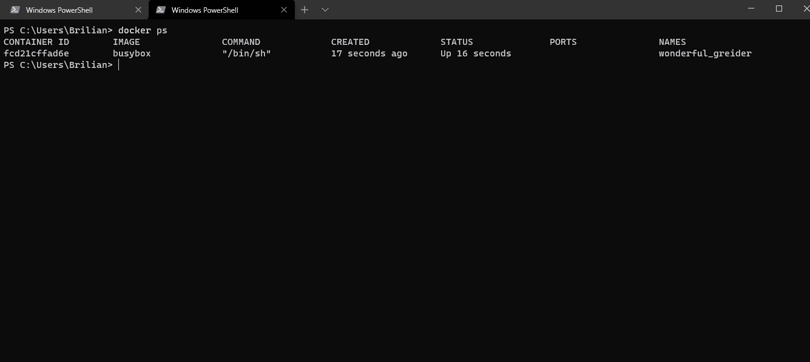

## 码头经理

如果你想在一个正在运行的容器中运行一个命令，可以使用`docker exec`。让我们试试`docker exec -it fcd /bin/sh`:

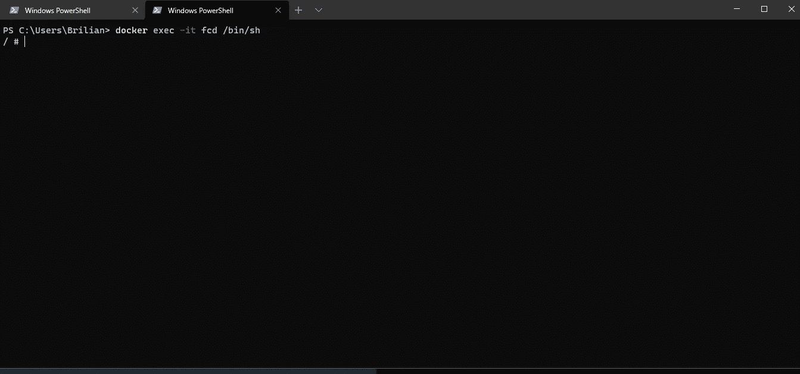

命令中的`fcd`是什么意思？`fcd`实际上是我们之前运行的`busybox`容器 ID 的起始字母。当我们尝试`docker ps`时，我们可以看到集装箱 ID 打印为`fcd21cffad6e`。Docker 是一款真正智能的软件。即使你没有输入完整的 ID，它也能识别你所指向的容器。只要它足够独特，Docker 就能识别容器。

现在，您可以通过创建一个文件夹并查看另一个终端中是否也创建了该文件夹来测试您的两个终端是否正在访问同一个容器:

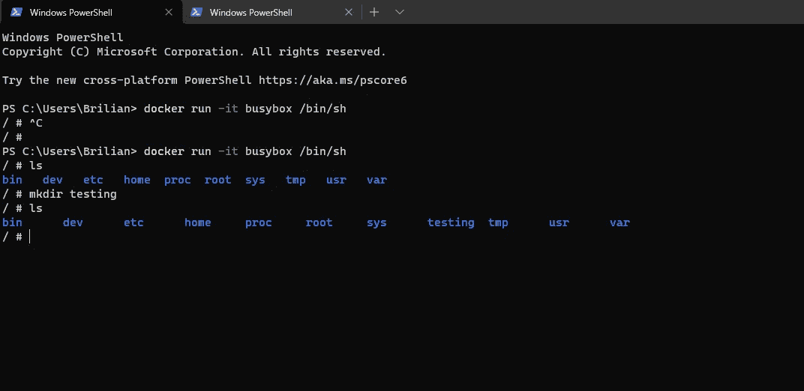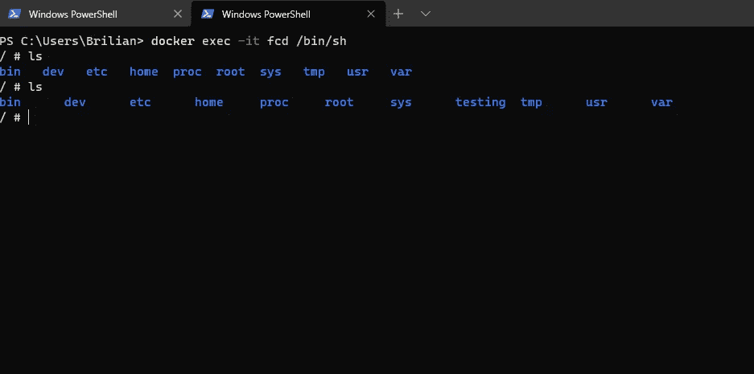

在第一张图片中，我在第一个终端中创建了一个名为`testing`的目录。之后，当我在第二个终端中运行一个`ls`命令时，您可以看到目录也在那里。

## 码头日志

为了更好地形象化`docker logs`命令的作用，让我们通过运行`docker run -d redis`来使用`redis`图像。

`docker logs {containerId}`可以用来查看过去控制台输出的一个容器。如果您想跟踪日志，还可以添加`--follow`参数。让我们通过使用`docker logs 82`来看看我们刚刚运行的`redis`容器输出了什么。请注意，我的机器和你的机器上的容器 ID 是不同的。

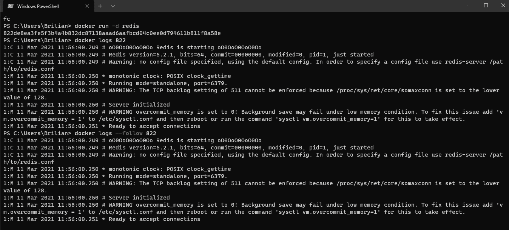

Docker 的基本命令就是这样。如果你对其他命令感兴趣，你可以在[Docker 备忘单](https://dockerlabs.collabnix.com/docker/cheatsheet/)中查看它们。

# 使用体积

让我们开始处理音量。在这一节中，我认为只有一件事是你刚开始学习 Docker 时应该知道的:卷安装。

卷挂载基本上是一种将主机操作系统的卷与容器的卷连接起来的方法。如果您打算使用 Docker 托管一个具有持久数据存储的容器，这是一件非常重要的事情。如果不将容器的卷装载到主机操作系统，每次更新映像或创建新容器时，您的数据都会被擦除。

为了展示这是如何工作的，让我们再次使用`busybox`图像。但是在我们启动容器之前，在您的机器上创建一个文件夹。在我的例子中，我将在`D:/docker/test-busybox-volume`中创建一个文件夹。让我们在刚刚创建的文件夹中创建一个简单的文本文件，并随意命名。我将命名我的`[mounted.txt](/mounted.txt)`。

是时候启动`busybox`并将其安装到我们之前创建的文件夹中了！要使用挂载卷特性，我们可以使用`docker run {image} --volume={src}:{dst}`。我们试试`docker run --volume D:/docker/test-busybox-volume:/test-busybox -it busybox /bin/sh`。转到`/test-busybox`目录，使用`ls`列出里面的文件。您应该会看到刚刚创建的文件:

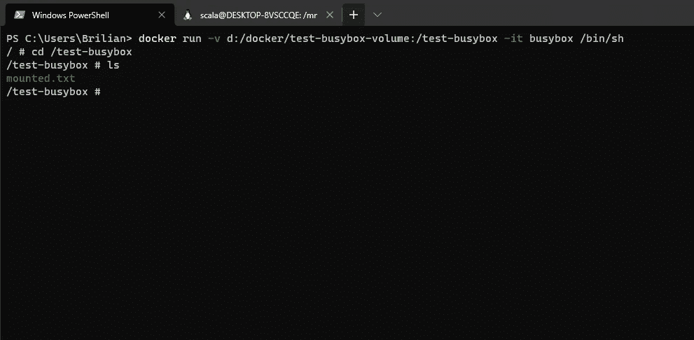

# 使用网络

关于 Docker 中的网络，你需要知道两件重要的事情:

*   如何从容器中公开一个端口来托管操作系统。
*   容器如何相互通信。

对于本节中的示例，我们需要一个具有公开端点的图像。我已经创建了一个简单的名为`brilianfird/node-mock-endpoint:1.0.0`的图像，我们可以使用它作为我们的案例。该图像包含一个监听端口 8080 的应用程序，当它被点击时将返回一个简单的`{"success": true}`响应。

## 暴露端口

将端口暴露给主机操作系统很容易。您可以在启动容器时添加`--port {to}:{from}`参数。让我们用`brilianfird/node-mock-endpoint`图像来试试:

```
docker run -p 8081:8080 brilianfird/node-mock-endpoint:[1.0.0](/1.0.0)
```

之后，尝试在浏览器中打开 localhost:8081，您将看到响应。

## 集装箱之间的通信

由于微服务的流行，服务相互连接是非常正常的。大多数应用程序还需要连接到数据库才能正常运行。如果容器是孤立的，那么它们如何相互连接呢？

对于要相互连接的容器，它们需要在同一个 Docker 网络中。在本文中，我们将使用一个非常简单的桥接网络来连接容器。如果你对其他类型的网络感兴趣，你可以在文档中阅读。

让我们用`docker network create my-network`创建一个基本网络，并用`docker network inspect my-network`检查它:

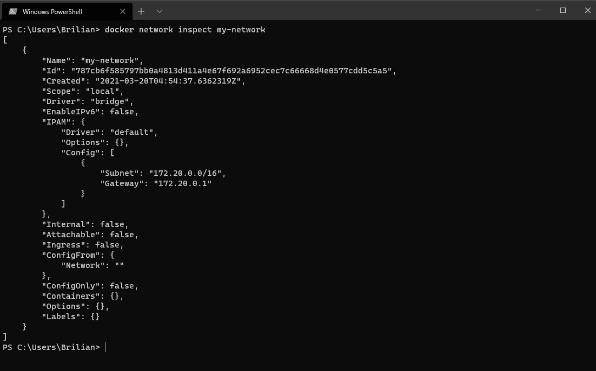

网络中有许多配置，但在我们的例子中，Docker 默认分配所有配置，因为我们没有指定它们。我们不会深入探究每个配置的功能。您唯一需要知道的是,`“bridge”`驱动程序将使其中的容器能够相互通信。

这一步我们将使用两个容器:`node-mock-endpoint`和`alpine`。让我们通过运行`docker run --rm --network my-network --name my-endpoint -d node-mock-endpoint:[1.0.0](/1.0.0)`来启动附加到我们新创建的网络的`node-mock-endpoint`映像。请注意，我们将容器命名为。为了让其他容器更容易地调用这个容器，这是一件非常重要的事情。

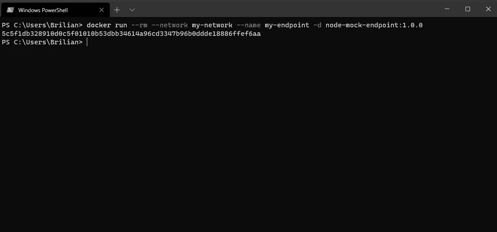

下一步是运行一个`alpine`图像。然后，我们将在 alpine 映像中安装`curl`,并尝试从中访问我们的`node-mock-endpoint`映像。让我们运行`docker run --network my-network --rm -it alpine /bin/sh`来创建一个新的容器。进入容器后，运行`apk add curl --no-cache`在容器中安装`curl`命令:


现在，我们如何调用`node-mock-endpoint`容器？嗯，当你在网络中创建一个容器时，Docker 网络会自动为你的容器分配一个私有 IP。Docker 还会根据容器的名称给 IP 添加一个别名。所以，如果你想调用一个特定的容器，你可以直接调用它的名字。

之前，我们将我们的`node-mock-endpoint`容器命名为`my-endpoint`。因为我们可以使用容器的名称来访问它，所以我们可以只从`curl`到`my-endpoint`看看它是否返回响应。让我们运行`curl -XGET my-endpoint:8080`:


如果一切顺利，您应该会看到来自`my-endpoint`容器的响应`{"message":true}`。

# 在 Docker 中创建我们自己的形象

到目前为止，我们只使用了 Docker Hub 中已经存在的图像。但是我们实际上是如何塑造自己的形象的呢？在本节中，我们将学习如何做到这一点！我们将创建一个简单的`alpine`映像，其中预装了一个`curl`，并将运行`curl --help`作为默认命令。

我们通常只使用自定义命令来进入容器的外壳。但是请记住，我们可以运行任何与映像兼容的命令(比如安装`curl`)。

让我们运行一个`alpine`容器。这一次，我们将安装`curl`而不进入容器。我们也把容器命名为`alpine-curl`。为此，我们可以运行`docker run --name alpine-curl alpine apk add --no-cache curl`。

现在，我们有了一个安装了`curl`的`alpine`容器。为了从它创建一个图像，我们可以使用`docker commit`命令。首先，让我们看看如何通过运行`docker commit --help`来使用`docker commit`:

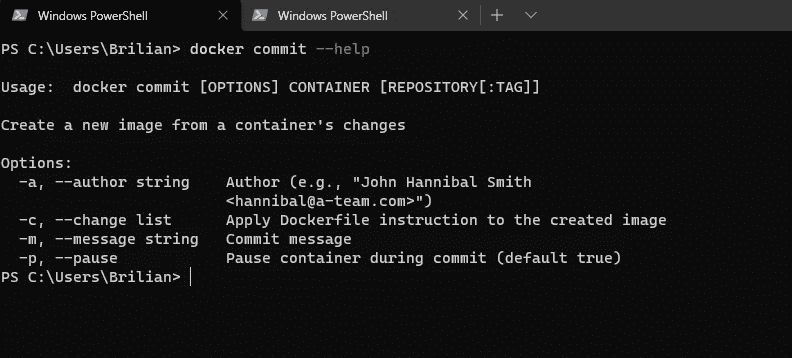

从帮助响应中，我们知道要使用`docker commit`，我们至少需要指定容器、存储库和标签。容器就是您想要从中创建图像的容器的 ID 或名称。存储库是您的映像的名称。它通常有这样的格式:`{company-name}/{image-name}`。标签基本上是你的图像的一个版本。默认情况下，Docker 会使用`latest`标签。

现在，回到我们的形象。剩下要做的就是将默认命令添加到我们的`alpine-curl`容器中。为此，我们可以在提交时使用带有 CMD 值的`--change`参数。让我们运行`docker commit --change='CMD ["curl", "--help"]' alpine-curl brilianfird/alpine-curl:latest`。注意，我使用我的 Docker 的句柄名称作为`{company-name}`。您可以使用相同的名称或将其更改为您的 Docker 的句柄名称。然后我们可以尝试使用`docker run brilianfird/alpine-curl`运行`brilianfird/alpine-curl`图像，我们应该会看到 curl 帮助信息。

*注意:如果您使用的是 windows，并且在运行映像时得到了* `*/bin/sh: [“curl”,: not found*` *，请尝试在 WSL 终端中提交映像。*

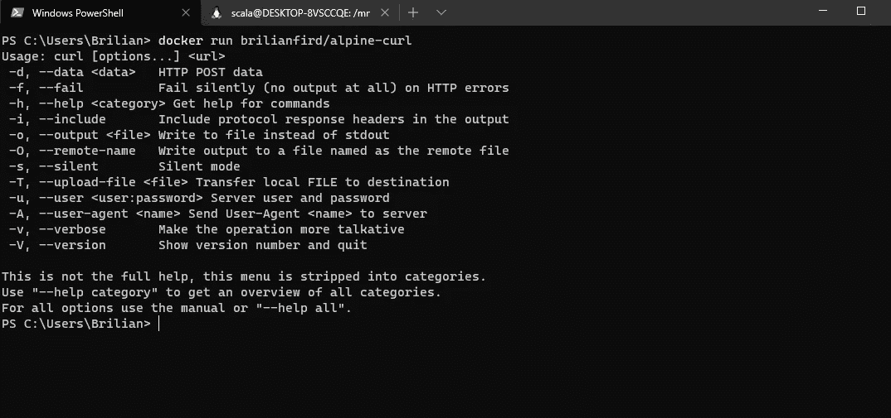

不错！现在我们的图像完成了！我们基于`alpine`图像创建了一个图像`alpine-curl`，并在其中安装了`curl`命令。然后，我们还添加了一个默认命令`curl --help`，如果我们运行这个映像，这个命令就会被执行！

你是否觉得创建一个图像非常复杂，需要记住所有的命令？你并不孤单。我也有这种感觉！幸运的是，Docker 用 Dockerfile 提供了一个更简单的图像创建过程。

## 使用 Dockerfile 创建图像

使用`Dockerfile`，您可以用更简单的语法将所有的`docker commit`命令包含在一个文件中。让我们为之前创建的`alpine-curl`图像创建一个。

首先，我们创建一个文件夹，命名为`alpine-curl`。然后在我们刚刚创建的文件夹中创建一个名为`Dockerfile`(没有任何扩展名)的文件，并在其中插入以下文本:

```
FROM alpine

RUN apk add --no-cache curl
CMD ["curl", "--help"]
```

之后，运行`alpine-curl`文件夹内的`docker build .`命令。您将获得一个图像 ID，如果您尝试运行它，您将看到`curl`帮助信息:

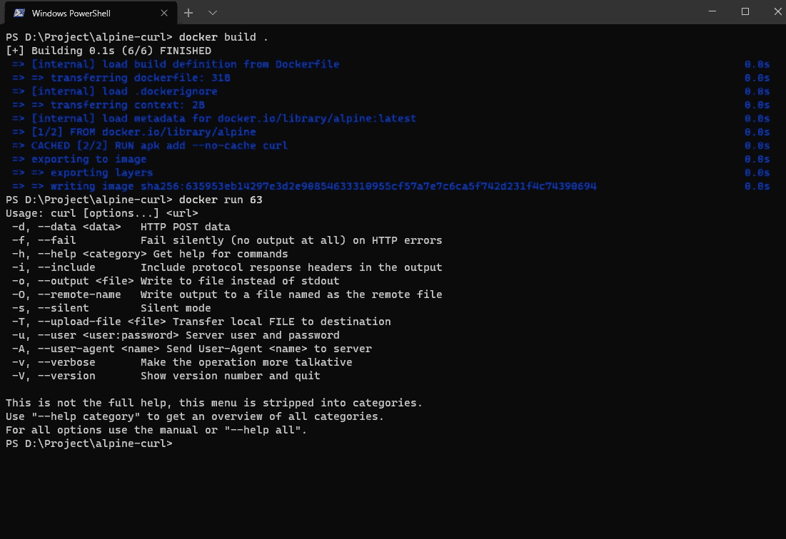

我们需要做的另一件事是更改图像的名称。为此我们可以使用`[docker tag](https://docs.docker.com/engine/reference/commandline/tag/)`。尝试运行`docker tag 63 brilianfird/alpine-curl-dockerfile:latest`(记得更改图像 ID)。

标记图像后，您可以使用`docker images`来检查它是否被正确标记。

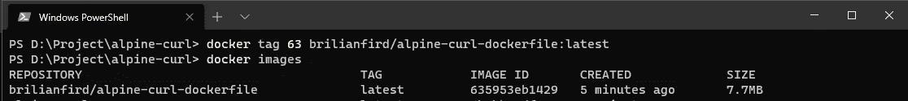

现在创建一个图像非常容易，对吗？`Dockerfile`也是你通常用来创建一个开发项目的图像。

# Docker 撰写

到目前为止，我们只讨论了如何创建单容器应用程序。如果我们想创建一个多容器的怎么办？多克还是支持你的。您可以使用 Docker Compose 创建一个多容器 Docker 应用程序。

Docker Compose 通常用于应用程序的开发和测试阶段。通过使用 Docker Compose，如果您的应用程序依赖于一个 MongoDB 存储库，您就不必在您的机器上安装 Mongo。您只需将它添加到 Docker Compose 文件中，每次运行它时，您的应用程序都会以 Mongo 服务启动。

Docker Compose 还会让您的测试工作变得更加轻松——尤其是集成测试。有了它，您可以确保您的应用程序在本地环境中的依赖关系与在生产环境中是一样的。

我们在前面的例子中使用了`node-mock-endpoint`和`alpine-curl`。对于本节，我们将使用相同的。我们将创建一个 Docker Compose，用一个命令运行`node-mock-endpoint`和`alpine-curl`，看看它们是否如我们预期的那样工作。

对于本节中的示例，让我们首先创建一个`Dockerfile`:

```
FROM alpine

RUN apk add --no-cache curl
CMD ["ping", "google.com"]
```

我们 pinging Google 的原因是，当我们运行它时，容器不会立即退出。

然后，创建一个 Docker 合成文件。转到之前创建的`alpine-curl`文件夹，创建一个名为`docker-compose.yml`的 yml 文件:

让我们一行一行地讨论`[docker-compose.yml](/docker-compose.yml)`。

1.  第一行是`version`。这决定了您正在使用哪个版本的 docker-compose。
2.  `services`确定您想要运行的服务/图像。
3.  `alpine-curl`和`mock-endpoint`是服务名。你可以随便给它们起什么名字。
4.  `build`要求 Docker 为指定的服务建立 Docker 文件。您需要指定将在上下文中构建哪个 Dockerfile。因为我们使用默认的 docker 文件名(`Dockerfile`)，所以我们可以在那里放一个点。
5.  `image`表示您将在服务中运行图像。您可以在那里指定存储库、图像名称和标记。

请注意，我们没有指定任何网络。当你使用 Docker Compose 时，默认情况下每个容器都可以互相通信。因此，即使我们没有指定任何网络，`alpine-curl`仍然能够与`mock-endpoint`通信。

现在让我们通过在终端中运行`docker-compose up --build`来启动 Docker Compose。`--build`参数在这里是可选的，但是如果您更改 Dockerfile/Docker Compose 文件中的某些内容，最好添加该参数来强制 Docker Compose 构建您的 Dockerfile。

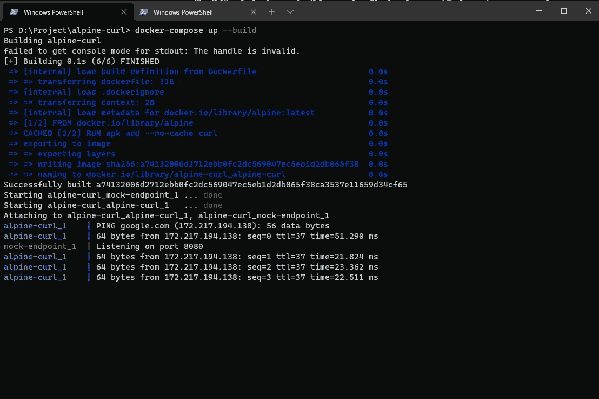

使用`docker-compose up`命令，Docker 将解析`docker-compose.yml`并在文件中创建已定义图像的容器。

为了证明两个容器可以相互通信，我们可以打开一个新的终端，并通过运行命令`docker exec -it alpine-curl_alpine-curl_1 /bin/sh`进入`alpine-curl`容器。在容器内部，尝试使用 curl 命令(`curl -XGET mock_endpoint:8080`，您应该会得到一个`{"message": true}`响应。您可以调用`mock_endpoint`的原因是 Docker 自动将服务名称解析为它的私有 IP。

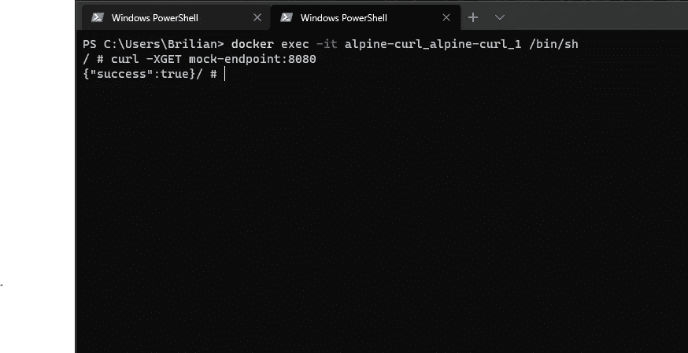

# 结论

Docker 对于软件开发人员和开发者来说都是一个非常重要的组件。这是使用容器时事实上的标准，与不使用容器相比，它有很多优点。

在本文中，我们了解了 Docker，但是接下来呢？我们可以学习如何在实际的开发项目中使用它，还可以学习 Kubernetes，一个 Docker/容器管理系统。

最后，我想说谢谢你一直看完这篇文章！我希望你喜欢它，并从中有所收获！

# 参考

*   [码头工人](https://docker.com)
*   Docker 和 Kubernetes:Udemy 的完整指南
*   [终极 Docker 备忘单](https://dockerlabs.collabnix.com/docker/cheatsheet/)
*   [Docker in Action，第二版](https://learning.oreilly.com/library/view/docker-in-action/9781617294761/)
*   [容器化与虚拟化:有何区别？](https://www.burwood.com/blog-archive/containerization-vs-virtualization#:~:text=Virtualization%20enables%20you%20to%20run,single%20virtual%20machine%20or%20server.)

*先前发表于*[*codecurated.com*](https://codecurated.com/blog/get-started-with-docker/)*。*