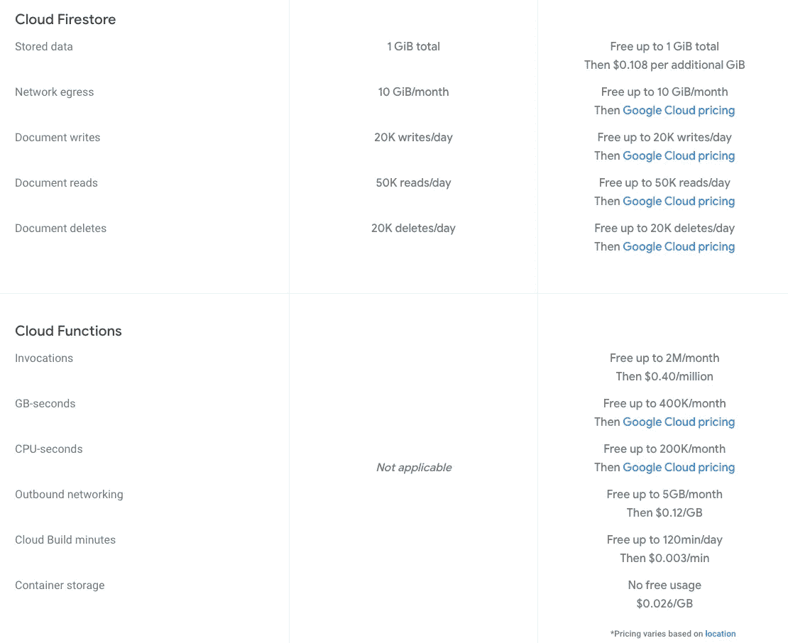
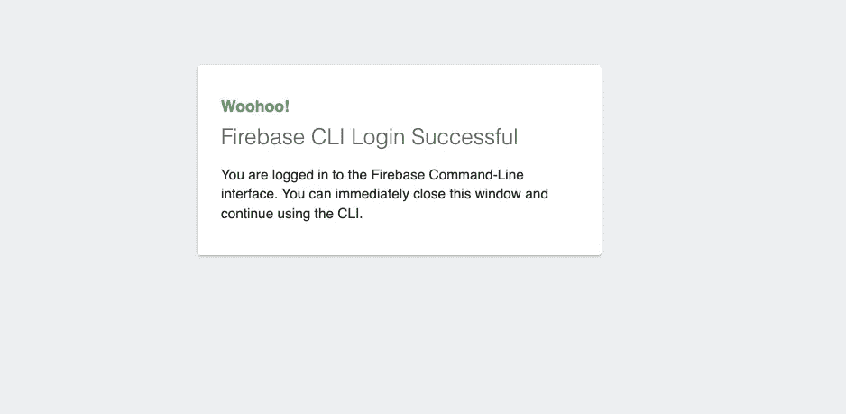
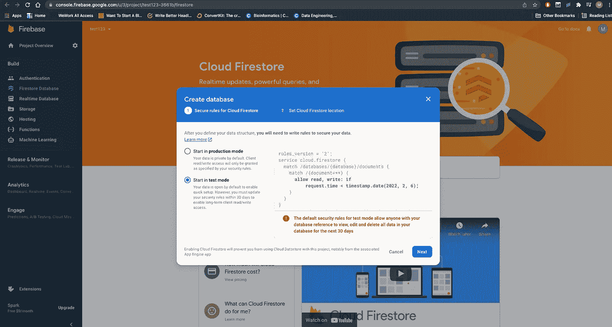
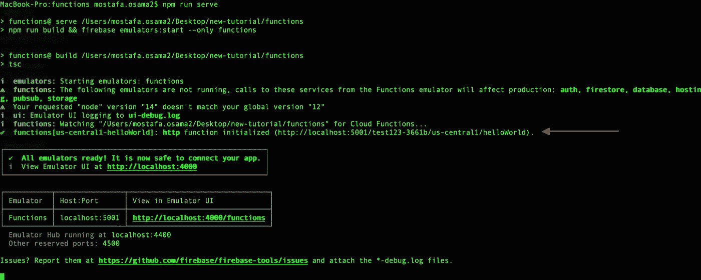
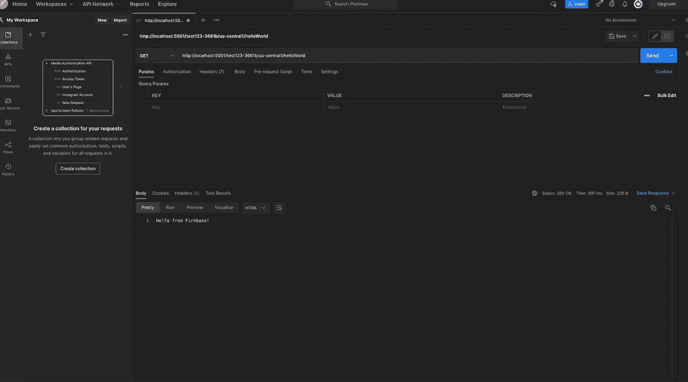
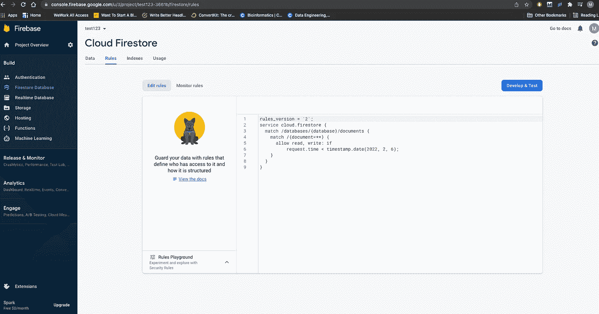

# Firebase 云功能和 Firestore 与 TypeScript 入门

> 原文：<https://betterprogramming.pub/getting-started-with-firebase-cloud-functions-and-firestore-with-typescript-95f810073ef7>

## 设置 Firebase 云功能，使用 TypeScript 进行 Firestore，并了解 Firestore 层次结构


汤姆·温克尔斯在 [Unsplash](https://unsplash.com?utm_source=medium&utm_medium=referral) 上的照片

由于多种原因，无服务器云功能已经变得相当流行。 [Firebase cloud functions](https://firebase.google.com/docs/functions) 是谷歌提供的一项服务(建立在谷歌云平台之上)，提供托管和一个利用无服务器云功能的库。当然，他们提供的远不止这些，例如，你可以通过云功能轻松使用 [Firestore](https://firebase.google.com/docs/firestore) ，这是一个 NoSQL 数据库。

我最近在一家我曾担任技术主管的加密初创公司中使用过 Firebase 和 Firestore，它的易用性、提供的功能数量以及[的便宜程度都给我留下了深刻的印象。](https://firebase.google.com/pricing)



来源: [Firebase 定价](https://firebase.google.com/pricing)

事不宜迟，我们开始吧。

# 1.设置

第一步是前往 [Firebase 控制台](https://console.firebase.google.com/u/3/?pli=1)并创建一个项目。为此，你需要一个谷歌账户，firebase 项目实际上是一个 GCP(谷歌云平台)项目。

下一步是在全球范围内安装他们的 NPM 软件包，这将帮助我们运行云功能和更多功能。注意，这是一个 TypeScript 教程，你可以用 Javascript 来完成。但是，也要注意，他们目前不支持 Python！

```
npm install -g firebase-tools
```

另外，请注意，您可能需要管理员权限才能全局安装此软件。下一步是使用创建项目时使用的 google 帐户来验证刚刚安装的 CLI。

只需运行:

```
firebase login
```

这将打开一个新的谷歌浏览器窗口，您只需登录。您应该会看到类似这样的内容:



来源:作者

下一步是为您的项目创建一个新目录，通过 CLI 导航到该目录并运行:

```
firebase init functions
```

选择“使用现有项目”，选择您刚刚创建的项目并继续。之后，你应该有一个项目用下面的指令初始化(来源: [Firebase docs](https://firebase.google.com/docs/functions/get-started)

```
myproject
 +- .firebaserc    # Hidden file that helps you quickly switch between
 |                 # projects with `firebase use`
 |
 +- firebase.json  # Describes properties for your project
 |
 +- functions/     # Directory containing all your functions code
      |
      +- .eslintrc.json  # Optional file containing rules for JavaScript linting.
      |
      +- package.json  # npm package file describing your Cloud Functions code
      |
      +- index.js      # main source file for your Cloud Functions code
      |
      +- node_modules/ # directory where your dependencies (declared in
                       # package.json) are installed
```

既然我们已经设置了我们的云功能，让我们也设置我们的 NoSQL 数据库，Firestore。第一步是转到[控制台](https://console.firebase.google.com/)，转到 cloud Firestore 并在测试模式下创建一个(目前)。注意，这个以后不能改了！



作者截屏

现在转到项目目录，简单地运行

```
firebase init firestore
```

这将把所有必需的文件添加到您的项目中。

# 2.运转

现在你已经安装好了所有的东西，让我们开始运行并确保它们正常工作吧！

导航到项目目录，然后导航到`functions`目录。在那里，你会发现一个`index.ts`，它将是最重要的文件之一。

这是决定我们将要运行的云功能的根文件。此时，您应该看到一个`helloWorld`函数被注释掉了，只需取消注释，转到您的 CLI，运行:

```
npm run serve
```

这将把 TypeScript 构建到 JS(可以在 functions/lib 下找到)中，并将启动云函数服务器。你可能已经注意到在`package.json`T4 有一面`— only functions`国旗。这意味着我们只想运行 firebase 云功能，而不是 Firestore 模拟器。

现在是有趣的部分！如果您成功运行了云功能，您应该会在 CLI 上看到它的名称:



来源:作者

这个红色箭头指向我们想要调用的端点。它只是一个运行在 localhost 端口 5001 上的服务器，URL 中有项目 ID、区域和云函数名称。

下一步是打开 [Postman](https://www.postman.com/) (或者您选择的任何 HTTP 请求客户机)并向这个端点发送一个请求。

发送一个简单的 GET 请求应该会得到如下结果:



来源:作者

# 3.Firestore

现在我们知道我们的云功能工作正常，我们可以开始集成数据库(Firestore)连接。停止你的服务器运行，让我们添加一些代码。

转到 index.ts .并添加到顶部:

```
import * as admin from "firebase-admin";admin.initializeApp();
```

这将根据我们之前进行的身份验证和 CLI 中配置的默认项目，自动创建到正确的 firebase 项目的连接。

下一步将是稍微改变我们的`helloWorld`云功能。

我们想写一些东西到 Firestore，这将是异步的(与任何数据库写入)。

所以只需在内部箭头函数中添加`async`关键字。然后我们想使用我们刚刚导入的管理模块向一个集合添加一条测试消息，我们现在称之为`test`(我将很快解释什么是集合)。

```
export const helloWorld = functions.https.onRequest(async (request, response) => {functions.logger.info("Hello logs!", {structuredData: true});admin.firestore().collection('test').add({testMessage: "some message"});response.send("Hello from Firebase!");});
```

现在只需保存您的`index.ts`并在 CLI 上再次运行 npm `run serve`。

请注意，如果您只是让服务器从上次开始运行并保存它，它不会加载新的更改，因为它需要将新的 TypeScript 代码重新编译成 JavaScript 代码。我们稍后将通过热重装来解决这个问题。

现在向 Postman 上的`helloWorld`端点发送另一个请求，并转到 firebase 项目控制台。单击左侧面板上的“Build ”,然后单击“Firestore Database ”,您应该会发现之前执行的云功能创建了一个新的集合`test`(如上所述),其中包含一个包含上述指定字段的文档。

请注意，由于我们没有指定文档名称，Firestore 只是添加了一个随机 ID 作为名称。


# 让我们来谈谈 Firestore 的等级制度

Firestore 是一个非关系数据库。从根本上来说，它包括所谓的“集合”，你可以把每个集合看作关系数据库中的一个表，或者基本上是一个独立的实体。例如，您可以在一个电子商务应用程序中拥有“用户”、“购买”和“项目”集合。

每个集合由一组文档组成，其中每个文档代表该集合的一个实例。并且每个文档包含特定字段组的条目。每个字段可以有[多个常规数据类型](https://firebase.google.com/docs/firestore/manage-data/data-types)。

你可能已经注意到“开始收集”按钮在左右面板上出现了两次(在上面的截图中)。这是因为 Firestore 允许集合具有“子集合”,这意味着文档中的条目可以是它自己的集合。解释他们为什么以这种方式组织，何时拥有子集合是一个相当广泛的话题，超出了这个简单教程的范围。简而言之，这取决于您的数据建模、用户的读写访问模式等等。

默认情况下，Firestore 不强制执行特定的模式，这意味着您可以向文档中添加任何字段，只要它是受支持的数据类型。然而，他们确实提供了" [firestore 规则](https://firebase.google.com/docs/firestore/security/get-started)"，允许你编写自定义的策略来规定如何访问数据库。

例如，对于一个测试项目，这是一个非常简单的默认规则。它说对于任何文档，只要请求发生在 2 月 6 日(也就是 30 天后)之前，读或写请求都是允许的。您可以添加更多的安全性规则或实施特定的模式(这将是另一天的主题)，或者您可以简单地使用外部库来完成这些，比如 [Joi](https://www.npmjs.com/package/joi) 。



这是一个关于 firebase 云功能和 firestore 入门的非常基础的教程，它们有如此多的功能！