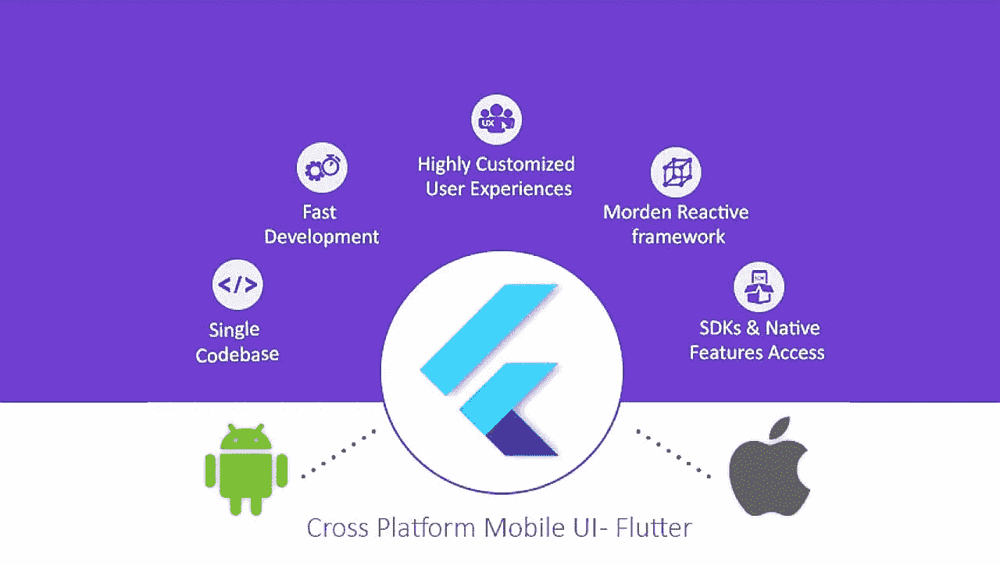
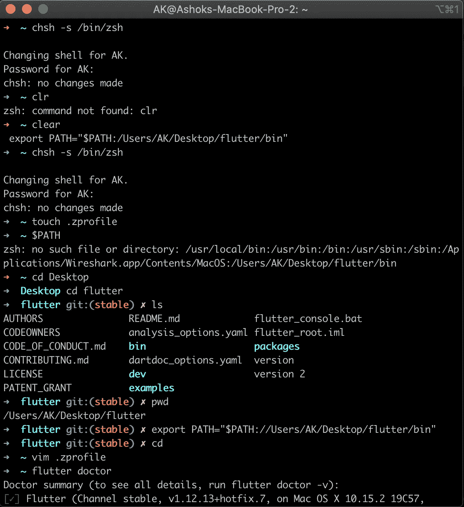
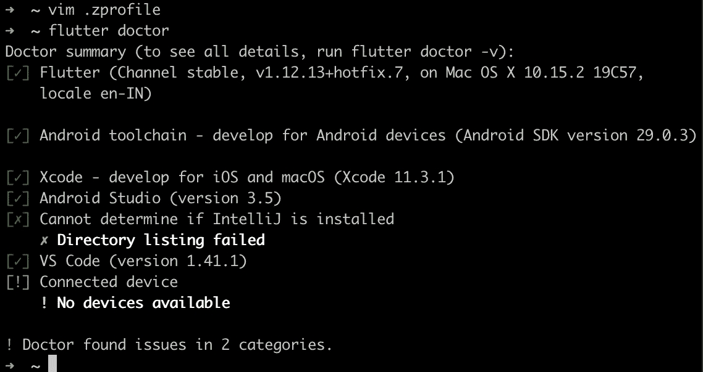
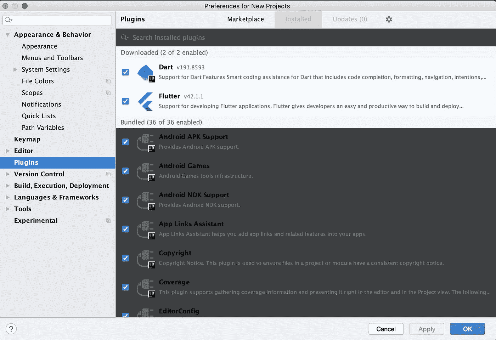
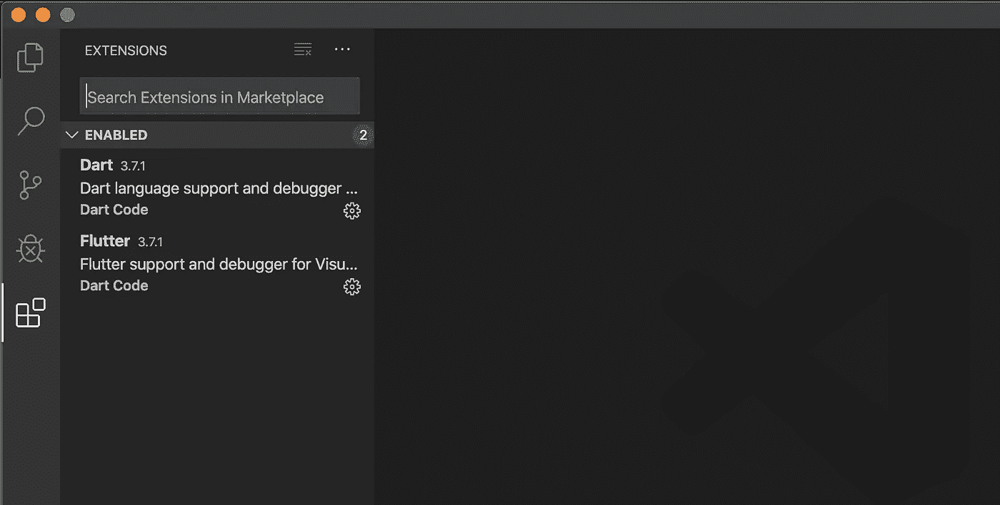

# 颤振入门:安装指南

> 原文：<https://betterprogramming.pub/getting-started-with-flutter-an-installation-guide-5678616f8d76>

## 为你的第一个跨平台应用程序构建一个 Hello World



[Flutter](https://flutter.dev/) 是一款移动 SDK，旨在使用单一代码库为 iOS 和 Android 设计高性能和高保真的移动应用。

从技术上来说，Flutter 是 Google 创建的开源 UI 软件开发工具包。它用于开发 Android、iOS、web 等应用程序。Flutter 应用程序可以用 Dart 编程语言编写。

Dart 是一种客户端优化语言，适用于任何平台上的快速应用程序。它针对 UI 进行了优化，在所有平台上都很快，并且包括生产性开发。

Dart 与许多其他语言共享特性，如 Kotlin 和 Swift。它可以很容易地转换成 JavaScript 代码。由于 Flutter 支持反应式和声明式编程风格，它类似于 React Native。在 Flutter 中不需要使用网桥来提高整体性能和启动时间。

通过使用 Dart，它将自动实现提前编译(AOT)。

# 入门指南

首先，[下载 Flutter SDK](https://storage.googleapis.com/flutter_infra/releases/stable/macos/flutter_macos_v1.12.13+hotfix.7-stable.zip) ，在`.zprofile`上设置路径。

开始了。只需遵循终端中的命令。



在我的例子中，我已经安装了 Xcode、Android Studio 和 Visual Studio 代码。

所以当你在输入" *flutter doctor，*"后点击“回车”，它会显示:



如果您尚未安装 Xcode、Android Studio 和 Visual Studio 代码，请按照以下步骤操作。

**第一步**

从 App Store 安装 Xcode。就是这样。

**第二步**

[下载 Android Studio](https://developer.android.com/studio) 并安装 Flutter 和 Dart 插件。

要安装这些:

1.  启动 Android Studio。
2.  打开插件偏好设置(macOS 上的偏好设置>插件，Windows 和 Linux 上的文件>设置>插件)。
3.  选择 Marketplace，选择 Flutter 和 Dart 插件，然后单击 Install。
4.  当提示安装 Dart 插件并重新启动时，单击是。



然后，您必须为 Android Studio 和 Android SDK 配置路径。开放终端:

```
flutter config --android-studio-dir /Applications/Android\Studio.app
flutter config --android-sdk ~/Library/Android/sdk
```

都是为安卓做的。

**第三步**

[安装 Visual Studio 代码](https://code.visualstudio.com)并安装 Flutter 和 Dart 插件。

1.  启动 VS 代码并调用视图>命令面板。
2.  键入“安装”并选择扩展:安装扩展。
3.  在扩展搜索字段中键入“flutter ”,从列表中选择 Flutter，然后单击 Install。这也将安装所需的 Dart 插件。



一切就绪。现在去终端输入"*颤振医生*"


对于连接的设备，你必须通过 USB 线连接一个物理设备(iOS/Android)，并在 Android 中启用开发者选项。或者你可以使用模拟器。

让我们在下一篇文章中讨论基本的颤振命令。干杯！