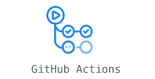
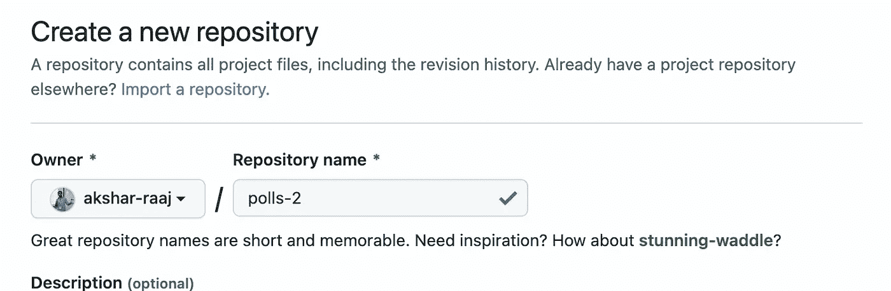
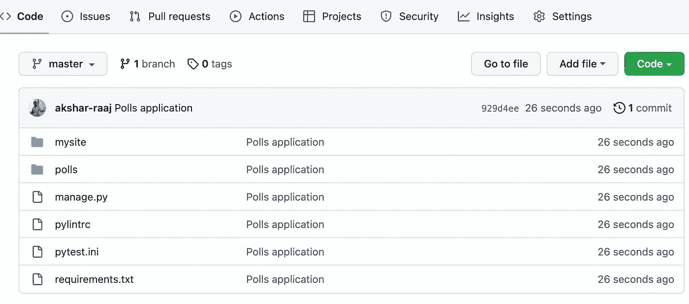
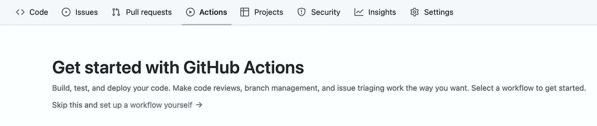
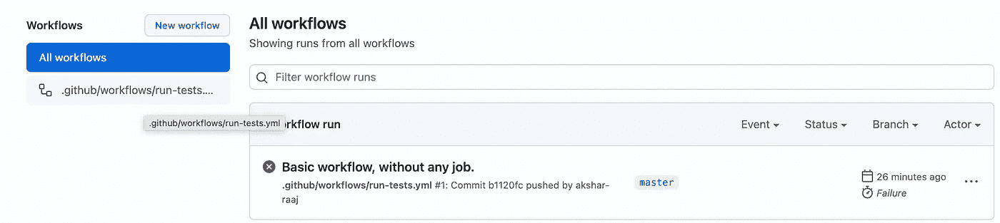
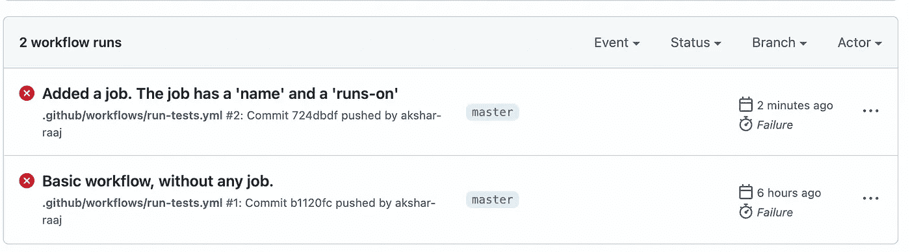
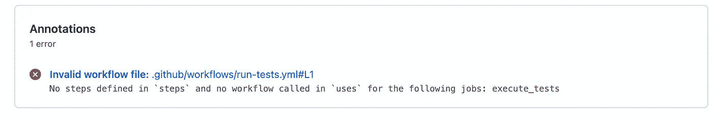
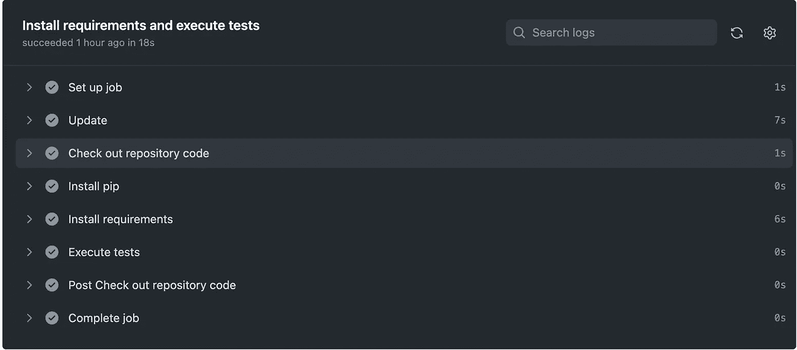
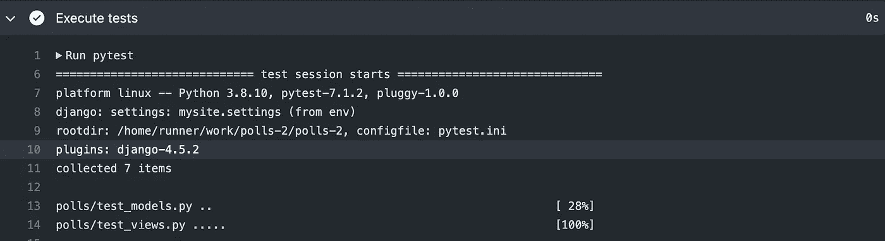

# 使用 Github 操作为 Django 项目设置 CI/CD

> 原文：<https://betterprogramming.pub/getting-started-with-github-actions-802838a09f4d>

## 使用 Github 动作触发 Django 项目的测试



Github 操作

# 议程

在这篇文章中，我们的目标是学习和设置 Github 动作。

我们将使用 Django 应用程序，并将设置 Github Actions 工作流来运行该应用程序的测试。测试将在每次推送 Github 时执行。

在[的后续文章](https://medium.com/@raaj.akshar/continuous-deployment-using-github-actions-37a7f5d7cb26)中，我们将增强工作流，在每次合并到 branch master 时将代码部署到 EC2 实例。

# 设置

让我们使用 Django polls 应用程序。我们在[这里](https://github.com/akshar-raaj/polls)构建了这个应用程序。

我们还为此应用设置了 ***pytest*** 。 ***pytest*** 是运行该应用程序测试的测试框架。

克隆此应用程序并安装需求。作为最佳实践，你应该使用虚拟环境。

导航到临时目录。

```
$ cd /tmp
```

激活相关的 Python 版本，这里假设你使用的是 ***pyenv*** 。随意使用 ***virtualenv*** 或 ***virtualenv-wrapper。***

```
$ pyenv shell 3.10.4
```

创建虚拟环境

```
$ pyenv virtualenv learn-gh-actions
```

激活创建的虚拟环境

```
$ pyenv activate learn-gh-actions
```

克隆 ***投票*** 应用程序。

```
$ git clone [git@github.com](mailto:git@github.com):akshar-raaj/polls.git
```

导航到项目文件夹

```
$ cd polls
```

结帐到相关的标签。我们在这个项目中创建了一个标签 ***v1.0*** 。签出此标签。

```
$ git checkout v1.0$ pip install -r requirements.txt
```

一旦安装了需求，尝试使用命令 ***pytest*** 调用测试。

你会看到一个抱怨***DJANGO _ SETTINGS _ MODULE***的错误。该错误类似于:

```
django.core.exceptions.ImproperlyConfigured: Requested setting INSTALLED_APPS, but settings are not configured. You must either define the environment variable DJANGO_SETTINGS_MODULE or call settings.configure() before accessing settings.
```

导出 django 设置模块

```
$ export DJANGO_SETTINGS_MODULE=mysite.settings
```

通过发出 ***pytest*** 命令再次调用测试。

```
$ pytest
```

测试应该已经运行，并且所有测试都应该已经通过。您应该会看到类似于以下内容的输出:

```
============================================================= test session starts =============================================================
    platform darwin -- Python 3.10.4, pytest-7.1.2, pluggy-1.0.0
    django: settings: mysite.settings (from env)
    rootdir: /private/tmp/polls, configfile: pytest.ini
    plugins: django-4.5.2
    collected 7 itemspolls/test_models.py ..                                                                                                                 [ 28%]
    polls/test_views.py ..                                                                                                                 [ 100%]======================================================== 7 passed, 4 warnings in 0.40s ========================================================
```

# Github 操作

Github 动作允许我们在项目中做一些很酷的事情。它可以用作 CI/CD。

Github Actions 的一个主要优点是，您可以将 CI/CD 包含在 Github 中。因此，您的 CI/CD 设置就在您的代码旁边。
***构建>测试>部署*** 循环包含在 Github 中。不需要单独的 CircleCI 设置或 Jenkins 设置。

使用 Github 术语中的 ***工作流*** 来管理 Github 动作。在 ***事件*** 上触发一个工作流。 ***git 推送*** 到 Github 可以认为是一个事件。类似地，拉请求的合并可以被认为是一个事件。

一个 ***工作流*** 由多个 ***作业*** 组成。每个 ***作业*** 由一个或多个 ***步骤*** 组成。

一个**步* *本质上是一个命令。在我们的 Github 工作流程中，一个步骤是**pytest**。类似地，一个步骤可以简单到调用**ls**或**curl**。

一个 ***步骤*** 也可以调用一个 Github 动作。Github 动作可以被认为是一些复杂的脚本，可以完成一项重要的任务。如果我们需要获取一些依赖来构建我们的项目，这不能用 ls 或 curl 这样简单的命令来完成，因此简单的步骤是不够的。对于这种情况，可以编写一些脚本来实现这一点。这些脚本被称为 Github 操作。我们将很快看到 aGithub 的行动；)

## 设置 Github 存储库

我们将在您克隆的存储库上添加一个 GH 操作工作流。

为了说明它的工作，我们需要将这些代码推送到您自己的存储库中。因此，我们将把这个克隆的存储库设置为您拥有的新存储库。

拆下**和*。git*** 文件夹。

```
$ rm -rf .git
```

验证它现在没有作为 Git 存储库被跟踪。

```
$ git status
```

您会注意到以下输出:

```
fatal: not a git repository (or any of the parent directories): .git
```

将此项目初始化为 git 存储库。

```
$ git init
```

您应该会看到以下输出

```
Initialized empty Git repository in /private/tmp/polls/.git
```

您需要在 Github 上创建一个新的存储库，在这里您可以推送您的本地更改并配置 Github 操作。



一旦创建了这个新的存储库，您可以将它添加为这个项目的 ***origin*** ，并将本地更改推送到这个 GH 存储库。

```
$ git remote add origin [git@github.com](mailto:git@github.com):akshar-raaj/polls-2.git
$ git add *
$ git commit -m "Polls application"
$ git push --set-upstream origin master
```

如果您的 GH 用户名是*约翰*，并且您已经将您的存储库命名为 *django-polls* ，那么远程 url 将看起来像[*git@github.com*](mailto:git@github.com)*:约翰/django-polls.git*

刷新 GH 上的存储库页面。你应该在 GH 上看到你的代码。



导航到 ***动作*** 选项卡。它应该在顶部可见，就在 ***拉动请求*** 的旁边。

页面上会说***GitHub 操作入门*** 。这是因为你还没有为项目定义任何 GH 工作流。



接下来让我们定义一个工作流。

## 添加工作流

工作流在中定义。github/workflows 目录。

```
$ mkdir -p .github/workflows
```

工作流是在 yaml 文件中定义的。为相同的创建一个. yml 文件。姑且称之为 *run-tests.yml.*

```
$ touch .github/workflows/run-tests.yml
```

一个工作流需要以下三个关键点:

*   名字
*   在
*   工作

***名称*** 用于为工作流指定一个名称。 上的
***用于指定该工作流应该触发的动作。***

让我们将以下内容添加到 *run-tests.yml* 中。

```
name: Run tests
on: push
```

让我们添加并提交此更改。

```
$ git add .github/$ git commit -m "Basic workflow, without any job."
```

将更改推送到 Github

```
$ git push
```

我们已经定义了我们的第一个工作流程。我们还将代码推送到 GH，因为工作流描述工作流应该在 **推**时 ***触发，因此工作流应该已经被触发。***

导航到*动作*，您会注意到工作流的一次运行。



导航到本次*运行*的详细页面。您会注意到*状态*为*故障*。您应该会注意到类似这样的内容:

```
Error: .github#L1
No jobs defined in `jobs`
```

## 添加作业

因此，GH 抱怨存在错误，因为没有定义作业。这表明*作业*是工作流中的必需键。

让我们修改工作流 yaml 文件来添加一个作业。以下内容应添加到 *run-tests.yml* 中。

```
jobs:
  execute_tests:
    name: Install requirements and execute tests
    runs-on: ubuntu-latest
```

因此，我们添加了一个 *jobs* 键。我们提供了一个 job_id，即 *execute_tests* 。这不是一个关键字，所以你可以给它起其他名字，比如说 *trigger_tests* 。job_id 的值是作业配置的映射。

这张地图有以下两个键:
-名称
-运行

*名称*用于提供作业的描述性名称。*run-on*用于指定转轮。runner 是指应该在其中执行该作业的安装。

我们希望我们的工作在 ubuntu 机器上执行。因此，我们将*的运行值*指定为 *ubuntu-latest* 。

让我们提交代码并推送到 GH。

```
$ git add .github/workflows/run-tests.yml
$ git commit -m "Added a job. The job has a 'name' and a 'runs-on'"
$ git push
```

导航到 Github 操作页面。您将会注意到，工作流将会再运行一次。这也会失败。



导航到本次跑步的详细信息页面。您会注意到*状态*为*故障*



如该错误所示，我们需要为添加的作业添加一个*步骤*。

## 添加步骤

让我们增加以下内容:

```
steps:
  - name: Update
    run: sudo apt update
```

此时 *run-tests.yml* 应该如下所示:

```
name: Run tests
on: push
jobs:
  execute_tests:
    name: Install requirements and execute tests
    runs-on: ubuntu-latest
    steps:
      - name: Update
        run: sudo apt update
```

让我们承诺并推动 GH。

```
$ git add .github/workflows/run-tests.yml
$ git commit -m "Added a job. The job has a 'name' and a 'runs-on'"
$ git push
```

导航到 Github 操作页面。您会注意到工作流的另一次运行已经被触发。这一切都会过去的。


## 执行测试的步骤

我们成功添加了一个有效的工作流，该工作流已成功执行。我们看到了作业和步骤在工作流文件中是如何强制的，并且熟悉了作业和步骤下的不同键。

是时候添加一个可以执行测试的步骤了。

工作流作业总是在转轮上运行。流道由*run-on*指定。在我们的例子中，我们的作业运行在 ubuntu 安装上。每一个任务运行都提供一个全新的安装，因此这个运行者或机器对我们的代码库没有任何概念。
因此，我们需要将我们的代码库放在 runner 上，这样就可以对它采取进一步的措施。

提取代码库将涉及多个命令。一些命令是:
-在机器上安装 git。
——创建一个公钥-私钥对，并将密钥添加到 github 上。
-从该机器执行“git 克隆”。

这个过程涉及多个命令。这就是 Github actions 发挥作用的地方。动作是由脚本文件组成的一组命令。我们不必在工作流文件中单独指定所有这些命令，我们只需使用一个 GH 动作就可以完成想要的事情。

Github 提供的动作可以在[https://github.com/actions/](https://github.com/actions/)查看。

我们对一个动作特别感兴趣，这个动作可以在 runner 机器上提取和检验我们的代码。相关动作在[https://github.com/actions/checkout](https://github.com/actions/checkout)进行。

让我们添加一个步骤，在 runner 机器上提取并检查我们的代码。它看起来会像

```
- name: Check out repository code
  uses: actions/checkout@v3
```

你会注意到在这一步我们没有使用*运行*，而是使用了*使用*。如果我们想在一个步骤中使用 GH 动作，那么必须使用键*使用*。如果我们想在一个步骤中运行一个命令，那么应该使用键 *run* 。

现在我们应该在 *run-tests.yml* 中有两个步骤。完整的文件应该如下所示:

```
name: Run tests
on: push
jobs:
  execute_tests:
    name: Install requirements and execute tests
    runs-on: ubuntu-latest
    steps:
      - name: Update
        run: sudo apt update
      - name: Check out repository code
        uses: actions/checkout@v3
```

让我们承诺和推动。

```
$ git add .github/workflows/run-tests.yml
$ git commit -m "Added a step which uses a Github action using key 'uses' instead of 'run'. This action will pull and checkout the code on runner."
$ git push
```

导航到 Github 操作页面。您会注意到，工作流将会再运行一次。这一切都会过去的。

一旦代码被签出，我们需要安装需求并运行测试。我们来补充一下相关步骤。

```
- name: Install pip
  run: sudo apt install python3-pip
- name: Install requirements
  run: pip install -r requirements.txt
- name: Execute tests
  env:
    DJANGO_SETTINGS_MODULE: mysite.settings
  run: pytest
```

我们添加了以下三个步骤。
-在转轮机上安装 pip 的步骤。
-使用 pip 安装需求。
-使用 **pytest** 执行测试。

Key *env* 允许我们为任何特定的步骤设置环境变量。在执行 *pytest* 之前，我们需要环境变量 *DJANGO_SETTINGS_MODULE* 。我们能够使用键 *env* 来设置它。

让我们承诺和推动。

```
$ git add .github/workflows/run-tests.yml
$ git commit -m " Added three steps corresponding to installing pip, installing requirements and executing tests"
$ git push
```

导航到 Github 操作页面。您会注意到，工作流将会再运行一次。这一切都会过去的。

导航到本次运行的详细信息页面，您会注意到所有步骤都已执行。



在详细页面上展开步骤*执行测试*。您会注意到 *pytest* 已经被调用，所有的测试都已经被执行。



因此，我们能够设置一个 Github 动作工作流，它在每次推送 Github 时被触发。

完整的项目可以在这里看到[。](https://github.com/akshar-raaj/polls-2)