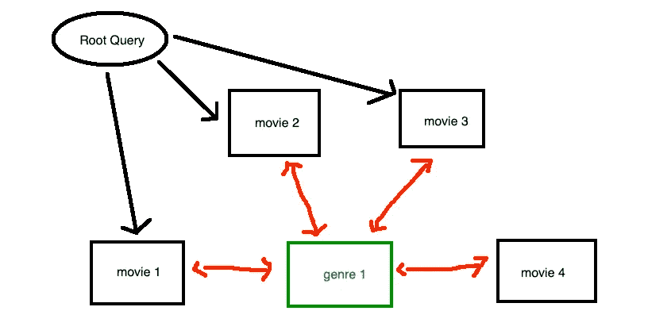
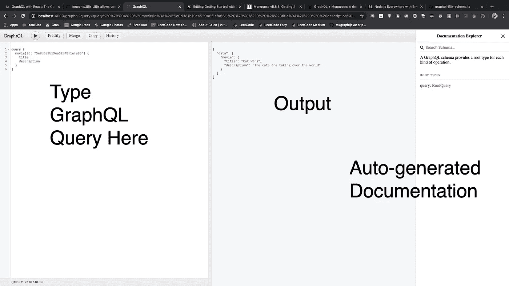
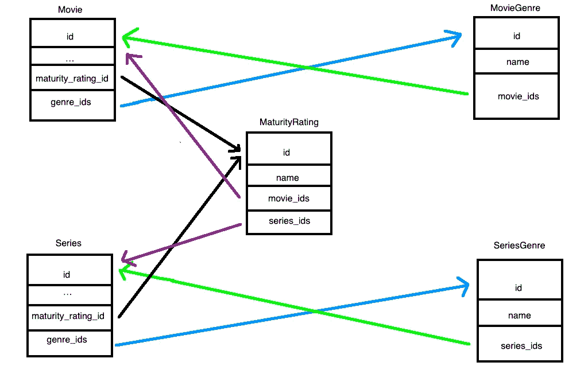

# GraphQL 入门(第 2 部分)

> 原文：<https://betterprogramming.pub/getting-started-with-graphql-5cd8e7c66909>

## 后端


查尔斯在 [Unsplash](https://unsplash.com/s/photos/netflix?utm_source=unsplash&utm_medium=referral&utm_content=creditCopyText) 上的照片

*这是 GraphQL 入门系列的第 2 部分。我们将使用 GraphQL 构建一个网飞克隆。可以在这里* *查看试玩 app* [*。源代码可在*](https://jflix.herokuapp.com/#/) [*这里*](https://github.com/ioneone/Jflix) *。你也可以在这里* *玩玩 demo app 的 graphiql* [*。*](https://jflix.herokuapp.com/graphql)

## 索引

*   [第 1 部分:简介](https://medium.com/@ionejunhong/getting-started-with-graphql-a1cc7951ef39)
*   第 2 部分:后端(你在这里)
*   第三部分:前端
*   [第 4 部分:基本特征](https://medium.com/@ionejunhong/getting-started-with-graphql-a281b14a560d)
*   [第 5 部分:部署](https://medium.com/@ionejunhong/getting-started-with-graphql-77f03d611136)

访问 Github repo [这里](https://github.com/ioneone/Jflix)查看完整代码。我使用本教程作为参考:

[](https://www.udemy.com/course/graphql-with-react-course/) [## 带 React 的 GraphQL:完整的开发人员指南

### 如果你厌倦了绞尽脑汁试图找出使用哪种类型的后端服务器，这是一门课程…

www.udemy.com](https://www.udemy.com/course/graphql-with-react-course/) 

我们将通过构建一个允许用户观看他们喜欢的电影和电视剧的 web 应用程序来学习 GraphQL，特别是 GraphQL 的 JavaScript 实现。这有点像网飞的复制品。


这是我们想要建立的东西(顺便说一句，你是一部好电视剧)

在这一部分，我们将在后端工作。

# 引入节点

我们将使用 [NodeJS](https://nodejs.org/en/) 构建后端。Node 是一个允许我们在浏览器之外执行 JavaScript 代码的平台。npm 是 JavaScript 的一个包管理器。让我们用这个命令初始化我们的项目:

```
npm init
```

# Express 简介

我们将使用 [expressJS](https://expressjs.com/) 来帮助我们构建后端。Express 是 NodeJS 的 web 应用框架。这有助于我们轻松快速地构建后端。

```
npm install --save express
```

创建一个名为`backend/server.js`的文件，并插入以下代码:

现在您可以用这个命令运行服务器。

```
node backend/server.js
```

# 介绍巴别塔

我们将在我们的项目中安装巴别塔。Babel 是一个编译器，可以让你把 ECMAScript 编译成 CommonJS。NodeJS 需要用 CommonJS 标准编写的 JavaScript。我用 ES6 更舒服，所以我需要这个。我用[这个](https://medium.com/@pativancarrasco/why-your-es6-syntax-doesnt-work-in-node-js-and-how-to-fix-it-161f0708f1ad)作为安装的参考。

```
npm install --save-dev @babel/core @babel/cli @babel/preset-env @babel/node
```

现在创建一个名为`.babelrc`的文件，并插入下面的代码。

```
{
  "presets": [
    "@babel/preset-env"
  ]
}
```

这基本上告诉 Babel 我们想要使用最新的 JavaScript 语法。现在，您可以使用以下命令运行服务器:

```
babel-node backend/server.js
```

# Nodemon 简介

Nodemon 是一个实用程序，它监视我们项目文件的变化，并自动为我们重启服务器。

```
npm install --save-dev nodemon
```

现在，您可以使用以下命令运行服务器:

```
nodemon --exec babel-node backend/server.js
```

# TypeScript 简介

我是 TypeScript 的忠实粉丝，所以我们也将使用它。TypeScript 强制 JavaScript 的类型检查。原来巴贝尔也支持这一点。

```
npm install --save-dev @babel/preset-typescript
```

更新`.babelrc`如下:

```
{
  "presets": [
    "@babel/preset-env",
    "@babel/preset-typescript"
  ]
}
```

添加`.tsconfig.json`用于类型脚本配置:

现在，您可以使用以下命令运行服务器:

```
nodemon --exec babel-node backend/server.ts --extensions '.ts,.tsx'
```

# 带 Express 的 GraphQL

我们将使用 [graphql-express](https://github.com/graphql/express-graphql) 来集成 express 和 graphql。

```
npm install --save graphql-express
```

我们告诉 express 将所有 GraphQL 请求导航到`/graphql`端点。

现在我们需要明确地告诉 GraphQL 我们有什么数据类型，如何访问它们，以及它们之间的关系是什么。

## 设置模式

我们需要从 npm 安装`graphql`。这是 GraphQL 的 JavaScript 实现。

```
npm install --save graphql
```

首先，我们有`Movie`模型(我们稍后将创建这个模型)。现在，为了简单起见，假设它有`id`、`title`、`description`和`released_year`。

## 设置数据库

转到 mLab，为这个项目创建一个 mongoDB。我们可以使用免费版本。一旦创建，插入一个超级用户，然后复制 MongoDB URI。现在数据库创建好了，我们知道了它的位置，我们想建立一个到它的连接。我们将使用`mongoose`来帮助我们做到这一点。我借鉴了[这个](https://mongoosejs.com/docs/)。

```
npm install --save mongoose
```

现在我们实际上创建了`Movie`模型。我们还插入一部假电影，`Cat Wars`:

## 返回模式

好了，我们的数据库准备好了。在 GraphQL 的世界里，所有的数据只是一个节点。我们需要告诉 GraphQL 如何找到一个给定 ID 的`Movie`节点。这被称为**根查询**。这充当了数据的入口点。



最后，我们用刚刚定义的这个根查询创建 GraphQL 模式，并将其插入到`graphqlHTTP`配置中。

## 图形 ql

好了，我们已经完成了 GraphQL 的最小设置。让我们看看查询`movie()`是否真的有效。我们用`graphiql`来核对一下。GraphQL 是开发人员与 graph QL 服务器交互的用户界面。启动服务器并转到`/graphql`端点。你也可以点击这里查看 Jflix 的 GraphQL 服务器[来使用它！](https://jflix.herokuapp.com/graphql)



转到 mLab 控制台检查我们之前插入的假数据的 ID。然后在左侧面板中，我们可以如下调用`movie()`查询。

```
# input
query {
  movie(_id: "5e0d381b19ea52948f1efa86") {
    title
    description
  }
}# output
{
  "data": {
    "movie": {
      "title": "Cat Wars",
      "description": "The cats are taking over the world"
    }
  }
}
```

厉害！如您所见，由于 GraphQL，我们可以在请求中添加`released_year`或删除`description`，而无需更改后端代码。我们得到了我们想要的——不多也不少。

# 更多模式

我们现在将添加更多的东西到我们的模式中，使它更有趣。



*   每部电影都有成熟度分级和电影类型
*   每个系列都有成熟度等级和系列类型
*   每个成熟度等级都有许多电影和连续剧
*   每种电影类型都有许多电影
*   每个系列类型都有许多系列

这是上面模式的 mongoose 实现。我用[这个](http://learnmongodbthehardway.com/schema/schemabasics/)作为如何在 mongoDB 中做多对多关系的参考(和 MySQL 略有不同)。

现在，我们需要告诉 GraphQL 这些新模式的类型。

注意我们对`fields`使用了箭头函数。这允许我们引用`MovieType`中的`MaturityRatingType`。如 GraphQL [文档](https://graphql.org/graphql-js/type/)中所述:

> 当两个类型需要相互引用，或者一个类型需要在一个字段中引用自己时，您可以使用一个函数表达式(也称为闭包或 thunk)来提供这些字段。

## 更多根查询

我们还将添加更多的根查询，以便 GraphQL 可以从不同的位置遍历数据。

## 别名

```
# input
query {
  getAllMovies {
    ...
  },
  getMovieById(_id: ...) {
    ...
  }
}# output
{
  "data": {
    "getAllMovies": [
      ...
    ],
    "getMovieById": {
      ...
    }
  }
}
```

我们将查询的名称改为更具描述性的名称(`movie`现在是`getMovieById`，但是响应 JSON 看起来并不好。我们可以使用 alias 来修复它，如下所示:

```
# input
query {
  movies: getAllMovies {
    ...
  },
  movie: getMovieById(_id: ...) {
    ...
  }
}# output
{
  "data": {
    "movies": [
      ...
    ],
    "movie": {
      ...
    }
  }
}
```

有关别名的官方文档，请参见[本](https://graphql.org/learn/queries/#aliases)。

# 变化

在 GraphQL 中，GET 请求被称为**查询**。其他的一切(比如 POST、DELETE)都被称为**突变**(因为你是在突变数据库)。在上一节中，我们完成了用 GraphQL 设置所有 GET 请求。现在，我们希望能够使用 GraphQL 通过突变向数据库插入数据。

当我们添加电影或系列时，不要忘记将它的 id 添加到`MovieGenre/SeriesGenre`和`MaturityRating`型号中。一旦我们定义了我们的`Mutation`类型，让 GraphQL 知道它的存在。

# 测试看看是否一切正常

去 graphql 创建一些假数据:

```
# input
mutation {
  genre1: addMovieGenre(name:"Thriller") {
    _id
    name
  },
  genre2: addMovieGenre(name:"Adventures") {
    _id
    name
  },
  maturity_rating: addMaturityRating(name: "G") {
    _id,
    name
  }
}
```

记下响应中的`_id`字段。然后添加新电影。

```
# input
mutation {
  addMovie(
    title:"Cat Wars 2", 
    description: "Cats are taking over the universe", 
    released_year: 2020,
    maturity_rating_id: "5e0e40847db1059e2e896b96",
    genre_ids: [
      "5e0e404c7db1059e2e896b95",
      "5e0e40997db1059e2e896b97"
    ]
  ) {
    _id
    title
    maturity_rating {
      _id
      name
    }
    genres {
     _id
      name
    }
  }
}
```

您应该会看到这样的响应:

```
{
  "data": {
    "addMovie": {
      "_id": "5e0e41645dad6a9e7fd196e8",
      "title": "Cat Wars 2",
      "maturity_rating": {
        "_id": "5e0e40847db1059e2e896b96",
        "name": "G"
      },
      "genres": [
        {
          "_id": "5e0e404c7db1059e2e896b95",
          "name": "Thriller"
        },
        {
          "_id": "5e0e40997db1059e2e896b97",
          "name": "Adventures"
        }
      ]
    }
  }
}
```

太好了——看起来突变和查询都工作正常！