# GraphQL 入门— AWS AppSync、DynamoDB 和 Postman

> 原文：<https://betterprogramming.pub/getting-started-with-graphql-aws-appsync-dynamodb-and-postman-503828a65971>

## GraphQL APIs 的实践介绍


作者图片

GraphQL 是一种用于 API 的查询语言。但是这到底意味着什么，它是如何工作的？最简单地说，GraphQL 就是询问对象上的特定字段。在本文中，我们将采用实践的方法，使用 AppSync、DynamoDB 和 Postman 快速入门 GraphQL。我们开始吧！

## 先决条件

*   自动警报系统
*   邮递员

## 服务

*   **AppSync** 是 AWS 上的一个完全托管的服务，使得开发 GraphQL APIs 变得容易
*   **DynamoDB** 是 AWS 上一个快速灵活的 NoSQL 数据库服务
*   Postman 是一个 API 开发的协作平台

# AppSync

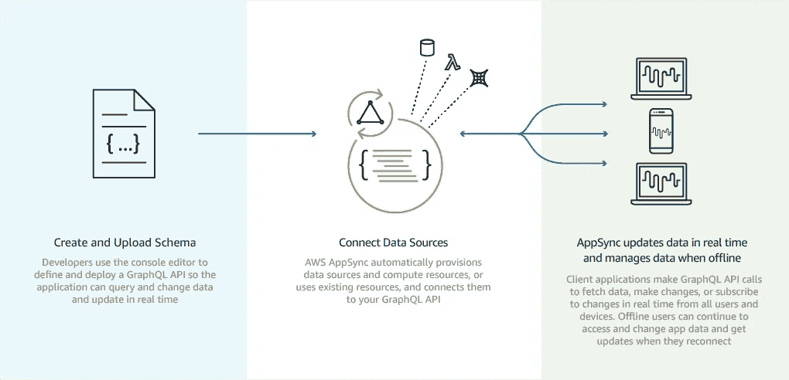

我们要做的第一件事是使用 AWS AppSync 设置我们的 GraphQL 服务器。幸运的是，这可以很快完成，因为 AWS 有一个样本模板，我们可以使用它来完成繁重的工作。要开始这样做，请访问 AWS AppSync 并遵循以下步骤:

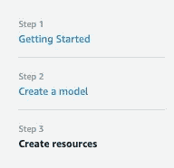

1.  [AppSync]单击创建 API
2.  【入门】点击**用向导创建**
3.  [创建模型]单击创建
4.  [创建资源]单击创建

就是这样！我们刚刚创建了第一个 GraphQL API *和与之相连的* DynamoDB。接下来我们要做的是运行一些查询来读写我们的表。以下是这些查询的图片:

## 问题

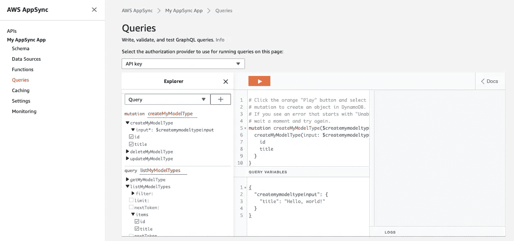

在 AppSync UI 中，单击左侧面板上的**查询** ，将进入查询屏幕。这是您可以编写、验证和测试 GraphQL 查询的地方。这里有几个不同的面板，为了更容易理解，让我们把它分成三个不同的部分。以下是这些部分的图像:

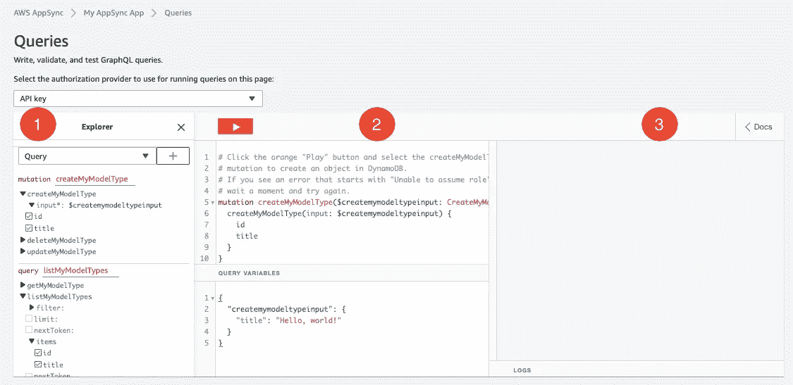

AWS AppSync 查询页面

1.  第一部分是查询浏览器。您可以在这里选择要使用的字段或属性。**变异**用 GraphQL 的术语来说就是修改数据或将数据写入数据源。**查询**用 GraphQL 的术语来说就是从数据源中取出数据或者读取。
2.  第二部分是查询浏览器的预览。尝试选中第一部分的一些框:你会看到预览随着你的选择而更新。这也是我们将在《邮差》中用到的。
3.  最后一部分是对您的请求的输出或响应。

## 变化

点击▶️播放按钮，它会打开一个下拉菜单。选择`*createMyModelType*`，您应该在第三部分看到一个响应，表明您成功地将一条记录插入到 DynamoDB 中。这是一张图片:

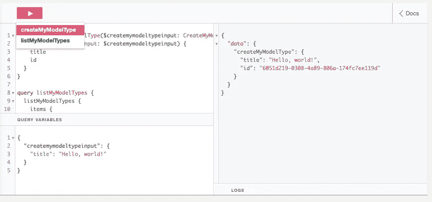

执行变异 *createMyModelType*

尝试更改变量，再次点击播放选择`*createMyModelType*`。您应该会在响应中看到您的新变量。这是一张图片:

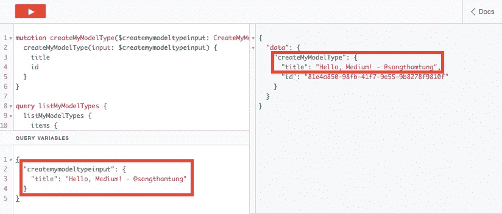

## 询问

太好了！既然我们已经写入了数据源，那么让我们试着从数据源中读取数据，以确保我们的记录确实在那里。为此，您将再次单击 play 按钮，但这次从下拉菜单`*listMyModelTypes*`中选择，您应该会看到一个显示我们刚刚创建的记录的响应。这是一张图片:

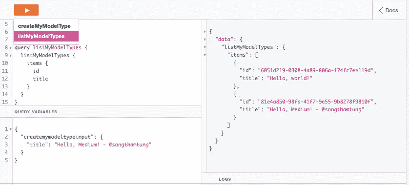

*执行查询 listMyModelTypes*

值得注意的是，从 play 下拉列表中进行选择实际上会触发预览部分中显示的查询。一起使用所有部分来开发和测试 GraphQL 查询。

# DynamoDB

让我们导航到 DynamoDB，验证我们在 GraphQL 中创建的记录确实存在于我们的表中。执行以下五个步骤:

1.  导航到 DynamoDB
2.  点击左侧面板上的**表格**
3.  单击您创建的表
4.  点击**项**
5.  确认记录在那里

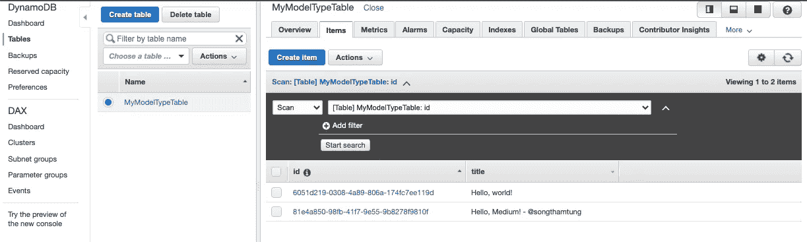

验证 DynamoDB 中的记录

# 邮递员

本文的最后一步是使用 Postman 向我们的 GraphQL 服务器发送读/写数据库的请求。我使用 Postman 的原因是，它是用于开发、测试和协作 API 的事实上的 GUI 工具。

此外，在 Postman 中发送 GraphQL 请求并不像看起来那么直观。因此，我在这一节专门讨论了使用**Content-Type***application/graph QL*和 *application/json* 的请求配置以及 API 调用的执行。

注意:对于每个请求，我都包含了一个 CURL 脚本，您可以导入和/或引用它。

## API URL 和 API 密钥

要获取调用我们的 GraphQL 服务器的配置，请返回 AWS AppSync 设置页面。从这里，我们将获取 API URL 和 API 密钥，以便在我们的 Postman 请求中使用。这是图片:

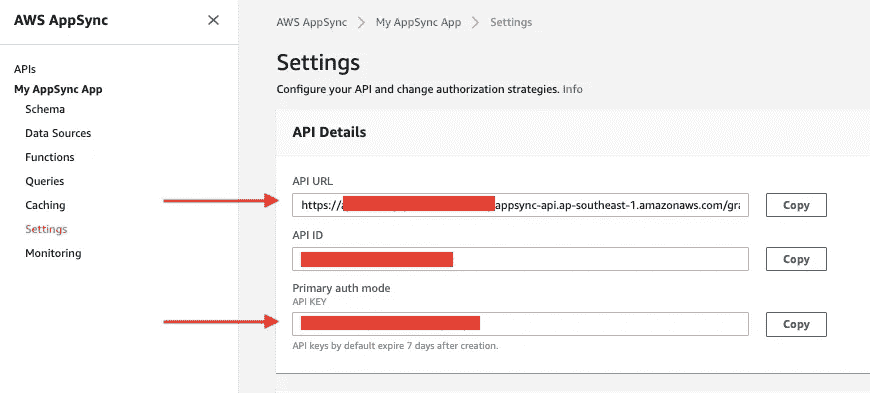

AWS AppSync 设置

## 配置

现在我们已经有了 API URL 和 API KEY，是时候在 Postman 中设置我们的请求了。为此，请回到 Postman 并遵循以下步骤:

1.  创建新请求
2.  确保类型为 POST
3.  在请求 URL 中输入 API URL
4.  在**标题**标签中输入`x-api-key` : `{{API KEY}}`

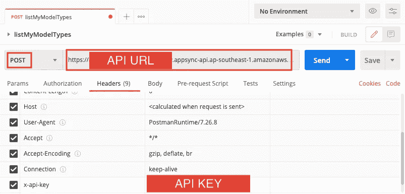

邮递员请求配置

## **内容类型:**应用程序/图表 ql

***读***

现在，我们将发出第一个使用 Postman 获取数据的 GraphQL 请求。为此，我们将使用 *Content-Type* 作为键，使用 *application/graphql* 作为值添加到我们的头中。

接下来，我们将前往 **Body** 选项卡并选择 GraphQL。这是一张图片:

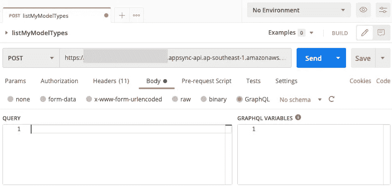

为了获得查询的内容，我们将返回 AppSync 查询页面，在预览部分复制`*listMyModelTypes*` 。这里有一张图片可供参考。代码在它下面:

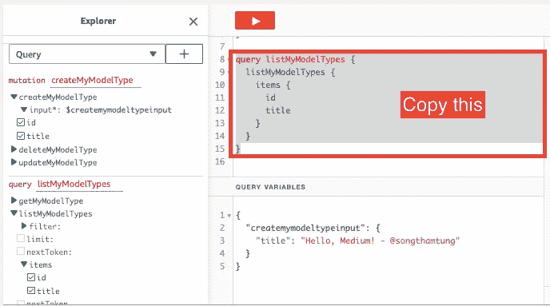

```
query listMyModelTypes {
  listMyModelTypes {
    items {
      id
      title
    }
  }
}
```

回到 Postman，粘贴到**主体**标签的查询部分，点击发送。下图将有所帮助:

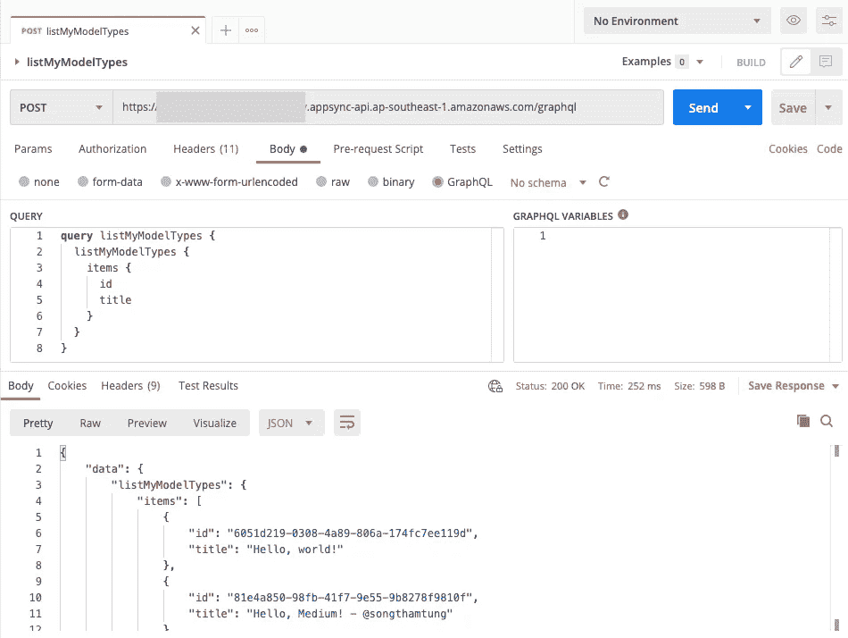

如果您做的一切都正确，那么您应该会看到一个来自 DynamoDb 的成功响应；该响应应该如下所示:

> curl-location-request POST ' API _ URL ' \
> -header ' x-API-KEY:API _ KEY ' \
> -header ' Content-Type:application/graph QL ' \
> -data-raw ' { " query ":" query listMyModelTypes { \ n listMyModelTypes { \ n items { \ n \ n title \ n } \ n } \ n }、" variables":{}} '

***写***

通过 Postman 写入数据库类似于读取，但有一些不同。我们首先返回 AppSync 查询页面，在预览部分复制`*createMyModelType*`。这里有一个图像可以帮助你，它的代码在下面:

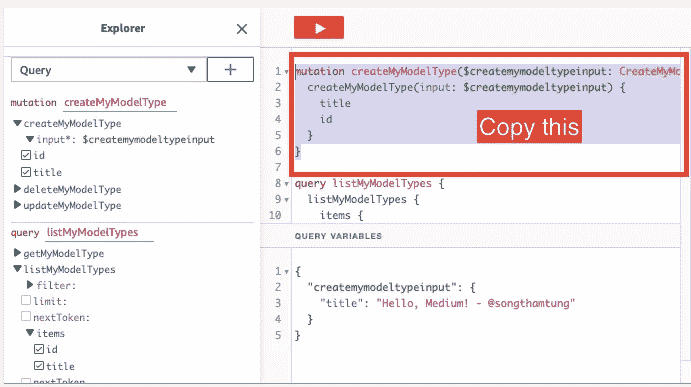

```
mutation createMyModelType($createmymodeltypeinput: CreateMyModelTypeInput!) {
  createMyModelType(input: $createmymodeltypeinput) {
    title
    id
  }
}
```

回到 Postman，粘贴到 **Body** 选项卡的查询部分，点击发送。如果您遵循了上面的步骤，那么您应该会看到一个带有错误消息的成功响应。下面是该错误消息的图像:

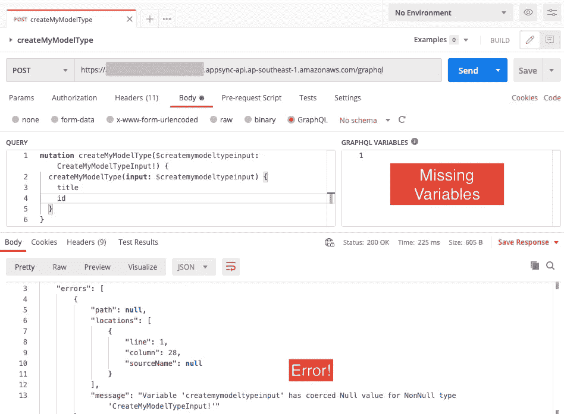

错误！缺少变量。

这是因为我们缺少 GraphQL 变量。要获取语法，请返回 AppSync 查询页面，在预览部分查询变量中复制`*createmymodeltypeinput*`。下图显示了该流程，其代码如下:

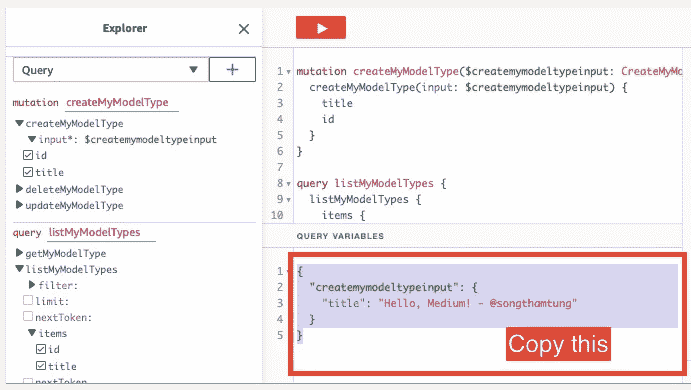

```
{
  "createmymodeltypeinput": {
    "title": "Hello, Medium! - [@songthamtung](http://twitter.com/songthamtung)"
  }
}
```

返回 Postman，将其粘贴到 **Body** 选项卡的 GraphQL 变量部分，然后单击 Send。这张图片将帮助您:

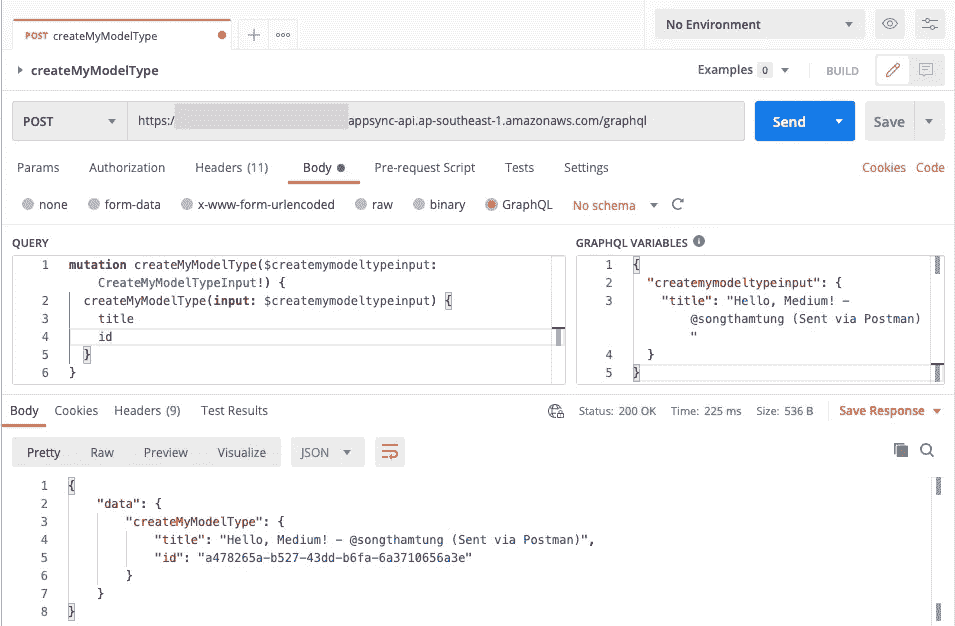

如果您做的一切都正确，那么您应该会看到一个成功的响应，从我们的变量中新建了一个项目。以下是消息:

> curl-location-request POST ' API _ URL ' \
> -header ' x-API-KEY:API _ KEY ' \
> -header ' Content-Type:application/graph QL ' \
> -data-raw ' { " query ":" mutation createMyModelType($ CreateMyModelTypeInput:CreateMyModelTypeInput！){ \ n createMyModelType(input:＄createmymodeltypeinput){ \ n title \ n id \ n } \ n }“，”变量“:{ " createmymodeltypeinput ":{ " title ":“您好，中！— @songthamtung(通过邮递员发送)" }} '

## 内容类型:应用程序/json

***读作***

这个部分用于在请求体中传递 JSON 数据。它建立在请求配置的基础上，但是使用*内容类型*作为键，使用*应用程序/json* 作为**标题**选项卡中的值。

这里需要注意的重要一点是语法，如下所示:

```
{"query": "{listMyModelType{items{id,title}}}"}
```

我们很大程度上采用了前面几节中的查询，并将其压缩成一行，作为键查询的值。将此粘贴到 Postman 中的 **Body** 选项卡，勾选“raw”，并在下拉列表中选择 JSON。

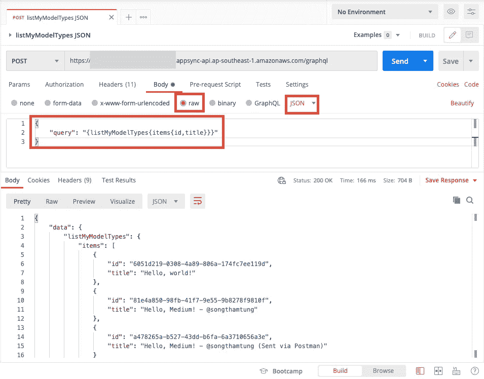

如果您做的一切都正确，那么您应该会看到一个成功的响应，其中包含来自 DynamoDb 的条目。它看起来会像这样:

> curl-location-request POST ' API _ URL ' \
> -header ' x-API-KEY:API _ KEY ' \
> -header ' Content-Type:application/JSON ' \
> -data-raw ' {
> " query ":" { listMyModelTypes { items { id，title}}}"
> } '

***写***

在将有效负载压缩为一行的上下文中，使用 JSON 写入数据库类似于使用 JSON 读取，如下所示:

```
{ "query": "mutation {createMyModelType(input:{title:\"JSON body\"}){title}}" }
```

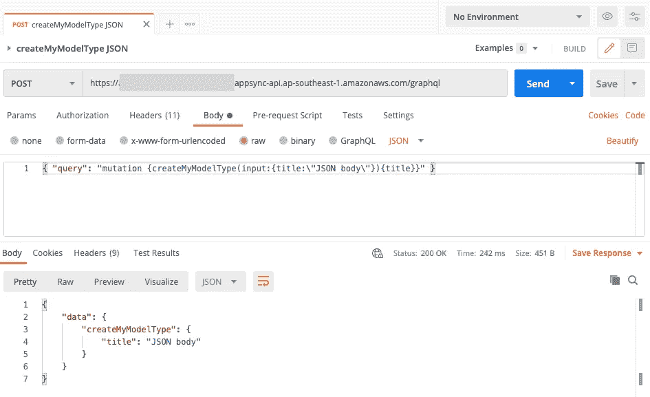

如果您做的一切都正确，那么您应该会看到一个成功的响应，其中包含一个来自 JSON payload 的新创建的条目。

> curl-location-request POST ' API _ URL ' \
> -header ' x-API-KEY:API _ KEY ' \
> -header ' Content-Type:application/JSON ' \
> -data-raw ' { " query ":" mutation { createMyModelType(input:{ title:\ " JSON body \ " }){ title } } " } '

# 关闭


照片由 [krakenimages](https://unsplash.com/@krakenimages?utm_source=medium&utm_medium=referral) 在 [Unsplash](https://unsplash.com?utm_source=medium&utm_medium=referral) 上拍摄

恭喜你已经走到这一步了！这并不容易。我们刚刚使用 AWS AppSync 创建了一个 GraphQL 服务器，它读取/写入 DynamoDB。最重要的是，我们能够使用 Postman 对 GraphQL 服务器进行 API 调用。

我希望您能够对它的工作原理有一个基本的了解，并将它们应用到您自己的应用程序中。我们只了解了 GraphQL 的冰山一角。还有很多我们在本简介中没有涉及的主题，比如模式设计、解析器、实时订阅、导入数据源、与 lambda 函数集成、身份验证、分页、与客户端应用程序连接等等。

我们将把这些留到以后的文章中；).

编码快乐！

# 资源

*   [https://aws.amazon.com/appsync/](https://aws.amazon.com/appsync/)
*   [https://aws.amazon.com/appsync/](https://aws.amazon.com/appsync/)
*   [https://graphql.org/](https://graphql.org/)
*   [https://postman.com/](https://postman.com/)