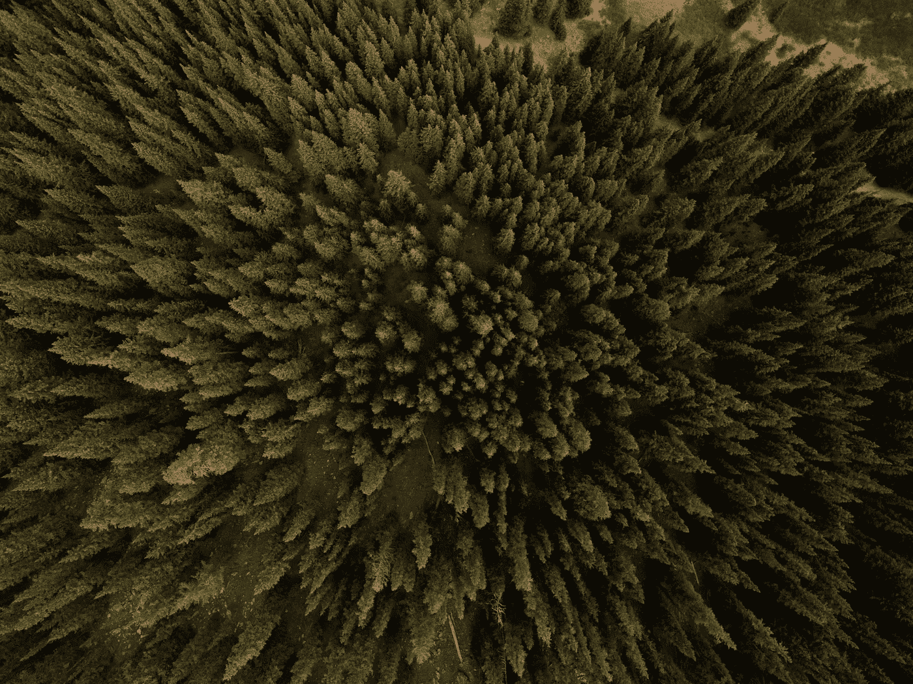
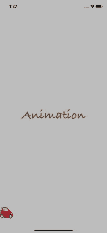
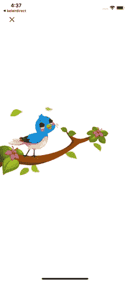

# iOS 动画入门(第 3 部分)

> 原文：<https://betterprogramming.pub/getting-started-with-ios-animation-part-3-e6cfaceba486>

## 如何制作视图控制器之间的过渡动画



[内森·安德森](https://unsplash.com/@nathananderson?utm_source=unsplash&utm_medium=referral&utm_content=creditCopyText)在 [Unsplash](https://unsplash.com/s/photos/transition?utm_source=unsplash&utm_medium=referral&utm_content=creditCopyText) 上拍照

欢迎我们动画系列的第三部也是最后一部。在这个故事中，我们将讨论如何在视图控制器之间转换时实现动画。

你也可以在这里找到第一和第二部分:

[](https://medium.com/dev-genius/getting-start-with-ios-animation-part-1-7bd3a673bee4) [## iOS 动画入门(第 1 部分)

### 如何制作视图组件的动画

medium.com](https://medium.com/dev-genius/getting-start-with-ios-animation-part-1-7bd3a673bee4) [](https://medium.com/better-programming/getting-start-with-ios-animation-part-2-65f5bcd0c087) [## iOS 动画入门(第 2 部分)

### 如何创作电影般的动画

medium.com](https://medium.com/better-programming/getting-start-with-ios-animation-part-2-65f5bcd0c087) 

**注意**:我建议从我们上一部分离开的地方开始，所以你可以在这里下载项目[。否则，您仍然可以通过创建两个视图控制器来遵循本教程。](https://www.dropbox.com/sh/hirw5786plbyspb/AAAdXMiQkuXE43Yup3llAPDOa?dl=0)

此时，我们有`LoginViewController`和`GiftViewController`:



屏幕上的动画很棒，但这两个视图之间的转换似乎很普通，所以我们将通过实现一些有趣的动画来改进它。这是最终的预期结果:


实际上，我们将增加一个可控的消除过渡，这意味着通过从屏幕的左边缘滑动，动画可以向前和向后移动手指拖动:



您可能会看到代码起初看起来很吓人，但实际上原理很简单。过渡动画可以通过创建一个符合`UIViewControllerAnimatedTransitioning`的类来完成。然后，我们将它注入到视图控制器的`UIViewControllerTransitioningDelegate`中。

**提示**:动画参数是通过反复试验找到的。我们经常需要密切监视我们的每一步行动，所以我们需要放慢速度。模拟器提供了一个很棒的慢动作功能:去调试，选择`Slow Animations`。

## 当前过渡动画

我们从现在的转变开始。以下是动画步骤:

*   沿 y 轴顺时针旋转“打开”按钮 90 度。
*   在“打开”按钮的位置和大小显示礼物快照视图，但初始位置是 y 轴上逆时针 90 度。这是因为它有助于按钮旋转看起来连续。
*   然后我们沿着 y 轴顺时针旋转 90 度。
*   缩小礼物视图以充满屏幕。

代码如下:

最重要的部分是拍摄目标视图的快照:

`let snapshot = toVC.view.snapshotView(afterScreenUpdates: true)`

这里是每一步的代码:

**沿 y 轴顺时针旋转“打开”按钮 90 度**:

```
UIView.addKeyframe(withRelativeStartTime: 0.0, relativeDuration: 1/4) {
     fromVC.loginButton.layer.transform = CATransform3DMakeRotation(CGFloat(-Double.pi / 2), 0.0, 1.0, 0.0)
}
```

通过使用`UIView.addKeyframe`，我们可以指定动画的每一步的持续时间相对于整个动画的持续时间。这里我们希望“打开”按钮的旋转时间占整个持续时间的四分之一。

**将快照目标视图旋转 90 度**:

但是首先，我们必须在 y 轴上逆时针 90 度初始化它。我们在整个动画开始之前就这样做了。

```
snapshot.layer.transform = CATransform3DMakeRotation(CGFloat(Double.pi / 2), 0.0, 1.0, 0.0)
```

然后在旋转“打开”按钮后旋转它:

```
UIView.addKeyframe(withRelativeStartTime: 1/4, relativeDuration: 1/4) {
     snapshot.layer.transform = CATransform3DMakeRotation(0.0, 0.0, 1.0, 0.0)
}
```

**在最后一步，我们缩小快照以匹配最终目标视图**:

```
UIView.addKeyframe(withRelativeStartTime: 2/4, relativeDuration: 1/2) {
     snapshot.frame = finalFrame
}
```

在整个动画完成时，我们进行清理:

*   显示目的地视图，
*   删除快照，并且
*   重置“打开”按钮位置。

也就诞生了现在的动画。现在，我们要做的就是将它连接到我们的视图控制器。因此，当应用程序准备序列时，我们必须指定我们想要使用自定义过渡(通过指定`transitioningDelegate`)而不是默认过渡:

然后在右边的委托函数中输入我们的动画实例:

一切都结束了。运行应用程序，欣赏第一个动画。

## 消除过渡动画

既然我们成功地创建了当前的转换，我们将做同样的事情来取消一个转换。

以下是消除动画的代码:

暂时忽略`SwipeInteractiveTransition`。我们以后再谈。

在这里，我们将找到与我们在当前动画中编写的代码相同的模式，只是注意到`.to`和`.from`视图控制器是相反的。

我们将分三步创建消除视图:

**将当前视图缩小到目的按钮的大小**:

```
UIView.addKeyframe(withRelativeStartTime: 0.0, relativeDuration: 1/2) {
     snapshot.frame = **self**.destinationFrame
}
```

**在 y 轴上将其旋转 90 度**:我们也将“打开”按钮旋转 90 度，因此此时我们不会看到“打开”文本:

```
UIView.addKeyframe(withRelativeStartTime: 1/2, relativeDuration: 1/4) {
     snapshot.layer.transform = CATransform3DMakeRotation(CGFloat(Double.pi/2), 0.0, 1.0, 0.0)
     toVC.loginButton.layer.transform = CATransform3DMakeRotation(CGFloat(Double.pi/2), 0.0, 1.0, 0.0)
}
```

**最后，将“打开”按钮旋转回到正确的位置:**

```
UIView.addKeyframe(withRelativeStartTime: 3/4, relativeDuration: 1/4) {
     toVC.loginButton.layer.transform = CATransform3DIdentity
}
```

现在我们已经创建了动画，我们只需要在`UIViewControllerTransitioningDelegate`中连接它:

```
func animationController(forDismissed dismissed: UIViewController) -> UIViewControllerAnimatedTransitioning? {
     return DismissViewControllerAnimation(destinationFrame: loginButton.frame)
}
```

酷，现在我们完成了所有的动画。运行应用程序，享受神奇！

## 控制动画

iOS 让用户与动画互动变得非常容易。它的工作方式和我们制作这两个动画的方式一样。首先，我们创建一个`UIPercentDrivenInteractiveTransition`的子类，然后将它注入到我们的`UIViewControllerTransitioningDelegate`的函数`interactionControllerForDismissal`中。`UIPercentDrivenInteractiveTransition`类提供了三个功能:

*   `update()`:告诉我们转换完成了多少。0.0 是过渡的开始，1.0 是过渡的结束。
*   `cancel()`:取消过渡。在我们的例子中，它将取消解雇过程。
*   `finish()`:完成过渡。在我们的例子中，它将关闭礼物视图并显示登录视图。

我们通常将这种交互式过渡与手势识别结合使用，因为它赋予用户控制过渡的能力。下面是这个子类的代码:

我们将把`UIScreenEdgePanGestureRecognizer`添加到礼物视图中。该识别器可以检测到从屏幕边缘的拖动。然后，根据用户拖动的程度，我们使用`update`来控制过渡。当手势结束时，我们检查进度是否过半，然后我们前进，完成解散；否则，我们取消它。

我们可以在`GiftViewController`中实例化这个控制器:

```
private(set) var swipeTransition: SwipeInteractiveTransition?override func viewDidLoad() {
     super.viewDidLoad()
     setupUI()
     swipeTransition = SwipeInteractiveTransition(viewController: self)
}
```

然后在一个`UIViewControllerTransitioningDelegate`的函数中注入。下面是这个委托的最终版本:

厉害！我们完成了。现在是时候欣赏我们令人惊叹的过渡动画了！

# 从这里去哪里

你可以在这里下载最终项目。

在本教程中，我们学习了:

*   如何实现视图控制器之间的动画转换
*   如何让用户控制这个动画

我希望你喜欢这个故事。如果你想了解更多关于动画的知识，你可以查看我的两个最早的故事。

第一部分是关于动画视图:

[](https://medium.com/dev-genius/getting-start-with-ios-animation-part-1-7bd3a673bee4) [## iOS 动画入门(第 1 部分)

### 如何制作视图组件的动画

medium.com](https://medium.com/dev-genius/getting-start-with-ios-animation-part-1-7bd3a673bee4) 

第二部分是关于动画图像序列(类似电影的动画):

[](https://medium.com/better-programming/getting-start-with-ios-animation-part-2-65f5bcd0c087) [## iOS 动画入门(第 2 部分)

### 如何制作电影般的动画

medium.com](https://medium.com/better-programming/getting-start-with-ios-animation-part-2-65f5bcd0c087)