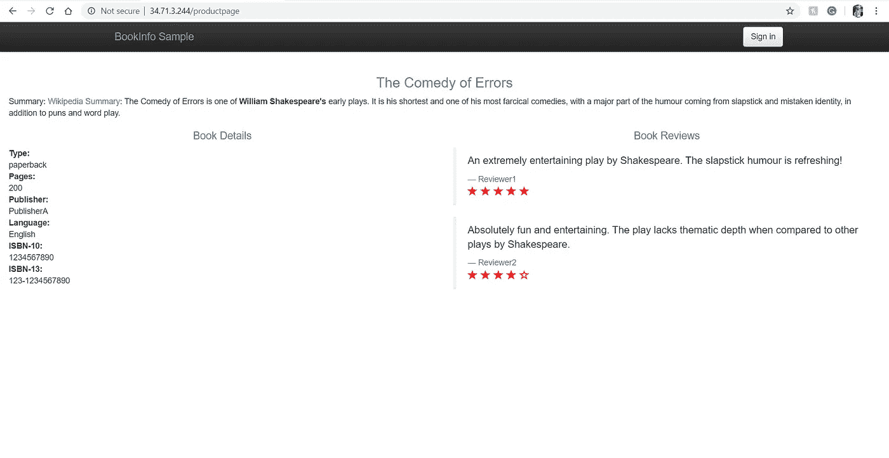
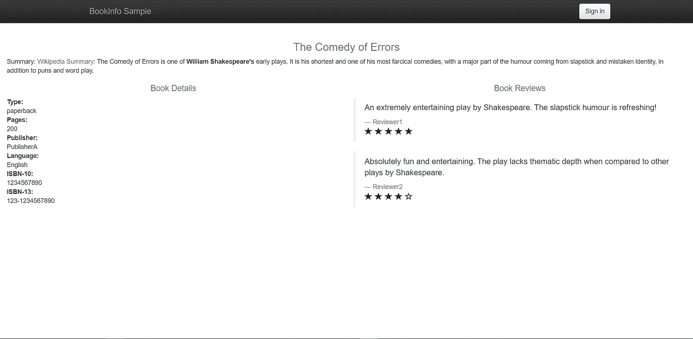
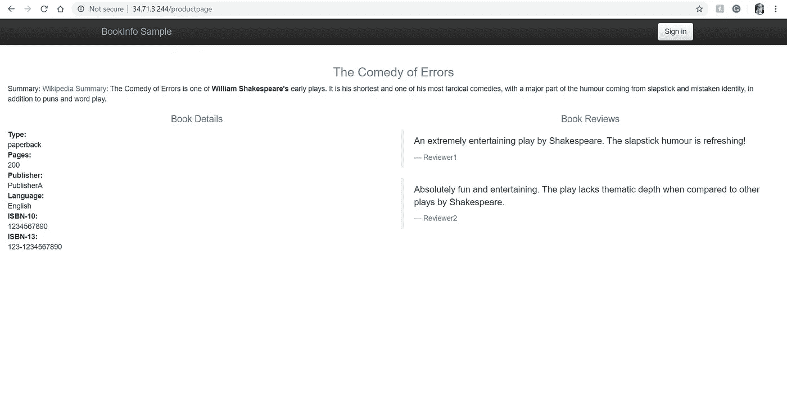
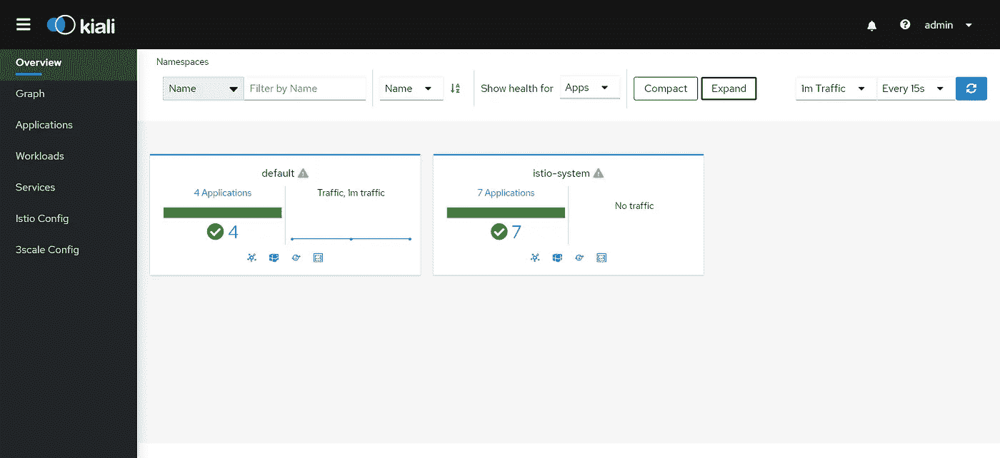
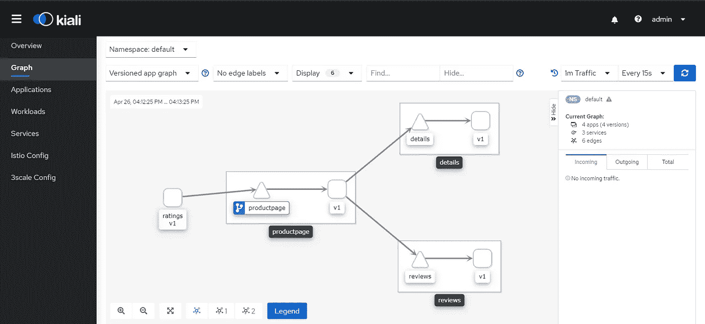

# Kubernetes 上的 Istio 入门

> 原文：<https://betterprogramming.pub/getting-started-with-istio-on-kubernetes-e582800121ea>

## 在 Kubernetes 集群中安装和配置 Istio


照片由[斯文·里德](https://unsplash.com/@starburst1977?utm_source=medium&utm_medium=referral)在 [Unsplash](https://unsplash.com?utm_source=medium&utm_medium=referral) 拍摄。

Istio 是目前最流行的服务网格，它与 Kubernetes 集成得非常好。对于一个[微服务](https://en.wikipedia.org/wiki/Microservices)架构来说，Istio 不仅有用，而且是必需的。这个故事是《Istio 如何在 Kubernetes 上幕后工作》的后续。今天，我们来讨论在您的 Kubernetes 集群中设置 Istio。

# 先决条件

您需要有一个正在运行的 Kubernetes 集群来安装 Istio。如果你在云上运行，像 [Google Kubernetes Engine](https://cloud.google.com/kubernetes-engine) 这样的托管服务将是一个完美的选择，因为它允许自动的边注。

我将讨论如何使用 GKE 在云中安装 Istio。但是，如果您在自己托管的或内部的 Kubernetes 集群中运行它，则只有很小的区别。

# 安装 Istio

Istio 是一个不断发展的项目。在撰写本文时，最新的稳定版本是 Istio 1.6，我们将安装该版本。

确保您在 Kubernetes 集群中作为集群管理员登录。

## 下载 Istio

下载 Istio 并通过运行以下命令设置下载二进制文件的路径:

```
$ curl -L [https://istio.io/downloadIstio](https://istio.io/downloadIstio) | ISTIO_VERSION=1.6.1 sh -
$ cd istio-1.6.1
$ export PATH=$PWD/bin:$PATH
```

安装 YAML 文件存在于`install/kubernetes`目录中。

Istio 还提供了一些示例，我们可以用它们来理解和试验`samples/`目录中的 Istio 特性。我们将在本系列的其余部分使用这个示例应用程序。

## 安装 Istio

通过使用适当的配置描述文件应用 Istio 清单来安装 Istio。

有六种配置文件可供选择:

1.  默认—建议用于生产部署，并配置`IstioOperator` API 的默认设置。默认情况下，这将强制执行大多数规则，您可以根据自己的需求定制配置。
2.  演示—你可以用它来玩 Istio 和学习，尤其是当你使用 Minikube 或资源有限的设置时。对于运行示例应用程序，这是最合适的概要文件，我们将在演示中使用它。
3.  最少的—它包含最少的功能，仅用于支持流量管理。
4.  Remote —如果您正在运行多个 Kubernetes 集群，并且希望使用 Istio 来管理多集群环境，那么这是最合适的配置文件。它为您提供了一个共享控制平面，让您可以从一个位置管理所有集群。
5.  Empty —这个概要文件不部署任何东西，如果您想定制 Istio 并从一个基本概要文件开始，您可以使用它。
6.  单独的—不推荐使用，仅用于支持传统功能。

安装带有演示配置文件的 Istio，因为它为我们提供了大多数评估和培训功能:

```
$ istioctl manifest apply --set profile=demo       
- Applying manifest for component Base...
✔ Finished applying manifest for component Base.
- Applying manifest for component Pilot...
✔ Finished applying manifest for component Pilot.
  Waiting for resources to become ready...
- Applying manifest for component IngressGateways...
- Applying manifest for component EgressGateways...
- Applying manifest for component AddonComponents...
✔ Finished applying manifest for component EgressGateways.
✔ Finished applying manifest for component IngressGateways.
✔ Finished applying manifest for component AddonComponents.
```

标记您想要让 Istio 自动注入边车容器的名称空间。从默认名称空间开始:

```
$ kubectl label namespace default istio-injection=enabled
namespace/default labeled
```

# 测试配置

现在您已经安装了 Istio 并配置它自动将 sidecar 容器注入到您的默认名称空间，安装示例图书信息应用程序并查看 Istio 是否工作。

如果你看一下图书信息应用程序的 YAML 文件，你会看到有四个微服务:`details`、`ratings`、`reviews`和`productpage`。

`reviews`微服务包含三个版本的 pod，每个都标有 v1、v2 和 v3。其余的微服务只有一个版本(v1)。

通过运行`kubectl`命令应用 YAML 文件:

```
$ kubectl apply -f samples/bookinfo/platform/kube/bookinfo.yaml
service/details created
serviceaccount/bookinfo-details created
deployment.apps/details-v1 created
service/ratings created
serviceaccount/bookinfo-ratings created
deployment.apps/ratings-v1 created
service/reviews created
serviceaccount/bookinfo-reviews created
deployment.apps/reviews-v1 created
deployment.apps/reviews-v2 created
deployment.apps/reviews-v3 created
service/productpage created
serviceaccount/bookinfo-productpage created
deployment.apps/productpage-v1 created
```

列出服务和单元:

```
$ kubectl get svc
NAME          TYPE        CLUSTER-IP    EXTERNAL-IP   PORT(S)    AGE
details       ClusterIP   10.8.12.70    <none>        9080/TCP   31s
kubernetes    ClusterIP   10.8.0.1      <none>        443/TCP    19m
productpage   ClusterIP   10.8.15.230   <none>        9080/TCP   28s
ratings       ClusterIP   10.8.14.21    <none>        9080/TCP   30s
reviews       ClusterIP   10.8.12.51    <none>        9080/TCP   30s$ kubectl get pod
NAME                              READY   STATUS    RESTARTS   AGE
details-v1-74f858558f-xv2rz       2/2     Running   0          56s
productpage-v1-76589d9fdc-dk9vn   2/2     Running   0          53s
ratings-v1-7855f5bcb9-2dcx8       2/2     Running   0          55s
reviews-v1-64bc5454b9-wtc8l       1/2     Running   0          54s
reviews-v2-76c64d4bdf-ddrfn       2/2     Running   0          54s
reviews-v3-5545c7c78f-8rmqr       2/2     Running   0          53s
```

你注意到什么了吗？在 YAML 的任何地方，我们都没有看到包含两个容器的吊舱，但是如果你看一下就绪列，你会看到 2/2。

这是为什么呢？我们刚刚在 pod 中部署了一个容器，但是我们看到 pod 中运行了两个容器。

不要惊讶！伊斯蒂奥正在旋转吊舱中的特使边车容器。这表明 Istio 正在自动注入边车。

现在，通过对`ratings`微服务容器执行`kubectl` exec 并运行 curl 到产品页面，尝试访问示例应用程序的产品页面:

```
$ kubectl exec -it $(kubectl get pod -l app=ratings -o jsonpath=’{.items[0].metadata.name}’) -c ratings -- curl productpage:9080/productpage
```

## 对外公开图书信息应用程序

为此，我们需要创建一个图书信息入口网关，将应用程序与 Istio 入口网关关联起来。

默认情况下，Istio 会在首次安装时部署 Istio 入口网关，并在`LoadBalancer`上公开服务。如果您的集群不支持负载平衡器，您可以使用`Service`的`NodePort`并使用`NodeIP:NodePort`组合来访问您的应用程序。

要确定`LoadBalancer`和`NodePort`，运行以下程序:

```
$ kubectl -n istio-system get service istio-ingressgateway
NAME TYPE CLUSTER-IP EXTERNAL-IP PORT(S) AGE
istio-ingressgateway LoadBalancer 10.8.14.188 34.71.3.244 15020:31344/TCP,80:30347/TCP,443:31784/TCP,15029:30240/TCP,15030:31113/TCP,15031:30358/TCP,15032:30211/TCP,31400:32315/TCP,15443:32359/TCP 17m
```

正如您所看到的，Istio 已经暴露了您的负载平衡器上的几个端口。在这个例子中，我们需要在端口 80 上运行我们的应用程序，因此我们可以使用映射到端口 80 的`NodePort`的`LoadBalancerIP:80`或`NodeIP:NodePort`组合。

确保打开防火墙，通过`LoadBalancer`或`NodePort`访问您的应用程序。例如，如果您使用 GKE，则运行以下命令:

```
$ gcloud compute firewall-rules create allow-gateway-http --allow tcp:80
Creating firewall...⠹Created [[https://www.googleapis.com/compute/v1/projects/playground-s-11-5eaba8/global/firewalls/allow-gateway-http](https://www.googleapis.com/compute/v1/projects/playground-s-11-5eaba8/global/firewalls/allow-gateway-http)].
Creating firewall...done.
NAME                NETWORK  DIRECTION  PRIORITY  ALLOW   DENY  DISABLED
allow-gateway-http  default  INGRESS    1000      tcp:80        False
```

Istio 在`samples/bookinfo/networking/`目录中提供了`bookinfo-gateway.yaml`，用于将图书信息应用程序与入口网关相关联:

bookinfo-gateway.yaml

如果您查看 YAML 文件，您会看到它在端口 80 上定义了一个`Gateway`，在`bookinfo-gateway`上定义了一个`VirtualService`。`VirtualService`匹配所有具有`/productpage`、`/static`、`/login`、`/logout`和`/api/v1/products`路径的主机，并将它们路由到端口 9080 上运行的`productpage`服务。

由于 Istio 支持 Kubernetes，您可以简单地使用`kubectl`命令来创建 Istio 对象:

```
$ kubectl apply -f samples/bookinfo/networking/bookinfo-gateway.yaml
gateway.networking.istio.io/bookinfo-gateway created
virtualservice.networking.istio.io/bookinfo created
```

现在，尝试在浏览器上使用负载平衡器 IP 访问应用程序:



带有红星的产品页面

刷新它，你会看到一个不同的页面出现:



带有黑色星星的产品页面

再次刷新它，您将看到另一个页面出现:



没有星星的产品页面

发生了什么事？

嗯，当我们部署应用程序时，我们实现了三个版本的`ratings`微服务，它以循环方式显示。

这是 Istio 的默认路由策略，这表明 Istio 已安装并正常工作。

# 访问仪表板

Istio 提供了许多可选的仪表板，您可以使用它们来挂钩您的网格。演示安装附带了 Kiali 仪表板，它为您提供了网格的拓扑结构以及流量是如何通过它的。

要访问仪表板，您可以使用`istioctl`打开一个代理:

```
$ istioctl dashboard kiali
[http://localhost:20001/kiali](http://localhost:20001/kiali)
```

然后使用代理 URL 在您的浏览器上打开 Kiali dashboard，并使用默认用户名`admin`和默认密码`admin`登录。



Kiali 概述

转到图形并选择默认名称空间以查看网状拓扑:



基亚里图

# 结论

感谢您通读！我希望你喜欢这篇文章。在下一篇文章[如何在 Kubernetes](https://medium.com/better-programming/how-to-manage-traffic-using-istio-on-kubernetes-cd4b96e00b57) 上使用 Istio 管理流量中，我将通过实际操作演示来讨论通过 Istio 进行流量管理，所以下一部分再见！