# iXGuard 入门——一款混淆和应用收缩工具

> 原文：<https://betterprogramming.pub/getting-started-with-ixguard-an-obfuscation-app-shrinking-tool-85e1342a5572>

## 唯一一个提供学习如何使用 iXGuard 工具缩减应用程序大小的教程

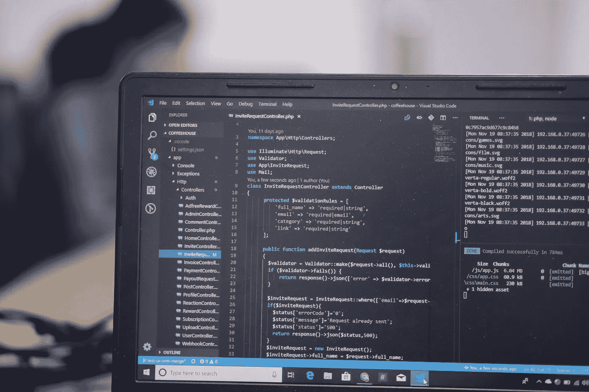

Vishnu R Nair 在 [Unsplash](https://unsplash.com/search/photos/hacking?utm_source=unsplash&utm_medium=referral&utm_content=creditCopyText) 上的照片

任何人都可以使用现成的工具来反汇编和检查 iOS 应用程序和 SDK，并深入了解其内部逻辑。

这为各种形式的滥用打开了方便之门，包括知识产权盗窃、凭据获取、篡改和克隆。

[iXGuard](https://www.guardsquare.com/en/blog/ixguard-20-released) 旨在保护您的 [Swift](https://developer.apple.com/swift/) 和 [Objective-C](https://developer.apple.com/library/archive/documentation/Cocoa/Conceptual/ProgrammingWithObjectiveC/Introduction/Introduction.html) 应用和 SDK 免受逆向工程和黑客攻击。它强化了他们的代码，使他们能够监控自己的完整性和运行环境的完整性。

在本教程中，您将学习如何使用 iXGuard——一种应用程序收缩和模糊工具——来缩减您的应用程序大小。

iXGuard 3.1 保护 iOS 应用免受静态库注入，并提供改进的混淆。

# **1。安装 iXGuard**

使用安装软件包文件的标准程序为您的 [Xcode](https://developer.apple.com/xcode/) 版本安装 iXGuard。

# **2。创建一个 IPA(基于 Xcode 10.1)**

1.  用 Xcode 中的*产品*->-*档案*创建一个分发文件。

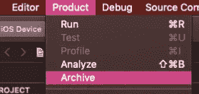

2.选择*管理器*中创建的档案，选择*分发 App* 。

3.选择 *iOS 应用商店*，然后*下一个*。

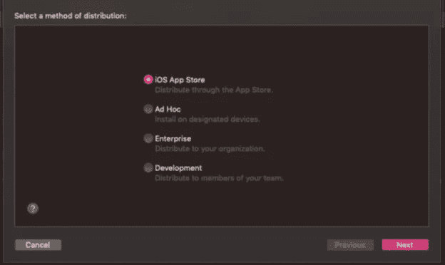

4.选择*导出*，点击*下一个*。

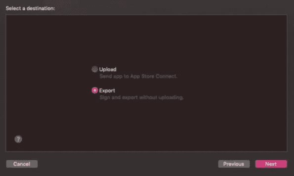

5.包括 iOS 内容的位代码，并上传应用程序的符号，以接收来自 Apple 的符号化报告。检查项目并点击下一个的*。*

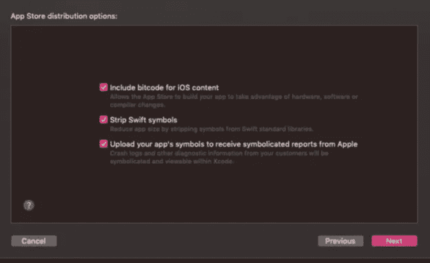

6.设置好证书相关设置后，*导出*，保存。

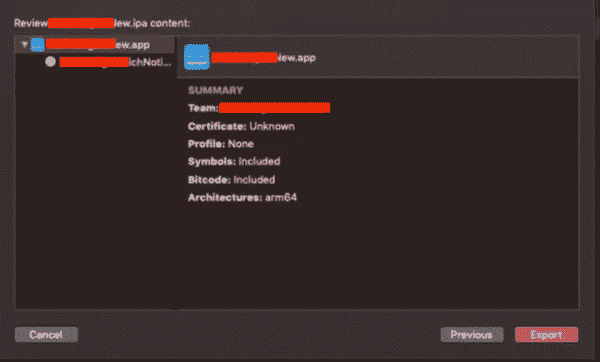

# **3。创建 ixguard.yml**

每个应用程序的文件可能不同。详情请参考 iXGuard 的配置页面。

从导出的 IPA 文件所在的文件夹到终端:

`ixguard.yml -o [Obfuscated IPA file name] [Generated IPA file name]`

当您输入命令时，`ixguard.yml`默认文件被创建。

样本`ixguard.yml`(这可能因项目而异):

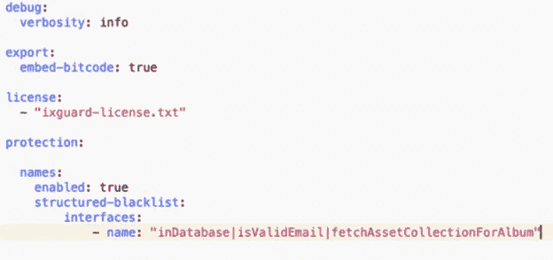

# **4。涂抹 iXGuard**

从导出的 IPA 文件所在的文件夹到终端 iXGuard。

在终端中输入以下命令来应用 iXGuard:

`config ixguard.yml -o [After obfuscation IPA] [File name] [Generated IPA file name]`

如果操作中没有错误，则会创建一个混淆的 IPA 文件。

在终端中日志出现`[warning]`的情况下，每种情况的解决方案与 iXGuard 手册中的解决方案相同。

在*故障排除*->-*运行时问题*页面，注意:*外观*。

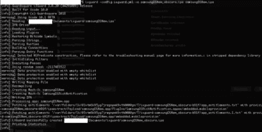

注意:结果屏幕。

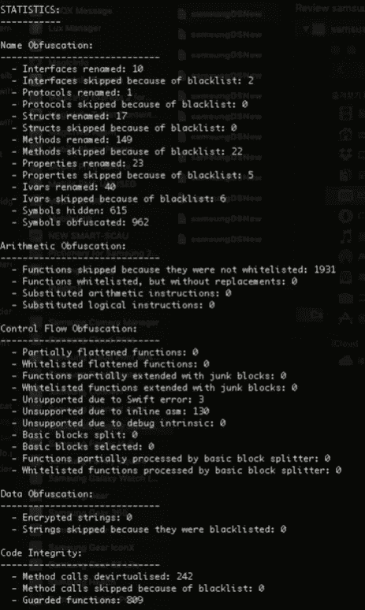

# **5。测试您的应用程序**

在实际设备上使用 [TestFlight](https://developer.apple.com/testflight/) 等方法测试 app 的功能。

令牌、认证密钥等。是面向逻辑的测试所特别需要的。

# **6。模糊验证**

该零件已经使用 [MachOView](https://github.com/gdbinit/MachOView) 工具进行了验证。

1.  执行步骤 2 创建 IPA 文件。包括 iOS 内容检查的位代码。释放并创建两个过时的 IPA 和两个未混淆的 IPA 文件。
2.  将对应的 IPA 文件的扩展名改为 zip 并解压缩。

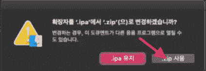

3.解压缩后的文件夹中有一个*有效载荷*文件夹。检查包含应用程序名称的应用程序文件。

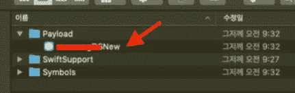

4.右击应用程序并选择*查看包*。

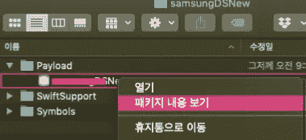

5.复制包中 app 名称的可执行文件，解压到任意目录。

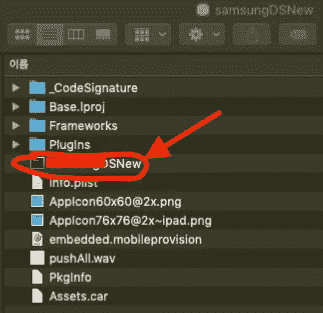

6.用 MachOView app 打开混淆前提取的可执行文件和混淆后提取的可执行文件。

检查碎片的名称，并确认应用了模糊处理。

下图仅供参考。(上图:混淆前，下图:混淆后。)

# 7.在应用商店中部署应用

最后，在 App Store 中部署应用。

`Xcode -> Open Developer Tool -> Application Loader`。