# Python Kubernetes 入门

> 原文：<https://betterprogramming.pub/getting-started-with-kubernetes-for-python-254d4c1d2041>

## 了解基础知识并部署您的第一个集群


马克西米利安·魏斯贝克尔在 [Unsplash](https://unsplash.com?utm_source=medium&utm_medium=referral) 上的照片。

想象一下，你有一个尖端的机器学习过程，在你出色的、震惊世界的 web 应用程序的背景下突突前进。

但是有一个问题。

一旦 web 应用程序收到的流量超过预期，每个人都会认为你的服务是垃圾，因为后端 magic ML 解决方案现在超级慢——它只能处理预先规定的流量…

幸好我们有 [Kubernetes](https://kubernetes.io/) ！现在，我们可以*在我们的 ML 魔法容器大军之间协调*工作负载。我们甚至可以按需扩充我们的军队。一旦后端达到高容量，就制造更多的容器！

Kubernetes 是一个 Docker 容器编排器。这意味着我们可以自动平衡工作负载，保持部署的高可用性、高响应性和高效率。

Kubernetes 是一项改变游戏规则的技术。

在开始部署我们的第一个 Kubernetes Python API 集群之前，我们将快速介绍 Kubernetes 的设置！其实也没那么难。从开始到结束，我们将涵盖:

*   创建 Docker 图像。
*   上传图像到 Docker Hub。
*   配置我们的 pod (我们把容器放在这个里面)。
*   使用服务配置群集网络。
*   将我们的 pod 和服务部署到集群。

每一步都将包含易于遵循的分步说明。尽情享受吧！

# Kubernetes 设置

我们将使用 Docker 部署我们的 Kubernetes 集群。为此我们确实需要 Windows 10 Pro/Enterprise。或者，也可以使用 [Minikube](https://kubernetes.io/docs/tasks/tools/install-minikube/) ，但我们不会在这里讨论它。

为 [Windows](https://docs.docker.com/docker-for-windows/install/) 或 [Mac](https://docs.docker.com/docker-for-mac/install/) 下载 Docker。

安装完成后，我们右键单击任务栏中的 Docker 桌面图标(它是一个小鲸鱼),然后单击设置:

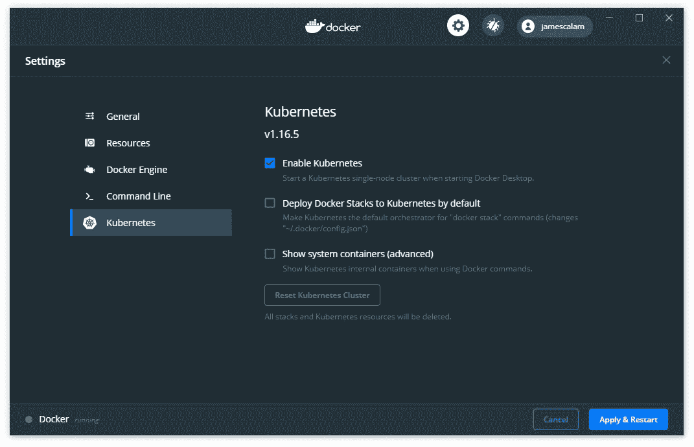

Kubernetes >启用 Kubernetes >应用并重启。

然后，我们点击 Kubernetes >检查启用 Kubernetes >点击应用和重启！


Kubernetes 运行成功！

设置好 Kubernetes 后，我们应该会在 Docker 设置窗口的左下角看到它与 Docker 一起运行:

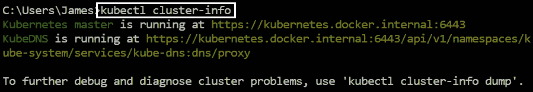

检查 Kubernetes 是否正在使用 kubectl cluster-info。

为了再次检查所有设置是否正确，我们打开首选的 CLI 并键入`kubectl cluster-info`。我们应该会看到我们的集群信息，如上所示。

# 该过程

1.  我们创造我们的码头工人形象。
2.  将图像上传到 Docker Hub。
3.  配置容纳容器的 pod
4.  使用服务配置我们的集群网络。
5.  将我们的 pod 和服务部署到集群。

# 形象

首先，我们需要一个 Docker 映像，它将被用作 Kubernetes 集群中的核心流程。

我们将使用一个用 Python 构建的简单 API，它简单地向收到的每个请求返回`{"hello": "world"}`。我们将使用的代码是:

我们的 Python 文件叫做`app.py`。在同一个目录中，我们还添加了`requirements.txt`，它包含我们的 Python 包导入:

```
flask
flask-restful
```

以及一个我们用来创建容器的 docker 文件:

## 建立码头工人形象

然后，我们打开一个 CLI，导航到包含我们的 API 文件的目录，并使用`docker build -t <image name>`构建我们的映像:

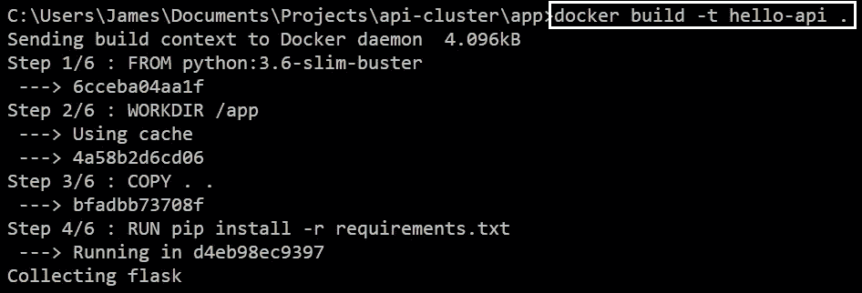

构建一个映像就像 docker build -t <name><path>一样简单。记住结尾的点——我每次都忘记。</path></name>

现在，为了检查我们的容器是否正常工作，我们键入`docker run -p 3050:3000 hello-api`。这将告诉 Docker 在`localhost:3050`运行我们的容器:

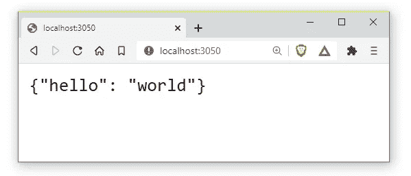

当我们导航到 localhost:3050 时，应该会看到{"hello": "world"}。

在浏览器中输入这些内容后，应该会看到我们的 API！

# 码头枢纽

接下来，我们将图像上传到 [Docker Hub](https://hub.docker.com/) 。

1.创建一个帐户或登录。

2.单击创建存储库。

3.选择一个名字。在本文中，我使用的是`hello-api`。现在我们回到我们的 CLI。

4.出现提示时，键入`docker login --username=<username> --email=<email>`并输入您的密码。

5.通过键入`docker images`获得图像 ID。

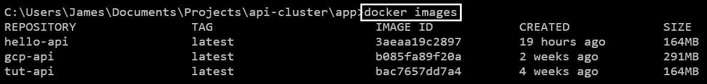

我们可以通过键入 Docker images 来查看所有 Docker 图像的列表。

6.使用`docker tag <image ID> <hub repo>`标记图像。对我来说，这就是`docker tag 3aeaa19c2897 jamescalam/hello-api`。

7.使用`docker push <hub repo>`将我们的图像推送到我们的 repo。

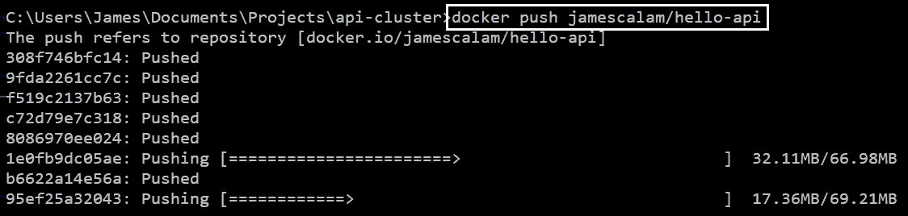

我们通过 docker push 将我们的容器映像推送到 Docker Hub。

# 分离舱

pod 是可以在我们的 Kubernetes 集群中部署的最小计算单元。pod 内部运行一个或多个容器。

## 配置文件

要创建一个 pod，我们只需要一个 YAML 文件:

我们的配置文件的第一行是`apiVersion: v1`。每个`apiVersion`启用一组不同的对象。在这种情况下，要创建一个 pod，我们必须使用`v1`。

我们的下一个系列与此相关。我们现在从`apiVersion`提供的集合中指定我们想要使用的对象。在这种情况下，它就是`kind: Pod`。

在`metadata`中，我们存储了关于我们的 pod 的信息。首先是 pod `name`，接下来是 pod `labels`，我们在其中使用了`run: connectApi`，这允许我们在服务配置中识别这个 pod。

在`spec`中，我们使用`containers`关键字来列出包含在 pod 中的容器。在我们的例子中，这只是一个容器:`client`。

我们的容器`image`是存储在 Docker Hub 上的容器映像的名称。

最后，我们定义暴露哪些`ports`用于与外界通信。这与`app.py`和我们的服务配置文件中使用的端口一致。

# 服务

我们使用服务在集群中建立网络。有几种以不同方式控制网络的服务。我们将使用的是一个节点端口。

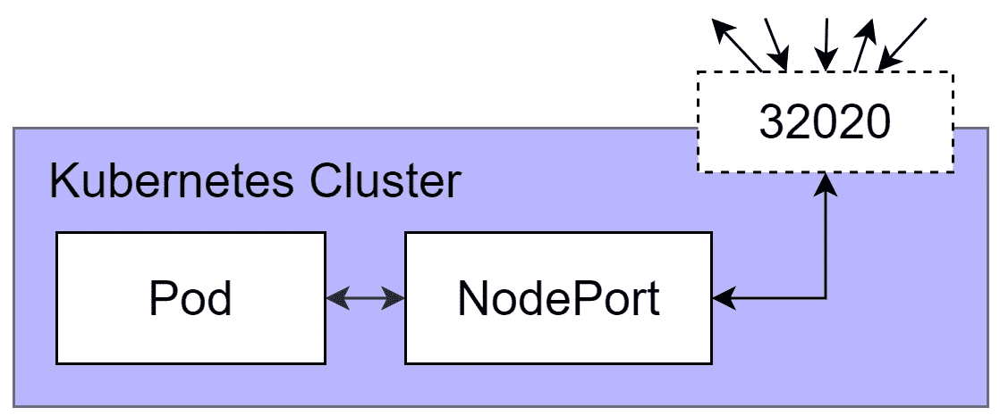

添加节点端口服务对象在我们的 pod 和外部世界之间创建了一个通信通道。

通过添加我们的服务，我们创建了一个类似上面的网络。在我们的集群内部，我们的节点端口将充当我们的 pod 和集群端口(通往外部世界的网关)之间的流量定向器。

## 配置文件

与我们的 pod 一样，我们只需要一个 YAML 文件来创建我们的服务。

我们的服务配置文件的前三部分几乎反映了我们的 pod 配置，并且具有完全相同的目的，因此我们不再重复:

然而，在`spec`中事情有些不同。首先，我们将服务类型设置为`NodePort`。我们之前解释过了。

接下来，我们建立我们的网络`ports`。这里，我们有三个端口:

*   `port: 3050`告知该服务通过其自己的`3050`端口进行通信。
*   `targetPort: 3000`告诉我们使用端口`3000`与我们的目标对象(我们的吊舱)通信。
*   `nodePort: 32020`是我们使用的外部端口。任何想要从集群外部与我们的服务通信的人都必须使用端口`32020` ( [这可以是 30，000–32，767](https://v1-15.docs.kubernetes.io/docs/concepts/services-networking/service/#nodeport) 之间的任何数字)。

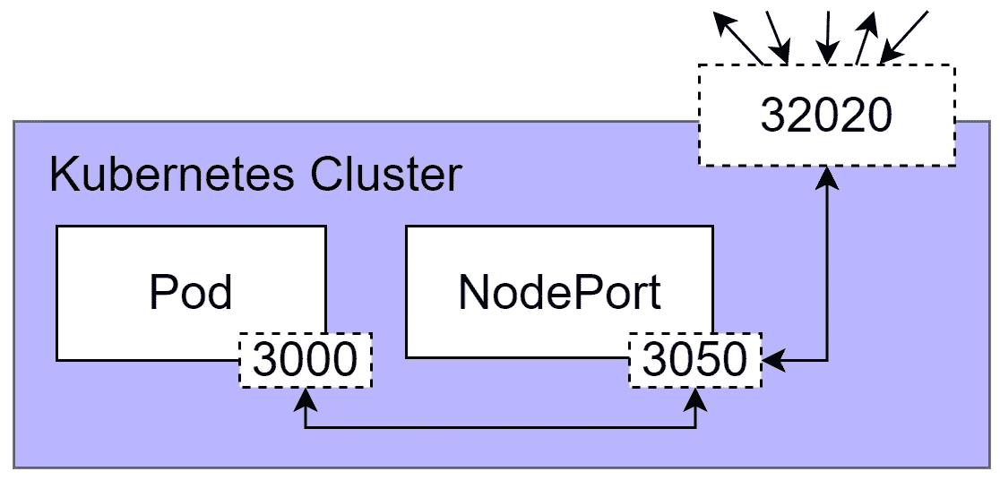

我们的集群网络。NodePort 通过 nodeport.yaml 中定义的端口控制通信。

现在这里少了一个细节。我们的服务如何知道我们的`targetPort`是针对哪个对象的？当然，我们知道这是我们设置的 pod，但是 Kubernetes 是怎么知道的呢？

我们在配置文件的最后两行定义了目标对象。我们写`run: connectApi`，如果我们记得的话，它与 pod 配置中的`run: connectApi`的`labels`键值对相匹配！

因此，我们的服务将找到所有其他带有键值标签`run: connectApi`的对象，并通过它们的端口`3000`进行连接。回到我们的 pod 配置，这就是我们设置`containerPort: 3000`的原因。

# 部署集群

为了初始化 Kubernetes 部署中的 pod 和服务，我们使用了两个配置文件:

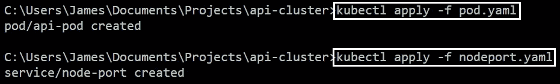

我们使用 kubectl apply -f <yaml file="">来组装我们的集群对象。</yaml>

一旦我们执行了我们的 YAML 脚本，我们可以使用`kubectl get pods`和`kubectl get services`来检查我们的 pod 和服务是否已经成功部署。

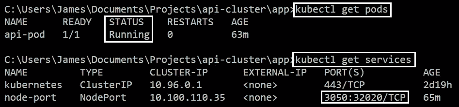

我们可以使用 kubectl get <objects>检查集群中某个对象的状态。</objects>

*   我们的 pod 的状态应该是`Running`。
*   我们应该能够在模式`port:nodePort`中看到我们在服务 YAML 中设置的端口。

最后，为了确认我们的本地集群已经启动并正在运行，我们打开浏览器并打开`localhost:32020`:

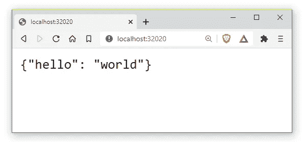

成功，我们集群返回{"hello": "world"}。

我们应该再次受到我们的 Flask API 的欢迎！

# 结束了

我们完了。你正式成为 Kubernetes 职业选手了！你可以在简历的技术技能部分写上“Kubernetes 大师”。

好吧，也许不是“大师”，但我们已经迈出了熟悉 Kubernetes 基础的第一步。这是一项非常酷的技术，值得花点心思去掌握。

我希望你喜欢这篇文章！如果你有任何想法或问题，请在下面的评论中联系我们。

感谢阅读！

**除非另有说明，所有图片均为作者。*