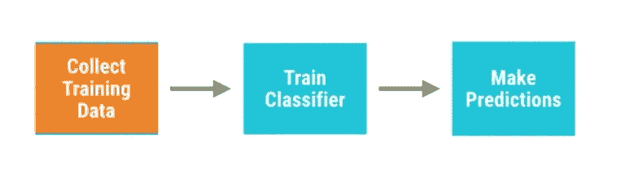
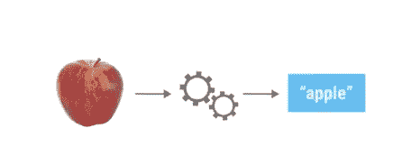
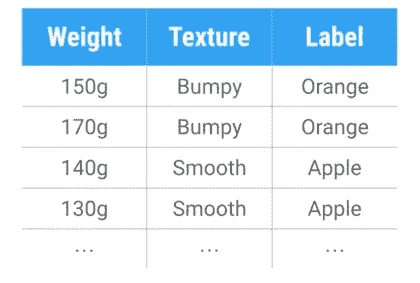

# 机器学习入门，第 1 部分

> 原文：<https://betterprogramming.pub/getting-started-with-machine-learning-part-1-5cca93679d74>

## 基本概念和术语


图片由 [Freepik](https://www.freepik.com/free-photos-vectors/background) 提供

# 什么是机器学习？

此时此刻，你可以把机器学习看作是人工智能的一个子领域。这是一种从例子和经验中学习的算法研究，而不是依赖于硬编码的规则。 [AlphaGo](https://en.wikipedia.org/wiki/AlphaGo) 是机器学习的第一个也是最好的例子。

> “机器学习是人工智能(AI)的一种应用，它为系统提供了自动学习和根据经验进行改进的能力，而无需显式编程。机器学习专注于开发能够访问数据并使用数据进行自我学习的计算机程序。”
> 
> “学习的过程始于观察或数据，如例子、直接经验或指导，以便在数据中寻找模式，并根据我们提供的例子在未来做出更好的决策。主要目的是让计算机在没有人类干预或帮助的情况下自动学习，并相应地调整行动。”

# 机器学习是如何诞生的

想到一个问题:我们有一个苹果和一个橘子要分类。

基本上，对于一个机器学习算法，我们给一些文件作为输入，它在里面做一些事情，并给出图像标签作为输出。

在这个例子中，我们必须编写大量的手动规则来对水果进行分类——或者我们可以简单地编写橙色像素与绿色像素的比率来最终确定答案。

但是现实世界比这更混乱。如果必须识别黑白或灰度图像呢？

我们不得不写大量的代码来区分苹果和橘子之间的区别。我们必须编写代码来检测颜色、检测边缘等等。

```
def detect_colors(image)
    #lots of codedef detect_edges(image)
    #lots of codedef detect_shapes(image)
    #lots of codedef guess_texture(image)
    #lots of code
```

所以我们必须想办法为自己找出规则。为此，我们必须训练一个分类器。



图片由作者提供

请记住，分类器是一个将数据作为输入并产生标签作为输出的函数。这是深度学习或机器学习的主要部分。



图片由作者提供

分类器将获取一个苹果的图像，并将其标记为苹果。

另一个在实际情况下机器学习的基本例子是谷歌邮件，它使用分类器识别重要的邮件和垃圾邮件。我们把这种方法叫做机器学习中的*监督学习*。

这背后的基本思想是:

收集训练数据->训练分类器->进行预测

这意味着我们正在引导分类器通过以前的数据进行预测。



图片由作者提供

在机器学习中，这些测量被称为*特征*。一个好的特征使得区分不同类型的水果变得容易。

数据中的每一行都描述了一种水果。最后一列是重要的一列，它被称为*标签*。

数据越多，创建的分类器就越好。

# 分类器的类型

*   人工神经网络
*   支持向量机
*   决策图表

就目前而言，量词可以分为几大类，如:

*   回归分类器
*   分类的分类器
*   聚类分类器
*   用于关联规则学习的分类器(ARL)
*   降维分类器

作为第一步，我们可以使用一些内置的数据集来训练我们的分类器，而不是去寻找我们的数据。

最流行和最知名的数据集是 [*虹膜*花数据集](https://en.wikipedia.org/wiki/Iris_flower_data_set)。它在几乎所有的网络和平台中都可用，如 TensorFlow 和 MATLAB AlexNet。

# 数据集功能

特征应该是:

*   情报的
*   独立——例如，在计算重量时，我们可以用千克和克来计算。如果我们像那样得到一个特征，我们可以很容易地从它得到另一个特征。所以不要拿依赖特性。
*   很简单——例如，当我们给某人提供位置时，我们可以提供最近的城镇，或者我们可以提供纬度和经度——但这很难计算。因此，要确保给分类器的特征足够简单易懂。

# 机器学习平台

现在可用的主要平台是 TensorFlow 和 sci-kit learn，后者由 200+个数据集和非常精确的分类器组成。MATLAB 也是一个不错的选择，但是平台上应该加入 Alexnet。

我想第一次就够了。在下一篇文章中，我们将通过一些实践环节来深入研究机器学习。编码快乐！