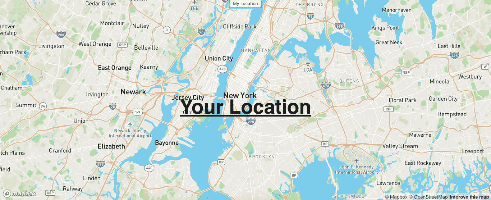
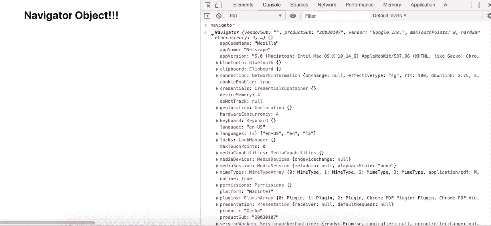
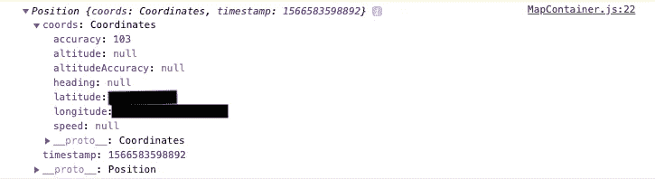
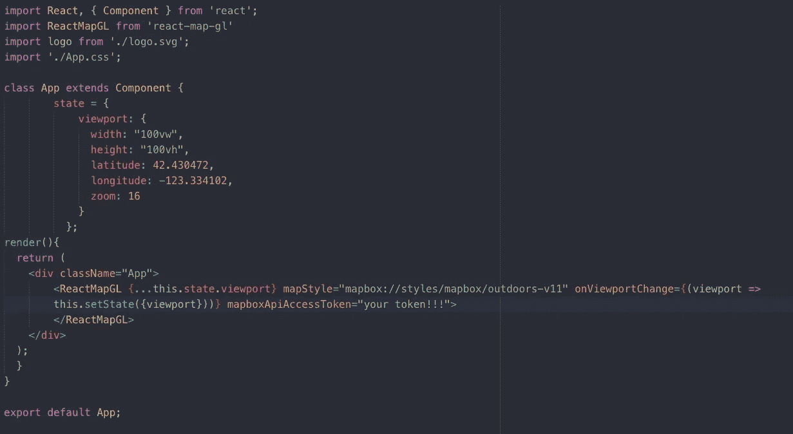
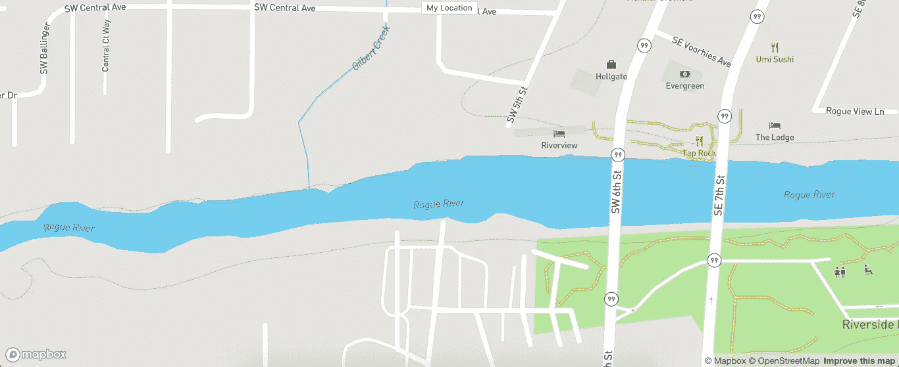
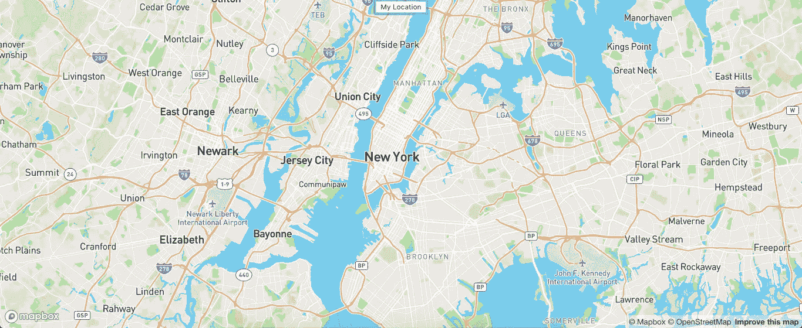

# Mapbox GL JS 入门:使用地理定位的用户位置

> 原文：<https://betterprogramming.pub/getting-started-with-mapbox-gl-js-user-location-with-geolocation-f32c3e323526>

## 创建一个你可以设置到任何位置的地图，用一个按钮重新定位到用户的位置



我很高兴来到这里的新领域。我告诉过你我喜欢地图吗？我希望我能早点进入地图框；作为一个开发者和地理爱好者，这是一个梦想成真。

虽然，在这些文章中，我仅仅是记录了如何开始使用它，就像我一样，并且希望它对某些人有用。也可以阅读第 1 部分，【React 和 MapBox GL JS 入门。

# 目标:切换到用户的位置

这实际上是一个非常简单的任务。

如果您熟悉 React 并遵循了之前的教程，那么您将会非常出色。如果你还没有建立一个地图，跟随我上面链接的第一个教程。

# 我们需要什么

1.  我们在上一个教程中建立的地图。
2.  `navigator.geolocation.getCurrentPosition()`

差不多就是这样。这非常简单，几分钟后，你就可以点击一个按钮，地图就会放大到你所在的位置。

最后你会说:“哎呀达拉斯，多么强大的概念。也很容易！”

# 深潜

## 航海家

除非您已经使用 JavaScript 有一段时间了，否则您可能没有听说过`navigator`对象。当我们找到我们的用户时，这将对我们非常有用。

这是一个 JavaScript 特性，在所有主流浏览器上都可用。我不会详细介绍它，但是如果您检查一个网页，在控制台中键入 navigator，然后打开 navigator 对象，您会看到类似这样的内容:



正如 w3Schools 所说:

> "导航对象包含关于浏览器的信息."

啊哦，这意味着任何网站都可以通过 navigator 对象随时访问我的位置？你以后会明白为什么答案是否定的。

## 导航器.地理定位

您将注意到导航对象中的一个键，标记为`geolocation`。这就指向了一个有键的对象，所有的键我都不知道是什么功能(除了`getCurrentPosition`)。

## navigator . geolocation . getcurrentposition

现在，在那些开胃菜之后，我们有主菜，即`function`。所以，`navigator.geolocation.getCurrentPosition`返回一个函数。这个函数是异步的，需要回调。

大致结构是这样的:

```
navigation.geolocation.getCurrentPosition(position => { // right now "position" is an object
})
```

这将返回一个位置对象。一个坐标键，这个对象包含了你现在所在位置的纬度和经度。

看起来是这样的:



这就是你获取用户位置的方法。

# 将此应用于我们的应用程序

所以，这个概念很简单。在页面加载时(或者你可能想要一个按钮什么的)，我们可以获取用户的当前位置并更新`viewport`状态。

对于本教程，我们将使用一个按钮。到目前为止，我们有这个(来自上一个教程)。它放大到俄勒冈州格兰特山口的一个点(美丽的地方)。



但是，我们更希望它能放大到我们的位置。因此，我们将制作一个按钮，一旦点击，它将放大到我们的位置。

```
setUserLocation = () => {
            navigator.geolocation.getCurrentPosition(position => {
                let newViewport = {
                    height: "100vh",
                    width: "100vw",
                    latitude: position.coords.latitude,
                    longitude: position.coords.longitude,
                    zoom: 12
                }
                this.setState({
                    viewport: newViewport
                })
            })
        }
```

1.  在`ReactMapGL`组件上方添加一个按钮。
2.  在里面放一个`onClick`，它将改变我们组件的状态。

所以，现在我们在`App.js`中的渲染是这样的:


## 重要说明

还记得之前我说“啊哈这是说任何网站都可以通过 navigator object 随时访问我的位置？你稍后会明白为什么答案是否定的。

现在是以后。

幸运的是，如果用户不想分享他们的位置，他们不必这样做。它是内置的，浏览器首先请求用户的许可(以警告的形式)。

## **点击按钮前的**



## **点击按钮后(应该是你所在的位置)**



是的，我搬到了“世界上最大的小苹果”。

# 准备好向地图添加标记了吗？

[带有标记组件的用户位置标记](https://levelup.gitconnected.com/getting-started-with-react-and-mapbox-gl-js-user-location-marker-with-marker-component-716a3f1abf83)

# **结论**

地图是炸弹。我真的很喜欢玩 MapBox 并写一些关于它的东西。现在你有了一个可以设置到任何你想要的位置的地图和一个可以重定位到用户位置的按钮。

感谢阅读，我希望这是有帮助的。在下一篇文章中，我将介绍如何在地图上添加点。

# 资源

*   [之前的地图框教程](https://medium.com/swlh/getting-started-with-react-and-mapbox-gl-js-daa96477dd2c)
*   [MDN 地理定位](https://developer.mozilla.org/en-US/docs/Web/API/Navigator/geolocation)