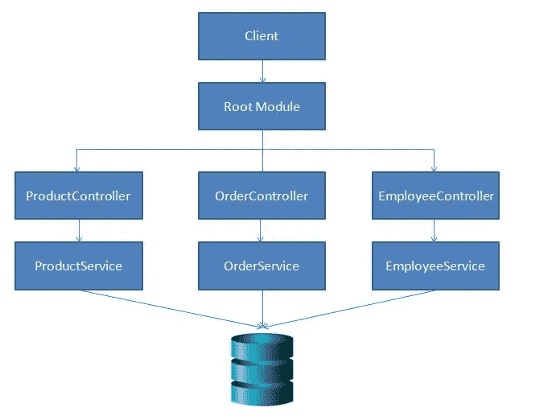

# NestJS 入门

> 原文：<https://betterprogramming.pub/getting-started-with-nestjs-a4e8b0b09db4>

## 为什么您应该在下一个项目中考虑 NestJS


这是 Node.js 框架系列的第一部分，称为 [NestJS](https://nestjs.com/) 。在本文中，我们将了解为什么以及如何使用 NestJS。

# 我的 Node.js 故事

我从 2017 年开始使用 Express.js，我爱 express . js——它设计得很好，我们可以插入任何 JavaScript 库并使用它。

我曾经是一名. Net 开发人员，现在在 Angular 工作。在使用 ExpressJS 时，我确实错过了一些事情。

## 角生态系统对 Node.js/Express.js 生态系统

*   **CLI:** Angular 为我们提供了一个轻松启动新项目的 CLI。即使在。我可以使用命令行界面创建一个应用程序。虽然有许多生成器可用，但使用带有 ExpressJS 的 CLI 将是一个很好的补充。
*   **干净的架构:** ExpressJS 没有定义任何干净的架构，当然，这也不是 ExpressJS 的目的——因为你可以自由定义自己的架构。但是对于一个企业应用程序，我更喜欢有一个干净的和定义良好的架构。
*   **代码共享:**对于一个大型企业应用程序，我们可能需要在多个应用程序甚至 API 之间共享代码。在其他编程语言中，这可以通过使用库来实现。在 ExpressJS 中，我们可以创建一个 npm 模块，并通过 Artifactory 使其可用。

# 内斯特来救援了

NestJS 是一个基于 ExpressJS 编写的框架，它是用 TypeScript 编写的。让我们来看一些优点:

*   **TypeScript 支持:** NestJS 支持 TypeScript，这让我很舒服，因为我在使用 Angular 时已经使用 TypeScript 很长时间了。您也可以选择 JavaScript。
*   代码共享: NestJS 支持使用 CLI 创建库和应用程序。共享代码变得非常容易，成为企业应用程序的绝佳选择。
*   **monorepo 支持:** Angular 支持 monorepo，从版本 6 开始，NestJS 附带了 [monorepo](https://trilon.io/blog/announcing-nestjs-monorepos-and-new-commands) 支持。
*   **学习途径:**我喜欢 NestJS 的另一点是，如果你来自. Net 或 Java 背景，并且有创建 API 的想法，NestJS 很容易学习。此外，如果你是一个 Angular 开发人员，你会感觉很自在，因为它遵循相同的模块化模式。
*   **Fastify 支持:** NestJS 使用 ExpressJS 作为默认框架，但它也支持 Fastify，可以很容易地配置。

# 体系结构

如果我必须定义使用 NestJS 创建的 API 的架构，它看起来是这样的:我们有一个可用的根模块，它将用于配置数据库提供者，定义控制器，添加中间件，添加管道和防护，以及提供服务。



我们还可以为每个控制器配备一个模块。我们将在接下来的文章中看到如何实现这一点。一旦我们的模块收到请求，它将被重定向到相应的控制器(它将处理请求)。服务是可选的，但是我们应该尝试使用服务来遵循单一责任原则(SRP)。

# 装置

现在，我们有了为什么要使用 NestJS 的想法。让我们看看如何使用它。

*   在开始使用 NestJS 之前，我们需要安装 NestJS CLI。运行以下命令以全局安装 CLI:

```
npm install -g @nestjs/cli
```

*   你也可以从 GitHub 下载[启动项目](https://github.com/nestjs/typescript-starter)并使用。

# 创建我们的第一个 API

*   安装完 CLI 后，运行以下命令创建一个名为`shoppingAPI`的新应用程序。我们将在接下来的作品中使用相同的 API。

```
nest new shoppingAPI
```

*   CLI 使用 Typescript 作为默认语言创建应用程序。如果您喜欢 JavaScript 作为语言，您可以运行以下命令:

```
nest new shoppingAPI -l JS
```

# 运行和测试 API

一旦创建了一个新项目，我们可以使用下面的命令来运行应用程序。

```
cd shopping-API
npm start
```

默认情况下，该应用程序配置为在端口 3000 上运行。一旦已经定义了一个控制器，访问 [http://localhost:3000/，](http://localhost:3000/)，您将得到`Hello World!`作为响应。

我们已经用 NestJS 创建了第一个应用程序，只需要很少的配置。在下一篇文章中，我们将浏览应用程序结构，并将配置我们自己的控制器来处理 HTTP 请求。

# 结论

[NestJS](https://nestjs.com) 真的很好上手，而且如果你已经用过。Net，Java，甚至 ExpressJS，大部分概念都差不多。

它提供了一个 CLI，通过使用它，我们可以轻松地搭建我们的应用程序，并更多地关注我们的代码。对于企业应用程序，使用 NestJS 模块将代码分割到多个模块变得非常容易。

特别感谢 [@MarkPieszak](https://medium.com/@MarkPieszak) 的点评。