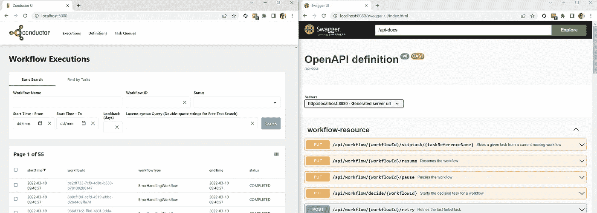
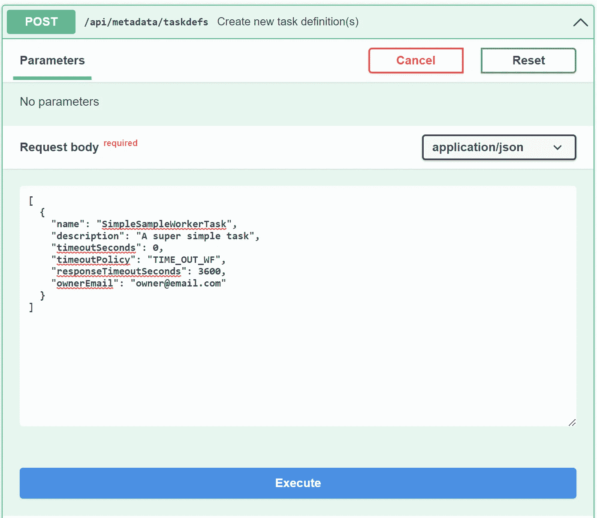
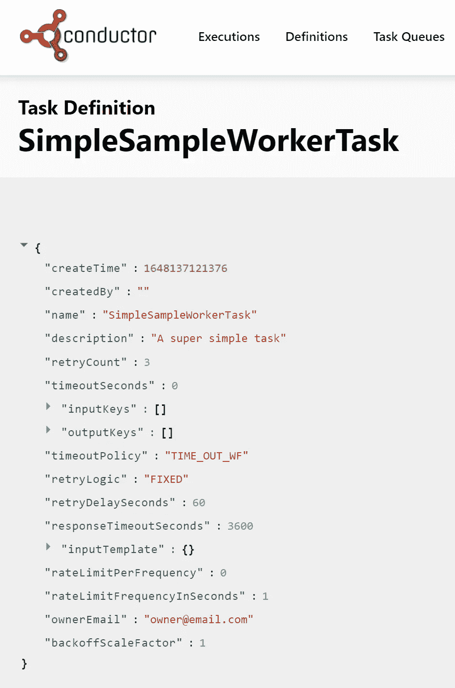
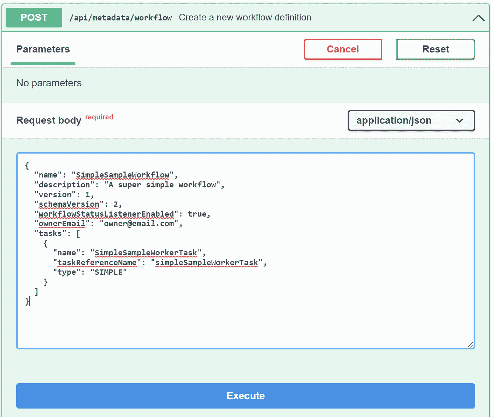
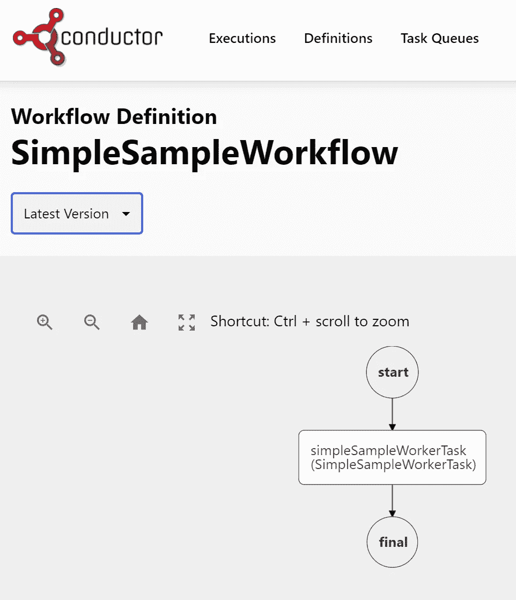
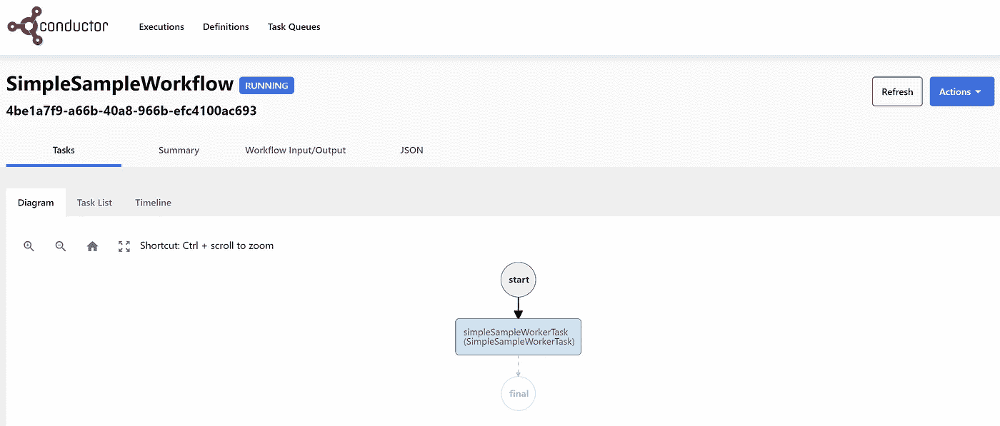
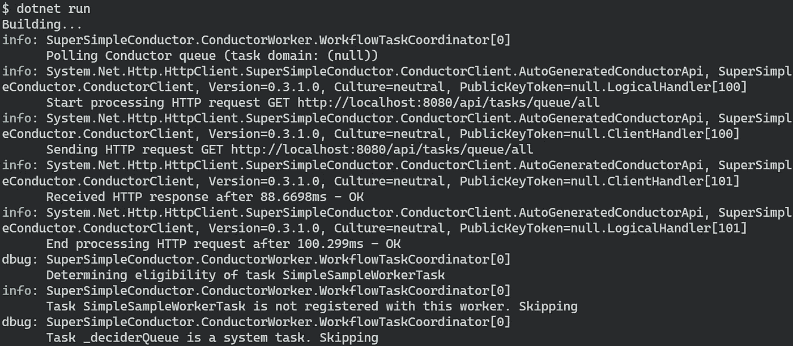
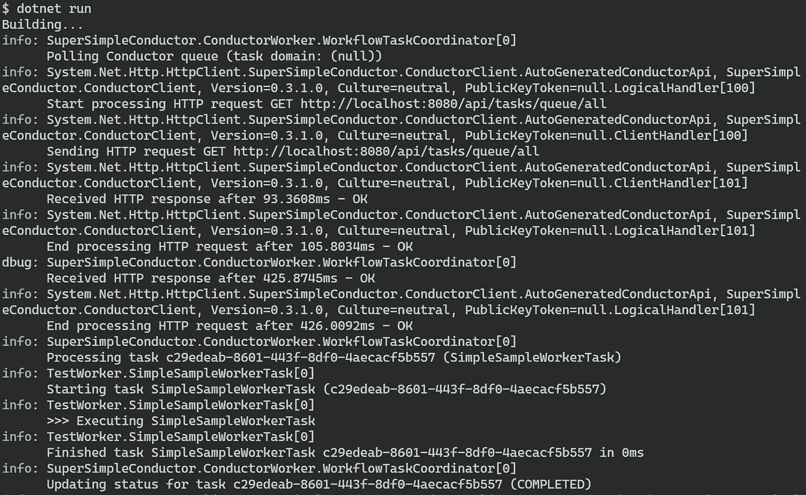
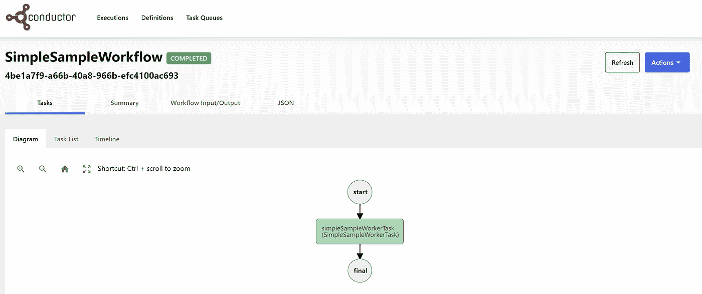

# 网飞指挥入门。使用超简单导体的网络

> 原文：<https://betterprogramming.pub/getting-started-with-netflix-conductor-in-net-using-supersimpleconductor-ed8a02120c1>

## 在网飞指挥系统中运行您的第一个工作流程的分步指南。


网飞指挥家 GitHub 资料库中的网飞指挥家徽标。

# 关于这篇文章

网飞指挥的两个关键概念是工人和任务。Workers 是包含任务实现的微服务，由 Conductor 作为工作流的一部分来执行。任务是工作流的构建块，即由工作流所表示的流程执行的步骤。

实现工人和任务的库可用于各种编程语言，最著名的是 Go、Java 和 Python。在本文中，我将介绍一个。名为 [SuperSimpleConductor](https://github.com/erikbrgr/supersimpleconductor) 的网络，是我开发并维护的。

在本文中，我将使用 SuperSimpleConductor 库来展示使用. NET 开始使用网飞指挥器是多么容易

# 什么是网飞指挥家？

网飞指挥是一个工作流程编排引擎，由网飞创建，用于“编排基于微服务的流程”(来源:[网飞指挥文档](https://netflix.github.io/conductor/))。网飞指挥的完整功能列表位于[这里](https://netflix.github.io/conductor/)，但一些关键功能是:

*   工作流和任务定义以 JSON 格式实现。这允许版本控制和对定制工具的简单支持，以创建和管理工作流和任务。
*   任务和工作者，即分别构成工作流和承载它们的微服务的构建块，是完全语言不可知的，这允许以最适合任务的语言来完成实现。
*   数据库架构是可插拔的，这意味着我们可以选择我们想要用于 Conductor 的数据库。Conductor 附带了许多现成的插件，支持 Dynomite(也是网飞开发的)、MySQL 和 PostgreSQL。
*   网飞指挥配备了一个(可选)用户界面，允许洞察和控制工作流程，如(重新)开始，暂停，停止。
*   整个项目是开源的，并且正在被积极地开发和支持。

简而言之，网飞指挥允许您自动化和管理由多个任务组成的流程(这些任务本身可能就是流程)，这些任务可能需要以可靠、一致和可扩展的方式按顺序执行。

在我目前的项目中，我们使用网飞 Conductor 和 PostgreSQL 来运行预定的 ETL 过程、创建报告、下载和上传文件，以及进行监控和报警。我们还研究了如何使用 Conductor 来自动提供用户帐户和其他基础设施。

# 在本地运行网飞指挥

为了按照本文编写代码，您需要一个运行中的 Conductor 实例。最简单的方法是使用 Docker 在本地运行 Conductor。使用我下面写的文章，您应该在几分钟内就可以开始运行了。

[](/running-netflix-conductor-3-in-docker-using-elasticsearch-7-and-postgresql-b415988dd74a) [## 使用 Elasticsearch 7 和 PostgreSQL 在 Docker 中运行网飞导体 3

### 所有这些都包含在一个简单、可重复和可维护的过程中

better 编程. pub](/running-netflix-conductor-3-in-docker-using-elasticsearch-7-and-postgresql-b415988dd74a) 

如果您遵循了本文中的步骤，您应该能够访问位于 [http://localhost:5000/](http://localhost:5000/) 的 Conductor UI 和位于[http://localhost:8080/swagger-UI/index . html](http://localhost:8080/swagger-ui/index.html)的 Conductor 服务器 API。



导体 UI 和服务器 API 并行运行。

现在我们已经启动并运行了 Conductor，让我们开始使用它吧！

# 创建任务

我们的第一步是向 Conductor 注册任务。我们的任务定义如下:

这里我们正在创建`SimpleSampleWorkerTask`任务。

我已经尽可能保持了最小的定义。关于你还能做什么的详细信息，你可以参考文档[这里](https://netflix.github.io/conductor/configuration/taskdef/)。

为了注册任务，我们使用 Conductor 服务器 API 的`/api/metadata/taskdefs`端点。

我们将使用 Swagger 接口来调用端点。注意，端点需要一个 JSON 数组，所以我们用`[ ]`包装我们的定义。



使用 Conductor 服务器 API 注册任务。

点击**执行**后，我们可以看到任务出现在指挥界面:



Conductor UI 中的任务定义。

# 创建工作流

然后，我们使用`api/metadata/workflow`端点在 Conductor 中创建工作流。

同样，我已经尽可能保持了最小的定义。有关您可以使用的其他属性的详细信息，您可以参考[文档](https://netflix.github.io/conductor/configuration/workflowdef/)。



使用 Conductor 服务器 API 注册工作流。

并检查`SimpleSampleWorkflow`是否出现在指挥界面中:



Conductor UI 中的工作流定义。

现在我们已经注册了我们的工作流，我们可以使用`api/workflow/{name}`端点运行它的一个实例。



在 Conductor UI 中运行的工作流。

太好了！工作流现在正在运行，等待一个工作人员拾取第一个任务，即`SimpleSampleWorkerTask`。

接下来，我们将实现 Worker 进程。

# 创建工人

使用 SuperSimpleConductor，创建一个 Worker 非常简单(看到我在那里做了什么吗？).

首先，我们创建一个新的后台工作程序项目。

```
mkdir conductor-worker
cd conductor-worker
dotnet new worker -f net5.0
```

请注意，我正在使用。这里是网 5。超简单导体支架。NET Standard 2.1 或更高版本，所以您在这里选择的任何满足该要求的都可以。

我们不需要`Worker.cs`文件，所以删除它是安全的。

然后，我们添加 NuGet 的超级简单导体包。

```
dotnet add package SuperSimpleConductor.ConductorClient
dotnet add package SuperSimpleConductor.ConductorWorker
```

并用以下代码替换`Program.cs`类中的代码:

使用`dotnet run`运行 worker 会产生以下输出:



运行工作线程。

注意，我更改了`appSettings.Development.json`中的日志设置以获得更好的输出(默认情况下，它被设置为只记录`Information`消息):

我们可以看到发生的情况是工人轮询指挥队列并找到 2 个任务:任务`SimpleSampleWorkerTask`和任务`_deciderQueue`。后者是一个系统任务，所以工人跳过它。

它还通知我们`SimpleSampleWorkerTask`没有向这个 worker 注册。那是因为我们还没有这样做。

那么我们如何做到这一点呢？

按照这篇文章的主题，这也是超级简单的。

在`Program.cs`中，行

加载指定的程序集(在这种情况下只有`conductor-worker`程序集)，并向 worker 注册从`IWorkflowTask`接口派生的任何类。

这意味着我们现在需要做的就是实现`SimpleSampleWorkerTask`类。

# 创建工作任务

要实现`SimpleSampleWorkerTask`，创建一个新文件

```
touch SimpleSampleWorkerTask.cs
```

并粘贴以下代码:

现在，使用`dotnet run`运行 worker 向我们展示了`SimpleSampleWorkerTask`被拾取并执行:



运行添加了任务的工作线程。

最后，Conductor UI 中的工作流程显示为`Completed`。



工作流在 Conductor UI 中完成。

就是这样！现在剩下的就是用一个实际的实现替换`SimpleSampleWorkerTask`类中的日志调用。

当然，向工作流程中添加额外的任务应该像重复上述步骤一样简单。Conductor 可以使用并行任务、决策树和各种其他优点来支持非常复杂的工作流。

唯一的限制是你的想象力。

# 最后

一开始，开始使用网飞指挥家可能会令人望而生畏。但是使用正确的库，开始实际上会变得非常简单。

作为 SuperSimpleConductor 项目的一部分，GitHub 上的[提供了`TestWorker`类和上述所有源代码。](https://github.com/erikbrgr/supersimpleconductor)

编码快乐！

本文中的所有代码片段都是使用 [gistbuilder](https://levelup.gitconnected.com/create-beautiful-embedded-code-without-the-hassle-of-creating-github-gists-fe6ce2fa0109) 创建的。如果您觉得这篇文章很有用，您可能会对我们如何在项目中安排工作流感兴趣:

[](https://levelup.gitconnected.com/cron-docker-the-easiest-job-scheduler-youll-ever-create-e1753eb5ea44) [## Cron + Docker =你将创建的最简单的作业调度程序

### 最大功率和灵活性的两个组件。

levelup.gitconnected.com](https://levelup.gitconnected.com/cron-docker-the-easiest-job-scheduler-youll-ever-create-e1753eb5ea44)