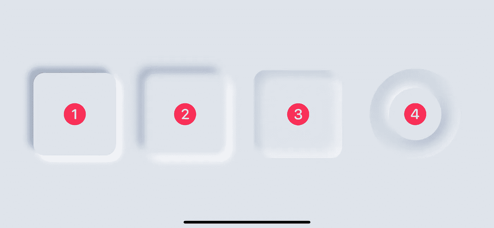
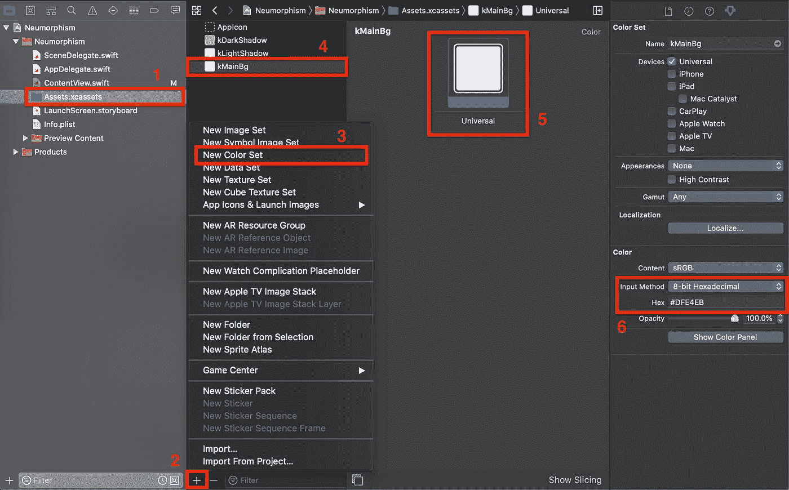
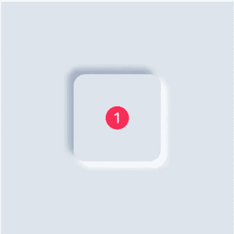
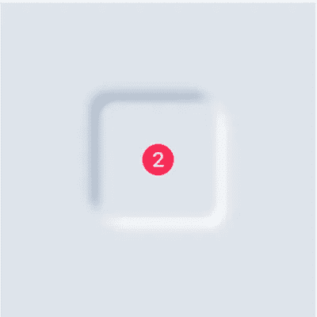
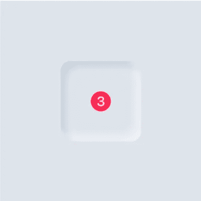
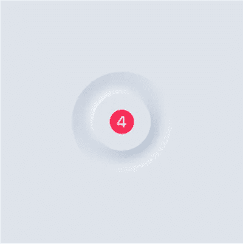

# SwiftUI 中的神经形态入门

> 原文：<https://betterprogramming.pub/getting-started-with-neumorphism-in-swiftui-459843ad05a6>

## 如何设计异形按钮

使用 SwiftUI 的神经变形效果(图片由作者提供)

我在[运球](https://dribbble.com/)中寻找最新的 UI 和 UX 设计趋势，我听说了一个经常被称为*神经形态*的概念。

设计社区认为这是 2020 年的设计趋势，一种在 UI 组件中模仿真实世界感觉的趋势。你可以在[运球](https://dribbble.com/search/neumorphism)上获得大量的设计模板和参考资料。

解释什么是神经形态及其历史超出了本文的范围。您可以在“[用户界面中的神经形态](https://uxdesign.cc/neumorphism-in-user-interfaces-b47cef3bf3a6)”、“[skeumorphism/神经形态 UI 趋势](https://medium.muz.li/skeuomorphism-neumorphism-ui-trend-e7b78792bd21)”和“[神经形态”中了解更多关于神经形态的信息。UI 设计的下一件大事](https://medium.com/@openGeeksLab/neumorphism-the-next-big-thing-in-ui-design-11e703df3ab0)？”

好了，让我们开始吧，看看如何使用 SwiftUI 在下一个 iOS 应用中实现 neumorphism。正如你可能意识到的，SwiftUI 使我们能够以最少的努力实现任何类型的复杂 UI 和 UX，无论它是否是今年的趋势。

在继续下一步之前，看看上面的图片，看看我们将要实现什么。您可能已经猜到了，我们将使用 SwiftUI 提供的默认实体形状，带有默认的修饰符，如`fill()`、`frame()`、`shadow()`、`blur()`、`opacity()`和`mask()`。

# 颜色很重要

我发现颜色是这里的主要因素，所以选择正确的颜色很重要。如果你没有选择正确的色调，你会浪费很多时间，就像我一样。

我们需要三种相同颜色的阴影:一种用于主要背景，另外两种用于明暗阴影。打开`Assets.xcassets`文件，添加下面的颜色(为简洁起见，使用相同的名称)。

1.  背景颜色: **#** DFE4EB(命名为`kMainBg`)
2.  光影颜色:#FFFFFF(取名`kLightShadow`)
3.  深色阴影颜色:#A2B0C5 (取名`kDarkShadow`)

为资产添加颜色

1.  选择`Assets.xcassets`文件。
2.  点击左下角的+按钮。
3.  从菜单中选择新颜色集选项。单击时，新的颜色集将被添加，弹出窗口将自动关闭。
4.  选择新添加的颜色，默认命名为“颜色”。我已经选择了我已经为演示添加的名称。
5.  选择为通用设备添加的颜色阴影。
6.  从下拉列表中将输入法更改为 8 位十六进制，输入上面提供的颜色十六进制值，然后点击 enter。

你完了。按照上述步骤添加所有三种颜色。

# 效果 1。

异形效应 1

我们将使用默认的`RoundedRectangle` 形状来获得这种效果。这是其余三个中最简单的一个。

1.  首先，添加一个`VStack`作为我们实际内容的容器，并将框架设置为边对边横跨屏幕。然后使用`background()`修改器将`VStack` 背景颜色设置为`Color(“kMainBg”)`。
2.  用`cornerRadius = 20`在`VStack`内部创建一个`RoundedRectangle`形状。
3.  使用`fill()`修改器应用矩形的主要背景色(`Color(“kMainBg”)`)。
4.  使用`frame()`修改器将矩形的大小设置为`150 X 150`。(我听到了，对，现在是圆角正方形，不是长方形。您可以选择不同的宽度来获得矩形，也可以根据需要使用任何尺寸。)
5.  使用深色(`“kDarkShadow”`)添加阴影，我们在资产中添加了`radius = 5`和偏移`x = -10`和`y = -10`。半径定义了阴影的大小，偏移定义了阴影相对于视图的位置(在我们的例子中是矩形)。这将在矩形的左侧和顶部添加一个黑色阴影。
6.  使用我们在资产中添加的光色(`“kLightShadow”`)添加另一个阴影，并偏移`radius = 5`和`y = 10`。这将在矩形的右侧和底部添加阴影。
7.  或者，如果你想在矩形上面有任何内容，你可以使用`overlay()`修改器给矩形添加一个`overlay`。我已经添加了一个`Image`视图作为叠加。
8.  您已经完成了效果 1。启用预览或在模拟器或设备中运行应用程序来检查结果。

# 效果二。

异形效应 2

我们将使用默认的`RoundedRectangle` 形状来获得这个效果。这和效果 1 很像。

1.  遵循效果 1 中的步骤 1 至 6。
2.  用`radius = 5`涂抹`blur`。半径定义模糊的径向大小，当半径较大时，模糊会更加分散。
3.  或者，如果您希望矩形上方有任何内容，您可以使用`overlay()`修改器向矩形添加一个`overlay`。我添加了一个`Image`视图作为叠加。
4.  你完成了你的效果 2。启用预览或在模拟器或设备中运行应用程序来检查结果。

# 效果三。

异形效应 3

我们将使用三个`RoundedRectangle` 形状，一个在另一个之上，大小不同，连同蒙版`RoundedRectangle`。

1.  首先，添加一个`VStack`作为我们实际内容的容器，并将框架设置为边对边横跨屏幕。然后使用`background()`修改器将`VStack`背景颜色设置为`Color(“kMainBg”)`。
2.  添加`ZStack`容器以保持三个`RoundedRectangle`一个在另一个之上。
3.  用`radius = 20`添加第一层`RoundedRectangle`。使用`Color(“kMainBg”)`设置填充，并设置`frame = 150 x 150`。这将作为你剩下的两个矩形的基础层。
4.  用`radius = 20`添加第二层`RoundedRectangle`。使用`Color(“kMainBg”)`设置填充，并设置`frame = 135 x 135`。我们将框架设置为小于第一个矩形，以允许阴影从第二层移动到第一层。阴影将填充两层之间的空隙。
5.  用`radius = 20`添加第三层`RoundedRectangle`。使用`Color(“kMainBg”)`和`frame = 150 x 150`设置填充，就像第二层一样。
6.  用`radius = 15`和`opacity = 0.7`将模糊应用到`RoundedRectangle`的第二层和第三层。这一次我们需要在应用阴影之前应用模糊和不透明。修饰符的顺序很重要。
7.  用`radius = 5`和偏移`x = -10`和`y = -10`给第二层应用深色(`“kDarkShadow”`)阴影。这将在矩形的左侧和顶部添加一个阴影。
8.  用`radius = 5`和偏移`x = 10`和`y = 10`将浅色`“kLightShadow”`阴影应用到第三层。这将在矩形的右侧和底部添加一个阴影。
9.  最后，你需要使用`mask()`修改器给`ZStack`添加一个带有`radius = 20`遮罩的`RoundedRectangle`。(这个很重要。)
10.  如果不添加遮罩，您将获得效果 2 的外观和感觉。但是如果你给效果 2 添加一个蒙版，你不会得到效果 3，因为我们已经用不同的帧玩了不同的层。
11.  可选地，如果你想在矩形上面有任何内容，你可以使用`overlay()`修改器给矩形添加一个覆盖。我添加了一个`Image`视图作为覆盖图。
12.  你完成了你的效果 3。启用预览或在模拟器或设备中运行应用程序来检查结果。

# 效果 4

异形效应 4

我们将使用三个`Circle`形状，一个在另一个之上，具有不同的尺寸，以及遮罩`Circle`。

1.  首先，添加一个`VStack`作为我们实际内容的容器，并将框架设置为边对边横跨屏幕。然后使用`background()`修改器将`VStack`背景颜色设置为`Color(“kMainBg”)`。
2.  添加`ZStack`容器以保持三个`Circle`一个在另一个之上。
3.  用`Color(“kMainBg”)`填充添加第一层`Circle`并设置`frame = 150 x 150`。这将作为你剩下的两个`Circle`的基础层。
4.  用`Color(“kMainBg”)`填充添加第二层`Circle`，设置`frame = 100 x 100`。我们给这个圆一个较小的尺寸，原因和效果 3 一样。
5.  用`Color(“kMainBg”)`填充添加第三层`Circle`，设置`frame = 80 x 80`。
6.  用`radius = 20`给第二层添加模糊。我们想隐藏层，但我们需要它的阴影。没有必要添加模糊的第三层，因为我们需要它是可见的。
7.  将`kDarkShadow`色阴影(`radius = 40`、`x = -18`、`y = -18`)添加到圆圈左侧和顶部的第二层，将`kLightShadow`色阴影(`radius = 40`、`x = 18`、`y = 18`)添加到圆圈底部和右侧。
8.  添加`kLightShadow`色阴影(`radius = 12`、`x = -7`、`y = -7`)到第三层，在圆的左侧和顶部，添加`kDarkShadow`色阴影(`radius = 12`、`x = 7`、`y = 7`)到圆的底部和右侧。
9.  最后，你需要使用`mask()`修改器给`ZStack`添加一个`Circle`遮罩。(这个很重要。)
10.  可选地，如果你想在矩形上面有任何内容，你可以使用`overlay()`修改器给矩形添加一个覆盖。我添加了一个`Image`视图作为覆盖图。
11.  你完成了你的效果 4。启用预览或在模拟器或设备中运行应用程序来检查结果。

# 结论

通过使用`shadow()`、`fill()`、`blur()`、`opacity()`、`frame()`和`mask()`等修改器，你可以在任何种类的形状或视图上实现变形效果。以此为基础，根据你的需求实现你的 UI / UX。

你可以在这里找到[的完整代码](https://github.com/karthironald/Neumorphism)。

谢谢！