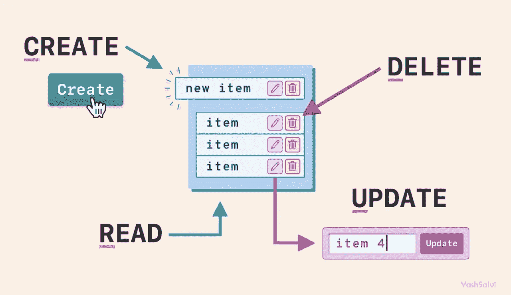

# Pyvcloud 入门 Python 库

> 原文：<https://betterprogramming.pub/getting-started-with-pyvcloud-a-python-library-2e77092ed3ea>

## 创建第一台虚拟机的快速设置


照片由[克里斯蒂娜·莫里路](https://www.pexels.com/@divinetechygirl?utm_content=attributionCopyText&utm_medium=referral&utm_source=pexels)从[派克斯](https://www.pexels.com/photo/woman-programming-on-a-notebook-1181359/?utm_content=attributionCopyText&utm_medium=referral&utm_source=pexels)拍摄

# ***什么是 Pyvcloud？***

您是否使用 VMWare 的 vCloud Director？您是否厌倦了重复创建虚拟应用程序、虚拟机等平凡步骤？你在寻找

> 《如何使用 pyv cloud》《v cloud Director 的 Python 包》

如果您的答案是肯定的，那么来看看 VMWare 自己的 Pyvcloud 吧。

> 用 VMWare 自己的话说，“Pyvcloud 就是 VMWare vCloud Director 的 Python SDK”。

简单来说，Pyvcloud 是一个用于 VCloud Director 管理的 Python 库，您可以在 vCloud Director 上执行的所有任务都可以通过这个易于使用的 Pyvcloud 来完成！对于一些目前不可用的任务有一些例外，我们将在接下来的讨论中涉及它们。

***开始之前:***

1.  使用[下载 python](https://www.python.org/downloads/) 在您的机器上下载并安装 Python
2.  设置一个 IDE，有很多 IDE 可供选择，但是我建议在本教程中坚持使用[而不是代码](https://code.visualstudio.com/download)。
3.  智能感知拯救:将微软的 Python 扩展添加到 VS 代码中

## ***安装 pyvcloud***

在 Python 程序中使用之前，您必须在系统上安装`pyvcloud`。运行下面给出的命令

```
pip install pyvcloud
```


[客户帕特森](https://unsplash.com/@cbpsc1)在 [unsplash](https://unsplash.com/photos/dYEuFB8KQJk) 上拍摄的照片

# ***将 Python 连接到 VCD***

对于本教程，我们将创建一个名为`VCD_Utils`的类，在其中我们将定义所有的方法。

构造函数建立 python 与 VCD 的连接。在此代码片段*、*中，客户端是 v cloud Director REST API 的底层接口。它需要你的 VCD 的主机名和其他参数是可选的；我们可以根据您的日志要求将它们设置为 True 或 False。BasicLoginCredentials 完成主要的连接工作，并为您设置连接。

Org 和 VDC 是构造函数，在 Pyvcloud 中，记住在使用构造函数时，你只需要两个东西:客户端对象和各自的资源。例如，为了构造一个 VDC 对象，我们提供了客户端和 VDC 的资源。我们将把 org 和 VDC 对象存储为实例变量，因为它们需要用于进一步的操作*。*

*注意:对于我们的教程，我们有一对一的映射，即单个 vApp 仅包含一个虚拟机。*

助手方法:

这些是帮助者的方法，它们会让我们的生活变得更容易。

`get_vapp()`接收`vapp_name`，从我们的数据中心获取它的资源，然后我们使用构造函数创建 vAPP 的 XML 对象。同样的情况也出现在创建一个 VM 对象并返回它的`get_vm()`方法上！最后一个方法`does_vapp_exist()`只是检查给定的`vApp`是否存在于我们的 VCD 中，如果是- >返回真，否则返回假*。*

*在 VCD 上执行 CRUD 操作:*



照片由亚什·萨尔维提供

*创建 vApp:*

此方法需要新 vApp 的名称、制作 vApp 的模板以及其他可选参数，如网络、存储策略等。实际上，我们使用 VCD 的`instantiate_vapp()`方法创建`vApp`并返回`vApp` XML 对象。现在，创建后我们可以检查`vApp`是否是由我们的助手`does_vapp_exist()`方法创建的。

*注意:创建 vApp 时，其状态为未解析，即电源状态= 0，直到应用的状态从未解析变为断电(电源状态= 8)，我们无法在 vApp 上执行任何操作。*

# ***读取 vApp 的数据***

现在，我们可以玩我们的 VApp 了，我们需要由 pyvcloud 的 vApp 类构造的 vApp 对象。`vApp`对象包含了大量的方法，多亏了我们的智能感知，通过在它后面加一个点就可以很容易地看到这些方法。为了读取 vApp 的数据，让我们获取虚拟机的 IP 地址。

注意:在大多数情况下，Pyvcloud 返回需要转换成字典的 XML 数据。Pyvcloud 有一个内置的`to_dict()`方法可以帮助我们进行这种转换，我们可以在控制台上看到字典内容！

## ***更新 vApp***

现在，我们将更新虚拟机的 CPU。为此，我们需要虚拟机对象驻留在我们的 vApp 中。我们将使用我们的助手方法 get_vm()来获取 vm 对象。然后，可以使用 VM 对象来更新 CPU。

## ***删除 vApp***

现在，我们将删除 vApp。删除也很简单。我们只需要`vapp_name`，把它提供给 Pyvcloud，然后 boom 就把它从 VCD 上删除了。这里的 force true 仅仅意味着如果它在*上，就关闭其中的虚拟机。*如果虚拟机已启动，而 force true 没有通过，那么我们将会得到一个错误！

唉！我们已经写了我们的类。

让我们通过为我们的类创建一个对象来收获果实并让我们的工作得到回报。

最后但同样重要的是，让我们注销我们的 VCD。

到目前为止，您应该已经成功地在 VCD 上执行了 CRUD 操作。要深入了解`pyvcloud`，你可以浏览他们的[文档。](https://vmware.github.io/pyvcloud/)

暂时就这样吧！你可以在我的 [GitHub 库](https://github.com/Raxy45/getting_started_with_pyvcloud)上找到完整的代码。