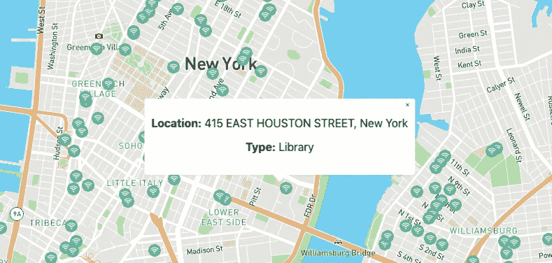
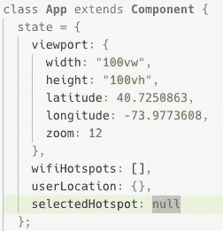
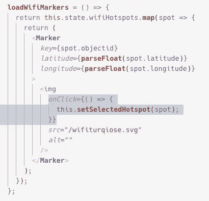
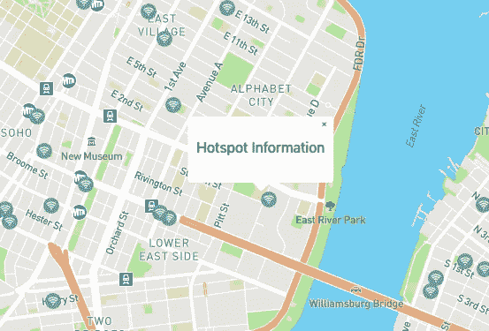
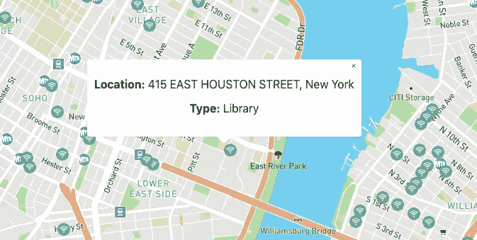

# React 和 MapBox GL JS 入门

> 原文：<https://betterprogramming.pub/getting-started-with-react-and-mapbox-gl-js-using-popup-component-with-marker-d76c72824423>

## 使用带有标记的弹出组件


# 首先(你知道程序):

以下是本系列前几篇文章的链接。他们做得很好——如果你还没有看的话，看看吧，里面应该有一些有价值的信息！

1.  【React 和 MapBox GL JS 入门

2.[MapBox GL JS 入门:带地理定位的用户位置](https://medium.com/better-programming/getting-started-with-mapbox-gl-js-user-location-with-geolocation-f32c3e323526)

3.【React 和 MapBox GL JS 入门:带有标记组件的用户位置标记

4.【React 和 MapBox GL JS 入门:从 API 设置地图标记。

# 目标:为我们的标记设置一些弹出窗口

我们将以编程方式为每个标记放置弹出窗口。这个结果是这样的:



您可以点击每个标记来显示相关信息。如果您一直关注本系列，您会知道我们一直在使用 API 来呈现标记，因此我们可以使用 ReactMapGL 的`Popup`组件使用每个标记的数据来呈现一个弹出窗口。轻松点。

# 我们需要什么

我们需要以下内容:

*   弹出组件
*   `selectedHotspot`在状态。
*   一点定制。

# 弹出组件

我会让你们自己仔细阅读`Popup`文档:[弹出组件](https://docs.mapbox.com/mapbox-gl-js/api/#popup)

但是我们将只使用所需的纬度和经度属性，并创建一个`onClose`事件监听器。如果你有反应经验，这对你来说不算什么。

我们需要用我们的`ReactMapGL`导入`Popup`组件:

```
import ReactMapGL, { Marker, Popup } from "react-map-gl";
```

# 处于状态的选定热点

现在我们在 state 中创建一个`selectedHotspot`键，它的值是`null`。



每当我们点击一个`Marker`，我们就将状态设置为我们分配给`Marker`的热点对象。我们通过传递一个`onClick`回调函数来做到这一点，该函数返回它的`Marker`的对象。

您会记得，我们迭代了所有的`wifiHotspots`，并为每一个创建了一个`Marker`。这是一个传递回调的好地方。

我们通过在我们的`Marker`中写一个`onClick`，并把对象传递给`setState`来实现。

之后，我们的`loadWifiMarkers`函数看起来像这样:



# setSelectedHotspot 函数

如你所见，我们还没有编写 setSelectedHotspot 函数。这是最基本的国家职能:

```
**setSelectedHotspot** = object => {
  this.**setState**({
     selectedHotspot: object
  });
};
```

# 弹出逻辑

所以现在我们可以设置一个标记被点击时的状态。然后呢？

我们需要做的就是在我们的 JSX 中编写一个三元运算符，有条件地呈现我们的`selectedHotspot`的`Popup`。如果`selectedHotspot`是一个对象，渲染它的`Popup`，如果不是，什么都不做。

然后我们插入一个`onClose`键，它的值是一个点击时将`selectedHotspot`切换回`null`的函数。

## 为了澄清…

标记器`onClick =>`将对象置于`selectedHotspot`状态，组件重新渲染，此时三元运算符将看到状态中的对象并渲染`Popup`组件。

`onClose =>`设置`selectedHotspot` 状态为空，重新渲染组件，不渲染`Popup`。

# **onClose 功能**

```
**closePopup** = () => {
  this.**setState**({
    selectedHotspot: null
  }); 
};
```

这被添加到`loadWifiMarkers`功能的下面。

```
{this.state.selectedHotspot !== null ? (
<**Popup** *latitude*={**parseFloat**(this.state.selectedHotspot.latitude)}
  *longitude*={**parseFloat**(this.state.selectedHotspot.longitude)}
  *onClose*={this.closePopup}
>
  <p>HotSpot Information</p>
</**Popup**>
) : null}
```

你会注意到这打开了我们点击的`Marker`上的`Popup`。当您点击`Popup`时，它关闭。



现在我们可以从我们的`selectedHotspot`中添加我们想要的任何信息。

```
{this.state.selectedHotspot !== null ? (
  <**Popup** *latitude*={**parseFloat**(this.state.selectedHotspot.latitude)}
    *longitude*={**parseFloat**(this.state.selectedHotspot.longitude)}
    *onClose*={this.closePopup}
  >
    <div>
      <p>
        <b>Location:</b> {this.state.selectedHotspot.location}{", "}
        {this.state.selectedHotspot.city}
      </p>
      <p>
        <b>Type:</b> {this.state.selectedHotspot.location_t}
      </p>
    </div>
  </**Popup**>
) : null}
```

我们得到了这个:



# 结论

现在我们可以用我们的`Popup`组件以编程方式呈现弹出窗口，它显示每个热点的信息。这带来了更好的用户体验和基本的应用程序功能。

非常感谢你的阅读！