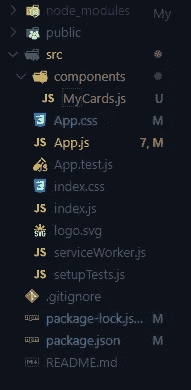
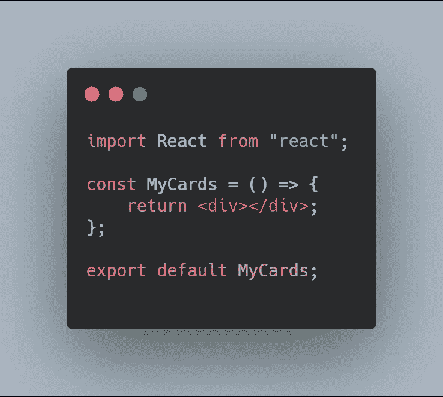
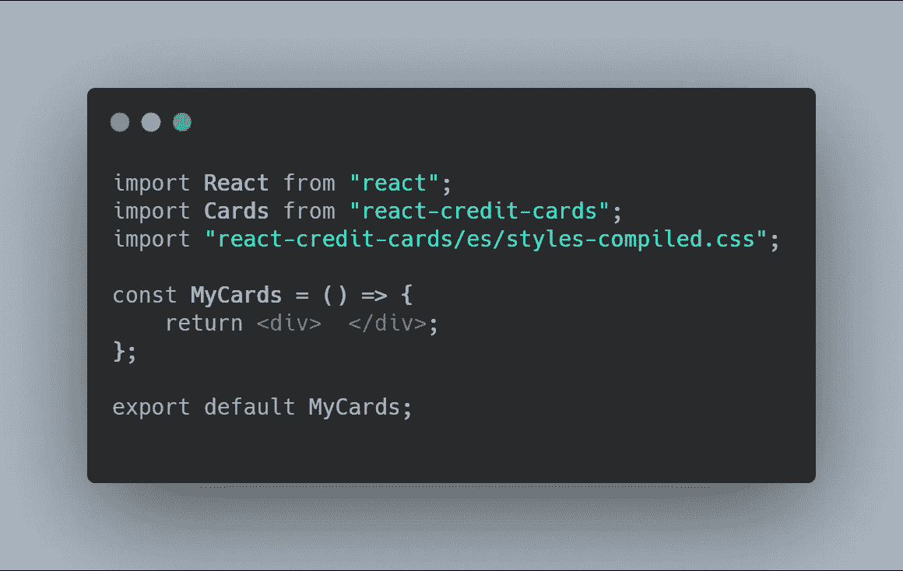
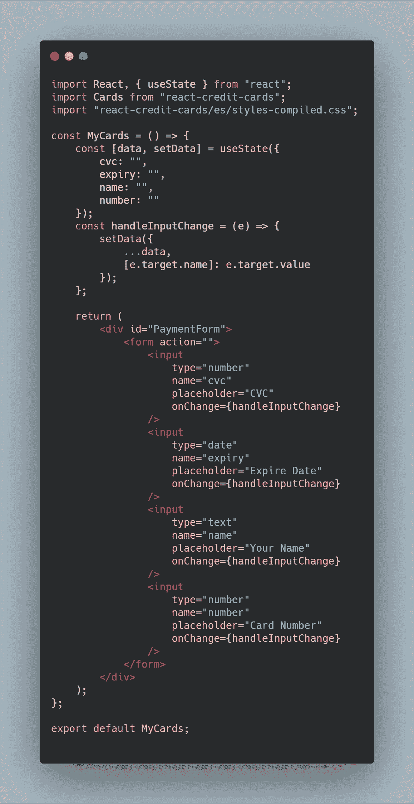
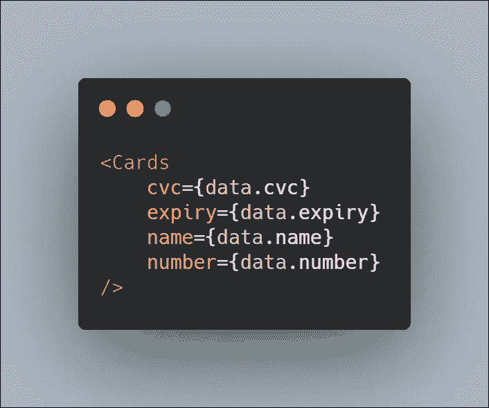
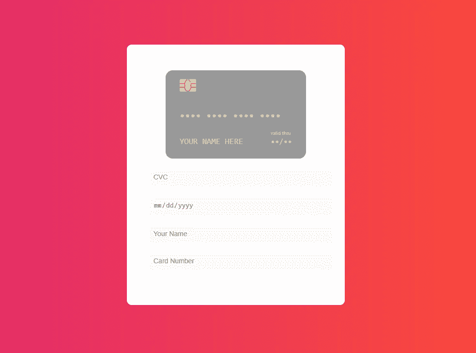

# React 信用卡入门

> 原文：<https://betterprogramming.pub/getting-started-with-react-credit-card-ac44071eeb45>


照片由[rupixen.com](https://unsplash.com/@rupixen?utm_source=unsplash&utm_medium=referral&utm_content=creditCopyText)在 [Unsplash](https://unsplash.com/s/photos/credit-card?utm_source=unsplash&utm_medium=referral&utm_content=creditCopyText) 上拍摄

在本教程中，我们将学习一个有趣的 React npm 包，名为[React-信用卡](https://github.com/Jobayerdev/react-credit-card)。

[演示](https://econ47.netlify.com)

首先，我们用 npm 命令行创建一个 React 应用程序。打开您的终端，在您创建了 React 应用程序后运行`npx create-react-app myapp`。然后输入命令`npm start`。在你启动你的应用之前，你需要用`cd myapp`进入项目目录，然后你运行你的应用。

好，现在让我们继续我们的反应信用卡项目。

# 安装

```
npm install --save react-credit-cards
```

安装完成后，需要用`npm start`再次启动你的 app。

# 设置

现在我们在你的`src`目录下创建一个组件文件夹。在这个文件夹中，我们创建一个文件，并将其命名为`MyCards.js`。现在我们的文件夹结构如下所示:



主目录

打开您的`MyCards.js`文件，并创建一个简单的功能性 React 组件。现在我们的`MyCards.js`文件看起来像这样:



好了，现在我们将从我们的`react-credit-cards`包中导入一些东西。我们从`react-credit-cards`导入两个东西，并将我们的`Mycards.js`文件放在顶部。

*   卡片:`import Cards from "react-credit-cards"`
*   样式表:`import "react-credit-cards/es/styles-compiled.css"`

到目前为止，我们的`MyCards.js`文件是这样的:



MyCards.js

在我们成功地导入卡片和样式表之后，我们继续实际的编码。

*   创建一个状态，并将默认值定义为一个对象
*   创建一个表单，并创建一个变更处理程序

所以现在我们的`MyCards.js`看起来像这样:



MyCards.js

成功完成这一步后，是时候实现我们的`Cards`组件了，它提供了我们的`react-credit-cards`包。



卡片组件接受四个参数作为道具:`CVC`、`expire`、`name`和`number`。这使用状态将我们的值从输入框传递到这个组件的道具。

到目前为止，我们的`MyCards.js`文件包含了所有这些代码:

MyCards.js

好了，现在我们的工作在`App.js`文件中完成了。我们导入`MyCards.js`文件并渲染。因此，打开`src`目录中的`App.js`文件，粘贴这段代码。这段代码只是导入了我们的`MyCards.js`组件。

# 式样

在`App.css`中，只需抓取这段代码，并粘贴它。它被取笑了。

我们现在完成了我们的应用程序。打开终端，运行`npm start`。我希望您能看到这样的输出:

