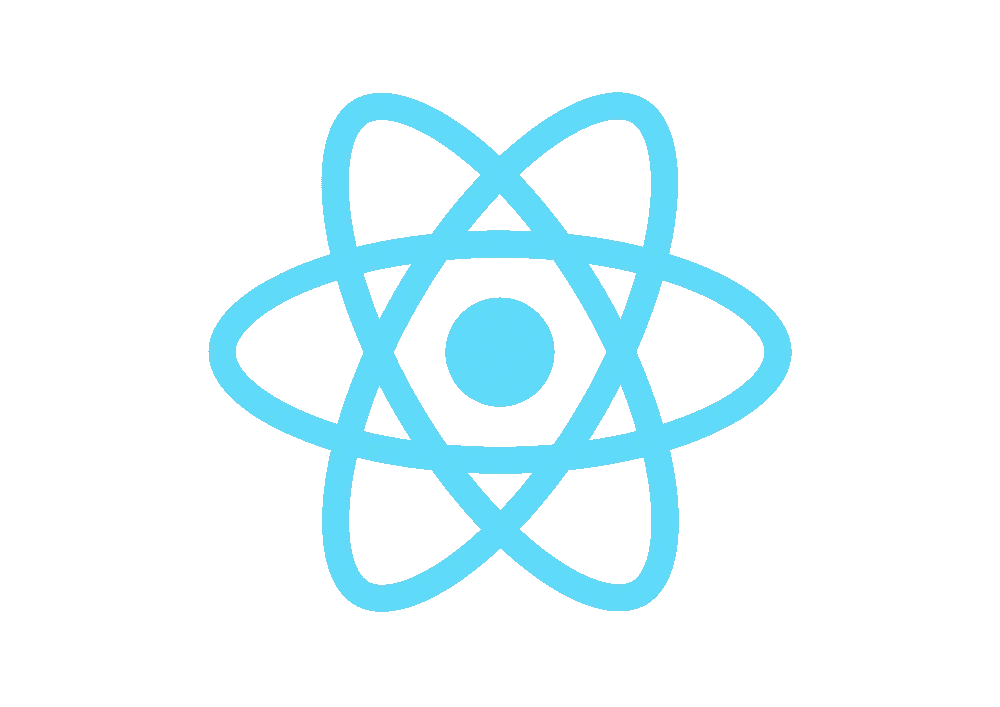
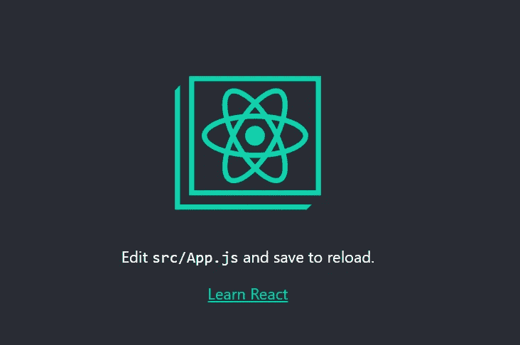
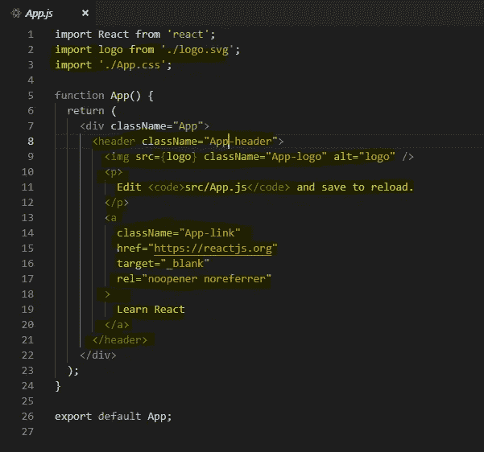
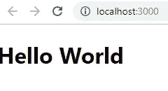
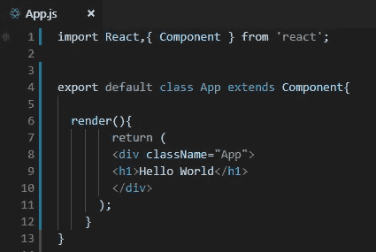

# React.js 入门—第 1 部分

> 原文：<https://betterprogramming.pub/getting-started-with-react-js-part-1-59598ef17780>

## 为您的第一个 **React** 应用程序打下基础



通过[维基共享资源](https://commons.wikimedia.org/wiki/File:React-icon.svg)反应图标

在这篇文章中，我们将了解 React 是什么，它是如何工作的，以及为什么使用它。我们还将构建我们的第一个 React 应用程序。如果您是第一次接触 React.js，那么理解 React.js 需要时间，因此我们将在这一部分中打下大部分基础，并在下一部分中使用这些知识来构建我们的第一个 react . js 应用程序。

# React.js 通俗点说

## 什么是反应？

首先，让我们了解一下[的反应](https://reactjs.org/)是什么。这是一个用于 DOM 操作的 JavaScript 库，通过 HTML5 推送状态处理导航。简单来说，它是一个视图库，使用组件在不刷新的情况下改变页面上的内容，这是单页面应用程序背后的核心原则。它是由脸书在 2013 年开发的，可用于移动、网络和虚拟现实应用。它今天如此受欢迎的原因是强大的开发人员社区为它制作开源包，用新的和伟大的特性更新它。

## 你应该学习反应吗？

是的，如果你是一个前端开发人员，你应该熟悉至少一个流行的前端框架。

## 你应该什么时候学习反应？

新手开发人员经常犯这样的错误:在没有理解复杂框架背后的概念的情况下就跳入复杂的框架。如果你有 HTML 和 CSS 的基础知识，很好地掌握了关键的 JavaScript 概念(如高级数组方法、承诺、回调、异步、等待等。)，并且熟悉 DOM 操作，只有这样你才应该决定学习一个前端框架。还有，编程基础知识，熟悉语法，了解函数式编程，面向对象编程，在学习这些东西的时候都会派上用场。

# 我们今天要建造什么

我们将制作一个简单的待办事项列表应用程序，可以在列表中添加和删除项目。在构建这个应用程序时，我们将学习状态、组件、虚拟 DOM、props 和 React 的一些其他基本概念，以帮助您入门。

注意:如果您想知道现在是否是开始学习框架的正确时机，这里有一个挑战:尝试使用纯普通 JavaScript 创建这个应用程序。应该是小菜一碟。如果你能做到，那么你就可以继续下去。否则，你必须先温习一下 JavaScript 和 JavaScript DOM 的知识。

# 项目概述

请记住，这不是您通常会使用 React 的那种应用程序(您很快就会明白为什么)，但它将有助于开发对框架如何工作的良好理解。

## React 中的组件

在 React 中，我们将应用程序分解成组件。你可以把组件想象成一大块一大块的东西，当它们放在一起时，整个应用程序就启动并运行了。大多数前端框架都是基于组件的，因为这使它们能够在以后重用这些组件，并使代码更加模块化。例如，应用程序中的导航栏是一个组件，页脚是一个组件，联系页面是一个组件，等等。稍后我们将对此进行更深入的探讨。

## 创建 React 应用

在我们继续之前，让我们设置我们的代码。确保您安装了最新的 LTS 版本的[节点](https://nodejs.org/en/)和 [npm](https://www.npmjs.com/) 。我们将使用 React CLI 来帮助我们轻松设置项目，并使用内置的开发服务器运行我们的应用程序。Create React App 预装了 [webpack](https://webpack.js.org/) ，以及运行 [Babel](https://babeljs.io/) 等工具的插件系统。首先，我们需要安装 React CLI。走向你的终端，然后输入:

```
npm install react.cli -g
```

这将在您的系统上全局安装 React CLI。现在我们可以使用`create-react-app`来建立一个新的 React 项目:

```
create-react-app todo-list
```

几分钟后，您会看到一个名为`todo-list`的项目，里面有一些文件。用编辑器打开它。

```
cd todo-listnpm start
```

我们也可以不用安装`create-react-app`就可以使用。只需运行:

```
npx create-react-app todo-listcd todo-listnpm start
```

现在我们在 localhost:3000 上有了一个开发服务器。您可以访问此 URL 并查看:



让我们首先解决这个问题，浏览一下 React CLI 为我们创建的一些文件。


我们创建的所有 JavaScript 都将进入`src`文件夹。还记得那个带有 React 标志的屏幕吗？这是通过`App.js`渲染的，我们在这里输出`logo.svg`。让我们处理掉这些文件。删除`App.css`(这只是`App.js`的本地 CSS 文件)、`App.test.js`(相当一段时间内你都不会用到)和`logo.svg`。现在前往`App.js`。



让我们去掉所有突出显示的代码。我们不需要它。类似地，从`index.js`文件中裁剪出`App.css`和`logo.svg`的导入和引用。现在我们已经建立了我们的项目，我们可以开始考虑如何构建我们的 React 应用程序了。

构建任何 React 应用程序的第一步是理解如何将应用程序分解成组件，并将它们组合在一起。每个 React 应用程序至少有一个组件:`App.js`。`App.js`是我们的 app 组件还是根组件。这是呈现所有 UI 并更新 web 上所有数据的组件。我们需要考虑如何在我们的应用程序中利用这个应用程序组件。

## 反应状态

React 中的状态只是任何动态数据，即我们的应用程序中可以改变的数据。您可以将状态想象成组件的临时数据容器。组件可以访问的所有数据都存储在这个状态中。如果我们将应用程序组件的状态定义为我们希望在 UI 上呈现的所有待办事项的列表，这将是合乎逻辑的。状态总是由它的父组件拥有。

## 组件类型

React 中主要有两种类型的组件:容器组件*和 UI 组件。前者基于基于类的语法，包含状态，与 UI 无关。后者是无状态的功能组件，从容器组件接收数据，用于改变 UI，顾名思义。*

您可能已经猜到，我们的应用程序组件是一个容器组件。

## 使用 JSX 渲染 HTML

JSX 代表 *JavaScript XML* ，它只是 React 中的 HTML 等价物。在 React 中，我们对组件内部的所有内容进行编码，这是一个 JavaScript 文件，我们在浏览器上呈现的所有 HTML 都是在`return`关键字下使用 JSX 语法编写的。和 HTML 很像。随着我们继续编码，你会明白如何写 JSX。

```
import React from ‘react’; function App() { return ( <div className=”App”> <h1>Hello World</h1> </div> ); }export default App;
```



我使用了一个< h1 >在我们的 app 组件内部的浏览器上输出 *Hello World* 。还记得我们如何确定我们的应用程序组件需要有一个状态来存储页面上所有的待办事项吗？然后我们得出结论，它是一个容器组件，而不是一个 UI 组件。

但是，在上面的代码中，你可以看到`App`已经被作为一个函数使用了。这是因为默认情况下`create-react-app`在 starter 模板中使用了一个无状态的功能组件。作为一个空洞的项目，拥有一个状态看起来非常荒谬。既然我们已经知道 App 是一个容器组件，我们必须把它作为一个类来使用。所以让我们改变代码。我们将同时浏览每一行，看看它是什么意思。

```
import React,{ Component } from ‘react’;
```

每个组件都将从其核心库导入`React`开始，这样我们就可以使用它内置的所有东西。然而，由于我们需要一个容器组件，我们将从核心库中导入另一个名为`Component`的模块。

```
export default class App extends Component{}
```

接下来，我们将声明我们的组件。在声明过程中导出这个组件总是一个好的做法，因为您以后可能会忘记这样做。导出该组件仅仅意味着所有代码及其功能都被打包到类`App`、中，我们可以通过简单地将它作为组件导入到任何其他文件中来使用它。

您可以将其可视化为`App`是运行我们的应用程序的唯一组件，但本质上，有多个组件嵌套在其中，共同驱动我们的应用程序。接下来，我们继承 React 中内置的组件类的所有属性，这样这个`App`类就可以继承典型组件的所有属性。我们所有描述这个组件功能的代码都将放在这个类中。

```
export default class App extends Component{
  render(){ return ( <div className=”App”> <h1>Hello World</h1> </div> ); } }
```

每个容器组件本质上有两件事:一个`render()`方法和一个*状态对象*。我们所有的 JSX 都将进入该组件的`render()`方法下的`return`关键字中，任何与该组件相关的动态数据都将进入`state object`下。由于我们还没有任何动态数据，我们可以简单地避免声明任何状态，但是以后，当我们开始创建我们的待办应用程序时，我们将需要这个对象的存在。否则，它就违背了创建`App`作为容器组件的全部目的。

在`return`关键字里面，我们放了 JSX。你可以看到 JSX 几乎和 HTML 一模一样，只是有一些明显的不同:HTML 中的`class`关键字被`className`代替，等等。还有一件事:无论你是否需要那个< div > ，把你的 JSX 包在一个< div >里面是强制性的。

现在我们知道如何创建一个组件，包括功能组件和容器组件，我们知道它们之间的区别，我们对状态是什么以及它用于什么有一个模糊的概念。以下是第一个组件的外观:



## 应用程序流程和组件结构

这可能看起来有点难以理解，但我保证，随着我们继续前进，并开始在 reaction 中编码，它将变得非常清晰。现在，只需了解我们的 React App 的组件结构，并将其牢记在心。


我们将使用一个`todos`组件(UI 组件)来呈现页面上的所有待办事项。我们也可以使用这个组件从页面中删除任何待办事项。我们将所有的待办事项存储在我们的`App`组件的状态中，一个`addTodo`组件将用于在页面上添加更多的待办事项。`addTodo`组件将在其状态中存储新添加的待办事项，并将其作为道具传递给`App`组件。我们将更新我们的`App`组件的状态，方法是将这个新的待办事项添加到它的状态中，并将`App`组件的新更新状态作为道具再次传递给`todos` 组件。

现在，您已经对我们将要做什么以及如何做有了一个大致的了解，让我们在第 2 部分见面，在这里我们将构建这个应用程序并学习更多关于 React 的知识。