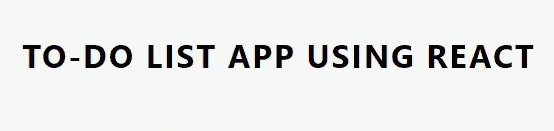
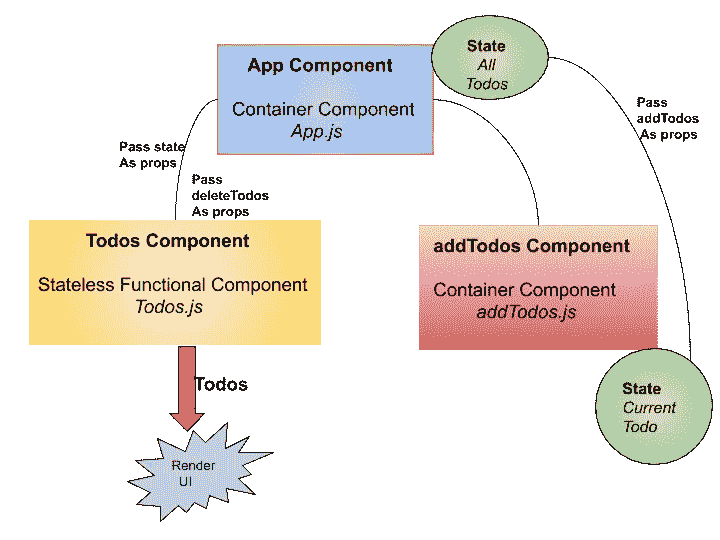
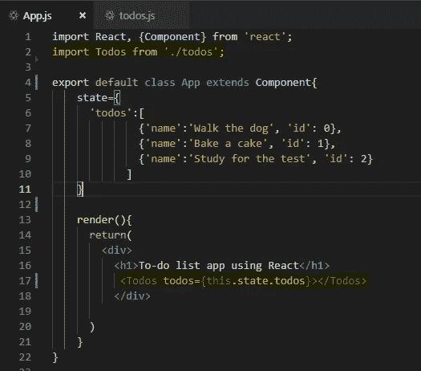
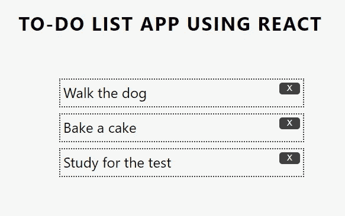
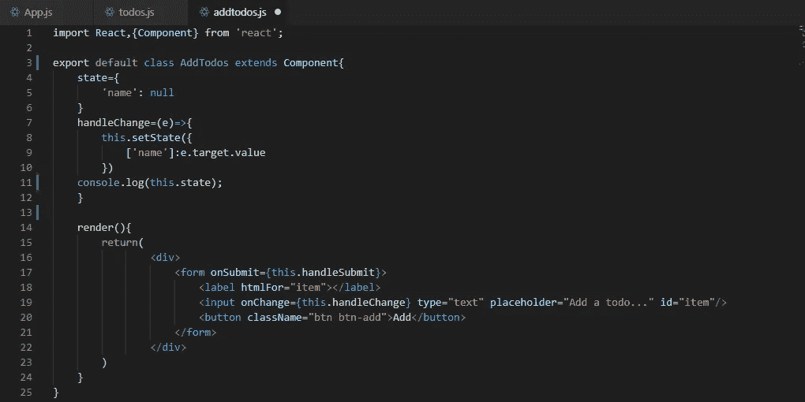

# React.js 入门—第 2 部分

> 原文：<https://betterprogramming.pub/getting-started-with-react-js-part-2-3dbd08c680a2>

## 深入我们的应用程序


通过[维基共享资源](https://commons.wikimedia.org/wiki/File:React-icon.svg)反应图标

这是我上一篇文章的后续。如果你对 React 一无所知，那么在这里快速地向自己介绍一下[，否则我们将在 React 中构建一个简单的待办事项应用。所有代码都可以在](https://medium.com/better-programming/getting-started-with-react-js-part-1-59598ef17780)[这里](https://github.com/FuzzySid/react-todo)获得。然而，为了充分利用本文，您应该继续编码。如果你在某个地方遇到困难，不要担心，我会在必要的时候给你提供代码和截图，这样你就可以把你的代码和我的代码进行比较，以防事情变糟。

# 在 React 中使用 CSS

在我们开始编写任何 JavaScript 代码之前，我想快速向您介绍一下我们如何向 React 组件添加样式。

还记得我们是如何删除`App.css` 的吗，因为我说我们不需要它了？在 React 中使用 CSS 有两种方式:通过本地 CSS 文件或通过全局 CSS 文件。本地 CSS 文件对每个组件都有单独的样式，并且每个组件本身都有自己的 CSS 文件。这在包含许多需要不同样式的组件的大型应用程序中非常有用。

对于这个应用程序，让我们保持简单。让我们把所有的样式放在`index.css` 中，你可以在任何组件中自动使用这些样式。从[这里](https://github.com/FuzzySid/react-todo/blob/master/src/App.js)复制样式并粘贴到你的`index.css`中。如果你愿意，你可以跳过这一步，在你编码的时候加入你自己的风格。

# 创建应用程序组件

首先，让我们在我们的`App Component`状态中添加一些虚拟的`todos`，这样每次你打开应用程序时，页面上已经有一些`todos`了。

```
import React, {Component} from 'react';export default class App extends Component{
  state={
   'todos':[ {'name':'Walk the dog', 'id': 0}, {'name':'Bake a cake', 'id': 1}, {'name':'Study for the test', 'id': 2} ]
      }render(){
  return(
    <div>
     <h1>To-do list app using React </h1>
   </div>
  )
 }}
```

到目前为止，我们所做的就是创建一个组件，在`state object`中添加一个`todos`变量，这个变量本身是一个包含两个属性`name`和`id`的对象的*数组。`name`就是`todo`的意思，`id`是用来唯一标识每个`todo`的。*

现在不要太担心`id`——如果你愿意，你甚至可以暂时跳过它。让我们回到 `*localhost:3000*` (还记得吗，我们 NPM 开始开开发服务器了吗？)



等等，`todos`在哪里？我以为我们把它们呈现在页面上了？

如果你一行一行地检查代码，我们实际上并没有写任何东西来告诉 React 获取这个`state object`，从它那里获取`todos`数组，循环通过那个数组，并在浏览器上的那个`forEach`循环中输出 name 属性。



记住:我们不会使用`App Component`来渲染`todos` ——我们只会使用它来维护`todos.`的当前状态，我们会使用另一个组件(`Todos Component` **)** 来输出浏览器上的所有`todos`。

## React 中的道具

道具是*不可变的数据*或者是我们无法改变的数据。React 使用 props 作为将数据从一个组件发送到另一个组件的方式。这有助于我们创建更加灵活的应用程序，在这些应用程序中，数据必须在各种组件之间进行交换。我们可以传递任何东西作为道具:组件的状态，可能是一些成员函数，几乎任何东西。接收这些道具的组件通过调用名为`this.props`的对象来访问它们。

*状态总是作为道具从父组件传递到子组件。它不应该被传递给兄弟或父组件。*

# 创建 Todos 组件

让我们创建另一个组件`todos.js`，然后将我们的`App Component` 的`state`传递给这个`Todos Component`作为`props`，并使用那个道具在浏览器上显示所有的`todos`。

```
import React from 'react';const Todos=({todos})=>{
 const todoItems=[];
 todos.forEach(todo=>{
  todoItems.push(
    <div key={todo.id}>
      <li>{todo.name} <button className="btn btn-delete">X</button>
      </li>
    </div>
  )
});return(
  <div className="list-container">
    <ul className="list">
     {todoItems}
   </ul>
  </div>
 )
}
export default Todos;
```

因为我们只是更新 UI，所以我们制作了一个*无状态函数组件* `todos.js`，在`Todos()` 函数内部，我们使用从`App Component` 接收的`props`，并创建一个名为`todoItems`的空数组。我们循环遍历`props`，并将一些 JSX 和每个`todo`一起放入`<li>`中。然后在关键字`return`中，我们返回一些嵌入了数组`todoItems`的 JSX。

*在 React 中，JavaScript 变量可以通过封装在{ }中直接在 JSX 中输出。*

现在，我们所要做的就是将它导入到我们的`App Component`中，并将我们`App Component`的`state`作为`props`传递给`Todos Component`。

```
import Todos from ‘./todos’
......
<Todos todos={this.state.todos}></Todos>
... 
```



你的 App.js 应该是这样的

现在检查浏览器:



我们已经根据应用程序组件的状态在页面上呈现了 todos

瞧——我们在浏览器上有了所有的虚拟人`todos`!

说到这里，让我们通过点击每个`todo`上的“X”来实现删除功能。一开始这似乎有点挑战性，所以让我们一步一步来。

我们将在删除按钮上附加一个 *onClick* 事件监听器，并在事件被触发时触发一个函数。

在这个函数中，我们将传入我们刚刚点击的`todo`的`id` 。我们可以使用`todo.id`很容易地访问它，其中`todo`是我们循环遍历的数组中的每个对象。但是我们如何删除那个`todo`？如果我们从里到外对`todos`组件进行这样的操作，我们不会真的删除它，因为我们还没有更新`App Component`的`state`，而这正是我们的`todos`组件获取数据并显示在浏览器上的内容。我们实际上需要从我们的`App Component`的`state`中删除那个`todo`。

## React 中的*设置状态*

我们已经在 React 中简要讨论过`state`。这是与组件相关联的动态数据。正如动态这个词所暗示的，动态数据具有随时间变化的能力，所以`state`也应该能够改变其中的数据。

然而*、*你必须*千万不要*直接修改状态！这意味着您不应该这样写:

```
this.state.todos.push({‘name’:‘clean room’, ‘id’:4})
```

为了改变、修改或更新状态，我们使用一种叫做`setState()`的方法。该方法将一个对象作为参数，该对象是组件的新状态，在该方法中，我们可以用新状态覆盖旧状态。

*引擎盖下，* `*setState()*` *不同步。它首先调用该组件的* `*render()*` *，然后更新状态。生成一个新视图，然后在 DOM 中更新它。*

为了删除那个特定的`todo`，我们引用了它的`id`。我们使用这个`id`，并尝试将它与我们状态中的每个`todo`匹配，并将每个`todo`推入一个新数组中——除了其`id`与传递的`id`匹配的那个。

接下来，我们在`App Component`中创建一个删除函数，在这里我们实现这个功能并使用`setState()`来更新状态:

```
deleteTodos=(id)=>{ let todos=this.state.todos.filter(todo=>{
    return todo.id!==id;
  }) this.setState({
     todos: todos
  })}
```

我们将把`deleteTodos()`函数作为`props`传递给我们的`Todos Component`。

```
<Todos deleteTodos={this.deleteTodos} todos={this.state.todos}></Todos>
```

现在转到`Todos Component`，这样我们可以为每个`todo`附加一个事件监听器，并把那个`todo`的`id`作为参数传入。

```
const Todos=({deleteTodos,todos})=>{
... <li >{todo.name} <button className=”btn btn-delete” onClick={()=>{deleteTodos(todo.id)}}> X
               </button>
</li></div>)
...
```

回到服务器，试着删除一些`todos`:

你现在可以删除那些`todos`。

太好了，你学到了很多！你的`todos.js`或者`Todos Component`完了！你现在可以在这里对比一下你的`Todos Component` [的代码。](https://github.com/FuzzySid/react-todo/blob/master/src/todos.js)

*在继续之前，尝试自己使用* `*addTodos Component*` *实现在页面上添加* `*todos*` *的功能。*

# 创建 addTodos 组件

我保证这是你最后一次看到这张图表——我知道你现在可能已经厌倦了。


让我们先弄清楚我们要做什么。为了在页面上添加一些`todos`，我们将创建一个带有添加按钮的输入字段。每当用户想要在页面上添加一个`todo`时，我们获取输入的值并将其添加到`App Component`的`state` 。

用一个单独的组件来实现这个功能是合乎逻辑的。一旦你创建了一个`addTodos Component`，事情就会变得简单。该组件将在`render()`方法中呈现一个输入标签和一个添加按钮，作为 JSX 模板。

那么，它是不是一个*无状态的功能组件*？

不完全是。我们需要一种方式来告诉组件一个新的`todo`已经到达，它需要被处理。还有什么比给组件的状态添加新的`todo`更好的方式呢！这样，我们的组件将引用我们添加的每个新的`todo`。

所以现在我们知道`addTodos`是一个容器组件，它将有一个`state`来存储新添加的`todo`。让我们继续这样做:

```
import React,{Component} from ‘react’;export default class AddTodos extends Component{ state={ ‘name’: null }render(){ return( <div> <form> <label htmlFor=”item”></label> <input type=”text” placeholder=”Add a todo…” id=”item”/> <button className=”btn btn-add”>Add</button> </form> </div> ) }}
```

现在我们需要设置我们的`addTodos Component`的`state`。我们将把一个`onChange`事件附加到我们的输入字段，这样组件的状态就会动态变化。当被触发时，该事件将触发一个函数`handleChange()`，该函数将事件对象作为一个参数，并使用`setState()`来更新组件的状态。

```
import React,{Component} from ‘react’;export default class AddTodos extends Component{....handleChange=(e)=>{ this.setState({ [‘name’]:e.target.value})render(){... <input onChange={this.handleChange} type=”text” placeholder=”Add a         todo…” id=”item”/>....}
```

让我们看看这是如何工作的。

在`handleChange()`方法中注销我们组件的`state`:

```
handleChange=(e)=>{ this.setState({
[‘name’]:e.target.value
}) console.log(this.state);}
```



您的 addTodos 组件应该如下所示

记住，我们直接从我们的根组件，也就是`App Component`，渲染一切。因此，将它导入到`App.js`中，并在其渲染方法中将该组件渲染为 JSX。

```
...
import AddTodos from ‘./addtodos’;
...
render(){
....
  <AddTodos></AddTodos>
...
}
```

转到浏览器并查看其运行情况:

状态在动态更新——酷！

现在剩下唯一要做的事情就是当我们点击 add 按钮时将这些`todos`添加到页面中。你可能会猜测我们将简单地使用一个`onSubmit`事件，并将我们的`addTodos Component` 的`state`作为`props`传递给`App Component` **。但是有一个条件。记住:*状态只能作为道具从父组件传递给子组件*。**

没问题。在这种情况下，我们将直接把`addTodos Component`的状态传递给`Todos Component`。但是等等…将状态作为道具从一个兄弟传递给另一个兄弟*也是不允许的*。

那么，我们不能用`addTodos Component`的状态做*任何*的事情吗？

不要担心，有一个简单的解决方法。我们可以在我们的`addTodos Component`中创建一个函数，它接受当前的`todo`作为参数，给它分配一个惟一的`id`，然后将它添加到我们的`App Component`的`state`中。我们将这个函数作为`props`传递给`addTodos Component`，后者在我们的`onSubmit`函数中触发它，从这里我们将`addTodos Component`的`current state` 传递给`addTodos()`函数。

让我们看看代码:

```
...
import AddTodos from './addTodos';export default class App extends Component{...addTodos=(newTodo)=>{
  newTodo.id=this.state.todos[this.state.todos.length-1].id+1;
  let todos=[...this.state.todos,newTodo]
  this.setState({
    todos
 })...render(){ ... <AddTodos addTodos={this.addTodos} /> ...}
```

现在我们需要调用这个我们作为`props`得到的方法，并把`addTodos Component`的`state`作为参数传入。我们将在附加到表单的`onSubmit`事件被触发后触发的`handleSubmit`函数中做这件事。在这个事件中，我们首先需要防止提交时重新加载页面的默认操作。我们还需要重置表单内的输入字段。

```
....export default class AddTodos extends Component{... handleSubmit=(e)=>{ e.preventDefault(); this.props.addTodos(this.state); document.querySelector(‘form’).reset(); }...}
```

快好了！

让我们通过将这个`handleSubmit()`函数附加到我们的`onSubmit`事件来总结一下:

```
...export default class AddTodos extends Component{ ....
    render(){
      return(
          .... <form onSubmit={this.handleSubmit}> ...
      )
   }...}
```

**十指交叉** 现在让我们检查一下开发服务器…

长舒一口气！现在，您已经理解了基础知识，并在 React.js 中编写了第一个简单的应用程序！

你可以逐行检查你的应用程序组件，这里是，这里是`Add Todos Component` [，](https://github.com/FuzzySid/react-todo/blob/master/src/addtodos.js)，以防你遗漏了什么。

# React 要学的就这些吗？

显然，React 中还有更多——可能是更多——需要探索。我们只学了最基本的。

在其[官网](https://reactjs.org/)上阅读更多关于 React 的内容。作为练习，尝试使用 React.js 构建一个简单的井字游戏，这在他们的[教程部分](https://reactjs.org/tutorial/tutorial.html)中有精彩的解释。