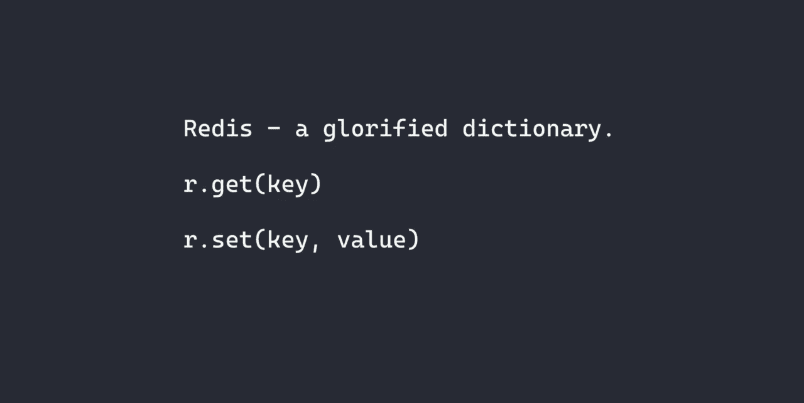

# Redis 入门:Python 教程

> 原文：<https://betterprogramming.pub/getting-started-with-redis-a-python-tutorial-3a18531a73a6>

## 探索概念并构建一个库



图片来源:作者

# 内容

*   先决条件
*   Redis 是什么？
*   使用 Docker 设置本地 Redis 服务器
*   使用 CLI 客户机探索基本的 Redis 概念
*   构建和使用自己的 Python Redis 库
*   为 Redis 使用真正的 Python 库
*   摘要

# 先决条件

*   码头工人
*   Python 3.6 以上版本

# Redis 是什么？

Redis docker 页面称它是“一个开源的、网络化的、内存中的、键值数据存储，具有可选的持久性。”这个描述抓住了 Redis 的关键特性。

**开源**——任何人都可以检查 Redis 的代码或者为[项目](https://github.com/redis/redis)做贡献。

**网络化** — Redis 使用客户机-服务器模型，客户机和服务器之间的通信通过网络进行。在本教程中，客户端和服务器都运行在一台机器上。在生产系统中，一个负载平衡的多节点 Redis 集群(由服务器组成)将为来自多个客户端的请求提供服务。

**内存中** — Redis 将数据存储在主计算机内存(即 RAM)中。查看计算机内存层次结构。存储在 RAM 中的数据比存储在较慢的(二级)内存(如磁盘)中的数据访问速度更快。这就是 Redis 快速且适用于要求低延迟数据访问(例如缓存)的应用程序的原因。


[计算机内存层次](https://commons.wikimedia.org/wiki/File:ComputerMemoryHierarchy.svg)由丹拉什在[en.wikipedia.org](https://en.wikipedia.org)

**键值数据存储** — Redis 是一个美化了的字典。支持的主要操作是用键的值设置键，用相关的键获取值，以及其他类似的操作。事实上， *Redis* 恰当地表示**re**mote**di**dictionary**s**server，指向它的网络化和键值存储特性。

**可选的持久性** —《设计数据密集型应用程序:可靠、可伸缩和可维护系统背后的伟大理念的作者 Martin Kleppmann 将持久性定义为“一旦事务成功提交，它写入的任何数据都不会被忘记，即使出现硬件故障或数据库崩溃。”

Redis 作为内存中的数据存储，默认情况下并不完全持久。如果 Redis 主机出现故障，成功写入 Redis 的一些数据可能会丢失。查看计算机内存层次结构。请注意，RAM 是易失性的，这意味着如果断电，RAM 中存储的内容也会丢失。这对于任何想要构建最大化性能而不牺牲耐用性的系统的人来说都是不可取的。幸运的是，Redis 提供了几个具有不同性能持久性特征的[持久性选项](https://redis.io/topics/persistence)，包括一个提供完全持久性的选项。

**数据类型多样性**—Redis Docker 页面描述中忽略的一个关键特征是 Redis 对其值的不同类型数据结构的原生支持，但这在别处可以找到。例如，Redis 项目在 GitHub 上的描述提到了它对各种数据结构的支持，包括“字符串、列表、集合、排序集合、哈希、流、超级日志、位图。”这种灵活性使得使用 Redis 更像是使用 Python 等编程语言中的字典数据结构。这也使得 Redis 成为支持应用程序的简单选择，这些应用程序将从这些数据结构提供的约束中受益。

# 使用 Docker 设置本地 Redis 服务器

为 Redis 之类的工具设置服务器可能是一项痛苦的工作，在第一次接触该工具时没有必要忍受。在本教程中，我们将使用 Docker 作为一个黑盒程序。Docker 是一个热门工具，很多人都把它列在了学习清单上，但是你不需要了解它的复杂性和特性就可以完成这篇教程。就用吧。

## 获取最新的 Redis Docker 映像(撰写本文时为 6.2.2 版)

这就像下载 Redis 的安装文件一样。

```
docker pull redis
```

## 将 Redis 服务器作为守护进程运行(后台进程)

在这个命令中，我们将计算机上的端口 6379 映射到 Redis 容器中公开的端口 6379。端口 6379 是 Redis 服务器的默认端口。

```
docker run -d -p 6379:6379 --name redis-server redis
```

# 使用 CLI 客户机探索基本的 Redis 概念

在本节中，您将了解 Redis 数据库，如何设置键-值对，如何使用各自的键获取值，以及如何删除键。

## 连接到 Redis 服务器

我们在上一节中启动的 Redis 服务器内置了一个 Redis CLI 客户端。我们将在教程的这一部分使用它。

```
docker exec -it redis-server redis-cli
```

## 概念 1。数据库

在通过 Redis CLI 程序连接到 Redis 服务器后，我们会看到类似这样的提示。它只显示我们连接的服务器的 IP 地址和端口号。

```
127.0.0.1:6379>
```

Redis 有数据库的概念，数据库是由键值对组成的索引组。那是什么意思？假设您有两个需要 Redis 服务器的应用程序。它们都存储使用相同键(例如，实体的 ID)的键-值对，但是它们存储与那些键相关联的不同值。第一个应用程序可能想要存储`StudentID`到`StudentEnrolledCourses`的键值对，而第二个应用程序可能想要存储`StudentID`到`StudentProfiles`的键值对。`StudentEnrolledCourses`和`StudentProfiles`的确切类型在这里并不重要。重要的是密钥来自同一个域(用集合论术语来说)。这意味着如果两个应用程序都将其密钥写入 Redis 服务器上的同一个 Redis 数据库，将会出现有问题的密钥冲突。

这个问题可以通过拥有多个 Redis 服务器来解决，但这是不优雅且笨拙的。另一个解决方案是让 Redis 服务器拥有多个数据库，这些数据库由唯一的符号标识，这些符号代表独立的键值对组。这正是 Redis 所允许的。Redis 有多个由整数标识的数据库，这些整数独立地对键值对进行分组。

回到我们的例子，第一个应用程序可以使用 Redis 数据库 1，第二个应用程序可以使用 Redis 数据库 2。默认的 Redis 数据库的索引为 0，当我们登录到 Redis 服务器时，会自动使用这个索引。我们可以通过发出`SELECT`命令来改变我们想要使用的数据库。

```
127.0.0.1:6379> SELECT 1
OK
127.0.0.1:6379[1]>
```

对于本教程的剩余部分，我们将使用索引为 1 的数据库。这是一个任意的选择，所以如果你想在线外着色，可以随意选择不同的索引。

## 概念 2。设置键值对

设置键值对有一个简单的语法。在这里。

```
127.0.0.1:6379[1]> SET hello world
OK
```

在设置了一个键-值对之后，我们得到一个漂亮的“OK”来告诉我们操作成功了。

你也可以设置自动过期的密钥。对于如何使密钥过期，有多种选择，例如秒(EX)、毫秒(PX)和以秒为单位的时间戳(EXAT)来列出其中的一些。

```
127.0.0.1:6379[1]> SET bye "In 60 seconds, I'll self-delete" EX 60
OK
```

## 概念 3。使用各自的键获取值

通过使用键获取值也有一个简单的语法。看那个！😲

```
127.0.0.1:6379[1]> GET hello
"world"# before 60 seconds elapses127.0.0.1:6379[1]> GET bye
"In 60 seconds, I'll self-delete"# after 60 seconds elapses127.0.0.1:6379[1]> GET bye
(nil)
```

## 概念 4。删除密钥

```
127.0.0.1:6379[1]> DEL hello
OK
127.0.0.1:6379[1]> GET hello
(nil)
```

# 构建和使用自己的 Python Redis 库

> Redis 是一本被美化了的词典。

让我向您展示 Redis 实际上是一个美化了的字典，它为 Redis 提供了一个过于简化的 Python 接口实现。尽管非常简单，但该实现将 Redis 剥离到其本质，并消除了您可能因使用该工具的复杂性而产生的任何犹豫。这个实现中唯一剩下的就是我们有一个内存中的键值数据存储。

## redisx.py

让我们用我们的图书馆吧！

## redisx _ hello _ world.py

# 为 Redis 使用真正的 Python 库

## 安装 redis-py Python 库

```
python -m pip install redis==3.5.3
```

我们可以将前一节中编写的客户机代码修改到本地运行的 Redis 服务器上，并在其上执行一些基本操作。

我就不做“找出差异”的练习了，注意在这个版本的客户端代码中，`Redis`类的`host`和`port`参数被赋值。同样，我们得到的值是一个二进制值(如前缀`b`所示)。我们可以使用`.decode()`方法将返回值转换为更简单的 Python 类型，如下面的代码所示。

让我们通过 Python 客户机复制我们在 Redis CLI 客户机中所做的事情。

# 摘要

Redis 是一个流行的键值数据存储，以其速度和灵活性而闻名。在本教程中，我描述了一些更常见的 Redis 特性。我们使用 Docker 设置了一个本地 Redis 服务器，并研究了基本的 Redis 概念，如数据库、设置键-值对、获取值以及使用 Redis CLI 客户机删除键。我们还构建并使用了我们自己的 Python Redis 库，以了解 Redis 的本质。最后，我们使用 [redis-py](https://pypi.org/project/redis/) Python 库编写了一个基本的 redis 客户机，该客户机复制了我们以前研究基本 Redis 概念时与 Redis 服务器的交互。

本教程非常简洁，但它描绘了 Redis 的一个简单视图，使新用户更容易更快地开始使用该工具。Redis 的先进性和相关的复杂性是非常真实的，它们既可以为您提供很好的服务，也可以带来挑战。但是关于它的高级启示、复杂性以及它们帮助或阻碍你的方式的讨论是另一个时间的话题。

要了解更多 Redis 特性，请看一下它的[文档](https://redis.io/documentation)。

感谢您的阅读！

# 更多计算资源

在 OnelTalksTech.com[观看涵盖各种计算主题的视频](https://oneltalkstech.com)