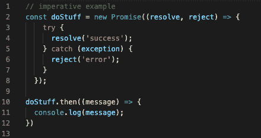
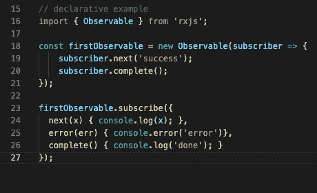
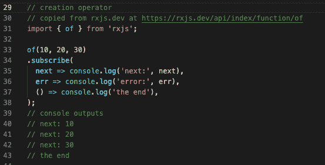
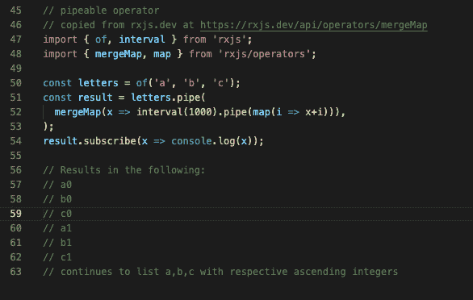
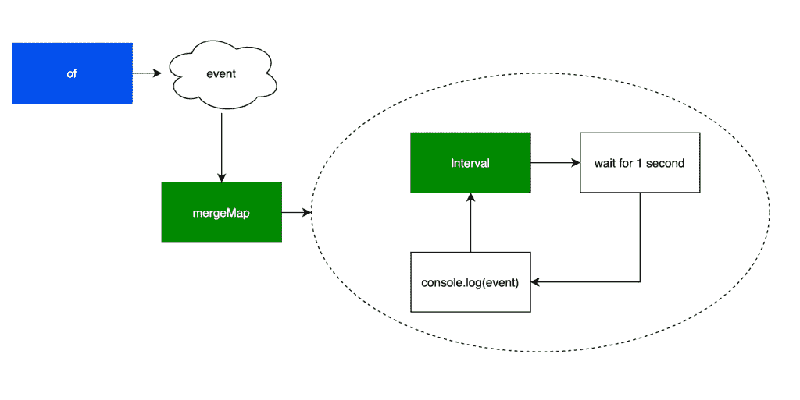
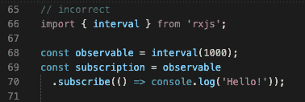
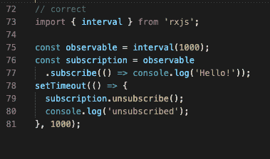

# RxJS 入门

> 原文：<https://betterprogramming.pub/getting-started-with-rxjs-1b6260dd184b>

## 如果你是一个新手或者经验丰富的 JavaScript 开发人员，你可能听说过 RxJS。让我们开始吧

在 [Unsplash](https://unsplash.com?utm_source=medium&utm_medium=referral) 上由 [Zany Jadraque](https://unsplash.com/@jenrielzany?utm_source=medium&utm_medium=referral) 拍摄的照片。

如果你是一个新手或者经验丰富的 JavaScript 开发人员，你可能听说过 RxJS。

RxJS 是目前最流行的 JavaScript 库之一。这篇文章将介绍它是什么以及如何在应用程序中使用它的基本步骤。

# 历史

所以在我开始之前，了解 RxJS 背后的历史是有帮助的。

这一切都始于[反应式延伸](http://reactivex.io/)(或 ReactiveX)。ReactiveX 是一个最初由埃里克·梅耶尔发明的概念。这是观察者模式[的一个实现。在它被开发出来之后，随后的编程库围绕着像。NET 和 JavaScript。](https://en.wikipedia.org/wiki/Observer_pattern)

RxJS 是 JavaScript 的反应式扩展的实现。 [RxJS 项目](https://github.com/ReactiveX/rxjs)最初是由 [Matthew Podwysocki](https://github.com/mattpodwysocki) 等人作为一个独立的开源项目启动的。大约从 RxJS 版本 5 开始， [Ben Lesh](https://github.com/benlesh) 和其他人改进了这个项目，使其更接近今天的样子。

RxJS 库实现了[观察者模式](https://en.wikipedia.org/wiki/Observer_pattern)和[迭代器模式](https://en.wikipedia.org/wiki/Iterator_pattern)。

RxJS 库也使用[函数式编程](https://en.wikipedia.org/wiki/Functional_programming)来实现操作符和函数来管理事件序列(流)。关于函数式编程的精彩介绍，我强烈推荐观看 Russ Olsen 在 GOTO 2018 上的演示视频。

# 命令式与陈述式

当你听到人们讨论 RxJS 时，你通常会听到他们提到命令式和声明式编码。

命令式指的是以特定方式编写的代码。这是你手动控制流程的代码，类似于[承诺](https://developer.mozilla.org/en-US/docs/Web/JavaScript/Reference/Global_Objects/Promise)工作的方式。

声明性是指使用声明的函数来执行动作。这里，您依赖于可以定义事件流的“纯”函数。在 RxJS 中，你可以看到[观察值](https://rxjs.dev/guide/observable)和[运算符](https://rxjs.dev/guide/operators)的形式。

这些定义将在本文的后面变得更加明显，但是在这里介绍它们是有好处的。

# 看得见的

在解释 RxJS 时，通常最简单的方法是首先显示代码。

大多数人通常都熟悉如下实现的承诺:

这里没有什么特别令人兴奋的——只是使用了标准的“解决/拒绝”语法。承诺完成后，输出消息被写入控制台。

现在比较一下这个:

哇哦。那是什么？嗯，那就是 RxJS！如果你注意到，当可观察对象首先被定义，然后观察者中的不同钩子与`next`、`error`和`complete`一起使用时，声明性实践被使用。

在这篇文章的后面我会回到这个例子，但我想先介绍一下。

# RxJS 是怎么工作的？

因此，从 RxJS 开始，首先有几个定义会有所帮助:

*   可观察的=一系列确定的事件
*   Subscription =表示事件的实际执行流(发起订阅基本上是“启动”执行)
*   Operators =是“纯”函数，可以调用带有订阅的流。这些有不同的形式，可以创建一个流或复制一个管道流的流。
*   Subject =可用于多播的事件发射器。这些是特殊的，所以你可以在你的程序中注入发射器。
*   调度器=这些有助于并发性，实际上是一个更高级的 RxJS 主题。为了完整起见，我将它们包含在这里。

如需更多信息和示例，请在此处参考[官方 RxJS 入门指南](https://rxjs.dev/guide/overview)。

有了这些词汇，现在我们可以正式讨论我之前介绍的例子了。

# 可观察的(再次)

让我们回到我之前展示的代码:

这是一个很好的例子，因为它向您展示了一个实现的可观察对象。

如果你注意到了，首先你用`next`和`complete`定义了可观测值。然后当我用`subscribe`开始执行流程时，我包含了对执行流程做什么的定义:

*   next =对从流中返回的内容执行一个`console.log`
*   error =如果流中出现错误，则执行`console.log`
*   complete =执行完成时将`done`写入控制台

这是直接定义可观测值的一种方法。每个观察者都有三个钩子`next`、`error`和`complete`，您可以用它们来定义执行行为。

# 经营者

可观测量很棒，但是 RxJS 也提供了操作符，这使得定义可观测量更加容易。

有两种类型的运算符:

*   创建运算符=具有预定义行为的生成的可观察值
*   可管道操作符=使用语法`.pipe`返回其他观察值的观察值

下面是一个正在运行的创建操作符:

这里，我们使用`of`操作符在一个序列中发出`10`、`20`和`30`的值。这是非常基本的，但是它让您知道如何使用它在流中发出一组值，而不需要手动定义观察器挂钩。

这是一个可管道化的操作器:

所以这里，有点复杂，但我想你能搞清楚。

1.  我们使用我之前提到的创建操作符`of`来生成值流`a`、`b`、`c`。
2.  接下来，我们将来自`of`的输出放入管道操作符`mergeMap`。
3.  然后我们让`mergeMap`创造一个新的可观察对象，并把它传送到`interval`。
4.  然后`interval`在一秒钟的延迟后取每个值的输出和`console.log`。

所以基本上，这就用`pipeable`操作符创建了一个流。原始源可观测值用于重新创建添加了逻辑的新可观测值。

有一种更简单的方式来思考这个问题:这里定义了一个`stream`。与流一起使用的每个管道都增加了价值。

对可管道化操作符的一种更字面的理解是，当水流过一组管道时。每根管子都增加了水的价值，直到它离开水流。

从视觉上看，您可以在下图中看到这种流动:

为了更好地观察 RxJS 的流程，许多人依赖大理石图。起初它们有点令人生畏，但是如果你学会了如何用 RxJS 指南阅读它们，它们真的很有帮助。我建议查看操作页面底部的 [RxJS 指南](https://rxjs.dev/guide/operators)。

# 订阅和内存泄漏

因此，开发人员在使用 RxJS 时遇到的一个大挑战是订阅时的内存泄漏。

内存泄漏是指您忘记“取消订阅”某个流，而该过程继续运行，耗尽了您的内存。内存泄漏会很快耗尽浏览器的内存，降低应用程序的速度。

最好的解决办法是确保你有一个`.unsubscribe`可以观察到的东西。你也可以依赖框架中的预建机制，比如 Angular 的`async`管道。

下面是一些导致内存泄漏的代码:

通过添加一个`setTimeout`可以很容易地修复这个代码，它会在设定的时间间隔后取消订阅流，如下所示:

# 高级主题

到目前为止，我们已经讨论了一些基本的执行流程。如果结合使用 RxJS 操作符，就可以用少量代码定义一些非常复杂的工作。

当你从一个单独的可观测值创建一组可观测值时，挑战就来了。这被称为高阶可观测值。RxJS 有一些运算符可以帮助您消除这些情况，包括:

我不打算在这里深入探讨高阶可观测性的例子，因为我认为这超出了一篇介绍性文章的范围。然而，我强烈推荐查看关于操作员的 RxJS 指南,该指南对此进行了更详细的讨论。

在我的博客文章“从承诺到观察”中，我还谈到了一个更高级的话题。在这种情况下，我通过设置一个`scan`操作符来组合几个 HTTP 调用。

我推荐阅读 [RxJS DEVTO 博客网站](https://dev.to/rxjs)上的帖子，了解更多可观察的案例和讨论。

# 进一步阅读

我在这篇文章中的讨论只是覆盖了你能用 RxJS 做什么的表面。网上还有许多很棒的材料和视频，提供了深入的演练和示例。

# 结束语

希望这对你学习 RxJS 有所帮助。在这篇文章中，我介绍了 RxJS 是什么以及如何在程序中使用它。

感谢你阅读这篇文章！