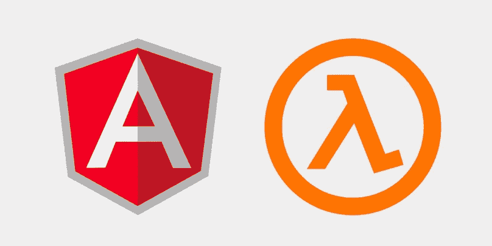
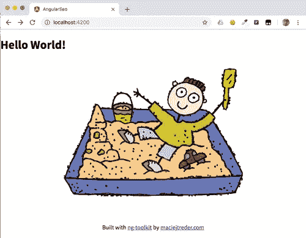
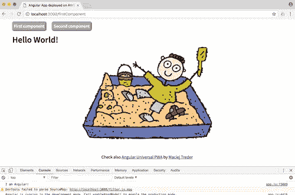
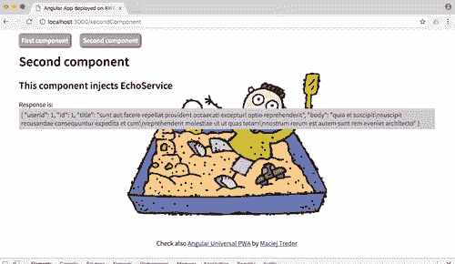
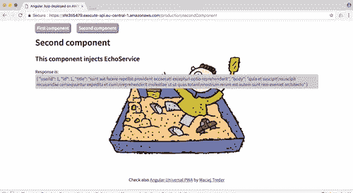

# AWS Lambda 无服务器 Angular Universal 入门

> 原文：<https://betterprogramming.pub/getting-started-with-serverless-angular-universal-on-aws-lambda-8754bcc4dc19>

## 创建一个 SEO 友好的 Angular 应用程序，并将其部署在无服务器框架上



您可以使用 [Angular Universal](https://angular.io/guide/universal) 构建搜索引擎优化(SEO)友好的单页应用程序(SPA ),这是一种在服务器上运行 Angular 应用程序的技术。此外，您可以使用作为亚马逊网络服务(AWS)的一部分提供的事件驱动的无服务器计算平台 [AWS Lambda](https://aws.amazon.com/lambda/) 来降低运行这些应用程序的成本。这篇文章将向您展示如何使用[无服务器框架](https://serverless.com/framework/)在 AWS Lambda 上构建和部署 Angular Universal 项目，这是一个用于构建和部署无服务器应用程序的开源命令行界面。

在这篇文章中，我们将:

*   创建一个包含两条路线并调用外部 API 的 Angular 应用程序
*   添加用于 SEO 目的的服务器端渲染
*   设置一个[无服务器框架](https://serverless.com/)框架配置
*   在 AWS Lambda 上部署应用程序

要完成这些任务，您需要[创建一个 AWS 帐户](http://aws.amazon.com/)并安装以下内容:

*   [Node.js 和 npm](https://nodejs.org/)(node . js 安装也会安装 NPM。)
*   [角度 CLI](https://cli.angular.io/)
*   [AWS CLI](http://docs.aws.amazon.com/cli/latest/userguide/installing.html)

要配置 AWS CLI，您需要从您的 AWS 帐户获得以下信息:

*   访问密钥 ID
*   秘密钥匙
*   默认区域

您的根用户将拥有将 Angular 应用程序作为 Lambda 函数进行部署和运行所需的所有权限。通过在身份和访问管理(IAM)控制台中生成新的访问密钥 ID 和密钥对，您可以获得 root 用户的访问密钥 ID 和密钥。

如果你不想在这个项目中使用你的根用户 ID，你可以[为一个 API 设置一个 IAM 角色和策略来调用 Lambda 函数](https://docs.aws.amazon.com/apigateway/latest/developerguide/integrating-api-with-aws-services-lambda.html#api-as-lambda-proxy-setup-iam-role-policies)。这个过程有许多步骤，如果您不熟悉 AWS，不建议您这样做。

在继续之前，请确保您已成功完成所有这些任务。

# 成立 Angular 项目，运营 Hello World！

在每个 Angular 项目中，我们必须采取的第一步是软件包的初始化和安装:

```
ng new angularSeo --style css --routing false
cd angularSeo
```

让我们对生成的项目做一些小的修改。首先，让我们给`src/index.html`文件中的`<app-root>`添加一些样式。用以下代码替换现有代码:

接下来，将现有的`src/app/app.component.html`内容替换为:

```
<h1>Hello World!</h1>
```

最后，将以下内容添加到`src/styles.css`:

注意，在上面，我们使用了我最喜欢的花哨背景:


下载它，并把它放在`src/assets/img`目录中。

让我们通过键入以下命令来运行应用程序:

```
ng serve
```

打开后，您应该会在浏览器中看到:



您可以在可以克隆的 GitHub 存储库中找到到目前为止的所有代码:

```
git clone -b tutorial1_step1 https://github.com/maciejtreder/angular-seo.git angularSeo
cd angularSeo/
npm install
ng serve
```

# 组件、工艺路线和服务

到目前为止，我们的应用程序并不复杂。让我们向它添加一些路由、组件和服务:

```
ng g c first
ng g c second
ng g c menu
ng g s echo
```

好的，我们有很多文件。我们就从`src/app/first/first.component.ts`开始；这真的很简单。用以下内容替换默认内容:

```
import { Component } from '@angular/core';@Component({
   template: '<h1>Hello World!</h1>'
})
export class FirstComponent {}
```

编辑第二个组件`src/app/second/second.component.ts`，它稍微复杂一点:

*注意:你的开发环境或者 linter 可能会调出* `makeCall()` *。不要担心这个问题:我们将在创建服务时解决这个问题。*

我们在这里介绍了一些机制。首先是使用外部模板和外部样式(`templateUrl`和`stylesUrls`)。Angular 让我们能够在组件类之外创建 HTML 模板和 CSS 样式表。

第二个组件`src/app/second/second.component.html`的模板应该是这样的:

```
<h1>Second component</h1>
<h2>This component injects EchoService</h2>
Response is: <span>{{response | async | json}}</span>
```

样式表`src/app/second/second.component.css`应该是这样的:

```
span {
   color: purple;
   display: block;
   background: #ccc;
   padding: 5px;
}
```

我们在这个组件中引入的另一个机制是*依赖注入*。如果您仔细查看`second.component.ts`中的构造函数，您会看到一个类型为`EchoService`的参数。Angular 将尝试初始化一个`EchoService`类型的对象，并在初始化时将它传递给我们的`SecondComponent`类。依赖注入是一种用于实现被称为*控制反转* (IoC)的架构范例的技术。

我们还在模板中引入了一个`Observable`类型和一个`async`管道。你熟悉[承诺](https://developer.mozilla.org/en-US/docs/Web/JavaScript/Reference/Global_Objects/Promise)吗？可观测性更进了一步。这种异步类型发出由其他函数推送给它的值。您可以根据需要多次重用它，订阅多个侦听器，等等(映射、过滤、传递到另一个可观察对象，等等)。).你可以在 [RxJS GitHub 页面](https://github.com/ReactiveX/rxjs)了解更多信息。

在`second.component.html`模板中的“异步”管道是一个特殊的角度机制，只有当我们的变量被求值时才在视图模板中显示它。换句话说，运行时推送到 HTML 的值是由`EchoService` observable 发送的。

最后，但同样重要的是，我们实现了`OnInit`接口和`ngOnInit`生命周期挂钩。TypeScript 中的接口与其他语言中的接口工作方式相同；如果实现它，就必须实现其中声明的所有方法。在这个特殊的例子中，我们需要实现`ngOnInit()`方法。该方法是“角度生命周期挂钩”之一，由角度引擎在视图初始化、销毁和其他事件的不同阶段自动调用。根据角度文件:

> ngOnInit 在 Angular 首先显示数据绑定属性并设置指令/组件的输入属性后初始化指令/组件。调用一次，先`ngOnChanges()`后。

我们在第二个组件中注入了一个服务。现在我们可以创建它了。用以下内容替换`src/app/echo.service.ts`的默认内容:

这个服务只包含一个方法，它向`https://jsonplaceholder.typicode.com/posts/1` URL 发出 GET 请求。

好的。这个魔术看起来很棒，但是你可能会问“Angular 怎么知道注入什么，在哪里注入，以及所有这些类在哪里初始化？”。这些都是很好的问题！答案是:`NgModule`，我们 app 的入口。是时候看看它内部发生了什么，并再导入一个模块，这是`EchoService` : `HttpClientModule` ( `src/app/app.module.ts`)所必需的:

我们这里有什么..？

*   进口—链接到其他`NgModules`
*   声明—应用程序中使用的组件列表
*   bootstrap——我们希望作为“主”组件加载的组件的名称
*   提供者—应用程序中使用的服务列表

好了，现在该声明路由了。首先创建一个路由模块:

```
ng generate module app-routing --flat --module=app
```

我们现在可以将我们的路由添加到`src/app/app-routing.module.ts`，从中导出`RouterModule`，并删除冗余代码(`declarations`数组和`CommonModule`导入):

我们可以在`MenuComponent`文件中添加一些链接，`src/app/menu/menu.component.ts`:

您是否看到了`routerLink`和 AppModule 中声明的路由之间的联系？太好了！这就是我们如何在 Angular 中链接东西:`routerLink`是一个 Angular 内置指令，它将`path`作为一个参数，并将其与在`RouterModule.forRoot()`中声明的`path`相匹配。当有匹配时，它将给定的组件加载到一个`<router-outlet>`组件中，我们现在要把它添加到`src/app/app.component.html`中。将此文件中的代码替换为:

```
<app-menu></app-menu><router-outlet></router-outlet>
```

我们的应用已经准备好了。是时候启动了:

```
ng serve -o
```

这是您应该在浏览器中看到的内容:



当您单击“第二个组件”按钮时，如果一切正常，您将看到以下内容:



到目前为止的所有代码都在这个 GitHub 库中，您可以克隆它:

```
git clone -b tutorial1_step2 https://github.com/maciejtreder/angular-seo.git angularSeo
cd angularSeo/
npm install
ng serve -o
```

# 搜索引擎优化

我们的应用看起来可以部署了。但是如果我们像网络爬虫一样“思考”,就会出现一些问题。

运行我们的应用:

```
ng serve
```

看看我们的网站。您可以通过检查页面源代码或运行下面的`curl`命令来实现这一点(如果您安装了 cURL):

这里有什么问题？单页应用程序是如何工作的？事实上，它们是纯 HTML，附带了大量的 JavaScript 并在用户的浏览器中执行。

爬虫能做同样的事情吗？GoogleBot 可以呈现 JavaScript，但其他爬虫(如脸书、LinkedIn、Twitter、Bing)不能。此外，网站“看起来”像静态的，并且不期望爬虫程序需要额外的资源来读取它们，因为它们的性能更好，所以在搜索引擎排名中的位置更高。

我们如何解决这个问题？超级简单！在命令行中键入以下内容:

```
ng add @ng-toolkit/universal
```

刚刚发生了什么？@ng-toolkit 用 [Angular Universal](https://angular.io/guide/universal) 功能更新了我们的项目，这是在服务器上运行 Angular 应用程序的技术。我们创建了几个新文件。

对`src/app/app.module.ts`文件进行了修改，这是我们应用程序的入口点。@ng-toolkit 所做的是从`@NgModule`注释中移除`bootstrap`属性，移除`BrowserModule`并将`NgtUniversalModule`和`CommonModule`添加到导入数组中。

我们的 app 现在在哪里自举？其实看情况。如果您正在寻找浏览器使用的引导程序，我们应该导航到`src/app/app.browser.module.ts`，这是它所在的位置:

@ng-toolkit 还完成了`src/app/app.server.module.ts`的创建。这是将在服务器端执行的代码的入口点。

现在我们可以看看项目配置文件，`angular.json`。我们会发现我们的项目中增加了一个新的建设者。

(代码块中的省略号(“`...`”)表示为简洁起见而修订的部分。)

如您所见，这个构建的入口文件是`src/main.server.ts`，它也被添加到我们的项目中。通过查看这个文件，我们可以确定 Angular 编译器用来创建服务器端版本的入口点:

这里是:`src/app/app.server.module.ts`，它是服务器端渲染，相当于`src/app/app.browser.module.ts`，启动应用程序进行浏览器渲染的模块。

您可能已经注意到，`@ng-toolkit`也对`package.json`文件进行了修改。我们有几个新的脚本:

```
...
"build:server:prod": "ng run angularSeo:server && webpack --config webpack.server.config.js --progress --colors",
"build:browser:prod": "ng build --prod",
"build:prod": "npm run build:server:prod && npm run build:browser:prod", 
"server": "node local.js"
...
```

最重要的两个在列表的末尾:

*   `build:prod`，针对浏览器和服务器构建运行 Angular 编译器，然后使用@ng-toolkit 添加的 Webpack 配置创建一个`server.js`文件。
*   `server`，用于用编译后的应用程序启动 Node.js。

给他们一个机会:

```
npm run build:prod
npm run server
```

我们可以尝试像网络爬虫一样行动:

```
curl localhost:8080
```

嘣！如果我们检查页面源代码，我们可以看到服务器端生成了什么。查找为按钮生成的链接，如下所示:

如果您没有看到预期的结果或遇到错误，您可以在这个 GitHub 存储库中找到到目前为止的所有代码，您可以克隆它:

```
git clone -b tutorial1_step3 https://github.com/maciejtreder/angular-seo.git angularSeo
cd angularSeo/
npm install
npm run build:prod
npm run server
```

# 部署！

厉害！我们的应用程序是完全开发和搜索引擎友好。我们已经为部署做好了 95%的准备。

剩下的 5%我们来讨论一下。

通常，我们会构建自己的应用程序，并将`dist`文件夹下的所有内容发布到某个托管服务(例如，亚马逊 S3)。“问题”是我们引入了服务器端渲染机制，需要 Node.js 运行在后端机器上。我们需要每天 24 小时运行的高成本 EC2 实例吗？

没有。我们将使用 AWS Lambda，一个功能即服务(FaaS)环境以及[无服务器框架](https://serverless.com/)。通过再次使用@ng-toolkit，我们将为无服务器框架设置一个基本配置。

```
ng add @ng-toolkit/serverless
```

这个命令创建了为无服务器框架提供配置的`serverless.yml`文件和为 AWS Lambda 函数提供入口点的`lambda.js`文件。它还对框架做了一些小的改动。

要配置项目在您的默认 AWS 区域中运行，编辑`serverless.yml`文件并用您的默认 AWS 区域的名称替换`region:`的值。比如把`eu-central-1`换成`us-east-2`。

我们在`package.json`中也有新的脚本。利用其中的一个:

您应该能够在部署命令输出中找到的 URL 处导航到您的应用程序，如上所示。如果您更改了`serverless.yml`中的值，URL 将包含您的默认区域。

当您点击“第二组件**”**按钮时，输出应如下所示:



最后，使用 curl 命令或通过检查页面源代码来检查 URL:

完美。我们的应用程序在网上直播。

您可以在可以克隆的 GitHub 存储库中找到到目前为止的所有代码:

```
git clone -b tutorial1_step4 https://github.com/maciejtreder/angular-seo.git angularSeo
cd angularSeo/
npm install
npm run build:serverless:deploy
```

# 摘要

今天，我们已经成功地在 AWS Lambda 上开发和部署了一个 Angular 应用程序。您已经学习了如何在 Angular 中引入路由、模块和服务，所有这些都是出于 SEO 优化目的的服务器端呈现。这些技术使您能够以搜索引擎可访问的方式在 web 上部署 Angular 应用程序，同时最小化您的运营成本。有了 AWS Lambda，你只需为服务访问者请求所需的计算时间付费，而不是为服务器在线的每分钟付费。

# 资源

GitHub 资源库:[https://GitHub . com/maciejtreder/angular-SEO/tree/tutorial 1 _ step 4](https://github.com/maciejtreder/angular-seo/tree/tutorial1_step4)

另外，查看:[https://github.com/maciejtreder/ng-toolkit](https://github.com/maciejtreder/ng-toolkit)了解更多 Angular 和 Angular +无服务器框架特性

*也可以联系我:contact@maciejtreder.com 或@ maciejtreder on*[*GitHub*](https://github.com/maciejtreder)*，*[*Twitter*](https://twitter.com/MaciejTreder)*，*[*stack overflow*](https://stackoverflow.com/users/2849613/maciej-treder)*，*[*LinkedIn*](https://www.linkedin.com/in/maciej-treder/)*。*