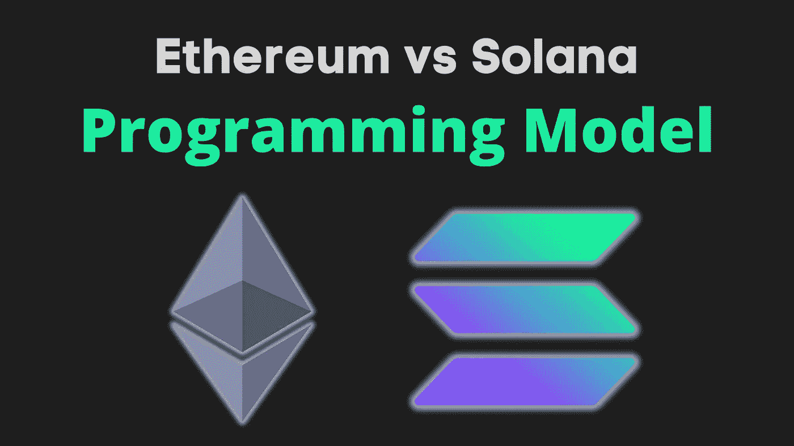
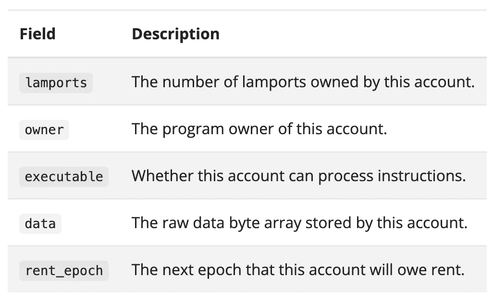
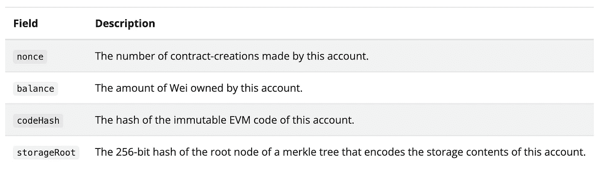
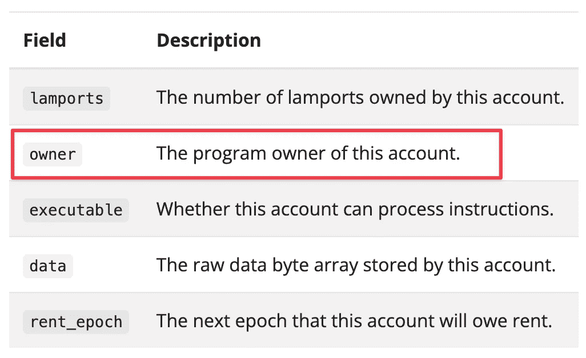

# 面向 Solidity 开发人员的 Solana 入门

> 原文：<https://betterprogramming.pub/getting-started-with-solana-for-solidity-developers-ee97a9bdf7ed>

## 通过比较以太坊和索拉纳的编程模型开始你的索拉纳之旅



如果你熟悉以太坊和固体，你可能会尝试一下索拉纳生态系统。索拉纳的快速区块链充满希望，令人兴奋。另外，你增加了你的网络 3 知识的表面积。

但是如果你从来没有看过 Solana 程序，它的语法非常可怕，文档看起来就像是一个开发者重新编写的笔记。没有连贯性，有些部分要等到后面的章节你才能理解。

这就是为什么我创作了这个“Solana Ramp for Solidity Devs”[系列](https://www.solidnoob.com/solana-ramp)来温和地向你介绍 Solana，没有痛苦和挫折。本系列的第一篇文章是“Ethereum 与 Solana 的编程模型比较”,本质上只是在 ETH 与 SOL 中如何编写程序的概念差异。

我们不会深入了解索拉纳如何在幕后工作，比如它的历史证明等等。这将在另一篇文章中讨论。

下面是这篇文章的提纲:

*   以太坊 vs 索拉纳的存储状态
*   索拉纳账户
*   程序派生地址

# 以太坊 vs 索拉纳的存储状态

在以太坊中，您习惯于将状态权限存储在智能契约本身中。看看这个简单的合同:

它只存储了一个变量`author`，并有一个助手`publish`函数来改变`author`变量。您部署这个契约，代码及其状态存储在一个地址。您可以使用该地址来引用合同并读取其数据(例如在 Etherscan 上)。

但是索拉纳不一样。

索拉纳合同是无国籍的。把它们看作只是指令。它们不存储任何数据/状态。那么数据存储在哪里呢？它存储在单独的“帐户”中。帐户保存数据。当您调用 Solana 合约的函数时，您需要将数据传递给该函数。

所以上面的`publish`函数需要引用存储数据的账户。该函数将增加发布的数量，但是`author`变量仍然存储在同一个帐户中(不是在合同中)。合同的状态没有改变。如果您来自 Java 世界，Solana 契约就像 Java 中的静态类。

> *顺便说一句，智能合约在索拉纳被称为*程序*。*

下面是上面的简单合同在 Solana 中的样子:

注意数据是如何存储在一个单独的`AuthorAccount`中的，并且这个数据是通过引用`publish`函数(通过`Context`)传入的。`solana_example`程序本身不存储任何东西。它只是对传入的数据进行操作。(`AuthorData`有点像需要将`AuthorAccount`传递给`publish`函数的包装器)。

我知道语法很吓人。这是锈和锚(索拉纳框架)。让我想起了刚开始 iOS 开发，第一次遇到 Objective C 的日子。不要担心，我们将在本[系列](https://www.solidnoob.com/solana-ramp)的第二篇文章中更详细地查看语法。会更有意义的，我保证。

将代码与数据分开使得升级程序变得容易。在 Solana 中，可以在重用相同数据帐户的同时，将新版本的程序重新部署到相同的地址，这是一种不丢失数据的升级。(这个在以太坊就难做多了)。

# 索拉纳账户

“账户”是一个模糊的词。它在不同的上下文中有很多意思。在索拉纳，一个账户仅仅意味着一个存储单元。它只是一个存储任意数据的容器。

有两种类型的账户。首先是一个“数据账户”,它只是为我们已经提到的`AuthorAccount`这样的程序存储数据。第二种类型是“程序帐户”，用于“托管”程序代码。当你在 Solana 上部署一个程序时，它的代码存储在一个“程序账户”中。

举个例子:如果你有一个计数器程序，允许你增加一个计数器，你必须创建两个账户:一个账户存储程序代码，另一个账户存储计数器值。

帐户有公钥/地址，以便能够引用它们，并且它们有私钥，用于在签名中证明修改帐户的权限

> *“权威”这个词在索拉纳世界里用得相当多。它只是意味着所有者——私钥的持有者。*

账户也存储余额。索拉纳天平。索拉纳的本币单位是索尔和兰波特(为纪念索拉纳最大的技术影响力而命名，[莱斯利·兰波特](https://en.wikipedia.org/wiki/Leslie_Lamport))。1 索尔= 10⁹兰波特斯。这些是 ETH 和 wei 的类似物。

为了创建一个帐户，Solana 需要在其存储上分配空间。Solana 上的存储不是免费的，所以创建一个帐户也不是免费的。你需要为“托管”你的账户向索拉纳支付租金。但是不用担心。如果你把两年的租金存入你的账户，你就可以免交租金。每个人都这样做，所以 Solana 上的存储基本上是免费的。

以下是索拉纳账户中存储的所有信息的摘要:



来自索拉纳[维基](https://solana.wiki/zh-cn/docs/account-model/)

`data`字段根据账户是否为`executable`存储代码或任意数据。我们稍后会谈到`owner`领域。

以太坊也有两种类型的账户:

*   外部拥有—可由您的钱包生成的常规帐户(只需生成一个私钥，然后导出公钥和地址，您就拥有了一个帐户)。这些账户仅仅存储余额和随机数。
*   智能合约帐户—这些帐户存储 EVM 代码，并且还有一个可用于存储任意数据的存储映射。

以下是以太坊账户中存储的内容，以供比较:



来自索拉纳[维基](https://solana.wiki/zh-cn/docs/account-model/)

`codeHash`用于存储代码，`storageRoot`用于存储任意数据。对于不可执行的帐户，`storageRoot`被设置为一个特殊的“空”散列，表示该帐户没有存储空间。

在以太坊，只有“可执行账户”才有存储。但是在 Solana 中，*所有的*账号都可以存储数据。但是，可执行帐户数据专门用于不可变字节代码。所有其他数据都存储在非可执行账户中，这些账户由可执行账户*拥有*。

现在，我们来谈谈索拉纳账户的`owner`字段。



为了确保契约不能修改另一个契约的状态，每个数据帐户分配一个拥有者程序，该程序对状态变化具有独占控制权。默认情况下，所有者程序是 Solana 的系统程序(有点像操作系统)。

除了所有者之外，任何人都不能修改数据帐户的状态。任何人都可以将钱存入账户，但只有账户所有人可以提取余额。

在这一点上，你知道如何程序和帐户对索拉纳的工作。但是索拉纳有一点笨拙是以太坊没有的。

假设您在 Solana 上部署了一个程序，并且还在 AWS 上部署了一个传统的 web2 前端来与程序进行交互。每次调用程序，都需要传入数据账号(修改状态)。您需要拥有数据帐户的私钥，以便能够更改数据帐户的状态。

钥匙的管理就落在你身上了。你打算把它存放在哪里？作为环境变量？这不太符合 web3。将这个密钥存储在程序本身中会很好，使它更像以太坊——一种将存储附加到程序的方法。

程序派生地址(PDA)解决了这个问题。

# 程序派生地址(PDA)

PDA 本质上允许您将数据存储帐户附加到无状态程序帐户。一种让索拉纳类似以太坊的方法。

它是如何工作的？在程序中，你只是从程序控制的变量中生成一个地址。这成为一个派生帐户(一个程序派生的地址)。Solana OS 提供了一个助手函数来导出这个地址。

更具体地说，PDA 是从一个程序 ID 和一个种子集合中派生出来的。程序 ID 是 Solana 程序的地址。种子可以由程序任意选择(我们将看到种子在哪里变得有用)。

该过程是确定性的:种子和程序 ID 的组合通过 sha256 散列函数运行，以查看它们是否生成位于椭圆曲线上的公钥(大约有 50%的结果公钥将位于椭圆曲线上)。如果它确实位于椭圆曲线上，我们简单地添加一些东西来稍微篡改我们的输入，然后再试一次。这个蒙混因素的技术术语是`bump`。在 Solana 中，我们从`bump = 255`开始，简单地向下迭代`bump = 254`、`bump = 253`等。直到我们得到一个不在椭圆曲线上的地址

> **“位于椭圆曲线上”是什么意思**？当一个公钥位于椭圆曲线上时，意味着存在一个对应的私钥，使得整个私钥密码算法能够工作。

有一个名为`findProgramDerivedAddress`的功能可以抽象出整个过程。

唷，那是一大堆技术性的东西。如果我把你弄丢了，实际上 PDA 是由程序 ID 和一些种子生成的，所以结果地址没有相应的私钥。现在，这个 PDA 是如何为 Solana 程序附加存储的呢？

PDA 解决了几个问题:

*   **无需管理/跟踪存储账户的私钥。**只需从程序中导出一个地址，并使用该地址/帐户作为存储。如何确保其他人不会修改派生帐户？因为没有对应的派生地址的私钥。所以没人能修改这个账号。Solana OS 确保只有程序被允许修改 PDA。你如何确保其他程序不能得到相同的 PDA？他们不能，因为他们的程序 ID 会不同。
*   **PDA 也可用于在单独的账户中存储用户特定信息**。这就是种子变得有用的地方。一种常见的做法是使用最终用户的公钥作为种子来生成 PDA，从而允许我们的程序将有关该用户的信息存储在它自己的独立帐户中。通过使用不同的种子，程序可以确定性地获得任意数量的地址。这些种子可以象征性地标识地址的使用方式。例如，您可以使用用户的公钥和令牌的符号作为种子，并获得一个帐户来存储关于特定令牌的用户信息(每个用户和每个令牌都将有一个新的 PDA 帐户)。

**总结一下**，PDA 只是一个拥有者是程序的账户，不像其他账户*一样有私钥。*由于没有相关的私钥，外部用户无法为 PDA 生成有效的签名。只有种子产生 PDA 的程序才能控制它——这是由 Solana OS 强制执行的。

“Solana vs 以太坊编程模型的差异”到此为止。你可以在 [SolidNoob](https://www.solidnoob.com/solana-ramp) 上查看整个“Solana Ramp for Solidity Devs”系列和更多关于 Solidity noobs 的内容。

我计划做更多的 Solana 介绍文章，如“语法差异”和“ERC-721/ERC20 实现的差异”。

```
**Want to Connect?**Follow me on [Twitter](https://twitter.com/nazar_ilamanov).
```