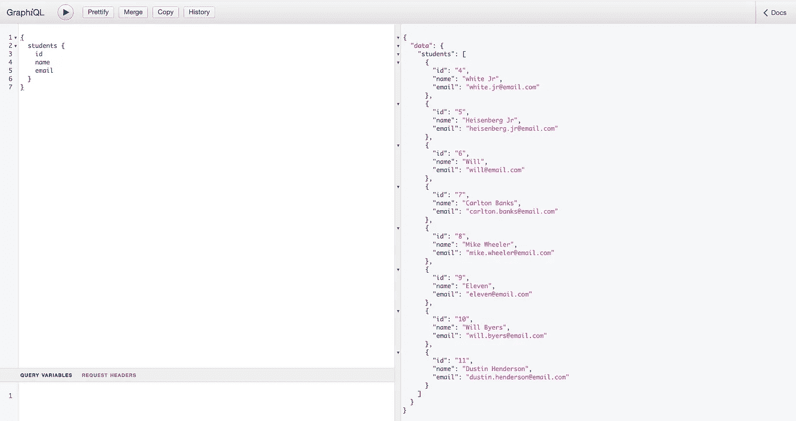
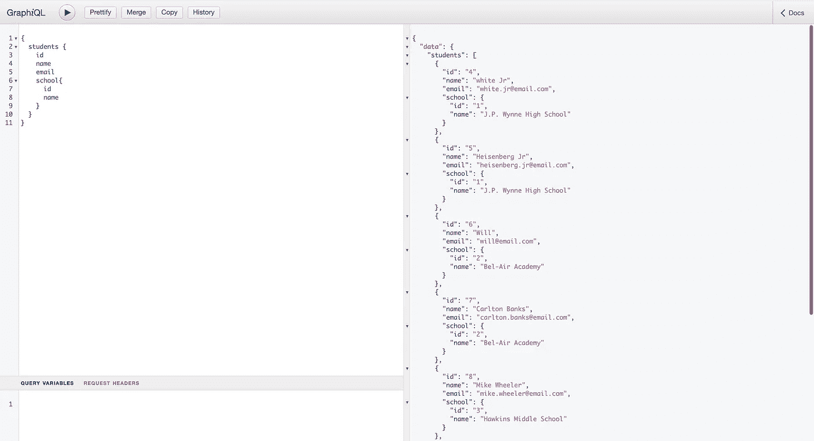
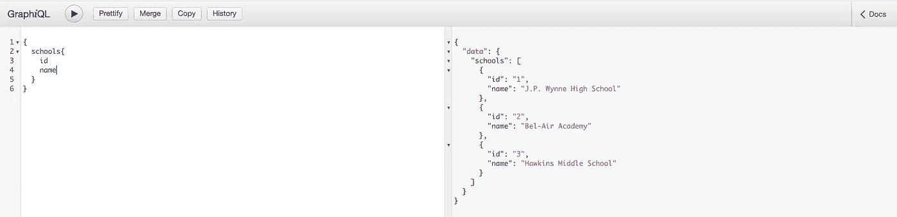
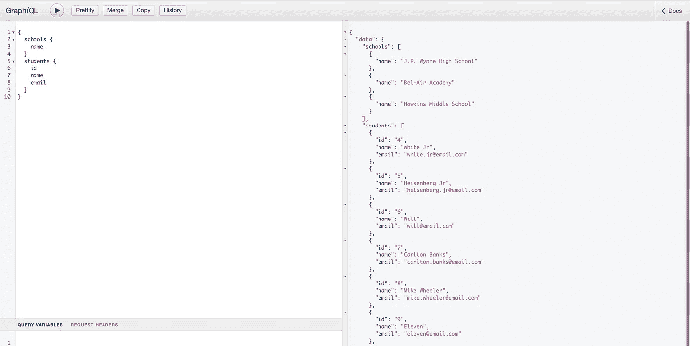

# Spring GraphQL 入门

> 原文：<https://betterprogramming.pub/getting-started-with-spring-graphql-8e53bb1acd2c>

## Spring 遇见 GraphQL


本文是在 Spring 应用程序中使用 GraphQL 的第一步。

但首先，让我们了解一下 GraphQL。根据 Red Hat 的说法，GraphQL 是一种查询语言和应用程序编程接口(API)的服务器端运行时，专注于只为客户端提供他们需要的信息。

GraphQL 的创建目标是使 API 快速、通用且对开发人员友好。它甚至可以在 GraphiQL 集成开发环境(IDE)中使用。GraphQL 是 REST 的一个替代方案，它允许开发人员创建查询，在单个 API 调用中从各种来源提取数据。

此外，GraphQL 允许 API 管理员在不影响现有查询的情况下添加或删除字段。开发人员可以使用他们选择的任何技术来创建 API，GraphQL 定义将确保它们为客户一致地工作。

# 项目理念

我们将构建的项目是一个简单的学校/学生 find all endpoint——只是这次使用 GraphQL，它允许我们更改和变异我们的响应数据结构。

学生将有一个 id，姓名，电子邮件和学校，每个学校都有一个 id 和一个名称。

**学生实体**

```
@Entity
@Data
@NoArgsConstructor
public class Student {

    @Id
    @GeneratedValue(strategy = GenerationType.SEQUENCE)
    private Long id;
    private String name;
    private String email;

    // Lazy fetch to avoid having the infinite loop
    @ManyToOne(fetch = FetchType.LAZY)
    private School school;

    public Student(String name, String email, School school) {
        this.name = name;
        this.email = email;
        this.school = school;
    }
}
```

**学生资源库**

```
@Repository
public interface StudentRepository extends JpaRepository<Student, Long> {}
```

**学校实体**

```
@Entity
@Data
@NoArgsConstructor
public class School {

    @Id
    @GeneratedValue(strategy = GenerationType.SEQUENCE)
    private Long id;
    private String name;
    @OneToMany
    private List<Student> students;

    public School(String name) {
        this.name = name;
    }

}
```

**学校知识库**

```
@Repository
public interface SchoolRepository extends JpaRepository<School, Long> {}
```

现在，我们用一个简单的`findAll`端点为学生和学校创建了控制器，从学生的:

```
@Controller
@AllArgsConstructor
public class StudentController { StudentRepository studentRepository;

    @QueryMapping
    List<Student> students(){
        return studentRepository.findAll();
    }

}
```

学校控制器将类似于学生的:

```
@Controller
@AllArgsConstructor
public class SchoolController {

    SchoolRepository schoolRepository;

    @QueryMapping
    List<School> schools(){
        return schoolRepository.findAll();
    }
}
```

在我们的主类中，我们保存了一组演示数据，我们接下来会看到:

当然，我们需要设置我们的 GraphQL 模式，在`resources`文件夹中我们创建了另一个名为`graphql`的文件，其中包含一个名为`schema.graphqls` *(* `resources>graphql>schema.graphqls` *)的文件。*

该模式应该如下所示:

```
type Query {
    students:[Student]
    schools:[School]
}

type Student {
    id: ID!
    name: String!
    email: String!
    school: School!
}

type School{
    id: ID!
    name: String!
}
```

终于到结果了！可以使用[http://localhost:8080/GraphiQL](http://localhost:8080/graphiql)上的 graphi QL 接口。

让我们尝试检索只显示姓名的学生列表:


现在，让我们按 id、姓名和电子邮件对他们进行分类:



让我们将他们的学校添加到结果中:



此外，我们可以检索学校:



当然，我们可以用相同的查询检索`Students`和学校:



# 最后

由于其结果操作，GraphQL 对任何项目都是一个显著的好处；这只是在 Spring 保护伞下使用 GraphQL 的第一步！

请在我的 GitHub 库[这里](https://github.com/xrio/spring-graphql)找到源代码。