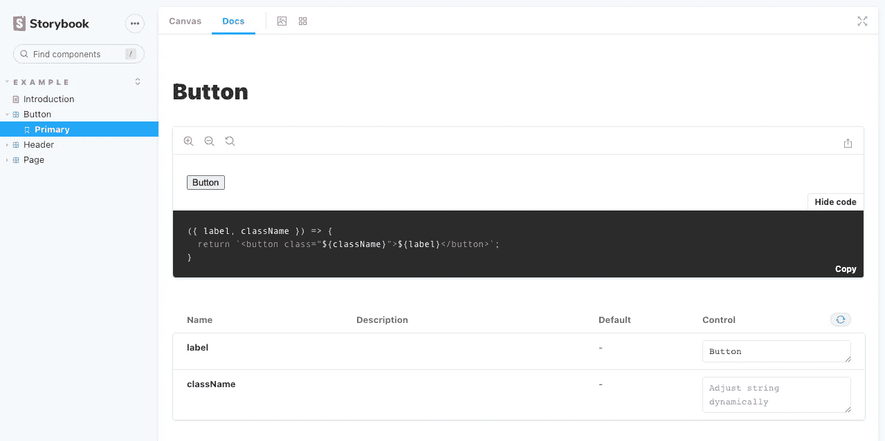
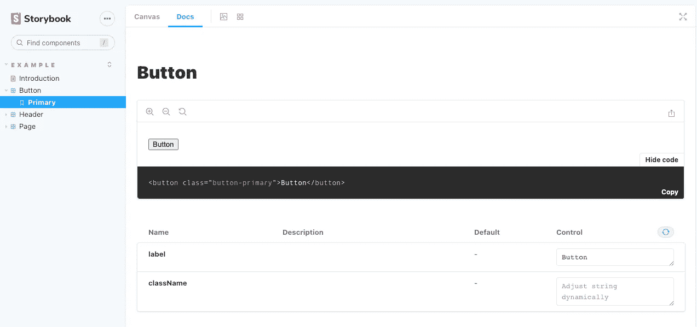

# 没有 JavaScript 框架的故事书入门

> 原文：<https://betterprogramming.pub/getting-started-with-storybook-without-a-javascript-framework-c2968d3f3d9f>

## 将它与普通 HTML 和 CSS 一起使用


由 [Ksenia Makagonova](https://unsplash.com/@dearseymour?utm_source=medium&utm_medium=referral) 在 [Unsplash](https://unsplash.com?utm_source=medium&utm_medium=referral) 上拍摄的照片。

我们都希望在前端使用文档记录良好的 UI 组件。有了 [Storybook](https://storybook.js.org/) ，你可以用 React、Angular、Vue 或任何其他框架相当快地做到这一点。

但是由于文档缺乏关于如何在没有任何 JavaScript 框架的情况下建立 Storybook 的明确信息，我将为您写下来，因为可以使用普通的 HTML 和 CSS。

*如果你想了解更多关于为什么你应该使用故事书的信息，请查看* [*为什么你在开发用户界面时应该总是使用故事书*](https://levelup.gitconnected.com/why-you-should-always-use-storybook-when-developing-user-interfaces-4c69b93b2f65) *作者* [*泰勒霍金斯*](https://medium.com/u/5a27f1e0e31b?source=post_page-----c2968d3f3d9f--------------------------------) *。*

# 装置

通过在终端中运行以下命令来添加故事书:

```
npx sb init
```

该命令将添加 Storybook 的所有依赖项并创建初始文件，以便您可以立即开始。

安装完成后，您会看到这个问题:“您要手动选择要安装的故事书项目类型吗？”键入“是”然后会出现“请从列表中选择一个项目类型”。为此，键入“HTML”

现在，CLI 将设置一切使用纯 HTML 的故事书。

安装完成后运行`npm run storybook`。

# 全局设置

当您检查您的目录时，您会看到一个名为`.storybook`的文件夹。在这个文件夹中，有两个文件:`main.js`和`preview.js`。

在`main.js`文件中，您可以配置将在哪个目录中检查`*.stories.js`文件(其他文件扩展名也是可能的)。Storybook 还有一个插件系统叫做[附加组件](https://storybook.js.org/docs/html/addons/introduction)，你也可以在这里添加。

在`preview.js`文件中，您可以在预览您的 UI 组件时添加需要加载的所有内容。

例如，添加您的全局 CSS 文件或图标字体，使其在所有组件中都可用。

# 纯 HTML 的示例故事文件

在 stories 文件夹中，您会找到文件`Button.stories.js`。看起来是这样的:

这是一个很好的故事文件的例子。`Button.js`中的代码将创建一个`<button>`元素。

尽管看起来很好很清晰，但是`createButton`创建`<button>`标签的方式并不能让我们生成清晰的代码示例来复制和粘贴。所以我们要做的有点不同。

# 带代码示例的普通 HTML 故事

为了实现这一点，我们需要一个故事书插件。运行以下代码进行安装:

```
npm i @storybook/addon-storysource
```

安装完成后，将其添加到`.storybook/main.js`文件中，如下所示:

在`stories`文件夹中创建一个名为`helpers`的文件夹。在该文件夹中，创建一个名为`code-example.js`的文件。在这个文件中，我们将创建一个助手函数，为我们的代码示例生成数据。

在该函数中，我们将`component`和`templateConfig`作为参数。这些参数将为我们提供组件本身的信息。

对于这个例子，我将通过只添加一个按钮的例子来最小化`Button.stories.js`的长度。所以复制粘贴下面的代码:

如果您检查 Storybook 中的按钮组件，您的代码示例还不能进行复制粘贴。



通过使用函数生成该示例，您将看到不同之处:

在这里，你可以看到我添加了`Primary`作为第一个参数，添加了`Template`作为下一个参数。这将生成简单的 HTML 代码，您可以复制和粘贴。



# 结论

现在你已经知道如何使用 Storybook 和普通的 HTML 和 CSS，你可以更有效地创建你的 UI 组件！

Storybook 是在任何 web 应用程序中使用的一个很好的工具。我对它超级满意！如果你愿意，可以在 GitHub 上查看他们的[项目，表示一些支持！](https://github.com/storybookjs/storybook)

你在什么样的应用程序或架构中使用或计划使用故事书？请让我知道。

***快乐编码！🚀***

# 谢谢！


读完这个故事后，我希望你学到了一些新的东西，或者受到启发去创造一些新的东西！🤗

如果我给你留下了问题或一些要说的话作为回应，向下滚动并给我键入一条消息。如果你想保密，请在 Twitter @DevByRayRay 上给我发一条 DM。我的 DM 永远是开放的😁

[**通过电子邮件获取我的文章点击这里**](https://byrayray.medium.com/subscribe) **|** [**购买 5 美元的中等会员资格**](https://byrayray.medium.com/membership)

# 阅读更多


[雷雷](https://byrayray.medium.com/?source=post_page-----c2968d3f3d9f--------------------------------)

## 荒诞的故事

[View list](https://byrayray.medium.com/list/angular-stories-24674407532a?source=post_page-----c2968d3f3d9f--------------------------------)6 stories

[雷雷](https://byrayray.medium.com/?source=post_page-----c2968d3f3d9f--------------------------------)

## 最新的 JavaScript 和 TypeScript 故事

[View list](https://byrayray.medium.com/list/latest-javascript-typescript-stories-0358ad941491?source=post_page-----c2968d3f3d9f--------------------------------)14 stories