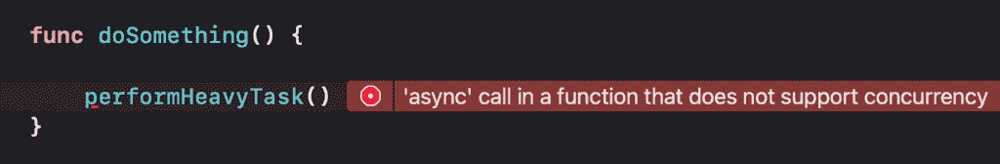
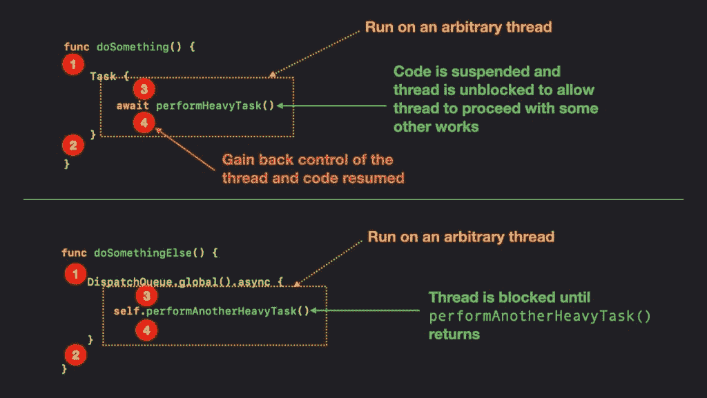
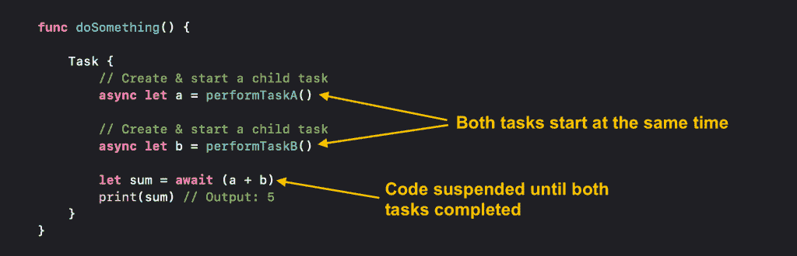
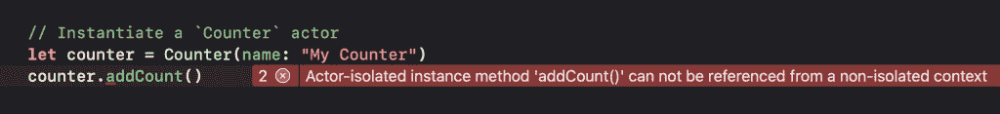

# 快速并发入门

> 原文：<https://betterprogramming.pub/getting-started-with-swift-concurrency-b6b3040362d7>

## 快速概述*异步/等待*、*结构化并发*和*参与者*


弗兰克·麦肯纳在 [Unsplash](https://unsplash.com?utm_source=medium&utm_medium=referral) 上拍摄的照片

对于开发人员来说，编写异步代码一直是一项具有挑战性的任务。多年来，Apple 提供了各种工具，如 grand central dispatch (GCD)、Operations 和 dispatch queue，帮助开发人员编写异步代码。所有这些工具都很棒，但是它们都有各自的优缺点。

在今年的 WWDC 上，苹果将这一点提升到了一个新的水平，推出了 Swift concurrency，内置语言支持，承诺异步代码易于编写，易于理解，最重要的是，不受竞争条件的影响。

在本文中，我将向您简要介绍 async/waits、结构化并发和 actor，这是 Swift 并发的三个主要特性。

希望在本文结束时，您能够很好地理解什么是 Swift concurrency，以及如何在自己的项目中使用它。

# 异步/等待

那么什么是 async/await？我们总是听到人们说我们可以使用 async/await 来使我们的代码并发运行，然而这并不是 100%正确的。仅使用 async/await 不会使您的代码并发运行，它们只是 Swift 5.5 中引入的关键字，告诉编译器某个代码块应该异步运行。

假设我们有一个函数执行一些需要一段时间才能完成的繁重任务，我们可以将该函数标记为`async`,如下所示:

异步函数是一种特殊类型的函数，它可以在执行过程中被挂起。然而，就像普通函数一样，异步函数也可以返回值并抛出错误。

如果一个函数被标记为`async`，那么我们必须像这样使用`await`关键字来调用它:

```
await performHeavyTask()
```

`await`关键字表示`performHeavyTask()`功能可能会由于其异步特性而被挂起。如果我们试图像调用普通(同步)函数一样调用`performHeavyTask()`函数，我们将会得到一个编译错误，说明在一个不支持并发的函数中调用了–*‘async’*。



为什么我们会得到这个错误是因为我们试图在同步上下文中调用异步函数。为了在同步和异步世界之间架起桥梁，我们必须创建一个`[Task](https://developer.apple.com/documentation/swift/task)`。

`Task`在 Swift 5.5 中引入。苹果公司称，`Task`是异步工作的单位。在任务的上下文中，代码可以被挂起并异步运行。因此，我们可以创建一个任务，并用它来调用我们的`performHeavyTask()`函数。方法如下:

上面的代码将为我们提供类似于使用全局调度队列的行为:

然而，他们如何在幕后工作实际上是很不一样的。

## 异步/等待与调度队列

当我们创建一个任务时，该任务将在任意线程上运行。当线程到达一个暂停点(代码标记为`await`)时，系统将暂停代码并解锁线程，以便线程在等待`performHeavyTask()`结束时可以继续进行其他工作。一旦`performHeavyTask()`完成，任务将重新获得对线程的控制，代码将继续执行。

就像任务一样，全局调度队列也运行在任意线程上。然而，线程在等待`performAnotherHeavyTask()`完成时被阻塞。因此，在`performAnotherHeavyTask()`返回之前，被阻塞的线程将不能做任何其他事情。这使得它与 async/await 方法相比效率较低。

下图显示了`DispatchQueue`和`Task`的程序流程:



比较任务和调度队列

## 模拟长期运行任务

如果您想尝试 async/await 关键字并亲自查看它们的运行情况，您可以使用`Task.sleep(_:)`方法来模拟一个长时间运行的任务。这个方法什么也不做，只是在返回之前等待给定的纳秒数。这是一个可行的方法，因此你可以这样称呼它:

注意，调用`Task.sleep(_:)`方法时不需要创建任务，因为`performHeavyTask()`被标记为`async`，这意味着它将在异步上下文中运行，因此不需要创建任务。

这就是 async/await，接下来我们将看看什么是结构化并发。

# 结构化并发

假设我们有两个返回整数值的异步函数，如下所示:

如果我们想得到这两个函数返回值的和，我们可以这样做:

上述代码需要 5 秒钟才能完成，因为`performTaskA()`和`performTaskB()`按顺序运行，`performTaskA()`必须先完成，然后`performTaskB()`才能开始运行。

您可能已经注意到了，上面的代码并不是最佳的。由于`performTaskA()`和`performTaskB()`是相互独立的，我们可以通过同时运行`performTaskA()`和`performTaskB()`来提高执行时间，使得只需要 3 秒钟就可以完成。这就是结构化并发的用武之地。

结构化并发的工作原理是，我们将创建两个子任务，同时执行`performTaskA()`和`performTaskB()`。在 Swift 5.5 中，创建子任务有两种主要方式:

1.  使用异步 let 绑定
2.  使用任务组

对于本文，让我们关注更简单的方法——使用 async-let 绑定。

## 异步 let 绑定

以下代码演示了如何将 async-let 绑定应用到我们之前的示例中:

在上面的代码中，注意我们如何结合`async`和`let`关键字来创建一个在`performTaskA()`和`performTaskB()`函数上的 async-let 绑定。这样做将创建两个子任务，同时执行这两个功能。

由于`performTaskA()`和`performTaskB()`都被标记为`async`，我们需要等待这两个函数都完成，以便获得`a`和`b`的值。因此，在获取`a`和`b`的值时，我们必须使用`await`关键字来表示代码可能会暂停，同时等待`performTaskA()`和`performTaskB()`完成。



使用 async-let 并发运行任务

# 行动者

当处理异步和并发代码时，我们可能遇到的最常见的问题是数据竞争和死锁。这类问题很难调试，也很难修复。由于 Swift 5.5 中包含了 actors，我们现在可以依靠编译器来标记代码中任何潜在的竞争情况。那么演员是怎么工作的呢？

## 它是如何工作的？

参与者是引用类型，其工作方式类似于类。然而，与类不同，actors 将确保一次只有一个任务可以改变 actors 的状态，从而消除了竞争条件的根本原因——多个任务同时访问/更改同一个对象状态。

为了创建一个 actor，我们需要使用关键字`actor`对它进行注释。这里有一个示例`Counter` actor，它有一个`count`可变状态，可以使用`addCount()`方法进行变异:

我们可以像实例化一个类一样实例化一个 actor:

现在，如果我们试图在`Counter` actor 之外调用`addCount()`方法，我们将得到一个编译器错误，说明–*Actor 隔离的实例方法‘add count()’不能从非隔离的上下文*中引用。



我们得到这个错误的原因是编译器试图保护`Counter` actor 的状态。假设有多个线程同时调用`addCount()`，那么就会出现竞争情况。因此，我们不能像调用普通的实例方法一样简单地调用 actor 的方法。

为了避开这个限制，我们必须用关键字`await`标记调用位置，表明`addCount()`方法在被调用时可能会挂起。这实际上很有意义，因为为了保持对`count`变量的互斥，`addCount()`的调用点可能需要暂停，以便它可以等待其他任务完成后再继续。

记住这一点，我们可以应用我们在 async/await 部分学到的知识，并像这样调用`addCount()`:

## 非隔离关键字

现在，我想请大家注意一下`Counter`演员的`getName()`方法。就像`addCount()`方法一样，调用`getName()`方法也需要`await`注释。

然而，如果你仔细观察，`getName()`方法只是访问`Counter`的`name`常量，它并不匹配`Counter`的状态，因此不可能创建竞争条件。

在这种情况下，我们可以通过将`getName()`方法标记为`nonisolated`来将其排除在行为人的保护之外。

这样，我们现在可以像普通的实例方法一样调用`getName()`方法:

在结束这篇文章之前，我还想介绍一下关于演员的最后一点，那就是`MainActor`。

# 主要演员

`MainActor`是一种特殊的演员，总是在主线上运行。在 Swift 5.5 中，所有的 UIKit 和 SwiftUI 组件都标记为`MainActor`。由于所有与 UI 相关的组件都是主要参与者，所以当我们想要在后台操作完成后更新 UI 时，我们不再需要担心忘记分派给主线程。

如果你有一个应该一直在主线程上运行的类，你可以用`@MainActor`关键字来注释它，如下所示:

但是，如果您只想让您的类中的某个特定函数总是在主线程上运行，您可以使用`@MainActor`关键字来注释该函数:

# 包扎

我对 Swift 并发感到非常兴奋，我可以预见，在不久的将来，Swift 并发肯定会成为编写异步 Swift 代码的标准。

我在这篇文章中提到的只是冰山一角，如果你想了解更多，我强烈推荐你看看《WWDC 21》的这些视频。

如果您喜欢这篇文章，并且不想错过任何与 Swift 并发相关的未来文章，请随时关注我的 [Twitter](https://twitter.com/Lee_Kah_Seng) 。

感谢阅读。