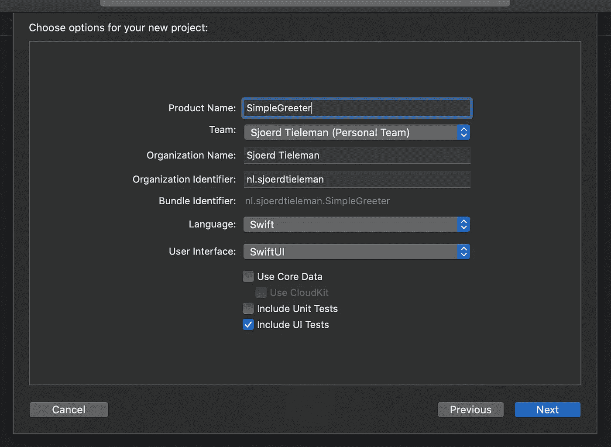
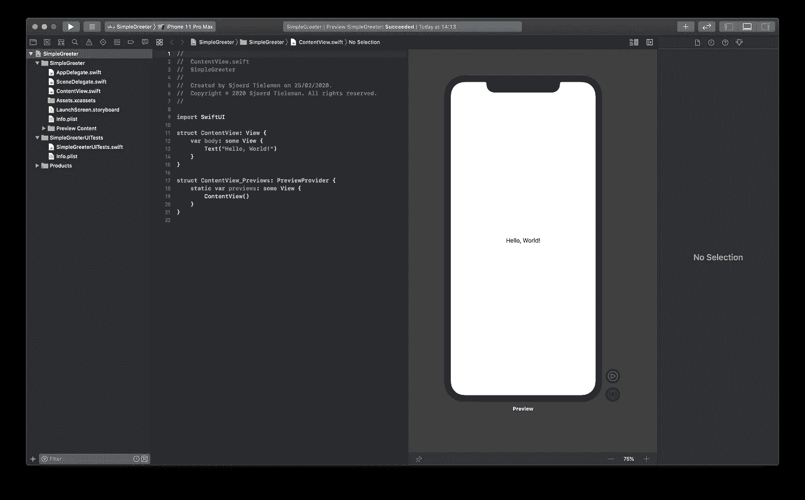

# 开始 SwiftUI 和 Xcode UI 测试

> 原文：<https://betterprogramming.pub/getting-started-with-swiftui-xcode-ui-testing-6e9f6e4a8492>

## 了解开始测试 SwiftUI 组件有多简单


每隔一段时间，从你的项目工作中抽出一点时间后退一步，看看你的开发领域目前发生了什么，这是一个好主意。幸运的是，对于 iOS 开发者来说，当苹果开始在 WWDC 发布 iOS 新功能时，这一时刻(至少)每年都会到来一次。

苹果在 2019 年发布的主要公告之一是在 iOS 开发工具包中添加了 [SwiftUI](https://developer.apple.com/xcode/swiftui/) 。它并不意味着直接取代 UIKit，但它无疑是构建用户界面的一种更现代的方法。这是过去几年中 iOS 用户界面开发的最大变化之一。

有了创建用户界面的良好的声明方式，我想知道当进行测试驱动开发(TDD)时，生活是否会变得更容易。不必在 Storyboard、ViewController 和 XCTest 之间来回切换的前景至少看起来很有吸引力。

我创建了一个小的测试项目，它将简单地显示一个文本标签，从一个文本字段请求一些输入，并在第三个文本字段中显示结果。一点也不像火箭科学——只是一些入门的东西。我将逐步增加功能，而不是一次全部增加，这样您就可以看到您的测试是如何发展的。这反映了正常开发发生的方式:随着时间的推移，特性得到扩展和添加，测试套件需要相应地更新。

我们走吧。

# 测试项目

首先，我在新项目选项对话框中创建了一个新的单视图应用。我把它命名为`SimpleGreeter`——猜猜它会做什么！



确保为用户界面选择 SwiftUI，并勾选包括 UI 测试选项。在这种情况下，由于应用程序的规模有限，我没有勾选包含单元测试选项，但是如果您愿意，以后添加单元测试是很容易的。

一旦您将应用程序保存到一个合理的位置，它应该看起来像这样。如果预览没有显示，请确定您按下了预览窗口右上角的“继续”按钮。



现在，在我们开始编写用户界面之前，花一点时间想想我们希望在应用程序中显示什么，以及用户如何交互(我们正在进行测试驱动，对吗？).首先，我想显示一个文本标签，以提供一些说明和一个文本字段，供用户输入他们的姓名。

所以切换到`SimpleGreeterUITests.swift`文件，并添加一个测试。首先，删除`tearDown`和`testLaunchPerformance`方法，因为在这个例子中我们不会用到它们。将`testExample`方法重命名为类似于`testInitialViewState`的名称，以表明这是一个测试用户界面默认状态的方法。此外，请随意删除 Xcode 为您生成的大量注释。

为了填充测试方法，我们将添加四个断言:

*   文本标签存在吗？
*   文本标签的文本是否正确？
*   文本字段是否存在？
*   文本字段是否有正确的占位符文本？

您应该会得到这样的结果:

现在，当然，如果您运行这个测试，它将失败，即使有一个文本标签，因为它包含一个不同的文本(“Hello，World！”).所以让我们来解决这个问题，我们将转到我们的`ContentView.swift`文件，开始添加一些控件，并确保我们的断言是真实的。

我们将在`VStack`中排列文本标签和文本字段，添加一些填充，并提供合理的标题和占位符。来自文本字段的输入我们将存储在一个名为`name`的变量中。目前就是这样——只需关注为通过测试而需要添加的最少功能。你会得到这样的结果:

现在再做一次测试，瞧！全线绿色。特别注意`name`变量的`@State`注释。这向 SwiftUI 发出信号，每次该值更新时，视图应该相应地更新。

但我们还没有完成，现在我们想更新它，以便每次您在文本字段中输入内容时，我们都会在新的文本标签中看到一条问候您的消息。因此，如果我在文本字段中输入“Jony”，我们应该会看到一个标签，上面写着“很高兴见到你，Jony。”同样，我们先做这个测试。返回到`SimpleGreeterUITests.swift`文件，添加另一个方法来测试您是否可以点击文本字段，添加一些文本，并查看正确的结果。

然而，由于我们将添加另一个文本标签，我们不能简单地通过使用`app.staticTexts.element`来引用文本标签，因为这只有在视图上只有一个文本标签时才有效。从文档中:

> "当您期望查询的单个匹配元素，但希望在访问结果之前检查多个不明确的匹配时，请使用`element`属性来访问查询的结果。`element`属性遍历应用程序的可访问性树，在返回之前检查多个匹配元素，如果没有一个匹配元素，则当前测试失败。

因此，我们需要区分旧的文本标签和将要添加的新的文本标签。我们可以通过使用`accessibilityIdentifier`来做到这一点。这个属性是由`UIAccessibilityIdentification`协议提供的，文档中说:

> 标识符可用于唯一标识您使用 UI 自动化接口编写的脚本中的元素。使用标识符可以避免不恰当地设置或访问元素的可访问性标签。

所以这正是 Apple 认为我们应该用来查询视图中正确元素的属性。这避免了(ab)使用`accessibilityLabel`(由屏幕阅读器使用)或检查某些标题或其他文本内容，这些内容在运行时可能会改变或具有意外的值。测试将如下所示:

有趣的是，我们将一个接一个地输入每个字母。`typeText`方法接受一个完整的字符串，但是如果你使用它，UI 自动化有时会输入太快，一些字符会被忽略，导致测试随机失败。不酷。

同样，这个测试会失败，因为我们没有正确的标签`accessibilityIdentifier`，我们没有实现正确的行为。让我们解决这个问题。我们只需在`ContentView.swift`中的`VStack`底部添加一个新的文本标签，就可以开始了:

```
Text("Nice to meet you, \(name).")
  .accessibility(identifier: "greetingTextLabel")
```

对吗？嗯，不。因为，是的，你的新测试会通过，但你的第一次测试会失败。这个应用程序有一个不想要的副作用，我们现在有一个额外的文本字段，在它的初始状态说`Nice to meet you, .`糟糕！

所以我们想解决这些问题:

1.  修复第一个测试(并为新的 UI 更新它)。
2.  确保每当没有输入姓名时(姓名为空)，我们不显示任何问候语。

为了解决第一点，我们将向第一个文本标签添加一个标识符，更新测试以使用它，并为新引入的文本标签添加额外的断言——检查它是否存在以及默认状态是否为空。更新后的测试将如下所示:

既然我们已经更新了第一个测试，我们将更新视图的行为来匹配它。我们将引入一个计算属性`greetingText`，它要么返回一个空字符串(如果没有输入姓名)，要么返回完整的问候文本。在这里，我使用了 Swift 5.1 的新特性( [SE-0255](https://github.com/apple/swift-evolution/blob/master/proposals/0255-omit-return.md) )，其中如果你的方法只包含一个表达式，它也被用作隐式返回。最后的`ContentView`是这样的:

最后的`SimpleGreeterUITests`看起来像:

# 结论

最后，这只是使用 SwiftUI 对 Xcode UI 测试的一个简单介绍。当然，还可以做更多的事情来改进 UI，但它表明，只需很少的努力，您就可以在 SwiftUI 视图中开始使用界面测试。我认为，到目前为止，做出改变并看到它们在你的应用程序中立即生效并不容易。

然而，它确实(像任何 TDD 一样)需要一点纪律和奉献精神。此外，Apple 文档在这方面有时提供的支持很少，如果没有对实际原因的清晰描述，测试可能会失败。这可能有点困难，但将来你会感谢你的。

如果你正在开始一个新项目或者刚刚进入 SwiftUI，并且你还没有使用 UI 测试，现在是开始的好时机。

最后一点:在你的视图中使用逻辑(例如`greeterText`)当然应该尽可能的避免，这样做只是为了不使这个示例项目复杂化。然而，一旦您开始注意到您的视图中有应用程序逻辑，就考虑切换到基于 ViewModel 的架构(并且一定要测试它)。

项目的最终代码可以在 [GitHub](https://github.com/tieleman/SimpleGreeter) 上找到。