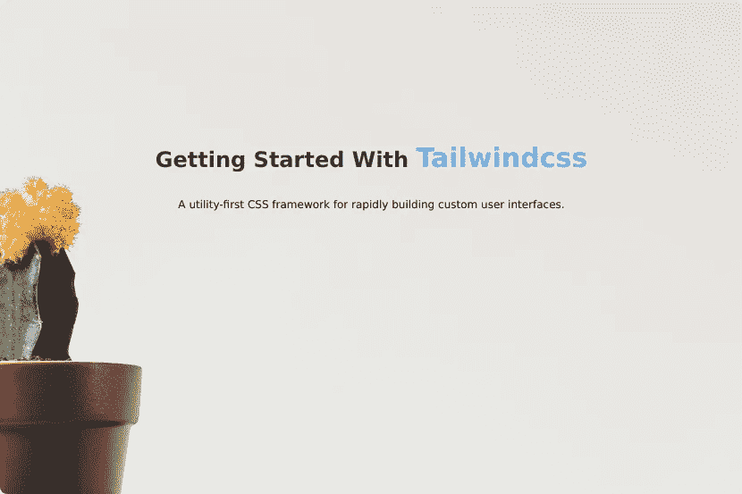
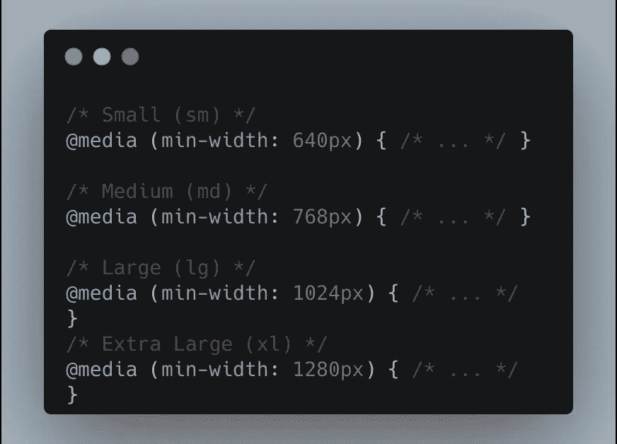
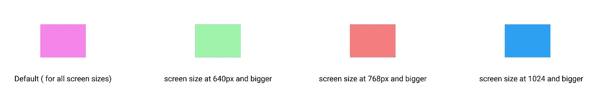

# 顺风 CSS 入门

> 原文：<https://betterprogramming.pub/getting-started-with-tailwind-css-d96150d0ff5e>

## 实用程序优先的 CSS 框架，用于快速构建自定义用户界面


照片由 [Cathryn Lavery](https://unsplash.com/@cathrynlavery?utm_source=medium&utm_medium=referral) 在 [Unsplash](https://unsplash.com?utm_source=medium&utm_medium=referral) 上拍摄。

写一长串的 CSS 有时会很耗时，令人疲惫，令人沮丧，这就是为什么你应该为这项工作选择正确的框架。

在本文中，您将学习如何在您的项目中安装和设置 [Tailwind](https://tailwindcss.com/) 。但是在深入项目本身之前，让我们简单了解一下什么是顺风。

# 什么是顺风 CSS？

根据官方网站[的说法](https://tailwindcss.com/)，“Tailwind CSS 是一个高度可定制的低级 CSS 框架，它为你提供了构建定制设计所需的所有构件。”

Tailwind 不会像 bootstrap 那样拿出预先设计好的组件。相反，它提供了低级的实用程序类，在那里你可以用定制的设计来构建你的站点，而不是用一段艰难的时间来覆盖固执己见的风格。

要使用 Tailwind CSS，你应该对 CSS 有一个基本的了解。

*注意:Tailwind 类只是 CSS 属性/值的简化版本，所以如果没有 CSS 的先验知识，就不应该使用 Tailwind。*

# 我们开始吧

## 项目详情

对于这个项目，我们将只使用 Tailwind 制作一个简单的单页静态网站。



请在 [MyTailWindcsssite](https://mytailwindcsssite.netlify.app/) 上查看。

# 装置

在这个项目中，我们将通过节点包管理器(npm)安装 Tailwind CSS，但是您也可以使用 CDN。如果您选择后一种方法，您将无法使用一些功能，如提取自定义 CSS 类。但如果你只是想尝试一下，那就去吧。

```
/* Tailwind CSS CDN */<link href="[https://unpkg.com/tailwindcss@](https://unpkg.com/tailwindcss@)^1.0/dist/tailwind.min.css" rel="stylesheet">
```

要安装 Tailwind，我们将首先创建一个文件夹:

```
$ mkdir mytailwindcsssite
```

现在，转到新创建的文件夹，初始化 npm 来安装 Tailwind:

```
$ cd mytailwindcsssite$ npm init -y
```

在文件夹中初始化 npm 后，将创建一个`package.json`文件。现在，我们可以通过运行以下命令轻松安装`tailwindcss`包:

```
$ npm install tailwindcss 
```

## 将顺风添加到项目

下一步是在我们的项目中添加顺风。为此，我们将创建一个名为`src/styles.css`的文件，在其中我们将注入所有三个顺风指令来导入`base`、`components`和`utilities`样式:

```
@tailwind base;@tailwind components;@tailwind utilities;
```

您还可以在项目中添加一个Tailwind 配置文件，让您创建自己的 CSS 类或通过`@import`规则导入字体。要安装`tailwindcss`配置文件，运行以下命令:

```
$ npx tailwindcss init
```

这将创建一个名为`tailwind.config.js` 的新文件，内容如下:

*注意:这只是一个可选文件，当你需要扩展 CSS 类或者插入额外的设置时，我们会在后面看到如何使用这个文件。*

## **处理 CSS 到顺风**

Tailwind 需要一个构建过程来处理 CSS 文件，并根据`src/style.css`文件中注入的指令将所有 CSS 代码插入样式表。

要开始构建过程，可以使用 PostCSS。PostCSS 是一个软件开发工具，它使用基于 JavaScript 的插件来自动化常规 CSS 操作。简单来说就是用 Javascript 转化 CSS 的工具。我们不会使用 PostCSS 方法，因为我们只是在做一个非常基础的项目，但我们仍然需要构建 Tailwind。我们可以通过使用顺风命令行界面来实现。

```
$ npx tailwindcss build src/styles.css -o public/styles.css
```

或者我们可以直接将这个命令包含到我们的`package.json`文件中，这样每当我们需要构建 Tailwind 时，我们就不必每次都运行这个长命令。相反，我们可以通过 npm 构建我们的`tailwindcss`文件。

将`tailwind css build`命令添加到`package.json`文件:

```
"scripts": {
   "build": " tailwindcss build src/styles.css -o public/styles.css"
  },
```

现在，要开始构建过程，请运行以下命令:

```
$ npm run build
```

请注意，在运行该命令后，您将创建一个名为`public`的文件夹，其中包含一个`styles.css`文件。`public/styles.css`文件将包含所有由 Tailwind 处理的 CSS 代码。

# 创建 HTML 文件

我们已经完成了项目的 tailwindcss 设置。现在，是时候写一些 HTML 代码并将`public/styles.css`文件链接到`index.html`文件了。

让我们创建一个简单的按钮进行演示:

```
<button> Click Me </button>
```

为了给这个按钮添加样式，我们使用了 Tailwind 提供的类:

```
<button class="bg-blue-500 p-3 text-white font-bold rounded text-xl">Click Me</button>
```


上述代码的结果

下面是在 button 元素上使用的类:

1.  `bg-blue-500`:给出蓝色的背景色。
2.  `p-2`:在顶部、右侧、底部和左侧填充 0.5 雷姆。
3.  `text-white`:赋予文本白色。
4.  `font-bold`:将文本的字体粗细设为粗体。
5.  `rounded`:使钮扣的角变圆。
6.  `text-xl`:给出 1.25 雷姆的字体大小

## 导航栏

现在我们知道了如何应用 Tailwind 类，让我们创建导航栏:


这里使用的大多数类都是不言自明的，但是有一些类您可能还不知道。下面是这些类的简要说明:

1.  `flex` : 给`ul`元素显示伸缩。
2.  `justify-end`、`items-center` : 分别与`justify-content: flex-end`和`align-items: center`相同。
3.  `text-center`:同`text-align: center`。

你可能想知道`sm:`是什么？这里，它被用作`flex`属性的前缀。事情是这样的，当你使用 TailwindCSS 的时候，你不用再写媒体查询了。Tailwind 还为您提供了一些用于媒体查询的实用程序类，让您的站点响应更加简单。

这些是 Tailwind 提供的带有断点的媒体查询类:



具有各自大小的顺风媒体查询类

*注:* *顺风采用移动优先断点制。* [*根据文档*](https://tailwindcss.com/docs/responsive-design) *，这意味着“不带前缀的实用程序(如* `*uppercase*` *)对所有屏幕尺寸都有效，而带前缀的实用程序(如* `*md:uppercase*` *)只在指定断点及以上有效。”*

看看这个小例子:

```
<div class="w-12 h-12  bg-pink-300 sm:bg-green-300 md:bg-red-500 lg:bg-blue-500"></div>
```



在出现断点之前，所有屏幕尺寸的元素都是粉红色的。

通常，人们会对移动优先的布局系统感到困惑，并使用`sm:`类来设计移动设计，这是不正确的。要针对移动屏幕，不要使用任何前缀实用程序类。

同样，你可以使用伪类，比如`hover`、`focus`等。

```
<button class="bg-blue-500 p-3 text-white font-bold rounded text-xl **hover:text-black hover:bg-blue-700**">Click Me</button>
```

回到我们的导航栏，你可以看到在锚标签中使用了许多顺风实用程序类，并且在所有的锚标签中反复出现。这使得我们的 HTML 看起来有点乱，可能会成为维护我们的类的负担。为了解决这个问题，我们可以提取组件。

## 提取组件

Tailwind 给出了一个`@apply`指令，可以方便地提取 CSS 组件类的公共实用模式。我们使用这个指令的方法是给我们的组件起一个名字(我们将在`index.html`*)**`public/styles.css`*中使用这个名字，并写下我们想要应用的顺风实用程序。**

**现在从我们的锚标签中复制所有的类(除了`block`和`inline-block`)，并命名为`anchor`来创建一个组件。**

**提取 *public/styles.ss* 中的组件**

**在这里，您可以看到 CSS 类`anchor`是通过使用`@apply`指令定义的。为了进行更改并使用`anchor` 标记，我们必须再次执行构建过程:**

```
**npm run build**
```

**现在，我们可以在 HTML 代码中使用这个类:**

**注意，我使用了类`h-h10`。这不是 Tailwind 本身提供的一个类，但是它给了我们自己扩展和定制一些属性的选项。我给了`h-h10`类一个 10vh 的高度，以便在`nav`元素中使用。您可以在`tailwind.config.js`的`theme.height`部分自定义高度。**

```
***/* tailwind.config.js */*theme: {
    height: {
        h10 : "10vh",
        h90: "90vh",
},**
```

**除了直接在 CSS 文件中编写组件类之外，还可以通过编写自己的插件向 Tailwind 添加组件类。在[官方顺风文档](https://tailwindcss.com/docs/extracting-components)中查看如何实现。**

**到目前为止，我们只使用 Tailwind CSS 实用程序类创建了我们的导航栏。对于整个项目源代码，请查看 [GitHub repo](https://github.com/nikhilswain/mytailwindcsssite) 。**

# **结论**

**与各种 CSS 框架不同，Tailwind CSS 使用了一种不同的方法，并提供了许多低级的实用程序类，你可以用它们来设计你喜欢的网站风格。**

**在本文中，您了解了如何在项目中设置 Tailwind CSS，如何使用 Tailwind 提供的实用程序类，以及如何创建自己的组件并提取它。要完整的学习 Tailwind CSS，建议去通读一下[官方文档](https://tailwindcss.com/docs/installation)，看看提供了哪些类，它们是如何工作的。**

**谢谢你读到这里。我希望你学到了新东西。**