# iOS 中的 Combine 框架入门

> 原文：<https://betterprogramming.pub/getting-started-with-the-combine-framework-in-ios-208c47b54ea1>

## 了解苹果新的声明式编程库中的协议和底层函数

詹妮弗·博瑙尔在 [Unsplash](https://unsplash.com/s/photos/start?utm_source=unsplash&utm_medium=referral&utm_content=creditCopyText) 上的照片

编程语言是一种用来控制计算机行为的语言。这是一个写程序的符号。有成千上万种计算机编程语言，而且每年都在创造更多的语言。

许多编程语言是以命令形式(即，作为要执行的操作序列)编写的，而其他语言使用声明形式(即，指定期望的结果，而不是如何实现它)。

iOS 的 UIKit，watchOS 的 WatchKit，MacOs APIs 的 AppKit 它们都遵循命令式编程。假设我们可能有一个函数，当一个按钮被点击时，这个函数就会被调用。

使用命令式框架带来的一些问题通常与代码中存储的值的状态有关。正在跟踪这些状态，以执行依赖于当前状态的工作类型。

例如，一个简单的灯泡开关可以有两种状态，开或关。如果使用两个开关，并且每个组合根据状态导致不同的动作，会怎么样？这是四种不同的组合。如果现在使用三个或四个开关会怎么样？如你所见，它会很快变得复杂。

与命令式编程相反，使用声明式编程，可以对应用程序在不同状态下应该做什么和看起来像什么进行编程，并让它自己处理这些状态之间的移动。

反应式编程就是这样一种关注数据流和变化传播的范例。

2019 年，苹果推出了一个名为 Combine 的原生第一方框架，基于编程的功能反应范式。在本文中，我们将会看到 Combine 框架的一些概念，并熟悉它。

# **异步编程**

异步编程是一种编程类型，在这种编程中，一个工作单元在不同的线程上单独运行，不阻塞结果，并通知调用线程它已完成。

使用异步编程的主要好处是提高应用程序性能和增强用户体验。

在 iOS 中，有多种接口可以用来执行异步工作——KVO、通知中心、委托、闭包或块等。

有时，实现所有这些模式会变得势不可挡。那么，有什么解决办法呢？解决这个问题的一种方法是使用反应式编程。

# **无功编程**

根据维基百科:

> 在计算中，反应式编程是一种声明式编程范例，涉及数据流和变化的传播。
> 
> 利用这种范例，可以容易地表达静态(例如，数组)或动态(例如，事件发射器)数据流，并且还传达相关联的执行模型内存在推断的依赖性，这有助于改变的数据流的自动传播。"

反应式编程是异步编程的一种方式。在反应式编程中，一切都可以是数据流。想象你的脸书源是一个数据流。人们可以听这个数据流并相应地作出反应。

通过这种类型的编程，将要执行的代码和线程是分离的。这种方法对于一些只有一个线程来执行 Node.js 这样的代码的服务器端架构非常重要。

由于它只有一个线程来执行代码，如果它被阻塞，整个服务器将处于暂停状态，进一步的请求将无法执行。

Reactive Extensions ( [Rx](http://reactivex.io/languages.html) )是一个使用可观察序列和 LINQ 风格的查询操作符来编写异步和基于事件的程序的库。

使用 Rx，可以表示多个异步数据流(来自不同来源，例如股票报价、tweets、计算机事件、web 服务请求等。)，并使用`IObserver<T>`接口订阅事件流。

每当事件发生时，`IObservable<T>`接口通知订阅的`IObserver<T>`接口。

[RxSwift](https://github.com/ReactiveX/RxSwift) 是一个与 Swift 编程语言交互的框架。ReactiveX 框架为跨不同编程语言重复使用的任务提供了一个公共词汇表。

这使得人们更容易关注语言本身的语法，而不是弄清楚如何将一个共同的任务映射到每一种新语言。

# 组合框架

[Combine](https://developer.apple.com/documentation/combine) 是苹果在 WWDC 2019 上展示的一个框架。它允许随着时间的推移处理值。它是函数式反应式编程的原生 Swift 实现，由苹果公司制造。

据苹果公司称“

> "通过组合事件处理运算符来自定义异步事件的处理."

使用 Swift Combine 框架编程是声明性的、反应性的和功能性的。它涉及到链接函数和将值从一个传递到另一个。这些值可以表示多种异步事件。这就产生了价值流，从输入流向输出。

简而言之，合并可以表示为:

*   联合=出版商+订户+运营商

# **联合收割机的基本原理**

Combine 声明发布者公开可以随时间变化的值。随着时间的推移可能发生的任何事情都可以由发布者来表示。订阅者用于接收发布者发出的值。

*   发布者协议声明了一种可以随时间传递一系列值的类型。发布者让操作者对从上游发布者接收的值进行操作，并重新发布它们
*   在发布者链的末端，订阅者在收到元素时对其进行操作。发布者仅在订阅者明确请求时发出值。这使您的订阅者代码可以控制它从所连接的发布者那里接收事件的速度。

# 仅仅

只向每个订阅者发出一次输出，然后结束的发布者。它提供一个值，然后自动终止。

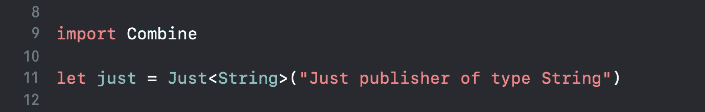

Combine 有两个内置订户:`assign`和`sink`。发布者可以通过在发布者上调用这两者中的任何一个来连接它们。

## 分配(给:在:)

将发行者的输出分配给对象的属性。

## 接收器(接收完成:接收值:)

订阅者可以通过在发布者上调用`sink`来连接到发布者。

第一个闭包在接收到`Subscribers.Completion`时执行，这是一个枚举，指示发布者是正常完成还是出错失败。

第二个闭包在从发布者那里接收到元素时执行。

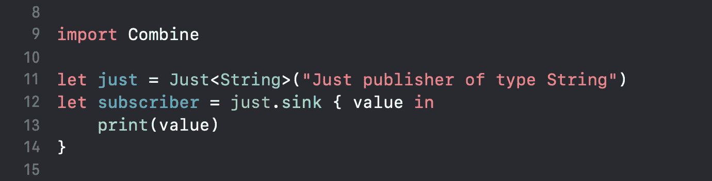

用户也可以在任何时候被取消，以避免收到简单的呼叫`cancel()`事件。

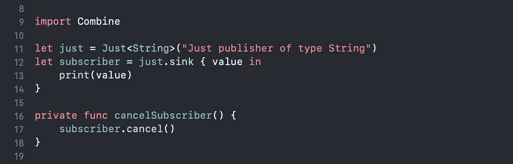

# **任何可取消的**

一个类型擦除可取消对象，当取消时执行一个提供的闭包。

一个`AnyCancellable`实例在反初始化时自动调用`cancel()`。

# **内置发行商**

## 通知中心

可以使用发布者订阅通知。

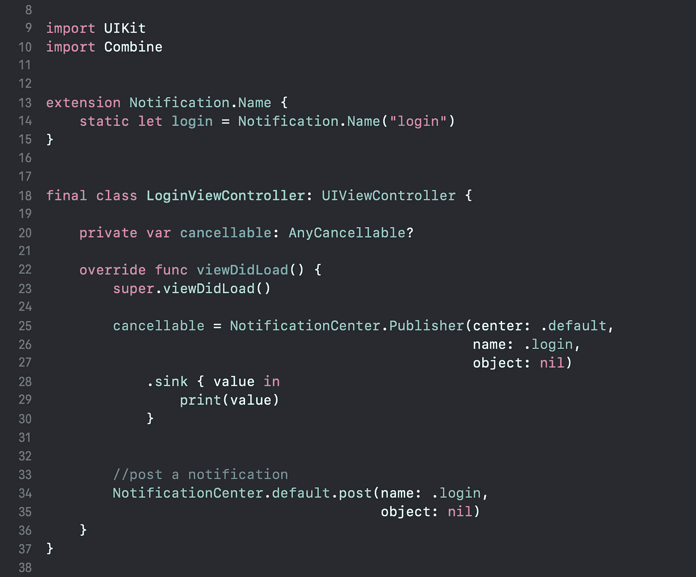

## **定时器**

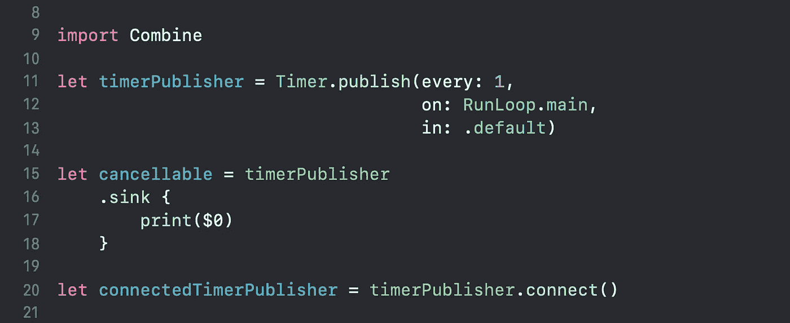

# **主题**

主题是一个发布者，它向外部调用方公开一个方法来发布元素。它用于通过调用其`send(_:)`方法将值注入到流中。

## **穿越主题**

向下游订户广播元素的主题。

`PassthroughSubject`提供了一种使现有命令式代码适应组合模型的便捷方式。

与`CurrentValueSubject`不同，`PassthroughSubject`没有初始值，也没有最近发布元素的缓冲区。如果没有订户，则`PassthroughSubject`会丢弃值。

## **当前值主题**

包装单个值并在值改变时发布新元素的主题。

与`PassthroughSubject`不同，`CurrentValueSubject`维护最近发布的元素的缓冲区。

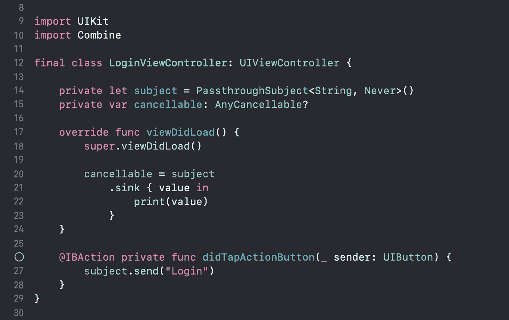

# 接收(开:选项:)

指定从发布者接收元素的计划程序。它将订阅调度程序设置在流的上游。

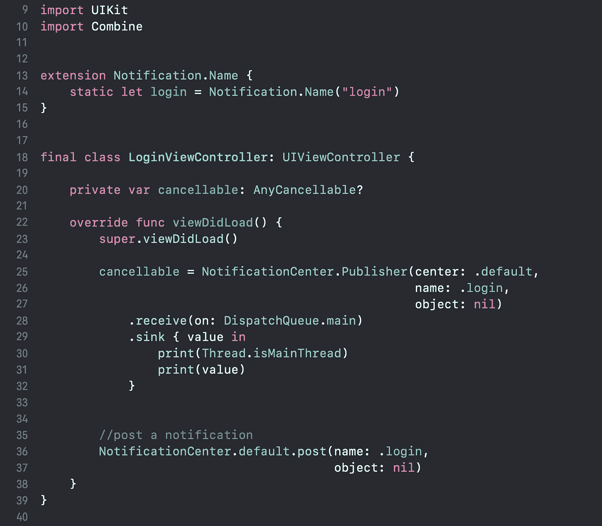

# **发表**

Published 是用于将发布者附加到属性的属性包装。

值得注意的是，`@Published`属性是受*类约束的*，这意味着它只能用于类的属性，而不能用于像结构这样的非类类型。

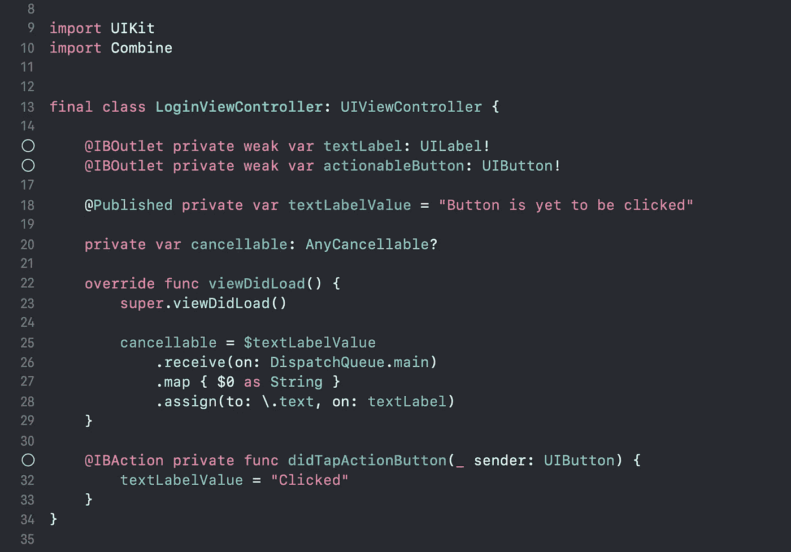

使用`$`符号和`assign`函数，创建一个绑定来订阅并将`textLabelValue`变量的值的任何变化分配给`textLabel`文本属性。

# **操作员**

Publisher 上的扩展定义了各种各样的操作符，可以组合这些操作符来创建复杂的事件处理链。每个运算符返回一个实现发布者协议的类型。

## 地图(_:)

它的行为类似于 Swift 中的地图。它用给定的闭包转换来自发布者的所有元素。

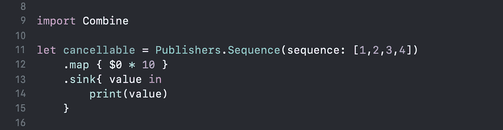

## 替换 Nil(用:)

用提供的元素替换发布者流中的 nil 元素。

## 过滤器(_:)

Filter 从提供的闭包中移除所有不匹配条件的元素。

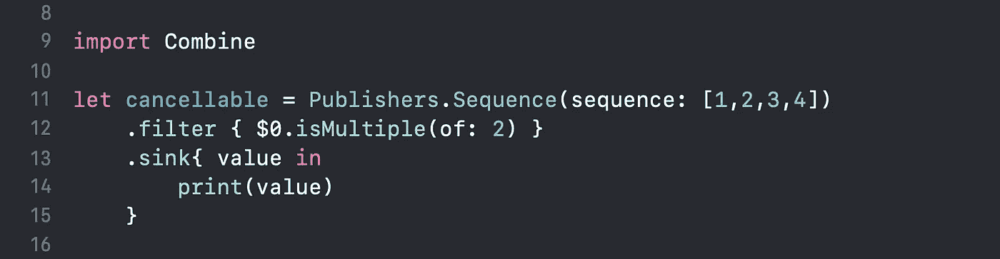

## 删除重复项()

仅发布与前一个元素不匹配的元素。

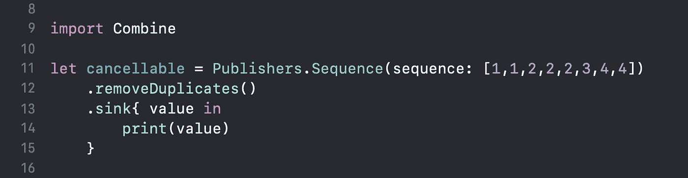

## `reduce(_:_:)`

对所有接收到的元素应用闭包，完成后产生一个累积值。

# **用操作符链接发布者**

运算符是在发布者上调用并返回另一个发布者的方法。

这允许通过一个接一个地应用它们来将它们链接在一起。每个操作者接收由链中的前一个操作者创建的发布者。

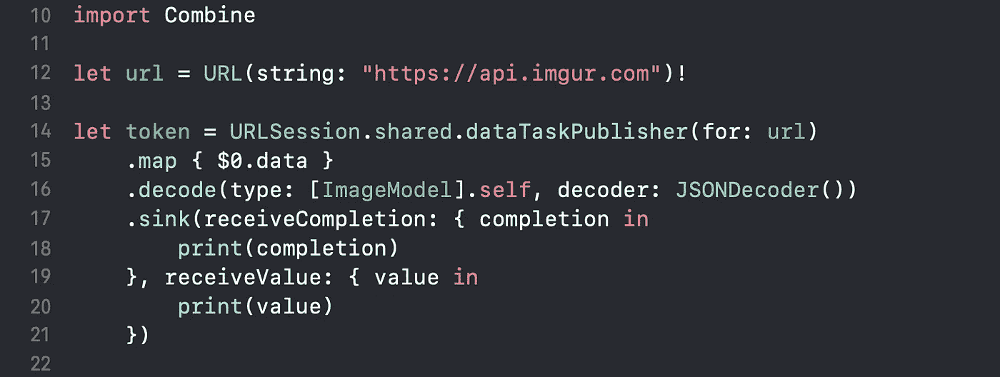

# **结论**

Combine 似乎是苹果做的一些很有前景的工作。联合收割机有如此多的优点。作为第一方，去除外部依赖并在本机获得相同功能的想法是一个巨大的胜利。

它与 SwiftUI 配合得非常好。Combine 的一个缺点是，它只支持基于 iOS 13 和更高版本的应用程序，这可能会限制一些开发者现在采用它。

阅读完本文后，我希望您现在对 Combine 框架以及如何使用它来简化同步工作有了基本的了解。

通过采用 Combine，通过集中事件处理代码和消除麻烦的技术，如嵌套闭包和基于约定的回调，可以使他们的代码更容易阅读和维护。