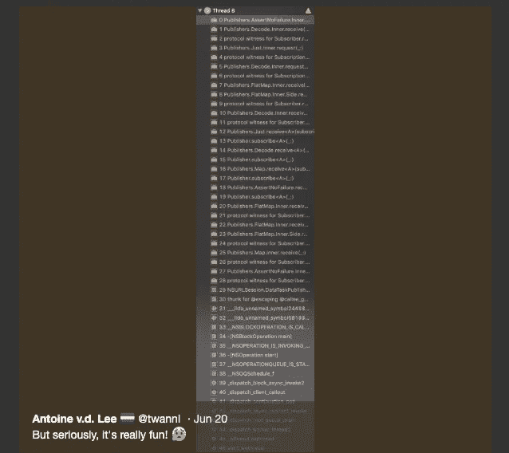
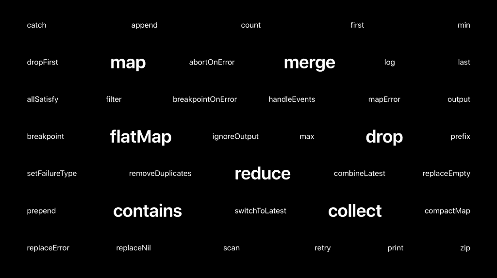

# Swift 联合框架入门

> 原文：<https://betterprogramming.pub/getting-started-with-the-combine-framework-in-swift-36fe4ff6e568>


在 [Unsplash](https://unsplash.com/search/photos/apple-code?utm_source=unsplash&utm_medium=referral&utm_content=creditCopyText) 上由 [Jantine Doornbos](https://unsplash.com/@jantined?utm_source=unsplash&utm_medium=referral&utm_content=creditCopyText) 拍摄的照片

[Combine](https://developer.apple.com/documentation/combine) 是苹果公司在 2019 年 WWDC 上推出的新框架。该框架提供了一个声明性的 [Swift](https://developer.apple.com/swift/) API，用于随时间处理值。

换句话说，正如苹果自己描述的:

> 通过组合事件处理运算符来自定义异步事件的处理。

起初，这可能听起来让人不知所措。它实际上意味着什么？我可以用它做什么，什么时候应该使用它？

希望看完这篇博文，你应该能回答这些问题。

# 什么是组合？

Combine 框架可以与类似于 [RxSwift](https://github.com/ReactiveX/RxSwift) 和 [ReactiveSwift](https://github.com/ReactiveCocoa/ReactiveSwift) 的框架相比较(正式名称为 [ReactiveCocoa](https://github.com/ReactiveCocoa/ReactiveCocoa/) )。

它允许您通过提供声明性的 Swift API 来编写功能反应型代码。

函数式反应式编程(FRP)语言允许您随时间处理值。这些类型的值包括网络响应、用户界面事件和其他类型的异步数据。

# 联合收割机的基本原则

Combine 的基本原理让你明白它是如何工作的，以及如何使用它。在我们深入代码示例之前，最好先了解一些背景信息。这将帮助您更好地理解代码是如何工作和运行的。

# 发布者和订阅者

Combine 框架附带了所谓的发布者和订阅者。如果您熟悉 RxSwift:

*   出版商和观察者是一样的。
*   订阅者与观察者相同。

名字不同，但都给了我们相同的理解。

发布者公开可以更改的值，订阅者订阅这些值以接收所有更新。当我们在使用 Combine 时查看 foundation 框架中可用的一些发布者示例时，请记住这一点。

# 基础框架和组合

foundation 框架包含了许多使用 Combine 的扩展。它允许您使用您已经熟悉的常见类型。

例子包括:

*   发布数据响应或请求错误的`URLSessionTask`发布者。
*   便于 JSON 解码的运算符。
*   发布通知的特定`Notification.Name`的发布者。

以最后一个例子为例，我们可以解释发布者和订阅者的概念。

在下面的代码示例中，我们为新的博客帖子通知创建一个新的`Publisher`。

该发布者将监听`newBlogPost`通知名称的传入通知。然而，这只有在有订户时才会发生。

例如，我们可以创建一个`lastPostTitleLabel`，将订阅者分配给发布者。

```
let lastPostLabel = UILabel()
let lastPostLabelSubscriber = Subscribers.Assign(object: lastPostLabel, keyPath: \.text)
blogPostPublisher.subscribe(lastPostLabelSubscriber)
```

如果您尝试这段代码，您可能会注意到它还不能工作。

它会导致以下错误:

`Instance method ‘subscribe’ requires the types ‘NotificationCenter.Publisher.Output’ (aka ‘Notification’) and ‘String?’ be equivalent`

标签的文本属性需要接收一个`String?`值，而流发布一个`Notification`。

因此，我们需要使用一个您可能已经熟悉的操作符:`map`。使用该运算符，我们可以将输出值从`Notification`更改为所需的`String?`类型。

```
let blogPostPublisher = NotificationCenter.Publisher(center: .default, name: .newBlogPost, object: nil)
    .map { (notification) -> String? in
        return (notification.object as? BlogPost)?.title ?? ""
    }
```

这将产生以下完整的代码示例:

每当一篇新的博客文章是`Published`，标签`Subscriber`就会更新它的文本值。太好了！

# 订阅的规则

现在，您已经看到了 Combine 中发布者和订阅者的基本示例，是时候回顾一下订阅所附带的规则了:

*   只能有一个订户。
*   可以发布零个*或多个*值。
*   最多会调用一个完成。

没错，订阅*可以*随完成而来，但并不总是如此。我们的`Notification`例子就是这样一个永远不会完成的发布者。

完成发布者的一个例子是`URLSessionTask`发布者，它将完成数据响应或请求错误。

事实是，每当流中出现错误时，订阅就会被取消。即使流允许多个值通过。

# @将值绑定到更改的已发布用法

既然我们已经知道了基础知识，我们可以直接进入`@Published`关键词。

这个关键字是一个[属性包装器](https://www.avanderlee.com/swift/property-wrappers/),并向任何属性添加一个发布者。一个简单的例子可以是我们分配给`UIButton`的启用状态的布尔值:

要对此进行分解:

*   `UISwitch`将触发`didSwitch`方法，并将`isSubmitAllowed`值更改为真或假。
*   `submitButton.isEnabled`的值被绑定到`isSubmitAllowed`属性。
*   当我们使用 UI 时，对`isSubmitAllowed`的任何更改都被分配给主队列上的这个`isEnabled`属性。

你可能注意到的第一件事是`isSubmitAllowed`前面的美元符号。它允许您访问包装的`Publisher`值。由此，您可以访问所有的操作符，或者像我们在示例中所做的那样，订阅它。

# 联合收割机中的内存管理

RxSwift 配有一个`DisposeBag`，Combine 配有一个`AnyCancellable`。

这个类在`deinit`上调用`cancel()`并确保订阅提前终止。如果不实现这一点，您可能会陷入保留周期。

以上面的例子为例，我们可以如下添加它，以确保我们的提交按钮订阅被正确发布:

`switchSubscriber`的生命周期与`FormViewController`的生命周期相关联。

每当视图控制器被释放时，属性也被释放，并调用`cancel()`方法。

# 错误类型和流

一旦开始使用 Combine，就会遇到错误类型不匹配的错误。

每个发布者都描述了他们是如何失败的，以及可以预期的错误类型。就像我们在通知示例中使用的`map`操作符一样，您可以使用操作符从错误中恢复或做出反应。

您可能想尝试的常见运算符:

*   `assertNoFailure()`，将错误类型更改为`Never`，并在错误发生时调用断言。
*   `mapError()`，允许您更改错误类型。
*   其他操作员如`retry`、`catch`、`abortOnError`、`replaceError`。

# 调试合并流

调试函数式反应式语言可能很难。这通常会导致 Xcode 中出现冗长的错误描述和不可读的堆栈跟踪。



长错误描述

通常，这是开发人员不使用 RxSwift 和 ReactiveSwift 这样的框架的原因。看着 Combine，似乎体验没什么不同。

幸运的是，在 Combine 中可以使用以下操作符进行调试:

*   `print()`，打印所有发布事件的日志消息。
*   `breakpoint()`，当提供的闭包需要停止调试器中的进程时，它会发出调试器信号。
*   `breakpointOnError()`，它只在接收到一个失败时引发调试器。

# 所有发布者操作员的列表

不幸的是，很难在这里列出所有的 publisher 操作符并使它们保持最新。找到它们的最好方法是深入研究[文档主题](https://developer.apple.com/documentation/combine/publisher)。

然而，为了让你有所了解，这里有一个来自 WWDC 的单词网:



Swift 中的组合运算符

# 与 MVVM 结合使用

组合框架非常适合与 MVVM 结合使用。其实用 Combine 好多了！

我不会讲得太深入，但是之前的例子可以转换成 MVVM 的例子，如下所示:

# 我应该何时使用联合收割机？

现在你已经知道了 Combine 的基本原理，还有一个重要的问题:“你应该什么时候使用它？”

如果我们看一下引用自[苹果文档](https://developer.apple.com/documentation/combine)的一段话，Combine 会给出以下内容:

> 通过采用 Combine，您将使您的代码更容易阅读和维护，通过集中您的事件处理代码和消除麻烦的技术，如嵌套闭包和基于约定的回调。

虽然这肯定是真的，但我们刚刚看到调试可能相当困难。

另一个缺点是它有一个学习曲线。不仅仅是你，你所有的同事都需要进入 Combine 并知道如何使用它。

如果您不熟悉像 Combine 这样的框架，以一个充满流和订阅者的项目结束，以一个相当困难的代码库结束并不罕见。

因此，在开始使用 Combine 之前，请确保在一个较小的项目中进行尝试。

和你的同事讨论这个框架，问问你自己你的代码是否需要合并。如果你真的去做，太好了！

但是，要确保你保持敏锐，不要以一个布满电线和难以调试代码的项目而告终，因为那最终会减慢你的速度。

如果状态变化很大，且需要大量异步代码，那么首先进行组合，并从组合中受益。

# 结论

您应该能够开始使用联合收割机。解释了基本原理，但还有更多的内容要讲。

上面的很多话题都可以有自己的博客。因此，我鼓励你开始探索结合自己！

此外，以下 WWDC 会议是给自己提供更多背景信息的良好开端:

*   [介绍联合收割机](https://developer.apple.com/videos/play/wwdc2019/722/)
*   [介绍联合收割机及基础进展](https://developer.apple.com/videos/play/wwdc2019/711/)
*   [结合实际](https://developer.apple.com/videos/play/wwdc2019/721/)

感谢阅读！